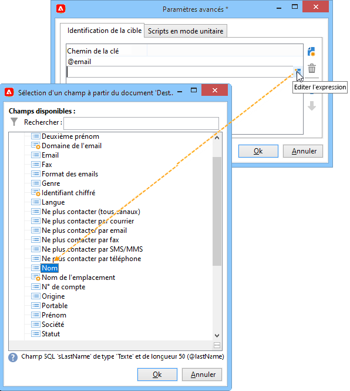
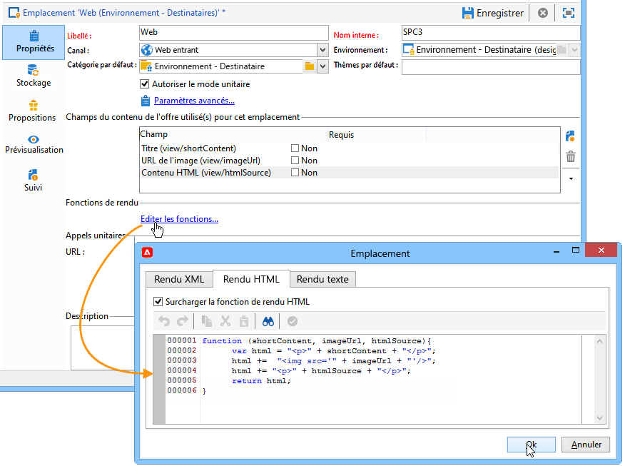
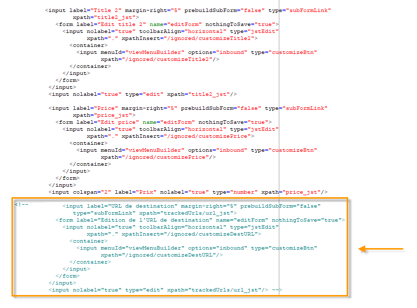
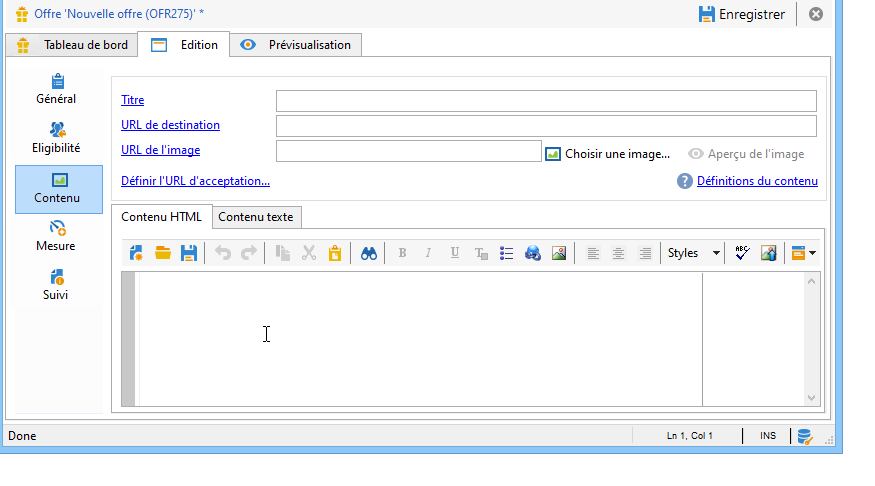
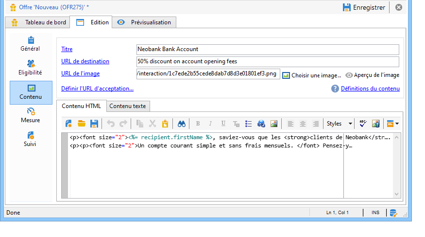
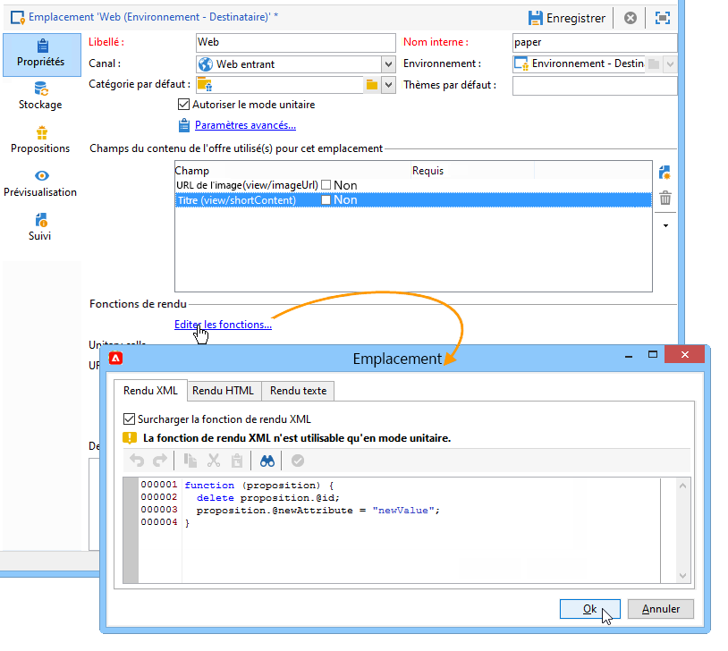

# Ajouter une offre sur une page web{#add-an-offer-in-web}

Pour appeler le moteur d&#39;offres dans une page web, insérez un appel à un code JavaScript directement dans la page. Cet appel renvoie le contenu de l&#39;offre dans un élément ciblé.

L&#39;URL d&#39;appel au script est de la forme suivante :

```
<script id="interactionProposalScript" src="https://<SERVER_URL>/nl/interactionProposal.js?env=" type="text/javascript"></script>
```

Le paramètre &quot;**env**&quot; reçoit le nom interne de l&#39;environnement en ligne dédié aux interactions anonymes.

Pour présenter une offre, il faut donc créer un environnement ainsi qu&#39;un emplacement pour l&#39;offre dans Adobe Campaign, puis configurer la page HTML.

Les cas d&#39;utilisations suivants présentent les différentes options possibles dans l&#39;intégration d&#39;offres via Javascript.

## Option 1 : mode HTML {#html-mode}

### Présentation d&#39;une offre anonyme {#presenting-an-anonymous-offer}

**Étape 1 : préparation du moteur d&#39;offres**

1. Dans l&#39;interface d&#39;Adobe Campaign, préparez un environnement anonyme.
1. Créez un emplacement rattaché à l&#39;environnement anonyme.
1. Créez une offre et sa représentation associée à l&#39;emplacement.

**Étape 2 : mise à jour du contenu de la page HTML**

La page HTML doit inclure un élément avec un attribut @id avec la valeur du nom interne de l&#39;emplacement créé (&quot;i_internal name space&quot;). L&#39;offre sera insérée dans cet élément par Interaction.

Dans l&#39;exemple, l&#39;attribut @id reçoit la valeur &quot;i_SPC12&quot; où &quot;SPC12&quot; est le nom interne de l&#39;emplacement précédemment créé :

```
<div id="i_SPC12"></div>
```

Dans l&#39;exemple, l&#39;URL d&#39;appel au script est la suivante (&quot;OE3&quot; est le nom interne de l&#39;environnement en ligne) :

```
<script id="interactionProposalScript" src="https://instance.adobe.org:8080/nl/interactionProposal.js?env=OE3" type="text/javascript"></script>
```

>[!CAUTION]
>
>La balise `<script>` ne doit pas être auto-fermante.

Cet appel statique va automatiquement générer un appel dynamique contenant tous les paramètres nécessaires au moteur d&#39;offres.

Ce comportement permet d&#39;avoir plusieurs emplacements sur la même page gérés par un seul appel au moteur d&#39;offres.

**Étape 3 : affichage des résultats dans la page HTML**

Le contenu du rendu de l&#39;offre est renvoyé à la page HTML par le moteur d&#39;offres :

```
<div id="banner_header">
 <div id="i_SPC12">
   <table>
    <tbody>
        <tr>
            <td><h3>Fly to Japan!</h3></td>
        </tr>
        <tr>
            <td></td>
            <td>
            <p>Discover Japan for 2 weeks at an unbelievable price!!</p>
            <p><b>2345 Dollars - All inclusive</b></p>
        </td>
        </tr>
    </tbody>
    </table>
 </div>
<script src="https://instance.adobe.org:8080/nl/interactionProposal.js?env=OE3" id="interactionProposalScript" type="text/javascript"></script>
</div>
```

### Présentation d&#39;une offre identifiée {#presenting-an-identified-offer}

Pour présenter une offre à un contact identifié, le processus est similaire à celui détaillé [dans cette section](#presenting-an-anonymous-offer).

Dans le contenu de la page web, vous devez ajouter le script suivant qui permettra d&#39;identifier le contact lors de l&#39;appel au moteur d&#39;offres :

```
<script type="text/javascript">
  interactionTarget = <contact_identifier>;
</script>
```

1. Dans l&#39;emplacement destiné à être appelé par la page web, cliquez sur **[!UICONTROL Paramètres avancés]** et ajoutez une ou plusieurs clés d&#39;identification.

   

   Dans cet exemple, la clé d&#39;identification est composite puisqu&#39;elle s&#39;appuie à la fois sur l&#39;email et le nom du destinataire.

1. Lors de l&#39;affichage de la page web, l&#39;évaluation du script permet de passer l&#39;identifiant du destinataire au moteur d&#39;offres. Si l&#39;identifiant est composite, les clés sont affichées dans la même séquence que celle utilisée dans les paramètres avancés et sont séparées par un |.

   Dans l&#39;exemple suivant, le contact s&#39;est identifié sur le site web et a été reconnu lors de l&#39;appel au moteur d&#39;offres via son adresse e-mail et son nom de famille.

   ```
   <script type="text/javascript">
     interactionTarget = myEmail|myName;
   </script>
   ```

### Utilisation d&#39;une fonction de rendu HTML {#using-an-html-rendering-function}

Vous pouvez utiliser une fonction de rendu afin que la représentation HTML de l&#39;offre soit automatiquement générée.

1. Dans l&#39;emplacement de l&#39;offre, cliquez sur le lien **[!UICONTROL Editer les fonctions]**.
1. Sélectionnez **[!UICONTROL Surcharger la fonction de rendu HTML]**.
1. Dans l&#39;onglet **[!UICONTROL Rendu HTML]**, insérez les variables correspondant aux champs définis pour le contenu de l&#39;offre dans l&#39;emplacement.

   

   Dans cet exemple, l&#39;offre s&#39;affiche sous forme de bannière dans une page web et est composée d&#39;une image cliquable sous laquelle se trouve un titre conformément aux champs définis dans le contenu de l&#39;offre.

## Option 2 : mode XML {#xml-mode}

### Présentation d&#39;une offre {#presenting-an-offer}

Le module **Interaction** de Campaign vous permet de renvoyer un nœud XML à la page HTML qui appelle le moteur d&#39;offres. Ce nœud XML peut être traité par des fonctions à développer côté client.

L&#39;appel au moteur d&#39;offres est de la forme suivante :

```
<script type="text/javascript" id="interactionProposalScript" src="https://<SERVER_URL>/nl/interactionProposal.js?env=&cb="></script>
```

* Le paramètre &quot;**env**&quot; reçoit le nom interne de l&#39;environnement en ligne.

* Le paramètre &quot;**cb**&quot; reçoit le nom de la fonction qui va interpréter le noeud XML renvoyé par le moteur contenant la ou les propositions (callback). Ce paramètre est optionnel.

* Le paramètre &quot;**t**&quot; reçoit l&#39;identifiant de la cible, pour une interaction identifiée uniquement. Ce paramètre peut également être passé avec la variable **interactionTarget**. Ce paramètre est optionnel.

* le paramètre &quot;**c**&quot; reçoit la liste des noms internes des catégories. Ce paramètre est optionnel.

* Le paramètre &quot;**th**&quot; reçoit la liste des thèmes. Ce paramètre est optionnel.

* Le paramètre &quot;**gctx**&quot; reçoit les données d&#39;appel globales (contexte) à toute la page. Ce paramètre est optionnel.

Le noeud XML retourné est de la forme suivante :

```
<propositions>
 <proposition id="" offer-id="" weight="" rank="" space="" div=""> //proposition identifiers
   ...XML content defined in Adobe Campaign...
 </proposition>
 ...
</propositions>
```

Le cas d&#39;utilisation suivant décrit les paramétrages à effectuer dans Adobe Campaign pour activer le mode XML, puis montre le résultat de l&#39;appel au moteur dans la page HTML.

1. **Créer un environnement et un emplacement**

   Pour plus d&#39;informations sur la création d&#39;un environnement, consultez [cette page](interaction-env.md).

   La création d&#39;un emplacement est détaillée sur [cette page](interaction-offer-spaces.md).

1. **Étendre le schéma des offres pour ajouter de nouveaux champs**

   Ce schéma va définir les champs suivants : titre N°2 et prix.

   Le nom du schéma dans l&#39;exemple est **cus:offer**

   ```
   <srcSchema _cs="Marketing offers (cus)" created="2013-01-18 17:14:20.762Z" createdBy-id="0"
              desc="" entitySchema="xtk:srcSchema" extendedSchema="nms:offer" img="nms:offer.png"
              label="Marketing offers" labelSingular="Marketing offers" lastModified="2013-01-18 15:20:18.373Z"
              mappingType="sql" md5="F14A7AA009AE1FCE31B0611E72866AC3" modifiedBy-id="0"
              name="offer" namespace="cus" xtkschema="xtk:srcSchema">
     <createdBy _cs="Administrator (admin)"/>
     <modifiedBy _cs="Administrator (admin)"/>
     <element img="nms:offer.png" label="Marketing offers" labelSingular="Marketing offer"
              name="offer">
       <element label="Content" name="view">
         <element label="Price" name="price" type="long" xml="true"/>
         <element label="Title 2" name="title2" type="string" xml="true"/>
   
         <element advanced="true" desc="Price calculation script." label="Script price"
                  name="price_jst" type="CDATA" xml="true"/>
         <element advanced="true" desc="Title calculation script." label="Script title"
                  name="title2_jst" type="CDATA" xml="true"/>
       </element>
     </element>
   </srcSchema>
   ```

   >[!CAUTION]
   >
   >Il est nécessaire de définir deux fois chaque élément. Les éléments de type CDATA (&quot;_jst&quot;) peuvent contenir des champs de personnalisation.
   >
   >Ne pas oublier de mettre à jour la structure de la base de données.

   Vous pouvez étendre le schéma des offres afin d&#39;ajouter des champs à la fois dans les modes batch et unitaire, et dans n&#39;importe quel format (texte, HTML et XML).

1. **Étendre le formulaire des offres pour éditer les nouveaux champs et modifier un champ existant**

   Editer le formulaire de saisie **Offre (nms)**.

   Insérer dans la partie intitulée &quot;Views&quot;, les deux nouveaux champs avec le contenu suivant :

   ```
   <input label="Title 2" margin-right="5" prebuildSubForm="false" type="subFormLink" xpath="title2_jst">
        <form label="Edit title 2" name="editForm" nothingToSave="true">
            <input nolabel="true" toolbarAlign="horizontal" type="jstEdit" xpath="." xpathInsert="/ignored/customizeTitle2">
            <container>
                <input menuId="viewMenuBuilder" options="inbound" type="customizeBtn" xpath="/ignored/customizeTitle2"/>
            </container>
            </input>
        </form>
    </input>
    <input nolabel="true" type="edit" xpath="title2_jst"/>
    <input label="Price" margin-right="5" prebuildSubForm="false" type="subFormLink" xpath="price_jst">
        <form label="Edit price" name="editForm" nothingToSave="true">
        <input nolabel="true" toolbarAlign="horizontal" type="jstEdit" xpath="." xpathInsert="/ignored/customizePrice">
            <container>
                <input menuId="viewMenuBuilder" options="inbound" type="customizeBtn" xpath="/ignored/customizePrice"/>
            </container>
        </input>
        </form>
    </input>
    <input colspan="2" label="Prix" nolabel="true" type="number" xpath="price_jst"/>
   ```

   Mettre en commentaire le champ URL de destination :

   

   >[!CAUTION]
   >
   >Les champs du formulaire (`<input>`) doivent pointer vers les éléments de type CDATA définis dans le schéma créé.

   Le rendu dans le formulaire des représentations des offres est le suivant :

   

   Les champs **[!UICONTROL Titre 2]** et **[!UICONTROL Prix]** ont été ajoutés et le champ **[!UICONTROL URL de destination]** n&#39;est plus affiché.

1. **Création d&#39;une offre**

   Pour plus d&#39;informations sur la création d&#39;offres, consultez [cette page](interaction-offer.md).

   Dans le cas d&#39;utilisation suivant, l&#39;offre est remplie de cette manière :

   

1. **Valider l&#39;offre**

   Validez ou faites valider l&#39;offre puis activez là sur l&#39;emplacement créé à l&#39;étape précédente afin qu&#39;elle soit disponible dans l&#39;environnement en ligne associé.

1. **Appel du moteur et résultat dans la page HTML**

   L&#39;appel au moteur d&#39;offres dans la page HTML est le suivant :

   ```
   <script id="interactionProposalScript" src="https://<SERVER_URL>/nl/interactionProposal.js?env=OE7&cb=alert" type="text/javascript">
   ```

   Le paramètre &quot;**env**&quot; a pour valeur le nom interne de l&#39;environnement en ligne.

   Le paramètre &quot;**cb**&quot; a pour valeur le nom de la fonction qui doit interpréter le noeud XML renvoyé par le moteur. Dans notre exemple, la fonction appelée ouvre une fenêtre modale (fonction alert() ).

   Le nœud XML renvoyé par le moteur d&#39;offres a la forme suivante :

   ```
   <propositions>
    <proposition id="a28002" offer-id="10322005" weight="1" rank="1" space="SPC14" div="i_SPC14">
     <xmlOfferView>
      <title>Travel to Russia</title>
      <price>3456</price>
      <description>Discover this vacation package!INCLUDES 10 nights. FEATURES buffet breakfast daily. BONUS 5th night free.</description>
      <image>
       <path>https://myinstance.com/res/Track/ae1d2113ed732d58a3beb441084e5960.jpg</path>
       <alt>Travel to Russia</alt>
      </image>
     </xmlOfferView>
    </proposition>
   </propositions>
   ```

### Utiliser une fonction de rendu {#using-a-rendering-function-}

Il est possible d&#39;utiliser une fonction de rendu XML pour créer une présentation d&#39;offre. Cette fonction modifie le nœud XML renvoyé à la page HTML lors de l&#39;appel au moteur d&#39;offres.

1. Dans l&#39;emplacement de l&#39;offre, cliquez sur le lien **[!UICONTROL Editer les fonctions]**.
1. Sélectionnez **[!UICONTROL Surcharger la fonction de rendu XML]**.
1. Dans l&#39;onglet **[!UICONTROL Rendu XML]**, insérez la fonction voulue.

   La fonction peut ressembler à l&#39;exemple ci-dessous :

   ```
   function (proposition) {
     delete proposition.@id;
     proposition.@newAttribute = "newValue";
   } 
   ```



## Configuration d&#39;une intégration SOAP

Les services web SOAP fournis pour la gestion des offres sont différents de ceux habituellement utilisés dans Adobe Campaign. Ils sont accessibles via l&#39;URL d&#39;interaction décrite dans la section précédente et permettent de proposer ou mettre à jour des offres pour un contact donné.

### Proposition d&#39;offres {#offer-proposition}

Pour une proposition d&#39;offres via SOAP, vous devez ajouter la commande **nms:proposition#Propose**, suivie des paramètres suivants :

* **targetId** : clé primaire du destinataire (il peut s&#39;agir d&#39;une clé composite).
* **maxCount** : indique le nombre de propositions d&#39;offre pour le contact.
* **context** : vous permet d&#39;ajouter des informations contextuelles dans le schéma d&#39;espace. Si le schéma utilisé est **nms:interaction**, **`<empty>`** doit être ajouté.
* **categories** : indique la ou les catégories auxquelles doivent appartenir la ou les offres proposées.
* **themes** : indique la ou les thèmes auxquelles doivent appartenir la ou les offres proposées.
* **uuid** : valeur du cookie permanent Adobe Campaign (&quot;uuid230&quot;).
* **nlid** : valeur du cookie de session Adobe Campaign (&quot;nlid&quot;).
* **noProp** : utilisez la valeur &quot;true&quot; pour désactiver l&#39;insertion de propositions.

>[!NOTE]
>
>Les paramètres **targetId** et **maxCount** sont obligatoires. Les autres sont optionnels.

En réponse à la requête, le service SOAP renverra les paramètres suivants :

* **interactionId** : id de l&#39;interaction.
* **propositions** : élément XML, contient la liste des propositions, chacune ayant un id et une représentation HTML propre.

### Mise à jour d&#39;une offre {#offer-update}

Ajoutez la commande **nms:interaction#UpdateStatus** dans l&#39;URL, puis les paramètres suivants :

* **proposition** : chaîne de caractères, contient l&#39;identifiant de la proposition donnée en sortie lors d&#39;un appel au moteur. Voir [Proposition d&#39;offres](#offer-proposition).
* **status** : nombre, indique le nouveau statut de l&#39;offre. Les valeurs possibles sont listées dans l&#39;énumération **propositionStatus**, dans le schéma **nms:common**. Par exemple, d&#39;usine, le nombre 3 correspond au statut **Acceptée**.
* **Context** : élément XML, vous permet d&#39;ajouter des informations contextuelles dans le schéma d&#39;espace. Si le schéma utilisé est **nms:interaction**, **`<empty>`** doit être ajouté.

### Exemple d&#39;utilisation d&#39;un appel SOAP {#example-using-a-soap-call}

Voici un exemple de code pour un appel SOAP :

```
<%
  var space = request.parameters.sp
  var cnx = new HttpSoapConnection(
    "https://" + request.serverName + ":" + request.serverPort + "/interaction/" + env + "/" + space,
    "utf-8",
    HttpSoapConnection.SOAP_12)
  var session = new SoapService(cnx, "nms:interaction")
  var action = request.parameters.a
  if( action == undefined )
    action = 'propose'

  try
  {
    switch( action )
    {
    case "update":
      var proposition = request.parameters.p
      var status      = request.parameters.st
      session.addMethod("UpdateStatus", "nms:interaction#UpdateStatus",
       ["proposition", "string",
        "status",      "string",
        "context",     "NLElement"],
       [])
      session.UpdateStatus(proposition, status, <undef/>)
      var redirect = request.parameters.r
      if( redirect != undefined )
        response.sendRedirect(redirect)
      break;

    case "propose":
      var count = request.parameters.n
      var target = request.parameters.t
      var categorie = request.parameters.c
      var theme = request.parameters.th
      var layout = request.parameters.l
      if( count == undefined )
        count = 1
      session.addMethod("Propose", "nms:proposition#Propose",
       ["targetId",      "string",
        "maxCount",      "string",
         "categories",    "string",
         "themes",        "string",
        "context",       "NLElement"],
       ["interactionId", "string",
        "propositions",  "NLElement"])
      response.setContentType("text/html")
      var result = session.Propose(target, count, category, theme, <empty/>)
      var props = result[1]
  %><table><tr><%
      for each( var propHtml in props.proposition.*.mdSource )
      {
        %><td><%=propHtml%></td><%
      }
  %></tr></table><%
      break;
    }
  }
  catch( e )
  {
  }
  %>
```
