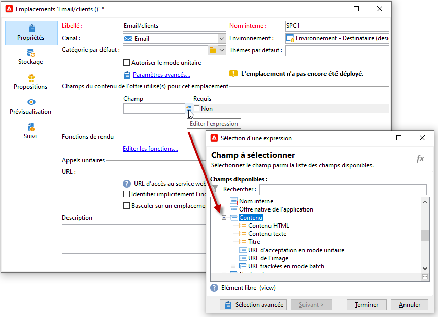

# Création d&#39;emplacements{#creating-offer-spaces}

Le contenu du catalogue d&#39;offres est paramétré dans des emplacements. Par défaut, le contenu peut contenir les champs suivants : **[!UICONTROL Titre]**, **[!UICONTROL URL de destination]**, **[!UICONTROL URL d&#39;image]**, **[!UICONTROL Contenu HTML]** et **[!UICONTROL Contenu texte]**. La séquence des champs est paramétrée dans l&#39;emplacement.

En tant qu&#39;**administrateur technique**, vous pouvez créer des emplacements dans l&#39;environnement en édition. Vous devez avoir accès au sous-dossier de l&#39;emplacement. Une fois créés, ces emplacements sont automatiquement dupliqués dans l&#39;environnement en ligne lors de la validation des offres.

Le rendu HTML est créé à partir d&#39;une fonction de rendu. L&#39;ordre des champs définis dans la fonction de rendu doit être identique à celui paramétré dans le contenu.


Pour créer un nouvel emplacement, procédez comme suit :

1. Dans la liste des emplacements, cliquez sur **[!UICONTROL Nouveau]**.

   

1. Sélectionnez le canal de votre choix et modifiez le libellé de l&#39;emplacement.

   

1. Cochez l&#39;option **[!UICONTROL Autoriser le mode unitaire]**.

1. Dans la fenêtre **[!UICONTROL Champs du contenu]**, cliquez sur **[!UICONTROL Ajouter]**.

   

1. Depuis le nœud **[!UICONTROL Contenu]** sélectionnez successivement les champs dans l&#39;ordre suivant : **[!UICONTROL Titre]**, puis **[!UICONTROL URL de l&#39;image]**, puis **[!UICONTROL Contenu HTML]**, puis **[!UICONTROL URL de destination]**.

   

1. Cochez l&#39;option **[!UICONTROL Obligatoire]** afin de rendre chaque champ obligatoire.

   >[!NOTE]
   >
   >Cette option est utilisée lors de la prévisualisation et rend les emplacements non valides lors de la publication si l&#39;un des champs obligatoires est absent de l&#39;offre. Toutefois, si une offre est déjà en ligne sur un emplacement, ces critères ne sont pas pris en compte.

   

1. Cliquez sur **[!UICONTROL Éditer les fonctions]** pour créer une fonction de rendu.

   Ces fonctions sont utilisées pour générer des représentations d&#39;offres sur un emplacement. Il existe plusieurs formats possibles : HTML ou texte.

   **Remarque** - Le format XML est limité aux interactions entrantes qui ne sont pas disponibles dans cette version du produit. [En savoir plus](../start/v7-to-v8.md#gs-unavailable-features)

   _

1. Positionnez-vous sur l&#39;onglet **[!UICONTROL Rendu HTML]** et sélectionnez **[!UICONTROL Surcharger la fonction de rendu HTML]**.
1. Insérez votre fonction de rendu.

   

## États de la proposition d&#39;offre {#offer-proposition-statuses}

L&#39;état de la proposition d&#39;offre varie en fonction des interactions avec la population ciblée. Le module Interaction de Campaign comprend un ensemble de valeurs qui peuvent être appliquées à la proposition d&#39;offre tout au long de son cycle de vie. Vous devez paramétrer la plateforme afin que l&#39;état de la proposition d&#39;offre soit modifié lors de sa création et de son acceptation.

>[!NOTE]
>
>La mise à jour de l&#39;état est un processus **asynchrone**. Elle est réalisée par le workflow de tracking qui se déclenche toutes les heures.

### Liste des statuts d&#39;offre {#status-list}

Les statuts d&#39;offre disponibles sont les suivants :

* **[!UICONTROL Acceptée]**
* **[!UICONTROL Différée]**
* **[!UICONTROL Générée]**
* **[!UICONTROL Intéressante]**
* **[!UICONTROL Présentée]**
* **[!UICONTROL Rejetés]**

Ces valeurs ne sont pas appliquées par défaut et doivent donc être paramétrées.

>[!NOTE]
>
>Le statut d&#39;une proposition d&#39;offre est automatiquement changée en &quot;Présentée&quot; si l&#39;offre est associée à une diffusion avec le statut &quot;Envoyé&quot;.

### État de l&#39;offre à la création de la proposition {#configuring-the-status-when-the-proposition-is-created}

Lorsqu&#39;une proposition d&#39;offre est **créée**, son état est mis à jour.

Dans l&#39;environnement **[!UICONTROL En édition]**, configurez pour chaque emplacement l&#39;état à appliquer lors de la création d&#39;une proposition, en fonction des informations que vous souhaitez afficher dans les rapports d&#39;offre.

Pour ce faire, procédez comme suit :

1. Accédez à l&#39;onglet **[!UICONTROL Stockage]** de l&#39;emplacement de votre choix.
1. Sélectionnez l&#39;état à appliquer lors de la création de la proposition.

   

### État de l&#39;offre à l&#39;acceptation de la proposition {#configuring-the-status-when-the-proposition-is-accepted}

Une fois qu&#39;une proposition d&#39;offre a été **acceptée**, utilisez l&#39;une des valeurs fournies par défaut pour configurer le nouvel état de la proposition. La mise à jour est appliquée lorsqu&#39;un destinataire clique sur un lien dans l&#39;offre.

Pour ce faire, procédez comme suit :

1. Accédez à l&#39;onglet **[!UICONTROL Stockage]** de l&#39;emplacement de votre choix.
1. Sélectionnez l&#39;état que vous souhaitez appliquer à la proposition lorsqu&#39;elle est acceptée.

   


**Interaction entrante**

L&#39;onglet **[!UICONTROL Stockage]** permet de définir les statuts des propositions d&#39;offre **présentées** et **acceptées** uniquement. Dans le cas d&#39;une interaction entrante, vous devez préciser directement le statut de la proposition d&#39;offre dans l&#39;URL d&#39;appel du moteur d&#39;offre plutôt que dans l&#39;interface. Vous serez ainsi en mesure de spécifier le statut à appliquer dans d&#39;autres cas, par exemple si une proposition d&#39;offre est rejetée.

```
<BASE_URL>?a=UpdateStatus&p=<PRIMARY_KEY_OF_THE_PROPOSITION>&st=<NEW_STATUS_OF_THE_PROPOSITION>&r=<REDIRECT_URL>
```

Par exemple, la proposition (identifiant **40004**) correspondant à l&#39;offre **Assurance habitation** et diffusée sur la page du site **Neobank** contient l&#39;URL suivante :

```
<BASE_URL>?a=UpdateStatus&p=<40004>&st=<3>&r=<"http://www.neobank.com/insurance/subscribe.html">
```

Dès lors qu&#39;un visiteur clique sur l&#39;offre, et donc sur l&#39;URL, le statut **[!UICONTROL Acceptée]**, (correspondant à la valeur **3**), est appliqué à la proposition et le visiteur est redirigé sur une nouvelle page du site **Neobank** pour souscrire à l&#39;assurance.

>[!NOTE]
>
>Si vous souhaitez spécifier un autre état dans l’URL (par exemple si une proposition d’offre est refusée), utilisez la valeur correspondant à l’état souhaité. Exemple : **[!UICONTROL Rejetés]** = &quot;5&quot;, **[!UICONTROL Présenté]** = &quot;1&quot;, etc.
>
>Les états et leurs valeurs peuvent être récupérés dans la variable **[!UICONTROL Propositions d&#39;offres (nms)]** schéma de données. Pour plus d’informations, consultez [cette page](../dev/create-schema.md).

**Interaction sortante**

Vous pouvez appliquer automatiquement l&#39;état **[!UICONTROL Intéressante]** à une proposition d&#39;offre lorsque la diffusion contient un lien. Ajoutez simplement la valeur **_urlType=&quot;11&quot;** au lien :

```
<a _urlType="11" href="<DEST_URL>">Link inserted into the delivery</a>
```

## Prévisualisation des offres par emplacement {#offer-preview-per-space}

Dans l&#39;onglet **[!UICONTROL Aperçu]**, vous pouvez visualiser les offres auxquelles le destinataire est éligible via une méthode sélectionnée. Dans l&#39;exemple ci-dessous, le destinataire est éligible à trois propositions d&#39;offres par mail.


Dans le cas où le destinataire n&#39;est éligible à aucune offre, la prévisualisation vous permet d&#39;en faire la vérification.


La prévisualisation peut ne pas tenir compte des contextes lorsqu&#39;ils sont limités à un emplacement. C&#39;est le cas lorsque le schéma d&#39;interaction a été étendu de façon à ajouter des champs qui sont référencés dans un emplacement utilisant un canal entrant.

Voir à ce propos cet exemple dans la section [Documentation de Campaign Classic v7](https://experienceleague.adobe.com/docs/campaign-classic/using/managing-offers/advanced-parameters/extension-example.html?lang=fr){target="_blank"}.