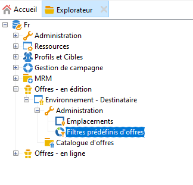
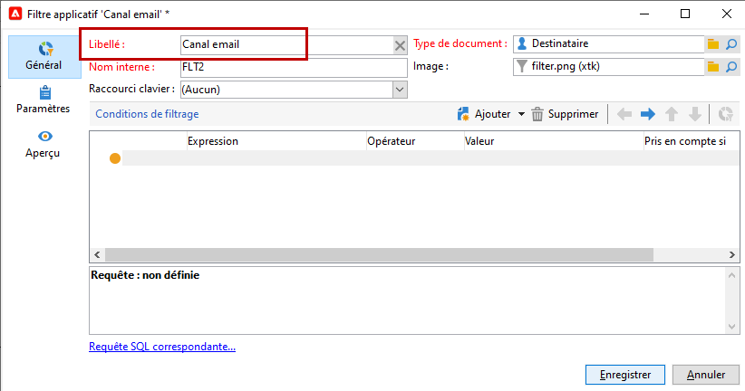
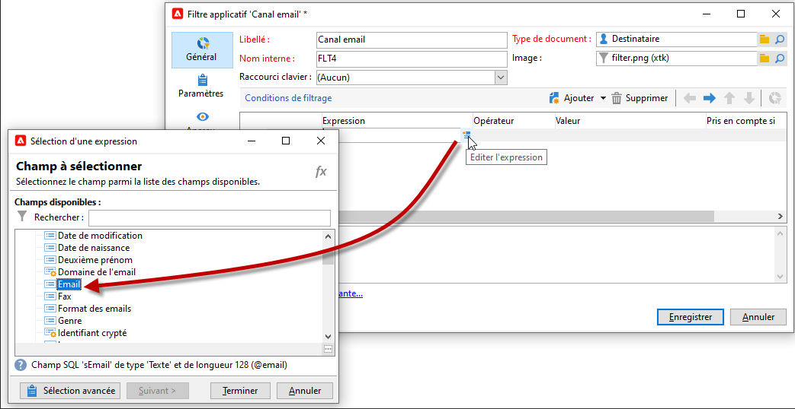
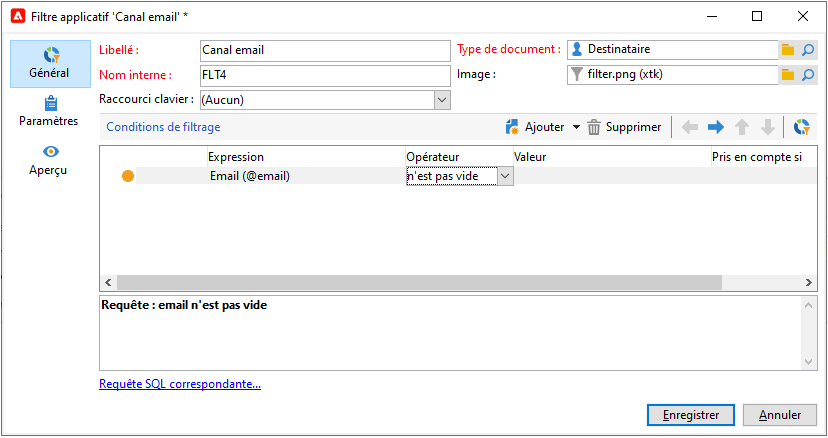
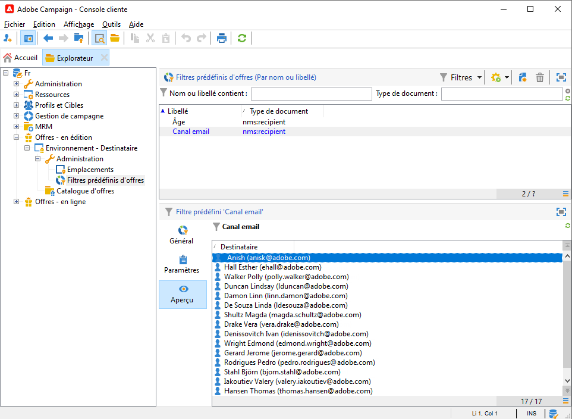

# Création de filtres prédéfinis{#creating-pre-defined-filters}

Créez des filtres prédéfinis afin de définir des règles d&#39;éligibilité pour la population cible qui pourront facilement être réutilisées lors de la création d&#39;offres. Ils sont spécifiques à chaque environnement et prennent en compte les paramètres de l’offre.

>[!NOTE]
>
>L’interface d’utilisation de d’Adobe Campaign Web vous offre une interface conviviale pour gérer et personnaliser facilement des filtres prédéfinis qui répondent à vos besoins spécifiques. Créez-les une seule fois et enregistrez-les pour une utilisation ultérieure. Pour en savoir plus sur les filtres prédéfinis pour l’interface d’utilisation web, reportez-vous à la [documentation de l’interface d’utilisation d’Adobe Campaign Web](https://experienceleague.adobe.com/fr/docs/campaign-web/v8/start/predefined-filters){target=_blank}.

Pour créer un filtre prédéfini, procédez comme suit :

1. Accédez au dossier **[!UICONTROL Administration]** et sélectionnez **[!UICONTROL Filtres d&#39;offre prédéfinis]**.

   

1. Cliquez sur **[!UICONTROL Nouveau]**.

   

1. Modifiez le libellé afin de pouvoir identifier le filtre ultérieurement.

   

1. Choisissez le champ sur lequel doit porter la condition de filtrage.

   

1. Choisissez un opérateur et si nécessaire une valeur, puis enregistrez la requête.

   

1. Cliquez sur **[!UICONTROL Aperçu]** pour visualiser le résultat du filtre.

   
