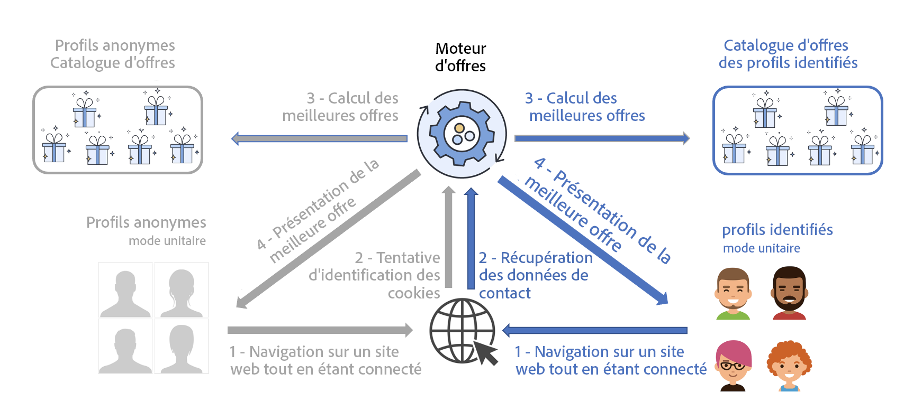

# Présentation de la meilleure offre{#interaction-present-offers}

Les offres peuvent être présentées à divers emplacements utilisant [un canal entrant ou sortant](interaction-architecture.md#interaction-types). Ce chapitre traite des spécificités des canaux entrants.

Pour qu&#39;une offre puisse être sélectionnée par le moteur d&#39;offres, elle doit avoir été validée et être disponible dans un environnement en ligne.

 Pour en savoir plus à ce sujet, consultez la [documentation de Campaign Classic v7](https://experienceleague.adobe.com/docs/campaign-classic/using/managing-offers/managing-an-offer-catalog/approving-and-activating-an-offer.html?lang=fr#approving-offer-content).

Lorsqu&#39;il s&#39;agit d&#39;un contact entrant, l&#39;utilisateur qui navigue sur la page peut être identifié ou non par le site web. Le moteur d&#39;offres présente des offres différentes selon qu&#39;il s&#39;agit de profils identifiés ou de profils anonymes.

Avant de pouvoir proposer des offres sur un canal entrant, vous devez paramétrer l&#39;appel au moteur d&#39;offres à l&#39;endroit où vous souhaitez que les offres soient présentées. Le cas le plus courant dans le cadre d&#39;une interaction entrante est la page web.

>[!NOTE]
>
>Dans le cas d&#39;interactions entrantes, il est nécessaire de paramétrer spécifiquement le moteur d&#39;offres pour proposer et mettre à jour une ou plusieurs offres.
>
>Vous devez également autoriser le mode unitaire sur vos emplacements. Pour plus d&#39;informations, consultez [cette page](interaction-offer-spaces.md).
