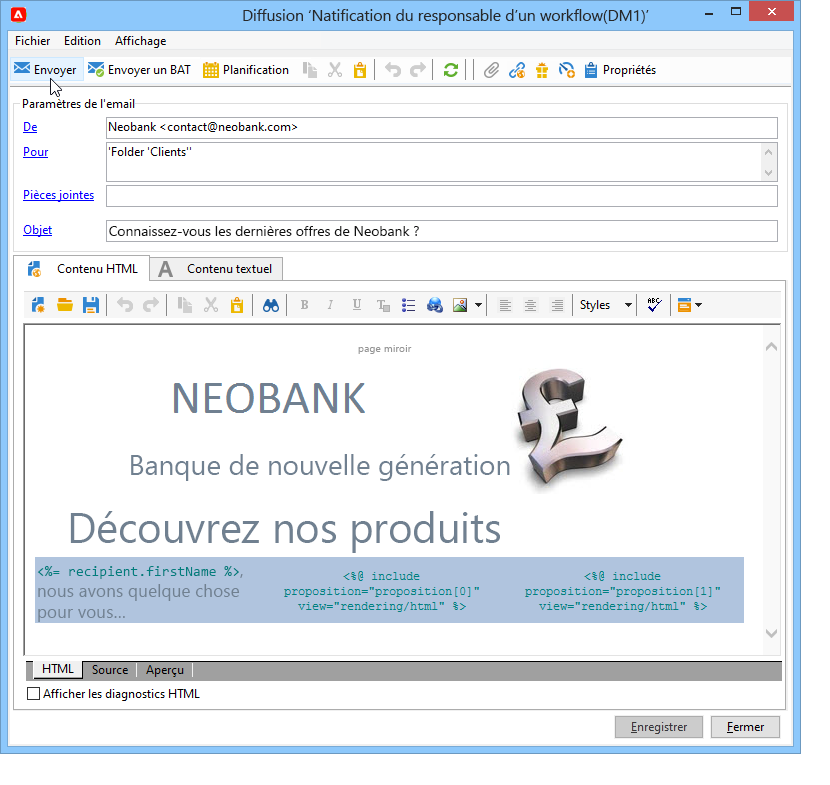

# Envoi d&#39;une offre{#send}

Pour qu&#39;une offre puisse être sélectionnée par le moteur d&#39;offres, elle doit avoir été validée et être disponible dans un environnement **En ligne**. [En savoir plus](interaction-offer.md#approve-offers)

La présentation des offres via un canal de communication sortant s&#39;effectue par le biais de diffusions par courrier, par e-mail ou mobiles. Vous pouvez également utiliser le mode unitaire avec les messages transactionnels (Message Center).

## Insérer une offre dans une diffusion {#offer-into-a-delivery}

Pour insérer des propositions d&#39;offres dans une diffusion, procédez comme suit :

1. Dans la fenêtre de diffusion, cliquez sur l&#39;icône **Offres**.

   

1. Sélectionnez l&#39;emplacement correspondant à votre environnement d&#39;offres.

   

1. Choisissez la catégorie dont la ou les offres à présenter font partie ou un ou plusieurs thèmes pour affiner le choix des offres réalisé par le moteur. Il est conseillé de ne pas utiliser ces deux champs conjointement afin de ne pas surcharger les restrictions.

   

   

1. Indiquez le nombre d&#39;offres que vous souhaitez insérer dans le corps de la diffusion.

   

1. Sélectionnez l&#39;option **[!UICONTROL Exclure les destinataires non éligibles]**, si nécessaire. [En savoir plus](#parameters-for-calling-offer-engine)

   

1. Si besoin, sélectionnez l&#39;option **[!UICONTROL Ne rien afficher si aucune offre n&#39;est sélectionnée]**. [En savoir plus](#parameters-for-calling-offer-engine)

   

1. Insérez les propriétés dans le contenu de la diffusion à l&#39;aide des champs de fusion. Le nombre de propositions disponibles dépend de la configuration de l&#39;appel au moteur et leur ordre dépend de la priorité des offres.

   

1. Finalisez le contenu, puis testez et envoyez votre diffusion.

   

### Paramètres du moteur d&#39;offres {#parameters-for-calling-offer-engine}

* **[!UICONTROL Emplacement]** : emplacement de l&#39;environnement des offres à choisir obligatoirement afin d&#39;activer le moteur d&#39;offres.
* **[!UICONTROL Catégorie]** : dossier spécifique dans lequel les offres sont classées. Si aucune catégorie n&#39;est spécifiée, c&#39;est la totalité des offres contenues dans l&#39;environnement qui seront prises en compte par le moteur d&#39;offres, sauf si un thème est sélectionné.
* **[!UICONTROL Thèmes]** : mots-clés définis préalablement au niveau des catégories. Ils agissent comme un filtre et permettent d&#39;affiner les offres à présenter en les sélectionnant dans un ensemble de catégories.
* **[!UICONTROL Nombre de propositions]** : nombre d&#39;offres renvoyées par le moteur qui pourront être insérées dans le corps de la diffusion. Si elles ne sont pas insérées dans le message, les offres seront néanmoins générées, mais non présentées.
* **[!UICONTROL Exclure les destinataires non éligibles]** : cette option permet d&#39;activer ou non l&#39;exclusion des destinataires pour lesquels il n&#39;y a pas assez d&#39;offres éligibles. Pour chaque destinataire, il se peut que le nombre de propositions éligibles soit inférieur au nombre de propositions requis. En cochant cette case, les destinataires pour lesquels le nombre de propositions requis n&#39;est pas atteint seront exclus de la diffusion. Si vous ne sélectionnez pas cette option, ces destinataires seront conservés, mais ils auront un nombre de propositions inférieur au nombre demandé.
* **[!UICONTROL Ne rien afficher si aucune offre n&#39;est sélectionnée]** : cette option permet de choisir le traitement du message au cas où l&#39;une des propositions n&#39;existerait pas. En cochant cette case, la représentation de la proposition manquante ne s&#39;affichera pas et aucun contenu n&#39;apparaîtra dans le message pour cette proposition. Si la case est décochée, le message lui-même est annulé au moment de l&#39;envoi et les destinataires ne recevront aucun message.

## Envoi d&#39;offres dans des workflows{#offer-via-wf}

Plusieurs activités de workflow permettent de définir la présentation des offres :

* Enrichissement
* Moteur d&#39;offres
* Offres par cellule

### Enrichissement {#enrichment}

L&#39;activité **Enrichissement** vous permet d&#39;ajouter des offres ou des liens vers des offres pour les destinataires d&#39;une diffusion.[En savoir plus](https://experienceleague.adobe.com/docs/campaign/automation/workflows/wf-activities/targeting-activities/enrichment.html?lang=fr){target="_blank"}.

Vous pouvez par exemple enrichir les données d&#39;une requête sur les destinataires, avant une diffusion.

Deux méthodes permettent de définir des propositions d&#39;offre.

* En spécifiant une offre ou un appel au moteur d&#39;offres.
* En référençant un lien vers une offre.

#### Spécification d&#39;une offre ou d&#39;un appel au moteur d&#39;offres {#specifying-an-offer-or-a-call-to-the-offer-engine}

Après avoir configuré votre activité **Requête** :

1. Placez et ouvrez une activité **Enrichissement**.
1. Dans l&#39;onglet **[!UICONTROL Enrichissement]**, sélectionnez **[!UICONTROL Ajouter des données]**.
1. Sélectionnez **[!UICONTROL Une proposition d&#39;offre]** dans les types de données à ajouter.

   

1. Indiquez un identifiant ainsi qu&#39;un libellé pour la proposition qui sera ajoutée.
1. Définissez la sélection de l&#39;offre. Deux options sont possibles :

   * **[!UICONTROL Rechercher la meilleure offre dans une catégorie]** : cochez cette option et définissez les paramètres de l&#39;appel au moteur d&#39;offres (emplacement, catégorie ou thème(s), date de contact, nombre d&#39;offres à conserver). Le moteur calcule automatiquement la ou les offres à ajouter en fonction de ces paramètres. Nous vous recommandons d’effectuer l’une des opérations suivantes : **[!UICONTROL Catégorie]** ou le **[!UICONTROL Thème]** plutôt que les deux en même temps.

     

   * **[!UICONTROL Une offre prédéfinie]** : cochez cette option et définissez un emplacement, une offre précise, ainsi qu&#39;une date de contact afin de directement paramétrer l&#39;offre que vous souhaitez ajouter, sans appeler le moteur d&#39;offres.

     

1. Paramétrez ensuite une activité de diffusion correspondant au canal de votre choix. [En savoir plus](#offer-into-a-delivery)

   >[!NOTE]
   >
   >Le nombre de propositions disponibles pour la prévisualisation dépend du paramétrage réalisé dans l’activité d’enrichissement et non d’un éventuel paramétrage directement dans la diffusion.

#### Référencer un lien vers une offre {#referencing-a-link-to-an-offer}

Vous avez également la possibilité de référencer un lien vers une offre dans une activité **Enrichissement**.

Pour ce faire, procédez comme suit :

1. Dans l&#39;onglet **[!UICONTROL Enrichissement]** de l&#39;activité, sélectionnez **[!UICONTROL Ajouter des données]**.
1. Dans la fenêtre de sélection du type de données à ajouter, choisissez **[!UICONTROL Un lien]**.
1. Sélectionnez le type du lien que vous souhaitez établir ainsi que sa cible. Dans le cas présent, la cible est le schéma des offres.

   

1. Définissez la jointure entre les données de la table entrante dans l’activité d’enrichissement (ici la table des destinataires) et la table des offres. Vous pouvez par exemple associer un code offre à un destinataire.

   

1. Paramétrez ensuite une activité de diffusion correspondant au canal de votre choix. [En savoir plus](#offer-into-a-delivery)

   >[!NOTE]
   >
   >Le nombre de propositions disponibles pour la prévisualisation dépend du paramétrage réalisé dans la diffusion.

#### Stocker le rang et le poids des offres {#storing-offer-rankings-and-weights}

Par défaut, lorsque l&#39;activité **Enrichissement** est utilisée pour diffuser des offres, leur rang ainsi que leur poids ne sont pas stockés dans la table des propositions.

>[!NOTE]
>
>L&#39;activité **[!UICONTROL Moteur d&#39;offres]** stocke bien ces informations par défaut.

Cependant, il est possible de stocker ces informations de la manière suivante :

1. Créez un appel au moteur d’offres dans une activité d’enrichissement placée après une requête et avant une activité de diffusion. [En savoir plus](#specifying-an-offer-or-a-call-to-the-offer-engine)
1. Dans la fenêtre principale de l&#39;activité, sélectionnez **[!UICONTROL Editer les données additionnelles]**.

   

1. Ajoutez les colonnes **[!UICONTROL @rank]** pour le rang et **[!UICONTROL @weight]** pour le poids des offres.

   

1. Validez votre ajout et enregistrez votre workflow.

La diffusion stocke automatiquement le classement et le poids des offres. Ces informations sont visibles dans les diffusions **[!UICONTROL Offres]** onglet.

### Moteur d&#39;offres {#offer-engine}

L&#39;activité **[!UICONTROL Moteur d&#39;offres]** vous permet également de définir un appel au moteur d&#39;offres en amont de la diffusion.

Pour en savoir plus sur le **Moteur d’offres** activité, voir [cette page](https://experienceleague.adobe.com/docs/campaign/automation/workflows/wf-activities/targeting-activities/offer-engine.html?lang=fr){target="_blank"}.

Cette activité fonctionne sur le même principe que l&#39;activité **Enrichissement** avec un appel au moteur, en enrichissant les données de la population entrante avec une offre calculée par le moteur, avant une diffusion.

Après avoir configuré votre activité **Requête** :

1. Placez et ouvrez une activité **[!UICONTROL Moteur d&#39;offres]**.
1. Renseignez les différents champs disponibles afin de définir les paramètres de l&#39;appel au moteur d&#39;offres (emplacement, catégorie ou thème(s), date de contact, nombre d&#39;offres à conserver). Le moteur calculera automatiquement la ou les offres à placer en fonction de ces paramètres.

   >[!CAUTION]
   >
   >Si vous utilisez cette activité, seules les propositions utilisées dans la diffusion sont stockées.

   

1. Paramétrez ensuite une activité de diffusion correspondant au canal de votre choix. [En savoir plus](#inserting-an-offer-proposition-into-a-delivery)

### Offres par cellule {#offers-by-cell}

L&#39;activité **[!UICONTROL Offres par cellules]** vous permet de répartir la population entrante (par exemple issue d&#39;une requête) en plusieurs segments, et de définir une offre à proposer pour chacun de ces segments.

Pour en savoir plus sur le **Offre par cellule** activité, voir [cette page](https://experienceleague.adobe.com/docs/campaign/automation/workflows/wf-activities/targeting-activities/offers-by-cell.html?lang=fr){target="_blank"}.

Pour cela :

1. Placez l&#39;activité **[!UICONTROL Offres par cellules]** après avoir défini la population cible, puis ouvrez-là.
1. Dans l&#39;onglet **[!UICONTROL Général]**, sélectionnez l&#39;emplacement sur lequel vous souhaitez proposer les offres.
1. Dans l&#39;onglet **[!UICONTROL Cellules]**, définissez les différents sous-ensembles via le bouton **[!UICONTROL Ajouter]** :

   * Définissez la population du sous-ensemble grâce aux règles de filtrage et de limitation disponibles.
   * Sélectionnez ensuite l&#39;offre que vous souhaitez proposer au sous-ensemble. Les offres disponibles sont celles éligibles sur l&#39;emplacement sélectionné à l&#39;étape précédente.

     

1. Paramétrez ensuite une activité de diffusion correspondant au canal de votre choix.

<!--

## Delivering with delivery outlines {#delivering-with-delivery-outlines}

You can also present offers in a delivery using delivery outlines.

For more information on delivery outlines, refer to the Campaign - MRM guide.

1. Create a new campaign or access an existing campaign.
1. Access the delivery outlines via the campaign's **[!UICONTROL Edit]** > **[!UICONTROL Documents]** tab.
1. Add an outline then insert as many offers as you like into it by right-clicking on the outline and selecting **[!UICONTROL New]** > **[!UICONTROL Offer]**, then save the campaign.

1. Create a delivery whose delivery outlines you have access to (for example, a direct mail delivery).
1. When editing the delivery, click **[!UICONTROL Select a delivery outline]**.

   >[!NOTE]
   >
   >Depending on the type of delivery, this option can be found in the **[!UICONTROL Properties]** > **[!UICONTROL Advanced]** menu (for email deliveries for example).

1. Using the **[!UICONTROL Offers]** button, you can then configure the offer space as well as the number of offers to present in the delivery.

1. Add the propositions into the delivery body using the personalization fields (for more on this, refer to the [Inserting an offer proposition into a delivery](#inserting-an-offer-proposition-into-a-delivery) section), or in the case of a direct mail delivery, by editing the extraction file format.

   Propositions will be selected from the offers referenced in the delivery outline.

   >[!NOTE]
   >
   >Information regarding the offer rankings and weights is only saved in the proposition table if the offers are generated directly in the delivery.
-->
