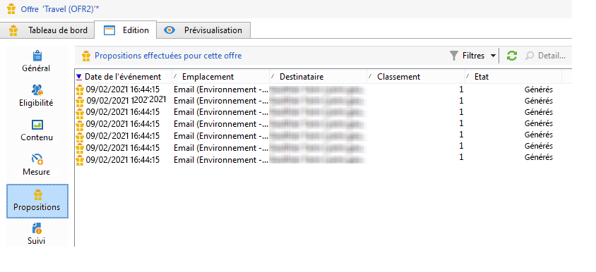
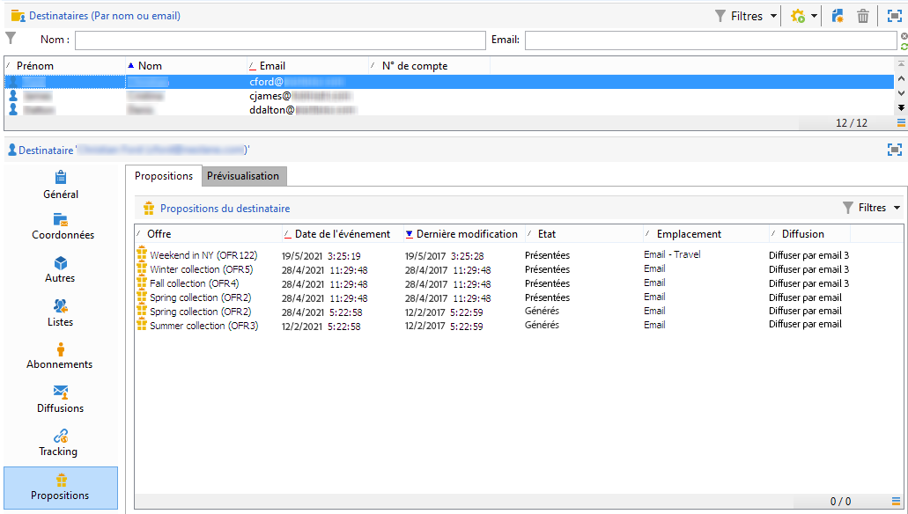
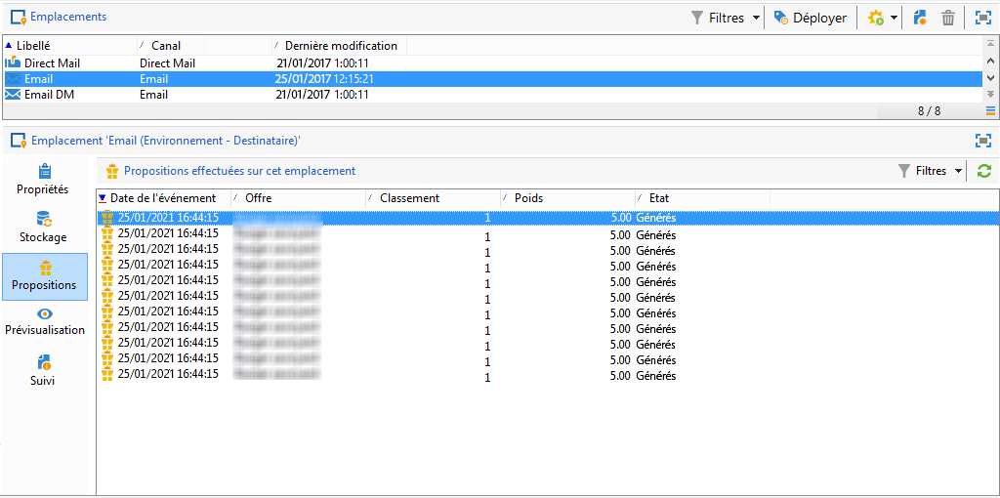
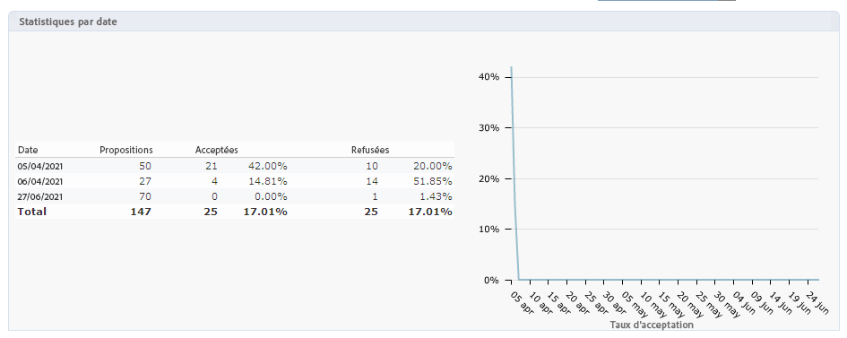
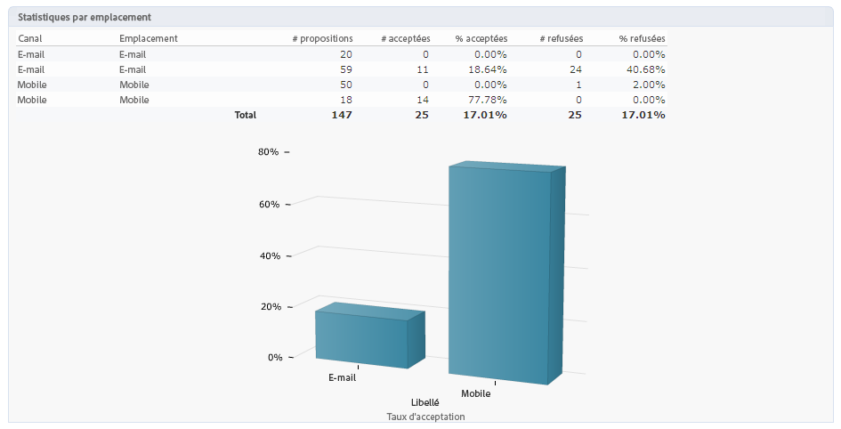
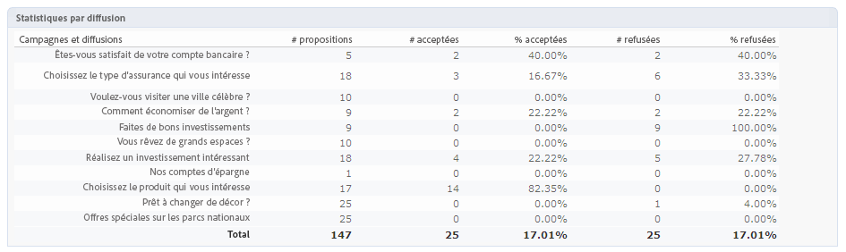

# Historique et rapports des interactions en temps réel

>[!NOTE]
>
>Ces fonctionnalités ne sont visibles qu&#39;en ligne et uniquement pour les **Chargés de diffusion**.

## Historique des propositions d&#39;offres{#offer-proposition-history}

Une fois vos propositions d&#39;offres effectuées, vous pouvez consulter l&#39;historique de vos différentes présentations.

* Au niveau de l&#39;offre, dans l&#39;onglet **[!UICONTROL Edition]**, cliquez sur **[!UICONTROL Propositions]**.

  

* Depuis le profil d&#39;un destinataire, cliquez sur l&#39;onglet **[!UICONTROL Propositions]**.

  

* Au niveau des emplacements, cliquez sur l&#39;onglet **[!UICONTROL Propositions]**.

  

## Rapport Analyse des offres{#offer-analysis-report}

Le rapport **[!UICONTROL Analyse des offres]** vous permet d&#39;avoir une vue d&#39;ensemble du nombre de propositions acceptées ou refusées.

Les statistiques sont classées selon trois critères :

* Par date :

  

* Par emplacement :

  

* Par diffusions :

  

Les données peuvent être filtrées en fonction des différents critères disponibles dans la section supérieure du rapport. Une fois les critères sélectionnés, cliquez sur le lien **[!UICONTROL Actualiser]** lien pour les appliquer au rapport.
