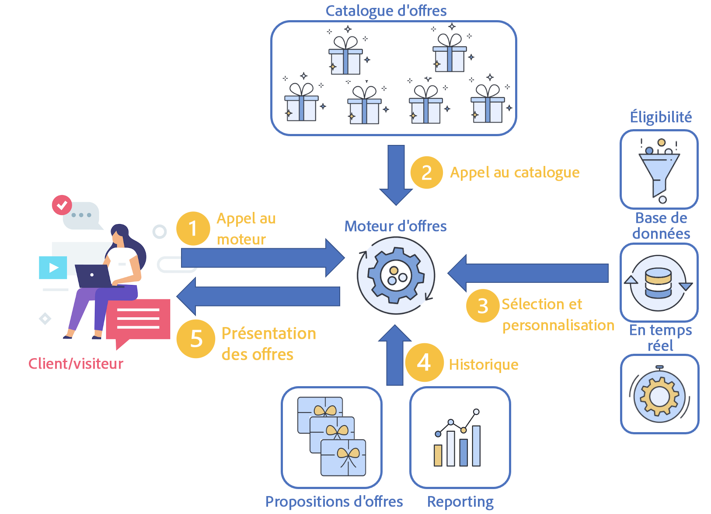

# Gestion des interactions en temps réel

Campaign comprend un module **Interaction** qui permet de répondre en temps réel lors d’une interaction avec un contact donné en lui proposant une ou plusieurs offres adaptées. Il peut s’agir par exemple de messages de communication simples, d’offres spéciales sur un ou plusieurs produits ou d’un service.

Vous pouvez créer un catalogue d’offres qui s’interface avec vos canaux sortants (e-mail, courrier, SMS) pour sélectionner la meilleure offre à envoyer à un contact dans un contexte donné. La meilleure sélection d&#39;offres pour un destinataire est basée sur des **règles d&#39;éligibilité**. La sélection d&#39;une offre à partir d&#39;un ensemble d&#39;offres pertinentes est déterminée à l&#39;aide de règles de priorité. Les règles de présentation des offres prennent en compte l’historique du contact et évitent de lui envoyer plusieurs fois la même offre.

Interaction vous permet de créer et de gérer un catalogue d’offres, et de paramétrer les règles d’éligibilité et les thèmes d’application qui leur sont associés. Vous pouvez personnaliser le contenu de votre offre selon le canal choisi à l’aide de différentes fonctions de rendu. Enfin, pour déterminer l’impact d’une présentation d’offres, vous pouvez utiliser le module de simulation mis à votre disposition.

Tout d’abord, un contact se produit entre un client et une entreprise par le biais d’un canal de communication : il peut s’agir d’un site web (interaction sortante), d’un e-mail, d’un SMS, d’une notification push (interactions entrantes). [En savoir plus](#interaction-types)   

Ce contact génère un appel au moteur d’offres. (1)

Lorsque l’appel au moteur d’offres se produit, une ou plusieurs offres sont sélectionnées dans le catalogue d’offres en fonction du nombre de paramètres d’offres sur la proposition. (2)

Ensuite, les règles d’éligibilité sont appliquées : les meilleures offres sont sélectionnées en fonction des règles d’éligibilité, des dates de début et de fin des offres, des données de profil et du comportement en temps réel du client ou de la cliente. (3)

L’historique des propositions de profil est mis à jour une fois la sélection effectuée afin d’éviter la duplication des offres présentées. (4)

Enfin, la meilleure offre est proposée à la cible. (5)

## Prise en main des offres

Les étapes clés pour commencer sont répertoriées ci-dessous.

### Configuration de votre plateforme

Avant de commencer, en tant qu&#39;**administrateur** de Campaign, assurez-vous d&#39;avoir effectué les tâches suivantes dans les environnements en édition :

1. Création de profils utilisateur. [En savoir plus](interaction-operators.md)
1. (Facultatif) Création d&#39;un environnement d&#39;offres pour chaque dimension de ciblage. [En savoir plus](interaction-env.md)
1. Création de règles de typologie pour chaque environnement. [En savoir plus](interaction-offer.md#offer-presentation)
1. Création d&#39;emplacements pour chaque environnement et configuration des fonctions de rendu. [En savoir plus](interaction-offer-spaces.md)
Si l&#39;emplacement est défini sur un canal unitaire en mode identifié, il est nécessaire de spécifier les paramètres avancés de l&#39;emplacement.

   >[!NOTE]
   >
   >Si l’emplacement est défini sur un canal unitaire en mode identifié, il est nécessaire de spécifier les paramètres avancés de l’emplacement.

1. Paramétrez le moteur d’offres pour les interactions entrantes, afin de proposer et mettre à jour une ou plusieurs offres.

   Les différents modes d’intégration sont décrits dans [cette section](interaction-present-offers.md).

   >[!NOTE]
   >
   >Lorsqu’un emplacement est créé sur le canal web entrant, vous devez configurer le site web pour afficher cette offre.
   >

### Créer et publier le catalogue d’offres {#managing-the-offer-catalog-}

En tant que **Chargé(e) d’offres**, vous devez :

1. Créer des catégories d’offres dans des environnements en édition. [En savoir plus](interaction-offer-catalog.md#creating-offer-categories)
1. Créer des offres dans des environnements en édition. [En savoir plus](interaction-offer.md)
1. Valider et publier des offres sur un ou plusieurs emplacements afin de les rendre disponibles dans les environnements en ligne pour le chargé/la chargée de diffusion. [En savoir plus](interaction-offer.md#approve-offers)

### Utiliser le catalogue d’offres {#using-the-offer-catalog-}

En tant que **Chargé(e) de diffusion**, vous devez :

1. Créer une campagne.
1. Référencer une offre dans la campagne ou la diffusion. [En savoir plus](interaction-send-offers.md).

## Glossaire

Découvrez les termes spécifiques aux offres et les conseils connexes avant de commencer.

* **Environnement** : ensemble comprenant un catalogue d’offres et des points d’extension (emplacements). Créez un environnement par dimension de ciblage. Il existe deux types d’environnements :

   * **Environnement en édition** : environnement dans lequel les offres sont créées et/ou les règles de typologie sont définies (règles qui déterminent les offres à présenter ou non à une personne ciblée). Le tableau des personnes à cibler par les offres et la table de stockage de toutes les propositions d’offres sont également définis dans cet environnement. Le nœud **[!UICONTROL Environnement en édition]** contient des sous-dossiers d&#39;’mplacements, des filtres prédéfinis et des catégories d’offres. Pour chaque **[!UICONTROL Environnement en édition]**, il existe un **[!UICONTROL Environnement en ligne]** correspondant, généré à partir de ce même **[!UICONTROL Environnement en édition]**.
   * **Environnement en ligne**: environnement associé à un **[!UICONTROL Environnement de conception]**. Il contient des offres en lecture seule dont le contenu et l’éligibilité ont été approuvés via l’**[!UICONTROL Environnement en édition]**. Ils peuvent être affichés sur un site web ou insérés dans un message.

* Un **emplacement** désigne un dossier définissant l’emplacement d’exposition de l’offre. Lors de la définition d’un emplacement, vous pouvez :
   * sélectionner le canal
   * choisir d’utiliser le mode unitaire (ou par défaut, uniquement en mode Lot)
   * créer le contenu de l’offre à l’aide de fonctions de rendu
   * indiquer les offres à présenter

  Un emplacement est une interface entre le canal et le moteur d’offres.

  >[!CAUTION]
  >
  >Un emplacement n’est pas un canal de communication, il correspond à un lieu d’exposition sur le canal. Par exemple, les offres exposées sur un site web peuvent occuper deux emplacements sur la même page. Dans ce cas, vous avez deux espaces pour le même canal.
  >
  >Les emplacements doivent être définis dans le cahier des charges et ne doivent pas être modifiés en cours de projet.

* **Catalogue d&#39;offres** : ensemble des offres définies dans Adobe Campaign pouvant être sélectionnées lors d&#39;une interaction. Le catalogue a une organisation hiérarchique dont chaque noeud est une catégorie.
* **Catégorie** : dossier relié au Catalogue d&#39;offres d&#39;un environnement, destiné à organiser les offres selon leur nature, leurs dates d&#39;éligibilité et leurs thèmes d&#39;application. Une catégorie peut contenir d&#39;autres sous-catégories qui hériteront de toutes les caractéristiques définies au niveau de la catégorie parent. Des règles d&#39;éligibilité peuvent être définies au niveau d&#39;une catégorie, afin notamment de les mutualiser pour plusieurs offres.

* **Thèmes d&#39;application** : mots-clés définis au niveau de la catégorie qui permettent de filtrer les offres au moment de leur présentation sur un canal sortant ou entrant en restreignant la sélection des offres à une ou plusieurs catégorie(s).

  >[!NOTE]
  >
  >Les catégories enfants héritent des thèmes définis au niveau de la catégorie parent.

* **Règles d’éligibilité** : contraintes appliquées à un environnement, à une catégorie ou à une offre, portant sur la période de validité, les cibles et le poids. Elles permettent de s’assurer qu’une offre est en adéquation avec un contact ciblé.

  Au niveau des environnements, les règles d’éligibilité comprennent les règles de présentation appliquées aux offres et les personnes à cibler.

  Dans les catégories, les règles d’éligibilité permettent aux opérateurs de limiter la validité de la catégorie dans le temps, de définir des thèmes d’application et de déterminer les personnes à cibler. Elles peuvent également définir un poids multiplicateur pour une période donnée. Ainsi, les opérateurs peuvent partager les règles relatives aux offres d’autres catégories et ainsi simplifier leur gestion.

  Au niveau des offres, les règles d’éligibilité permettent de limiter la validité des offres dans le temps et de déterminer les personnes à cibler.

* **Arbitrage** : sélection des offres à afficher dans un environnement donné (offres éligibles). Le principe de l’arbitrage permet de classer les offres par priorité en fonction des critères définis dans les catégories, les offres et les offres contextuelles.
* **Contact** : contact à l&#39;origine d&#39;une interaction entrante. Lors du traitement de l&#39;appel au moteur, le contact est associé à une dimension de ciblage. On distingue deux types de contacts :

   * **[!UICONTROL Contact identifié]** : contact s&#39;étant volontairement identifié sur le canal. Dans les interactions sortantes, le contact est systématiquement identifié.
   * **[!UICONTROL Contact anonyme]** : contact qui ne s&#39;est pas volontairement inscrit sur le canal mais qui peut être identifié implicitement au moyen d&#39;un cookie. Cette terminologie n&#39;a lieu d&#39;être que dans le cadre d&#39;interactions entrantes.

     >[!NOTE]
     >
     >Les contacts anonymes non identifiés sont rattachés à la dimension de ciblage des visiteurs.

* **Interaction sortante** : appel vers le moteur dʼoffres à partir dʼune liste de contacts (utilisée pour la diffusion dʼe-mails, de publipostage direct, etc.). Les mêmes règles et processus sont appliqués à chaque contact. Ce type d’interaction est généralement traité en mode Lot.
* **Interaction entrante** : interaction faisant suite à un appel entrant généré par l’action d’un contact sur le canal. Ce type d’interaction est généralement traité en mode unitaire.
* **Mode Lot** : le mode Lot permet de sélectionner la meilleure offre pour un ensemble de contacts. Les règles d’éligibilité/hiérarchisation sont appliquées à tous les contacts de l’ensemble. Ce mode est généralement utilisé pour les interactions sortantes.
* **Mode unitaire** : un seul contact est traité à la fois. Ce mode est généralement utilisé pour les interactions entrantes et les messages transactionnels.
* Le **Mode d’identification** fait référence au statut d’un contact :

   * **[!UICONTROL explicite]** : les contacts sont identifiés par leur connexion à l’interface du canal.
   * **[!UICONTROL implicite]** : les contacts sont identifiés par un cookie (permanent ou de session). Il peut être traité comme un contact anonyme ou identifié.
   * **[!UICONTROL anonyme]** : les contacts ne peuvent pas être identifiés.

* **Offre éligible** : offre répondant à des contraintes définies en amont pouvant être proposée de façon cohérente à une cible.
* **Règles de présentation** : règles de typologie référencées au niveau de l&#39;environnement d&#39;offres permettant d&#39;exclure certaines offres en tenant compte de l&#39;historique des propositions.
* **Poids** : il s’agit de formules permettant de calculer de manière précise la pertinence d’une offre, afin de sélectionner l’offre la plus pertinente. Les poids sont définis dans les offres. Les offres éligibles sont prises en compte dans l&#39;ordre décroissant de poids.
* **Fonction de rendu** : il s’agit d’une fonction définie au niveau de l’emplacement d’offre afin de construire son rendu de l’offre en fonction des attributs définis dans l’offre. Il existe trois modes de fonction de rendu différents : HTML, XML et texte.
* **Proposition d&#39;offre** : résultat de l&#39;action qui consiste à présenter une ou plusieurs offres à un contact sur un emplacement donné (une bannière sur un site web, un email ou un SMS par exemple). Ce résultat est stocké dans la table des propositions d&#39;offre. Il n&#39;est cependant pas obligatoire de stocker les propositions.
* **Simulation** : module permettant de tester la présentation d&#39;offres auprès des personnes à cibler avant de procéder à la véritable présentation.
* **Prévisualisation** : aperçu de l&#39;offre telle qu&#39;elle apparaîtra dans son emplacement. La prévisualisation d&#39;une offre est accessible depuis la fenêtre de paramétrage des offres ou le profil d&#39;un contact.
* **Filtres prédéfinis** : les règles de filtrage prédéfinis peuvent prendre en compte des paramètres dʼune offre (par exemple le code de lʼoffre). Elles peuvent être réutilisées une fois les offres créées.
* **Représentation d&#39;offre** : information exploitée par le canal afin d&#39;afficher l&#39;offre. La représentation d&#39;une offre peut être construite à partir de la fonction de rendu de l&#39;emplacement sur lequel l&#39;offre est représentée ou saisie directement dans l&#39;interface (par exemple : dans le bloc HTML). Une offre peut avoir une représentation par emplacement.
* **Processus de basculement** : processus activé dans un environnement identifié, chargé de diriger l&#39;appel vers un environnement anonyme si le contact n&#39;a pas pu être identifié explicitement et/ou implicitement.
