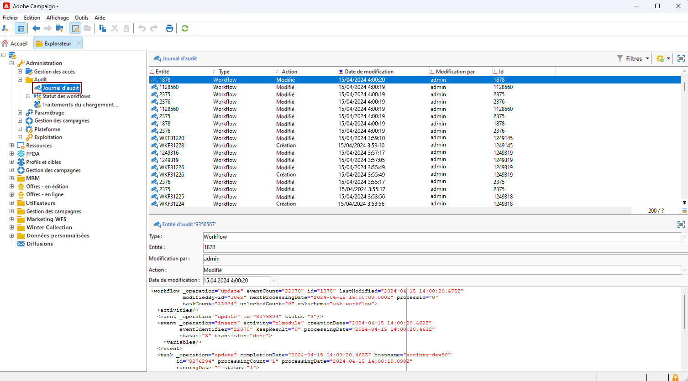
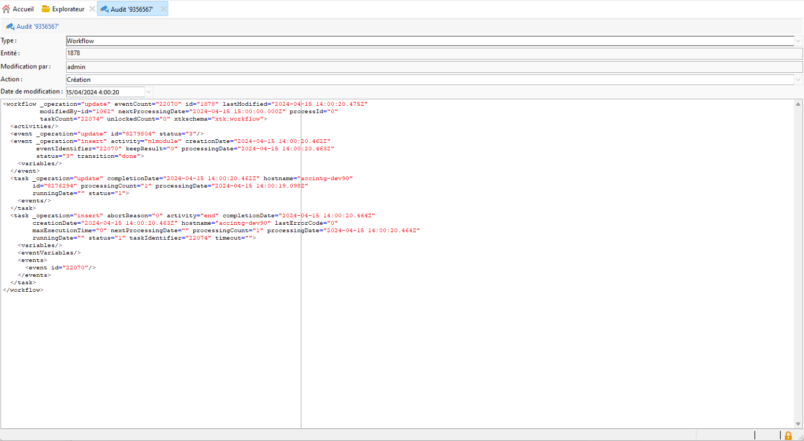
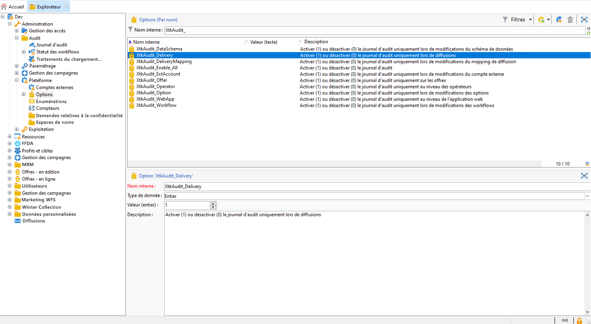
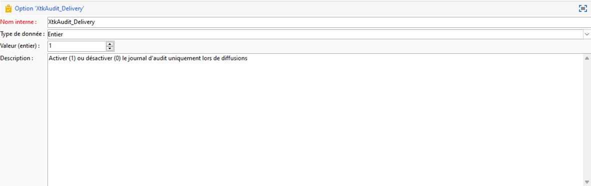

# Journal d’audit{#audit-trail}

La variable **[!UICONTROL Suivi]** La fonctionnalité d’Adobe Campaign offre un enregistrement granulaire de toutes les modifications apportées à des entités importantes de votre instance, généralement celles qui ont un impact significatif sur le bon fonctionnement de l’instance. Fonctionnant en tant que journal en temps réel, il capture une liste détaillée des actions et événements au fur et à mesure qu’ils se produisent.

>[!NOTE]
>
>Adobe Campaign n’effectue pas le suivi des modifications apportées aux droits des utilisateurs, aux modèles, aux personnalisations ni aux campagnes.\
>Le Suivi peut uniquement être géré par les administrateurs de l’instance.

+++ En savoir plus sur les entités disponibles du journal d’audit

* **Suivi du schéma**: vous permet d’explorer les modifications apportées à vos schémas, ainsi que d’identifier qui a effectué ces modifications et quand elles ont eu lieu.

  Pour plus d’informations sur les schémas, voir [page](../dev/schemas.md).

* **Suivi des workflows** effectue le suivi de toutes les actions liées à vos workflows, notamment :

   * Démarrer
   * Pause
   * Arrêter
   * Redémarrer
   * Nettoyer qui correspond à l’action Purge de l’historique
   * Simuler qui correspond à l’action Démarrer en mode simulation
   * Réveiller qui correspond à l’action Traitement anticipé des tâches en attente
   * Arrêt inconditionnel

  Pour plus d’informations sur les workflows, consultez [cette page](../../automation/workflow/about-workflows.md).

  Pour plus d’informations sur la surveillance des workflows, consultez la [section dédiée](../../automation/workflow/monitor-workflow-execution.md).

* **Suivi Option** vous permet de vérifier les activités et les dernières modifications apportées à vos options.

  Pour plus d’informations sur les options, consultez [cette page](https://experienceleague.adobe.com/en/docs/campaign-classic/using/installing-campaign-classic/appendices/configuring-campaign-options).

* **Suivi de la diffusion** permet de vérifier les activités et les dernières modifications apportées à vos diffusions.

  Pour plus d&#39;informations sur les diffusions, consultez cette [page](../start/create-message.md).

* **Compte externe** permet de vérifier les modifications apportées aux comptes externes, utilisées par des processus techniques tels que des workflows techniques ou des workflows de campagne.

  Pour plus d&#39;informations sur le compte externe, reportez-vous à cette section [page](../config/external-accounts.md).

* **Mappage de diffusion** vous permet de surveiller les activités et les modifications récentes apportées à vos mappages de diffusion.

  Pour plus d&#39;informations sur le mapping de diffusion, reportez-vous à cette section [page](../audiences/target-mappings.md).

* **Application web** permet de vérifier les modifications apportées aux formulaires Web dans Campaign V8 utilisées pour créer des pages avec des champs de saisie et de sélection, et qui peuvent inclure des données de la base de données.

  Pour plus d&#39;informations sur les applications web, reportez-vous à cette section [page](../dev/webapps.md).

* **Offre** vous permet de vérifier les activités et les dernières modifications apportées à vos offres.

  Pour plus d&#39;informations sur l&#39;offre, reportez-vous à cette section [page](../interaction/interaction.md).

* **Opérateur** permet de surveiller les activités et les modifications récentes apportées à vos opérateurs.

  Pour plus d&#39;informations sur les opérateurs, reportez-vous à cette section [page](../interaction/interaction-operators.md).

+++

## Accéder au Suivi {#accessing-audit-trail}

Pour accéder à la variable **[!UICONTROL Suivi]**:

1. Accédez au menu **[!UICONTROL Explorateur]** de votre instance.

1. Sous , **[!UICONTROL Administration]** menu, sélectionnez **[!UICONTROL Audit]** then **[!UICONTROL Suivi]**.

   

1. La fenêtre **[!UICONTROL Journal d&#39;audit]** s’ouvre avec la liste de vos entités. Adobe Campaign effectuera le suivi des actions de création, de modification et de suppression pour vos différentes entités.

   Sélectionnez l’une des entités pour en savoir plus sur les dernières modifications.

1. La fenêtre **[!UICONTROL Entité d’audit]** vous donne des informations plus détaillées sur l’entité choisie, telles que :

   * **[!UICONTROL Type]**: workflow, options, diffusions ou schémas.
   * **[!UICONTROL Entité]**: nom interne de vos activités.
   * **[!UICONTROL Modifié par]**: nom d’utilisateur de la dernière personne à avoir modifié cette entité.
   * **[!UICONTROL Action]**: dernière action effectuée sur cette entité, création, modification ou suppression.
   * **[!UICONTROL Date de modification]**: date de la dernière action effectuée sur cette entité.

   

>[!NOTE]
>
>Par défaut, la période de rétention est définie sur 180 jours pour **[!UICONTROL Journaux d’audit]**. Cette valeur peut être modifiée dans l&#39;assistant de déploiement.

## Activer/désactiver le Suivi {#enable-disable-audit-trail}

Le Suivi peut être facilement activé ou désactivé pour une activité spécifique, par exemple si vous voulez économiser de l’espace sur la base de données.

Pour ce faire :

1. Accédez au menu **[!UICONTROL Explorateur]** de votre instance.

1. Sous , **[!UICONTROL Administration]** menu, sélectionnez **[!UICONTROL Plateforme]** then **[!UICONTROL Options]**.

1. Sélectionnez l’une des options suivantes selon l’entité que vous voulez activer/désactiver :

   * Pour un workflow : **[!UICONTROL XtkAudit_Workflows]**
   * Pour un schéma : **[!UICONTROL XtkAudit_DataSchema]**
   * Pour une option : **[!UICONTROL XtkAudit_Option]**
   * Pour les diffusions : **[!UICONTROL XtkAudit_Delivery]**
   * Pour le compte externe : **[!UICONTROL XtkAudit_ExtAccount]**
   * Pour le mapping de diffusion : **[!UICONTROL XtkAudit_DeliveryMapping]**
   * Pour les applications web : **[!UICONTROL XtkAudit_WebApp]**
   * Pour l’offre : **[!UICONTROL XtkAudit_Offer]**
   * Pour l’opérateur : **[!UICONTROL XtkAudit_Operator]**
   * Pour chaque entité : **[!UICONTROL XtkAudit_Enable_All]**

   

1. Définissez la **[!UICONTROL Valeur]** sur 1 si vous voulez activer l’entité, ou sur 0 si vous voulez la désactiver.

   

1. Cliquez sur **[!UICONTROL Enregistrer]**.
