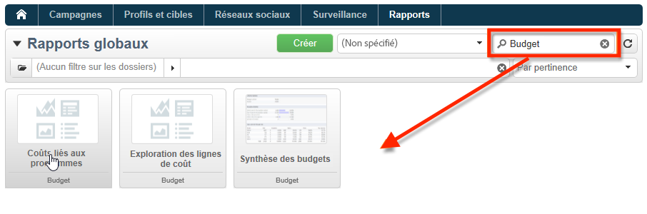

# Rapports intégrés d’Adobe Campaign {#ootb-reports}

Cette page fournit la liste des rapports intégrés d’Adobe Campaign, leur contenu et leur contexte. Toute une gamme de rapports intégrés est comprise dans Adobe Campaign. Vous pouvez y accéder à partir de la console cliente ou d’un navigateur Internet.

Les types de rapports disponibles sont les suivants :

* Rapports concernant l’ensemble de la plateforme. [En savoir plus](global-reports.md).
* Rapports de diffusion. [En savoir plus](delivery-reports.md).

Vous pouvez accéder aux rapports intégrés à partir de la page d’accueil de Campaign, du tableau de bord des rapports dédié ou de la liste des diffusions. La façon dont le rapport s’affiche dans l’interface utilisateur dépend de son contexte.

Une liste des principaux rapports est disponible sur la page d’accueil et permet d’accéder rapidement aux données de diffusion. Cette liste peut être modifiée en fonction de vos besoins. Vous pouvez également apprendre à ajouter vos propres rapports à l’onglet **[!UICONTROL Rapports.]**

Pour plus d’informations sur ces configurations personnalisées, consultez la [documentation de Campaign Classic v7](https://experienceleague.adobe.com/docs/campaign-classic/using/reporting/creating-new-reports/configuring-access-to-the-report.html?lang=fr).

## Accès aux rapports intégrés {#access-ootb-reports}

Pour accéder aux rapports natifs de Campaign :

1. Sélectionnez l&#39;onglet **[!UICONTROL Rapports]** de l&#39;interface Adobe Campaign.

   

1. Utilisez les champs de recherche pour filtrer les rapports affichés.

1. Cliquez ensuite sur le rapport souhaité pour l&#39;afficher.

   

1. Cliquez sur le lien **[!UICONTROL Retour]** situé en haut de l&#39;écran pour revenir à la liste des rapports.

   

Les rapports spécifiques à une opération ou à une diffusion sont accessibles à partir de leur tableau de bord respectif.

Le principe est le même pour les listes, les services, les offres, etc., comme dans l&#39;exemple ci-dessous :

## Rapports sur les diffusions {#reports-on-deliveries}

Les rapports intégrés fournis par Adobe Campaign figurent dans le tableau ci-après.

Pour plus d&#39;informations sur le contenu de ces rapports, consultez [cette section](delivery-reports.md).

<table> 
 <tbody> 
  <tr> 
   <td> <strong>Libellé et nom interne</strong>  </td> 
   <td> <strong>Description</strong>  </td> 
   <td> <strong>Schéma</strong>  </td> 
  </tr> 
  <tr> 
   <td> Activités utilisateurs (recipientActivity)  </td> 
   <td> Répartition des ouvertures, clics et transactions des destinataires par tranche horaire.  </td> 
   <td> nms:delivery  </td> 
  </tr> 
  <tr> 
   <td> Débit de diffusion (throughput)  </td> 
   <td> Graphes de débit de diffusion, en messages/heure et Bits/s.  </td> 
   <td> nms:delivery  </td> 
  </tr> 
  <tr> 
   <td> Echecs et retours (errors)  </td> 
   <td> Ventilation des échecs et retours, par cause et domaine de messagerie.  </td> 
   <td> nms:delivery  </td> 
  </tr> 
  <tr> 
   <td> Indicateurs de tracking (deliveryFeedback)  </td> 
   <td> Synthèse des indicateurs-clés pour le tracking du comportement des destinataires.  </td> 
   <td> nms:delivery  </td> 
  </tr> 
  <tr> 
   <td> Indicateurs de tracking (mobileAppDeliveryFeedback)  </td> 
   <td> Indicateurs de tracking d'une diffusion sur application mobile.  </td> 
   <td> nms:delivery  </td> 
  </tr> 
  <tr> 
   <td> Navigateurs (browserStatistics)  </td> 
   <td> Statistiques sur les navigateurs utilisés par les destinataires ayant cliqué dans les messages.  </td> 
   <td> xtk:none  </td> 
  </tr> 
  <tr> 
   <td> Partage vers les réseaux sociaux (deliveryForward)  </td> 
   <td> Statistiques des partages et d'ouvertures.  </td> 
   <td> nms:delivery  </td> 
  </tr> 
  <tr> 
   <td> Position des clics (hoturls)  </td> 
   <td> Affiche le message et les taux de clics en surimpression.  </td> 
   <td> nms:delivery  </td> 
  </tr> 
  <tr> 
   <td> Rapport des hypothèses (deliveryHypothesis)  </td> 
   <td> Affiche la synthèse des mesures sur les hypothèses de diffusion.  </td> 
   <td> nms:delivery  </td> 
  </tr> 
  <tr> 
   <td> Statistiques de diffusion (statisticsPerDelivery)  </td> 
   <td> Statistiques (messages traités, messages délivrés, erreurs hard, erreurs soft, ouvertures, clics, désinscriptions) par domaine de l'email.  </td> 
   <td> nms:delivery  </td> 
  </tr> 
  <tr> 
   <td> Statistiques des activités de partage (forwardActivities)  </td> 
   <td> Analyse des partages, ouvertures et abonnements par périodes de temps.  </td> 
   <td> nms:delivery  </td> 
  </tr> 
  <tr> 
   <td> Statistiques de tracking (trackingStatistics)  </td> 
   <td> Statistiques sur les taux d'ouvertures, clics et transactions dans le temps.  </td> 
   <td> nms:delivery  </td> 
  </tr> 
  <tr> 
   <td> Synthèse des diffusions (deliverySending)  </td> 
   <td> Synthèse des indicateurs de la diffusion : cible, exclusions et envois.  </td> 
   <td> nms:delivery  </td> 
  </tr> 
  <tr> 
   <td> Synthèse des diffusions (deliveryStatistics)  </td> 
   <td> Tableau de synthèse des diffusions sélectionnées : cibles, exclusions et envois.  </td> 
   <td> nms:delivery  </td> 
  </tr> 
  <tr> 
   <td> Systèmes d'exploitation (osStatistics)  </td> 
   <td> Statistiques sur les systèmes d'exploitation utilisés par les destinataires ayant cliqué dans un message.  </td> 
   <td> xtk:none  </td> 
  </tr> 
  <tr> 
   <td> Taux de réactivité (deliveryFeedbackSocial)  </td> 
   <td> Taux de réactivité d'une diffusion et répartition des réactions.  </td> 
   <td> nms:delivery  </td> 
  </tr> 
  <tr> 
   <td> URL et flux de clics (topUrlDelivery)  </td> 
   <td> URL les plus réactives et flux de clics associés.  </td> 
   <td> nms:delivery  </td> 
  </tr> 
 </tbody> 
</table>

## Rapports sur les opérations {#reports-on-campaigns}

Les rapports sur les campagnes portent sur les données du tableau **nms:operation**.

<table> 
 <tbody> 
  <tr> 
   <td> <strong>Libellé et nom interne</strong>  </td> 
   <td> <strong>Description</strong>  </td> 
  </tr> 
  <tr> 
   <td> Activités utilisateurs (operationRecipientActivity)  </td> 
   <td> Répartition des ouvertures, clics et transactions des destinataires par tranche horaire. Dépend de Campaign.  </td> 
  </tr> 
  <tr> 
   <td> Débit de diffusion (operationThroughput)  </td> 
   <td> Graphes de débit de diffusion, en mails/heure et Mbits/s. Dépend de Campaign.  </td> 
  </tr> 
  <tr> 
   <td> Dépenses de l'opération (budgetOperationExpenses)  </td> 
   <td> Affiche en détail les dépenses rattachées à l'opération. Dépend de Campaign.  </td> 
  </tr> 
  <tr> 
   <td> Echecs et retours (operationErrors)  </td> 
   <td> Ventilation des échecs et retours, par cause et domaine de messagerie. Dépend de Campaign.  </td> 
  </tr> 
  <tr> 
   <td> Exploration des lignes de coût (budgetExplorerOperation)  </td> 
   <td> Analyse descriptive d'exploration des lignes de coûts. Dépend de MRM.  </td> 
  </tr> 
  <tr> 
   <td> Indicateurs de tracking (operationFeedback)  </td> 
   <td> Synthèse des indicateurs-clés de tracking : ouvertures, clics et transactions. Dépend de Campaign.  </td> 
  </tr> 
  <tr> 
   <td> Partage vers les réseaux sociaux (operationForward)  </td> 
   <td> Statistiques des partages et d'ouvertures. Dépend de Campaign.  </td> 
  </tr> 
  <tr> 
   <td> Rapport des hypothèses (operationHypothesis)  </td> 
   <td> Affiche la synthèse des mesures sur les hypothèses des diffusions de l'opération. Dépend de Campaign.  </td> 
  </tr> 
  <tr> 
   <td> Statistiques des activités de partage (forwardActivityOpt)  </td> 
   <td> Analyse des partages, ouvertures et abonnements par périodes de temps. Dépend de Campaign.  </td> 
  </tr> 
  <tr> 
   <td> Synthèse des diffusions (operationStatistics)  </td> 
   <td> Tableau de synthèse des diffusions de l'opération : cibles, exclusions et envois.  </td> 
  </tr> 
  <tr> 
   <td> URL et flux de clics (operationTopUrlDelivery)  </td> 
   <td> URL les plus réactives et flux de clics associés. Dépend de Campaign.  </td> 
  </tr> 
 </tbody> 
</table>

## Rapports sur les services {#reports-on-services}

Les rapports sur les services portent sur les données du tableau **nms:service**.

<table> 
 <tbody> 
  <tr> 
   <td> <strong>Libellé et nom interne</strong>  </td> 
   <td> <strong>Description</strong>  </td> 
  </tr> 
  <tr> 
   <td> Acquisitions des fans (socialAcquisitionsByWebapp)  </td> 
   <td> Quelles sont les applications web à l'origine des acquisitions de prospects ? Dépend du composant additionnel Social Marketing.  </td> 
  </tr> 
  <tr> 
   <td> Répartition des abonnements (mobileAppDistribution)  </td> 
   <td> Répartition des abonnements actifs par application mobile. Dépend du composant additionnel Mobile app channel.  </td> 
  </tr> 
  <tr> 
   <td> Tracking des abonnements (subscriptionsProgress)  </td> 
   <td> Evolution des inscriptions aux services d'information  </td> 
  </tr> 
  <tr> 
   <td> Taux de réactivité (socialReactionRate)  </td> 
   <td> Quels sont les taux de réactivité obtenus par les dernières diffusions ? Dépend du composant additionnel Social Marketing.  </td> 
  </tr> 
  <tr> 
   <td> Taux de réactivité (mobileAppReactivityRate)  </td> 
   <td> Taux de réactivité des dernières diffusions. Dépend du composant additionnel Canal des applications mobiles.  </td> 
  </tr> 
 </tbody> 
</table>

## Rapports sur les budgets {#budget-reports}

Les rapports intégrés fournis par Adobe Campaign figurent dans le tableau ci-après.

<table> 
 <tbody> 
  <tr> 
   <td> <strong>Libellé et nom interne</strong>  </td> 
   <td> <strong>Description</strong>  </td> 
   <td> <strong>Schéma</strong>  </td> 
  </tr> 
  <tr> 
   <td> Coûts liés au(x) programme(s) (budgetProgramCost)  </td> 
   <td> Répartition des coûts du programme.  </td> 
   <td> nms:program  </td> 
  </tr> 
  <tr> 
   <td> Evolution du budget (budgetEvolution)  </td> 
   <td> Evolution des coûts du budget, répartis par niveau d'engagement.  </td> 
   <td> nms:budget  </td> 
  </tr> 
  <tr> 
   <td> Evolution cumulée du budget (budgetCumulativeEvolution)  </td> 
   <td> Evolution des coûts cumulés du budget, répartis par niveau d'engagement . </td> 
   <td> nms:budget  </td> 
  </tr> 
  <tr> 
   <td> Exploration des lignes de coût (budgetExplorerBudget)  </td> 
   <td> Analyse descriptive d'exploration des lignes de coûts.  </td> 
   <td> nms:budget  </td> 
  </tr> 
  <tr> 
   <td> Exploration des lignes de coût (budgetExplorer)  </td> 
   <td> Analyse descriptive d'exploration des lignes de coûts.  </td> 
   <td> nms:costLine  </td> 
  </tr> 
  <tr> 
   <td> Exploration des lignes de coût (budgetExplorerPlan)  </td> 
   <td> Analyse descriptive d'exploration des lignes de coûts.  </td> 
   <td> nms:plan  </td> 
  </tr> 
  <tr> 
   <td> Exploration des lignes de coût (budgetExplorerProgram)  </td> 
   <td> Analyse descriptive d'exploration des lignes de coûts.  </td> 
   <td> nms:program  </td> 
  </tr> 
  <tr> 
   <td> Synthèse du/des budget(s) (budget)  </td> 
   <td> Etat instantané des coûts principaux, des catégories de dépenses et des budgets.  </td> 
   <td> nms:budget  </td> 
  </tr> 
 </tbody> 
</table>

## Rapports sur les simulations {#reports-on-simulations}

Les rapports sur les simulations portent sur les données du tableau **nms:simulation**.

<table> 
 <tbody> 
  <tr> 
   <td> <strong>Libellé et nom interne</strong>  </td> 
   <td> <strong>Description</strong>  </td> 
  </tr> 
  <tr> 
   <td> Détail des exclusions de la simulation (dlvSimuLossesDetail)  </td> 
   <td> Tableau détaillé de toutes les causes d'exclusion.  </td> 
  </tr> 
  <tr> 
   <td> Répartition des offres par rang (offerSimulationRanking)  </td> 
   <td> Répartition des offres de la simulation, par rang d'apparition.  </td> 
  </tr> 
  <tr> 
   <td> Résumé de la simulation (dlvSimuLossesSummary)  </td> 
   <td> Résumé des volumes et des exclusions de la simulation.  </td> 
  </tr> 
  <tr> 
   <td> Statistiques de recouvrement (dlvSimuOverlapping)  </td> 
   <td> Volumes de recouvrement des cibles des diffusions.  </td> 
  </tr> 
  <tr> 
   <td> Synthèse des exclusions dues à la simulation (dlvSimuLossesSimu)  </td> 
   <td> Tableau des exclusions dûes à la simulation.  </td> 
  </tr> 
 </tbody> 
</table>

## Rapports sur les applications Web {#reports-on-web-applications}

Les rapports sur les applications Web portent sur les données du tableau **nms:WebApp**.

<table> 
 <tbody> 
  <tr> 
   <td> <strong>Libellé et nom interne</strong>  </td> 
   <td> <strong>Description</strong>  </td> 
  </tr> 
  <tr> 
   <td> Documentation (surveyDictionary)  </td> 
   <td> Description de la structure du questionnaire. Dépend du composant additionnel Survey Manager.  </td> 
  </tr> 
  <tr> 
   <td> Général (surveyProperties)  </td> 
   <td> Propriétés du questionnaire  </td> 
  </tr> 
  <tr> 
   <td> Répartition des réponses (surveyDistribution)  </td> 
   <td> Répartition des réponses aux questions.  </td> 
  </tr> 
 </tbody> 
</table>

## Autres rapports d&#39;usine {#other-ootb-reports}

Les rapports suivants sont également fournis natifs. Pour plus d&#39;informations, reportez-vous au document relatif à la fonctionnalité à laquelle ils sont associés.

<table> 
 <tbody> 
  <tr> 
   <td> <strong>Libellé et nom interne</strong>  </td> 
   <td> <strong>Description</strong>  </td> 
   <td> <strong>Schéma</strong>  </td> 
  </tr> 
  <tr> 
   <td> Analyse des offres (offerAnalysis)  </td> 
   <td> Analyse des offres par date et canal. Dépend du composant additionnel Interaction.  </td> 
   <td> nms:offer  </td> 
  </tr> 
  <tr> 
   <td> Efficacité du remarketing (remarketingEffect)  </td> 
   <td> Mesure de l'efficacité du remarketing  </td> 
   <td> nms:webEvent  </td> 
  </tr> 
  <tr> 
   <td> Historique des acquisitions de prospects sociaux (socialVisitorStatistics)  </td> 
   <td> Historique des acquisitions des prospects Twitter et Facebook. Dépend du composant additionnel Social Marketing.  </td> 
   <td> nms:visitor  </td> 
  </tr> 
  <tr> 
   <td> Tracking des propositions récentes (recentPropositions)  </td> 
   <td> Tracking en temps réel des propositions  </td> 
   <td> nms:propositionRcp  </td> 
  </tr> 
 </tbody> 
</table>
