# Créer un cube{#create-a-cube}

## Espace de travail des cubes {#cube-workspace}

Pour utiliser les cubes, accédez à **[!UICONTROL Administration > Configuration > Cubes]** dans l’Explorateur Campaign.

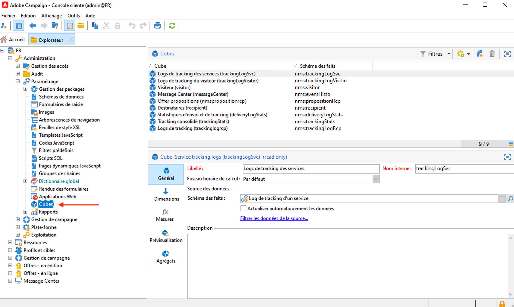

Les cubes vous permettent d’effectuer les opérations suivantes :

* Exporter les données directement dans un rapport, conçu sous l’onglet **[!UICONTROL Rapports]** de la plateforme Adobe Campaign.

  Pour cela, créez un nouveau rapport et sélectionnez le cube à utiliser.

  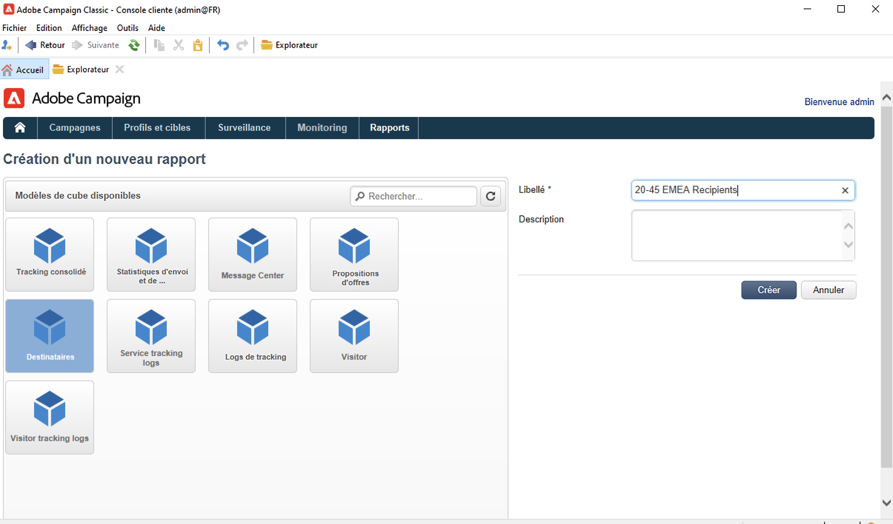

  Les cubes sont des modèles à partir desquels des rapports sont créés. Une fois le modèle sélectionné, cliquez sur **[!UICONTROL Créer]** pour configurer et afficher le nouveau rapport.

  Vous pouvez alors adapter les mesures, modifier le mode d’affichage ou configurer le tableau, puis afficher le rapport à partir du bouton central.

  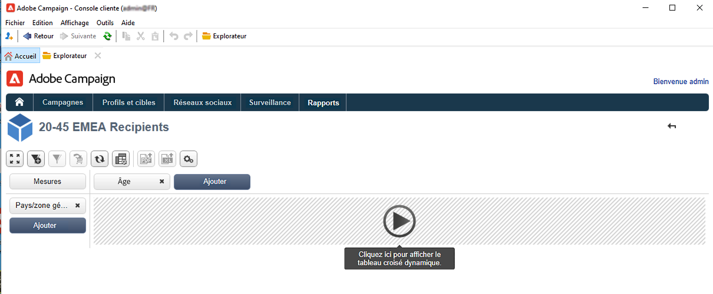

* Vous pouvez référencer un cube dans la boîte de **[!UICONTROL Requête]** d’un rapport afin d’en utiliser les indicateurs, comme illustré dans l’exemple ci-dessous :

  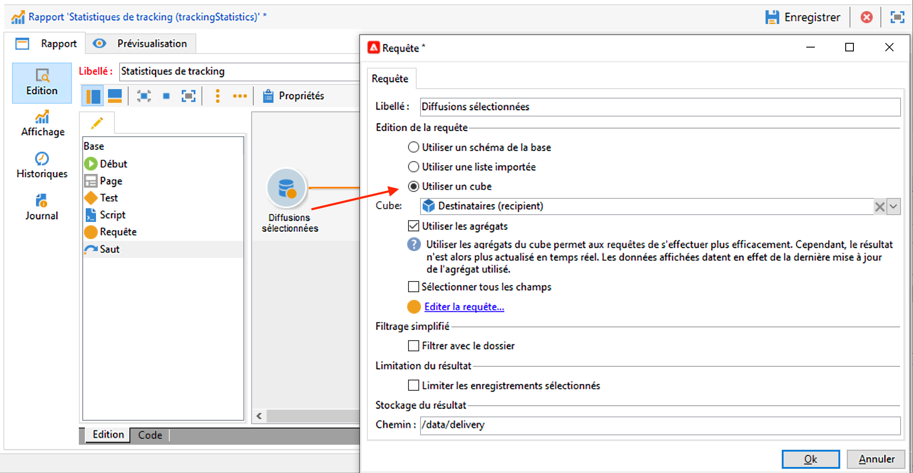

* Insérer un tableau croisé dynamique basé sur un cube dans n’importe quelle page d’un rapport. Pour ce faire, référencez le cube à utiliser sous l’onglet **[!UICONTROL Données]** du tableau croisé dynamique de la page concernée.

  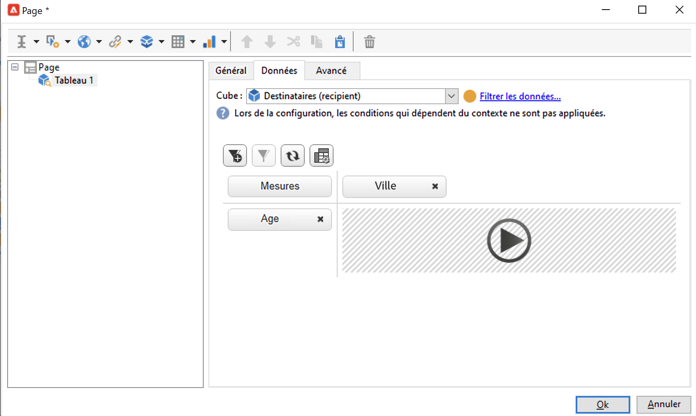

  Pour plus dʼinformations, consultez la section [Exploration des données dans un rapport](cube-tables.md#explore-the-data-in-a-report).

>[!CAUTION]
>
>Pour créer des cubes, vous avez besoin d’autorisations d’administrateur.
>

## Créer un cube{#cube-create}

Avant de commencer la création d’un rapport basé sur un cube, identifiez les dimensions et mesures pertinentes, puis créez-les dans le cube.

Pour créer un cube, procédez comme suit :

1. Sélectionner la table de travail. [En savoir plus](#select-the-work-table).
1. Définissez des dimensions. [En savoir plus](#define-dimensions).
1. Définissez des mesures. [En savoir plus](#build-indicators).
1. Créez des agrégats (facultatif). [En savoir plus](customize-cubes.md#calculate-and-use-aggregates).

Dans l’exemple ci-dessous, vous allez découvrir comment créer rapidement un cube simple et l’utiliser dans un rapport afin d’en exporter ses mesures.

### Sélectionner la table de travail {#select-the-work-table}

Pour créer un cube, procédez comme suit :

1. Cliquez sur le bouton **[!UICONTROL Nouveau]** situé au-dessus de la liste des cubes.

   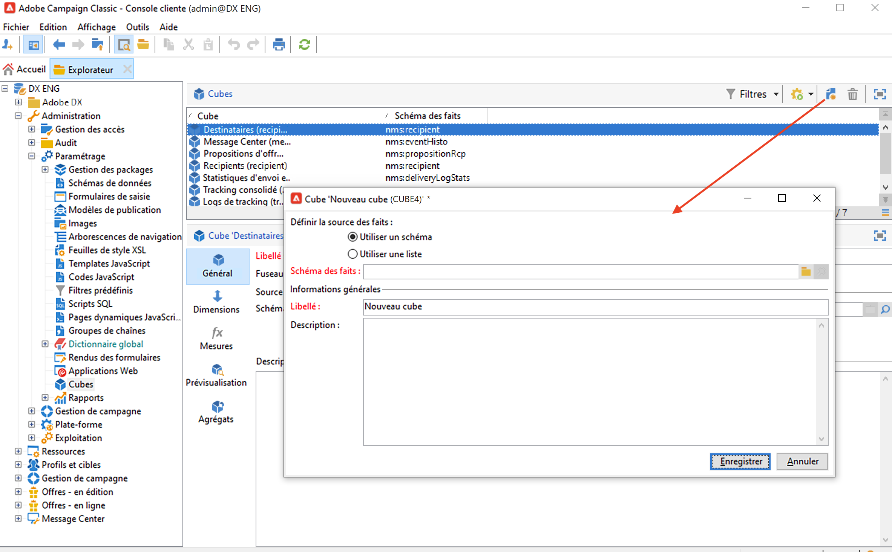

1. Sélectionnez le schéma qui contient les éléments que vous souhaitez explorer (également appelé « schéma des faits »). Dans cet exemple, sélectionnez le tableau par défaut **Destinataire**.
1. Cliquez sur **[!UICONTROL Enregistrer]** pour créer le cube. Il est alors ajouté à la liste des cubes. Vous pouvez maintenant utiliser les onglets pour le configurer.

1. Cliquez sur le lien **[!UICONTROL Filtrer les données de la source...]** pour appliquer les calculs de ce cube aux données de la base de données.

   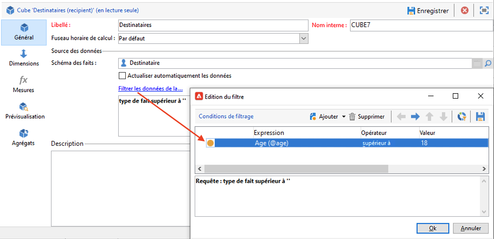

### Définir les dimensions {#define-dimensions}

Une fois le cube créé, vous pouvez définir ses dimensions. Les dimensions sont les angles d’analyse définis pour chaque cube en fonction du schéma des faits qui leur est associé. Il s’agit des dimensions explorées dans l’analyse, comme le temps (année, mois, date), une classification de produits ou de contrats (famille, référence, etc.), un segment de population (par ville, tranche d’âge, statut, etc.).

Pour créer des dimensions, procédez comme suit :

1. Accédez à l’onglet **[!UICONTROL Dimension]** du cube et cliquez sur le bouton **[!UICONTROL Ajouter]** pour créer une dimension.
1. Dans le **[!UICONTROL Champ d’expression]**, cliquez sur l’icône **[!UICONTROL Éditer l’expression]** pour sélectionner le champ qui contient les données concernées.

   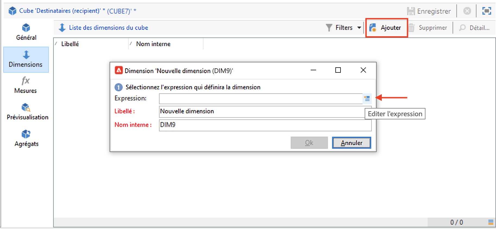

1. Dans cet exemple, nous avons choisi l’**Âge** du destinataire. Pour ce champ, vous pouvez définir un compartimentage afin de regrouper les âges et faciliter la lisibilité des informations. Il est recommandé de définir un compartimentage lorsqu’il peut y avoir plusieurs valeurs distinctes.

Pour cela, cochez l’option **[!UICONTROL Activer le compatimentage.]** [En savoir plus](customize-cubes.md#data-binning).

1. Ajoutez une dimension de type **Date**. Ici, nous souhaitons afficher les dates de création des profils de destinataires. Pour ce faire, cliquez sur **[!UICONTROL Ajouter]** et choisissez le champ **[!UICONTROL Date de création]** dans la table des destinataires.
Vous pouvez personnaliser le mode d’affichage de la date. Pour ce faire, sélectionnez la hiérarchie à utiliser et les niveaux à générer :

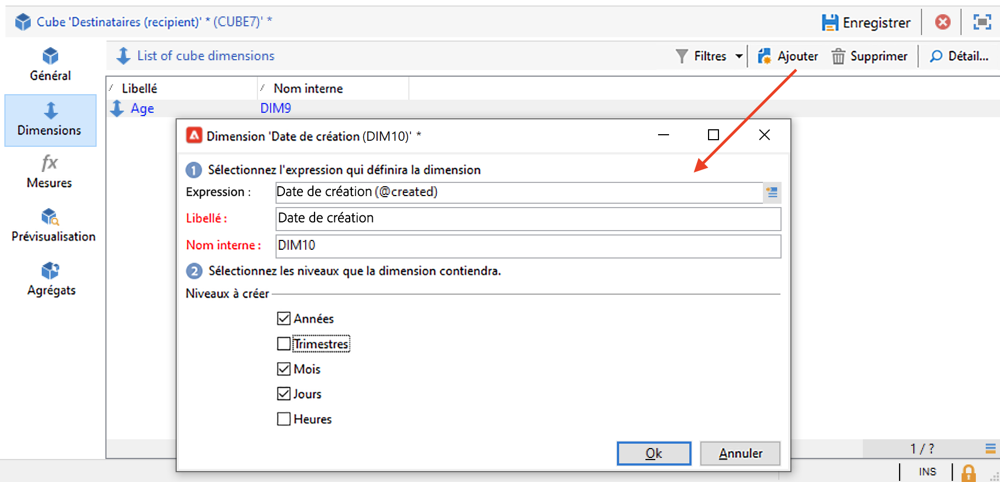

Dans notre exemple, nous souhaitons afficher uniquement les années, mois et jours. Il n’est pas possible d’utiliser à la fois les semaines et les trimestres/mois : ces niveaux ne sont pas compatibles.

1. Créez une autre dimension pour analyser les données relatives à la ville du destinataire. Pour cela, ajoutez une nouvelle dimension et sélectionnez la ville, sous le noeud **[!UICONTROL Localisation]** du schéma des destinataires.

Vous pouvez activer la mise en classe afin de simplifier la lecture des informations et lier les valeurs à une valeur d&#39;énumération.

Sélectionnez l&#39;énumération dans la liste déroulante.. Notez que cette énumération doit être définie comme **[!UICONTROL Réservée au compartimentage]**.

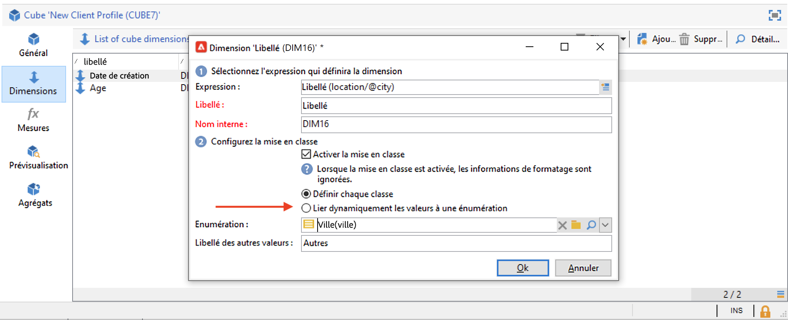

Seules les valeurs présentes dans l’énumération seront affichées. Toutes les autres seront regroupées sous le libellé défini dans le champ **[!UICONTROL Libellé des autres valeurs]**.

Pour plus d’informations, consultez [cette section](customize-cubes.md#dynamically-manage-bins).

### Construire des indicateurs {#build-indicators}

Une fois les dimensions définies, vous pouvez indiquer un mode de calcul pour les valeurs à afficher dans les cellules.

Pour ce faire, créez les indicateurs sous l’onglet **[!UICONTROL Mesures]**. Créez autant de mesures qu’il y a de colonnes à afficher dans les rapports basés sur ce cube.

Pour créer les indicateurs, procédez comme suit :

1. Accédez à l’onglet **[!UICONTROL Mesures]** et cliquez sur le bouton **[!UICONTROL Ajouter]**.
1. Sélectionnez le type de mesure et la formule à appliquer. Dans cet exemple, nous souhaitons comptabiliser le nombre de femmes parmi les destinataires. Notre mesure se base sur le schéma des faits et utilise l’opérateur **[!UICONTROL Comptage]**.

   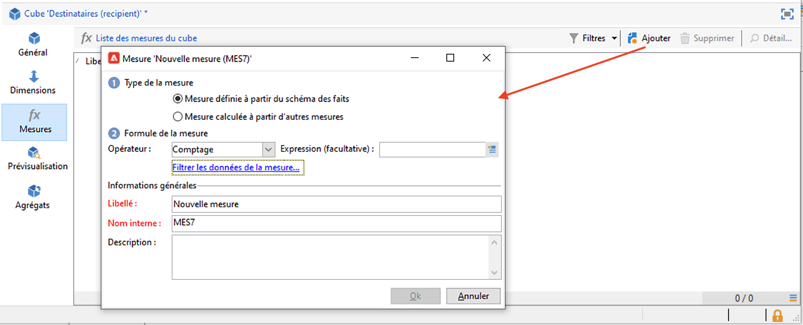

   Utilisez le lien **[!UICONTROL Filtrer les données de la mesure...]** pour ne sélectionner que les femmes. [En savoir plus](customize-cubes.md#define-measures).

   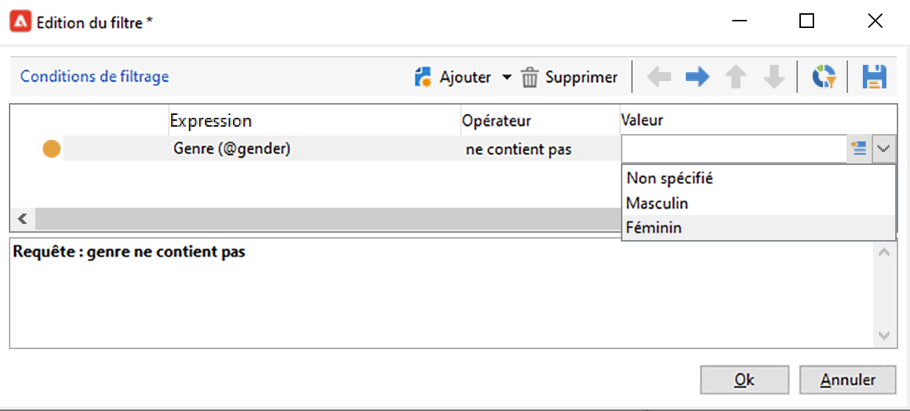

1. Saisissez le libellé de la mesure et enregistrez-la.

   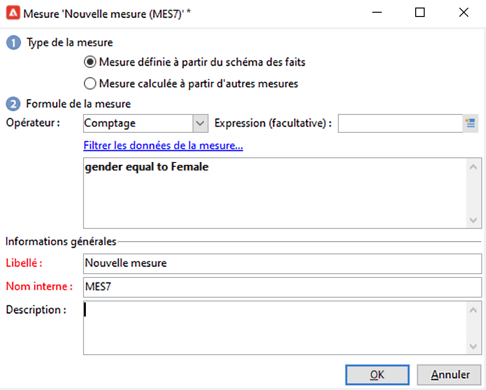

1. Enregistrez le cube.

Vous pouvez maintenant créer un rapport basé sur ce cube. [En savoir plus](cube-tables.md).
