# Utilisation des cubes pour explorer les données{#use-cubes-to-create-reports}

Utilisez des cubes pour créer des rapports, ainsi que pour identifier et sélectionner des données dans la base de données. Vous pouvez ainsi :

* Créer des rapports basés sur des cubes. [En savoir plus](#explore-the-data-in-a-report).
* Collecter des données de la base et les regrouper dans des listes, par exemple pour identifier et construire les cibles des diffusions. [En savoir plus](#build-a-target-population).
* Insérer un tableau croisé dynamique dans un rapport, au sein duquel vous référencez un cube existant. [En savoir plus](#insert-a-pivot-table-into-a-report).

## Exploration des données dans un rapport {#explore-the-data-in-a-report}

### Étape 1 : création dʼun rapport basé sur un cube {#step-1---create-a-report-based-on-a-cube}

Une fois le [cube paramétré](cube-indicators.md), il peut être utilisé comme modèle pour créer un rapport.

Pour créer un rapport basé sur un cube existant, procédez comme suit :

1. Cliquez sur le bouton **[!UICONTROL Créer]** de l’onglet **[!UICONTROL Rapports]** et sélectionnez le cube que vous venez de créer.

   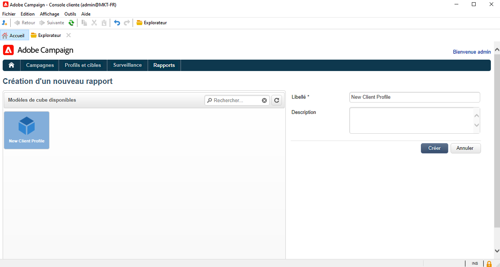

1. Cliquez sur le bouton **[!UICONTROL Créer]** pour valider : vous accédez alors à la page de configuration et de visualisation du rapport.

   Par défaut, les deux premières dimensions disponibles sont proposées en lignes et en colonnes, mais aucune valeur n’est affichée dans le tableau. Pour générer le tableau, cliquez sur l&#39;icône principale :

   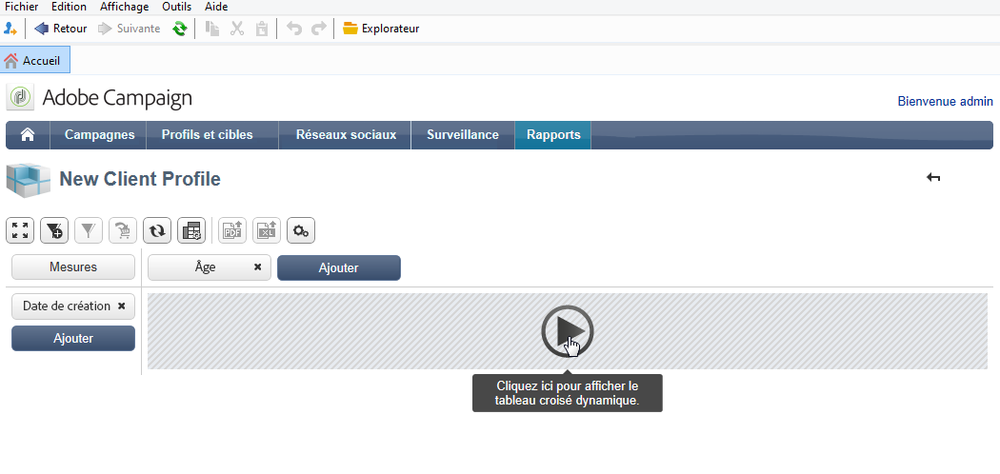

1. Vous pouvez changer les axes de la dimension, les supprimer, ajouter de nouvelles mesures, etc. Pour ce faire, utilisez les icônes appropriées.

   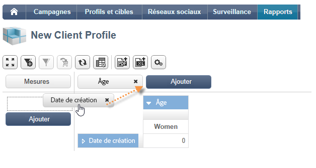

   Ces opérations sont décrites ci-dessous.

### Étape 2 : sélection des lignes et colonnes {#step-2---select-lines-and-columns}

L&#39;affichage par défaut propose alors les deux premières dimensions du cube (dans notre exemple : l&#39;âge et la ville).

Les boutons **[!UICONTROL Ajouter]** situés sur chacun des axes permettent d&#39;ajouter d&#39;autres dimensions.

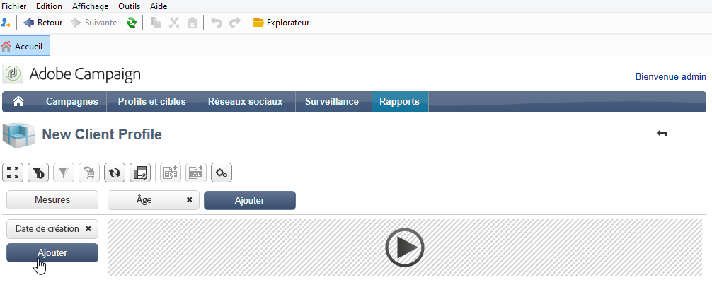

1. Sélectionnez les dimensions à afficher dans les lignes et colonnes du tableau. Pour ce faire, faites glisser et déposez les dimensions disponibles.
1. Sélectionnez la dimension à ajouter dans le tableau, parmi celles disponibles :
   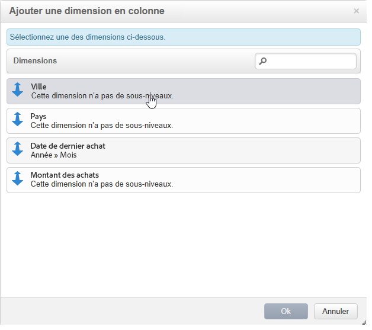

1. Sélectionnez ensuite les paramètres de cette dimension.

   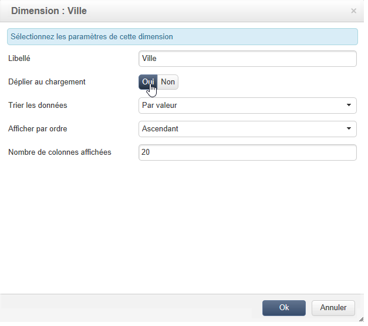

   Les paramètres disponibles varient selon le type de données de la dimension sélectionnée.

   Par exemple, pour les dates, plusieurs niveaux peuvent être disponibles. Pour plus dʼinformations, consultez la section [Affichage des mesures](customize-cubes.md#display-measures).

   À titre d’exemple, les options suivantes sont disponibles :

   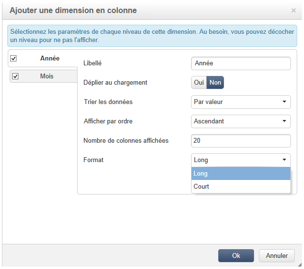

   Vous pouvez, au choix :

   * Déplier les données au chargement : les valeurs seront alors affichées par défaut à chaque mise à jour du rapport (valeur par défaut : non).
   * Afficher le total en fin de ligne : pour les données affichées en colonne, une options supplémentaire est proposée afin d&#39;afficher le total en fin de ligne : une colonne supplémentaire est alors ajoutée dans le tableau (valeur par défaut : oui).
   * Appliquer un tri : les valeurs de la colonne peuvent être triées par valeur, par libellé, ou selon une mesure (valeur par défaut : par valeur).
   * Afficher les valeurs dans l&#39;ordre ascendant (a-z, 0-9) ou descendant (z-a, 9-0).
   * Modifier le nombre de colonnes à afficher au chargement (par défaut : 200).

1. Cliquez sur **[!UICONTROL Ok]** pour confirmer l&#39;insertion : la dimension est alors ajoutée parmi les dimensions existantes.

   Le bandeau jaune situé au-dessus du tableau indique que vous avez effectué des modifications : cliquez sur le bouton **[!UICONTROL Enregistrer]** si vous souhaitez les sauvegarder.

   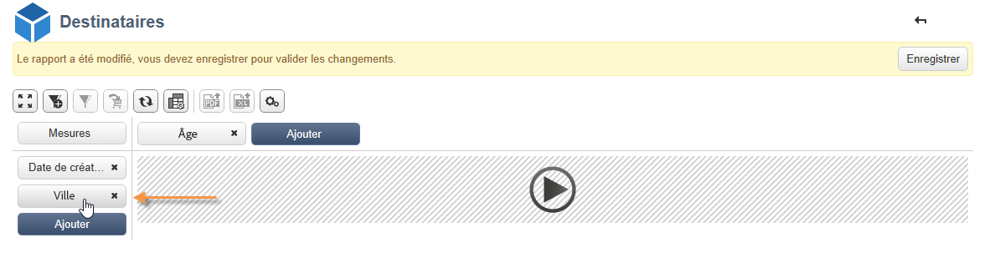

### Étape 3 : configuration des mesures à afficher {#step-3---configure-the-measures-to-display}

Une fois les lignes et les colonnes définies, sélectionnez les mesures à afficher. Par défaut, une seule mesure s’affiche.

Pour ajouter et configurer des mesures, procédez comme suit :

1. Cliquez sur le bouton **[!UICONTROL Mesures]**.

   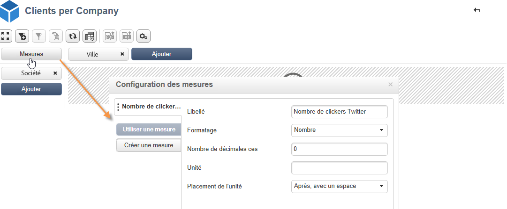

1. À l’aide du bouton **[!UICONTROL Utiliser une mesure]**, sélectionnez une des mesures existantes.

   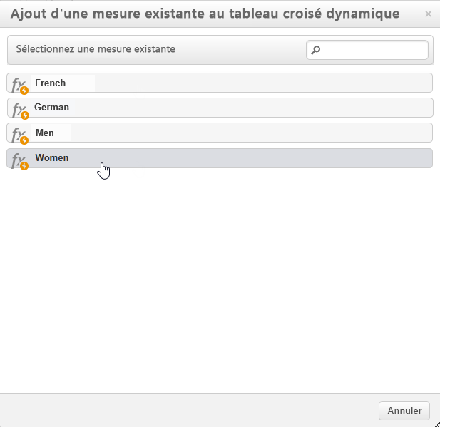

   Choisissez les informations à afficher et les options de mise en forme. La liste des options disponibles varie selon le type de mesure sélectionné.

   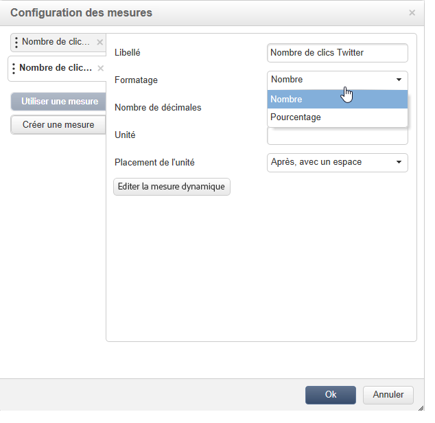

   Une configuration globale des mesures est également possible à partir de l’icône **[!UICONTROL Modifier la configuration du tableau croisé dynamique]** située dans l’en-tête.

   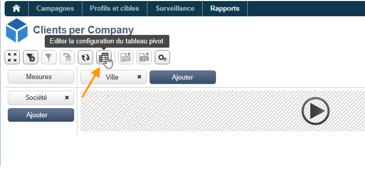

   Vous pouvez notamment choisir d&#39;afficher ou non les libellés des mesures. [En savoir plus](customize-cubes.md#configure-the-display).

1. Vous pouvez créer des mesures basées sur des mesures existantes. Pour ce faire, cliquez sur **[!UICONTROL Créer une mesure]** et configurez-la.

   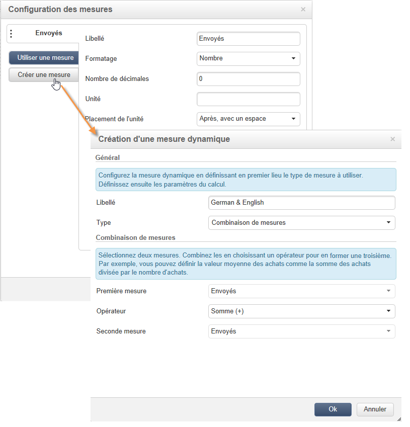

   Les types de mesures possibles sont les suivantes :

   * Combinaison de mesures : ce type de mesure permet de construire la nouvelle mesure à partir de mesures existantes.

     Entre ces mesures, les opérateurs disponibles sont : somme, différence, multiplication et taux.

   * Proportion : ce type de mesure permet de calculer le nombre d&#39;enregistrements mesurés pour une dimension donnée. Vous pouvez calculer la proportionnalité par rapport à une dimension ou une sous-dimension.
   * Variation : cette mesure permet de calculer la variation des valeurs d&#39;un niveau.
   * Ecart à la moyenne : ce type de mesure permet de calculer les écarts dans chaque groupe de cellules par rapport à la moyenne des valeurs. Par exemple, vous pouvez comparer le volume des achats pour tous les segments existants.

   Sitôt créée, la mesure est ajoutée dans le rapport.

   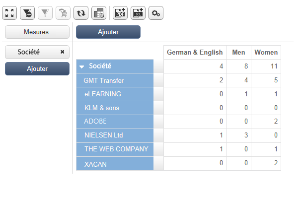

   Celle-ci peut toujours être configurée et modifiée ultérieurement. Pour ce faire, cliquez sur le bouton **[!UICONTROL Mesures]**, puis accédez à l’onglet de la mesure à modifier.

   Cliquez ensuite sur le bouton **[!UICONTROL Modifier la mesure dynamique]** pour accéder au menu des paramètres.

## Construction dʼune population cible {#build-a-target-population}

Les rapports construits à partir des cubes permettent de collecter des données dans le tableau et de les sauvegarder dans une liste.

Pour regrouper une population dans une liste, procédez comme suit :

1. Cliquez sur les cellules contenant les populations à collecter pour les sélectionner, puis cliquez sur l&#39;icône **[!UICONTROL Ajouter au panier]**.

   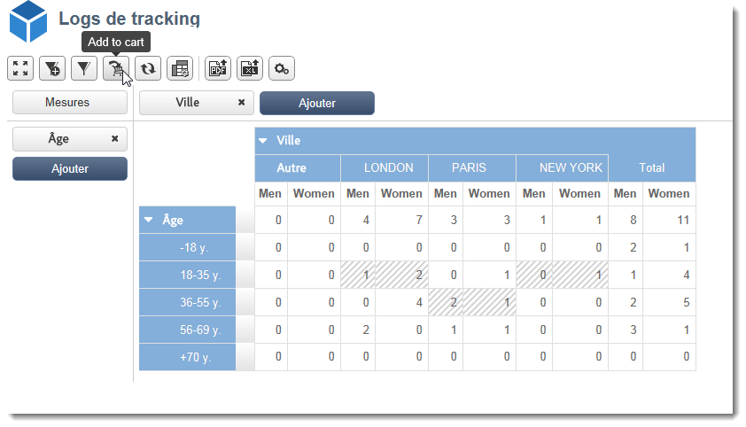

   Répétez l&#39;opération autant de fois que nécessaire, pour collecter les différents profils.

1. Cliquez sur le bouton **[!UICONTROL Afficher le panier]** pour en visualiser le contenu avant de réaliser l&#39;export.

   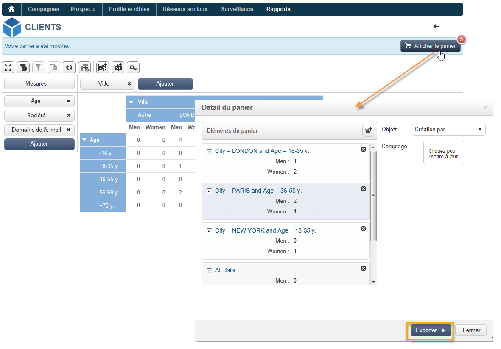

1. Utilisez le bouton **[!UICONTROL Exporter]** pour regrouper les éléments du panier dans une liste.

   Saisissez le nom de la liste, puis sélectionnez le type d’export à réaliser.

   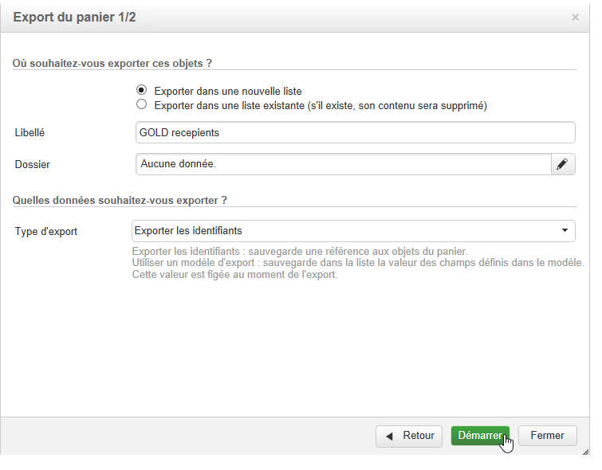

   Cliquez sur **[!UICONTROL Démarrer]** pour lancer l&#39;export.

1. Une fois l&#39;export terminé, un message vous en confirme la bonne exécution, ainsi que le nombre d&#39;enregistrements traités.

   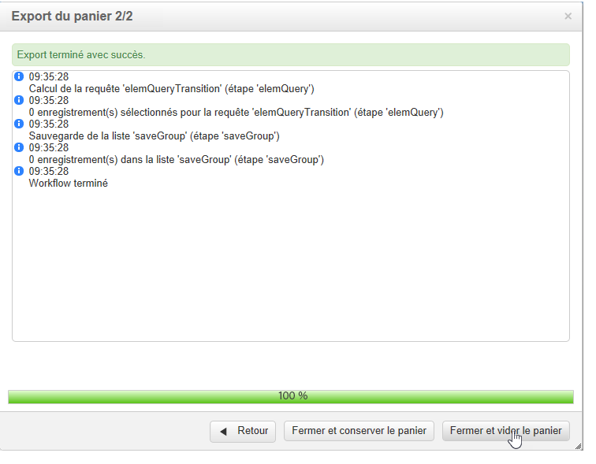

   Vous pouvez choisir de conserver le contenu du panier ou de le vider.

   La nouvelle liste est accessible à partir de l’onglet **[!UICONTROL Profils et cibles]**.

   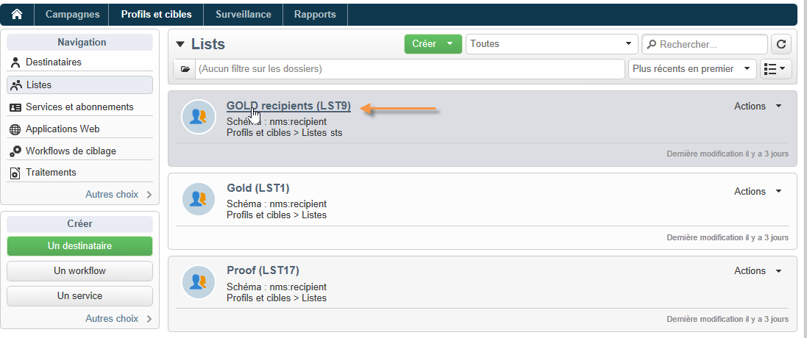

## Insertion dʼun tableau croisé dynamique dans un rapport {#insert-a-pivot-table-into-a-report}

Pour créer un tableau et explorer les données d’un cube, procédez comme suit :

1. Créez un nouveau rapport, avec une seule page, et insérez un tableau croisé dynamique.

   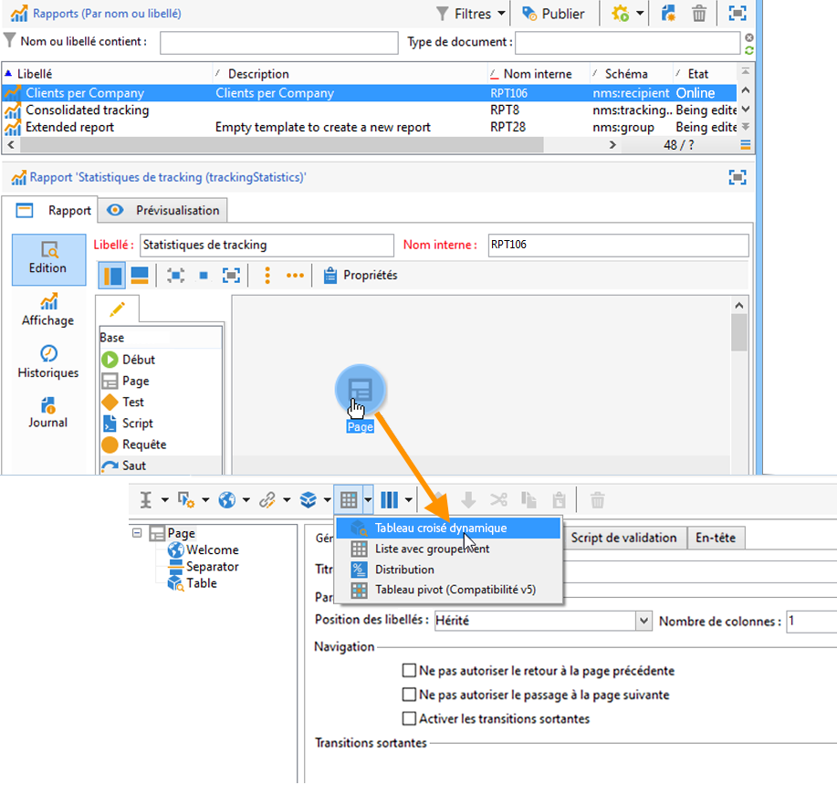

1. Dans l&#39;onglet **[!UICONTROL Données]** de la page, sélectionnez un cube afin d&#39;exploiter les dimensions qu&#39;il contient et afficher les mesures calculées.

   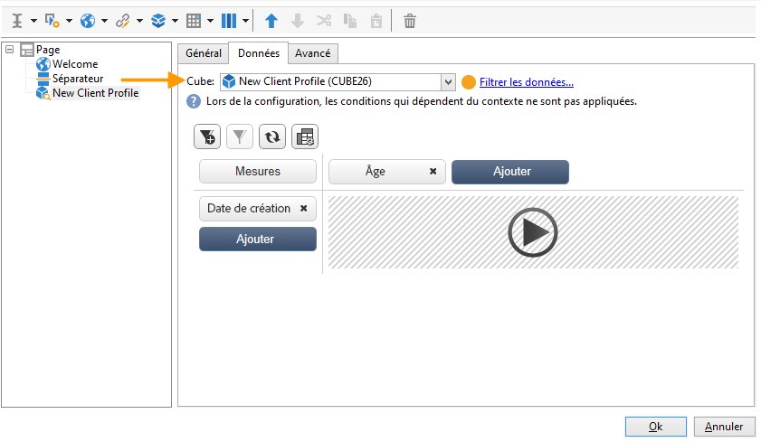

   Vous pourrez ainsi construire le rapport à afficher. Pour plus d’informations, consultez la section [Étape 2 - Sélectionner les lignes et les colonnes](#step-2---select-lines-and-columns).
