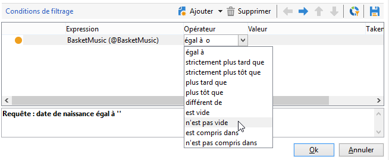

# Personnaliser vos cubes{#cube-custom}

## Compartimentage des données {#data-binning}

Utilisez le compartimentage des données pour simplifier l’affichage des données en regroupant les valeurs selon des critères. Selon les informations dont vous disposez, vous pouvez définir des tranches d’âge, regrouper des domaines de messagerie, vous limiter à une énumération de valeurs, restreindre explicitement les données à afficher et regrouper toutes les autres données dans une ligne ou une colonne dédiée, etc.

Globalement, trois types de mise en classe sont possibles :

1. Utilisation de plages de valeurs définies manuellement. Par exemple, âge, panier d’achat moyen, nombre de diffusions ouvertes, etc.). Voir à ce sujet la section [Définir chaque classe](#defining-each-bin).
1. Dynamiquement, selon les valeurs d&#39;une énumération : on n&#39;affiche que les valeurs contenues dans l’énumération et toutes les valeurs différentes sont regroupées dans « Autres ». Pour plus d&#39;informations, consultez la section [Gérer dynamiquement les classes](#dynamically-managing-bins).
1. En utilisant des plages de valeurs, toutes les autres étant regroupées. Par exemple, les 18 à 25 ans, les 26 à 59 ans, et les autres. Pour plus d&#39;informations, consultez la section [Créer des plages de valeurs](#creating-value-ranges).

Pour activer la mise en classe, cochez l&#39;option correspondante lors de la création de la dimension.

Vous pouvez créer chaque classe manuellement ou les lier à une énumération existante.

Pour générer automatiquement les classes, Adobe Campaign propose également un assistant : les valeurs peuvent être réparties en N groupes, ou regroupées selon les plus représentées dans la base.

### Définition de chaque classe {#define-each-bin}

Pour créer unitairement chaque classe, sélectionnez l&#39;option **[!UICONTROL Définir chaque classe]** et utilisez le tableau pour créer les différentes classes.

Cliquez sur le bouton **[!UICONTROL Ajouter]** pour créer une nouvelle classe et listez les valeurs qui seront regroupées dans la classe.

Dans l&#39;exemple ci-dessous, les langues seront réparties dans trois groupes : Anglais-Allemand-Néerlandais, Français-Italien-Espagnol et Autres.

Vous pouvez utiliser un masque SQL pour regrouper plusieurs valeurs selon un filtre. Pour cela, cochez l&#39;option **[!UICONTROL Oui]** dans la colonne **[!UICONTROL Utiliser un masque SQL]** et saisissez le filtre SQL à appliquer dans la colonne **[!UICONTROL Valeur ou expression]**.

<!--In the example below, all email domains that start with **yahoo** (yahoo.fr, yahoo.com, yahoo.be, etc.), or with **ymail** (ymail.com, ymail.eu, etc.) will be grouped under the label **YAHOO!**, as well as addresses with the **rocketmail.com** domain.-->

### Gérer les compartiments de manière dynamique {#dynamically-manage-bins}

Les valeurs peuvent être gérées dynamiquement via les énumérations. Ainsi, seules les valeurs contenues dans l&#39;énumération seront affichées. Lorsque les valeurs de l&#39;énumération sont modifiées, le contenu du cube est adapté automatiquement.

Pour créer ce type de mise en classe des valeurs, les étapes sont les suivantes :

1. Créez une nouvelle dimension et activez la mise en classe.
1. Sélectionnez l&#39;option **[!UICONTROL Lier dynamiquement les valeurs à une énumération]** et sélectionnez l&#39;énumération correspondante.

   

   Lorsque les valeurs de l&#39;énumération sont mises à jour, les classes sont automatiquement adaptées, sans aucune action côté utilisateur.

Pour en savoir plus sur les énumérations, consultez [cette page](../../v8/config/ui-settings.md#enumerations).

### Création de plages de valeurs {#create-value-ranges}

Vous pouvez regrouper les valeurs dans des plages selon l’intervalle souhaité.

Pour définir manuellement les plages, cliquez sur le bouton **[!UICONTROL Ajouter]** et choisissez l’option **[!UICONTROL Définir une plage]** :

Indiquez ensuite les limites inférieures et supérieures et cliquez sur **[!UICONTROL OK]** pour valider.

### Génération automatique de classes {#generate-bins-automatically}

Vous pouvez également générer automatiquement les classes. Pour cela, cliquez sur le lien **[!UICONTROL Générer les classes...]**.

Vous pouvez, au choix :

* **[!UICONTROL Récupérer les valeurs les plus utilisées]**

  Si vous générez 4 compartiments, les 4 valeurs les plus utilisées seront affichées, les autres seront comptabilisées et regroupées sous le libellé « Autres ».

* **[!UICONTROL Générer les compartiments sous forme de plages]**

  Pour le même échantillon, Adobe Campaign crée automatiquement 4 plages de valeurs de même taille pour afficher les valeurs de la base de données.

Dans ce cas, le filtre sélectionné au niveau du schéma des faits est ignoré.

### Énumérations {#enumerations}

Afin d&#39;augmenter la lisibilité et la pertinence des rapports, Adobe Campaign vous permet de créer des énumérations spécifiques pour regrouper différentes valeurs dans une même classe. Ces énumérations, réservées à la mise en classe, sont référencés dans les cubes puis affichées dans les rapports.

Adobe Campaign propose ainsi une énumération sur les domaines qui permet d&#39;afficher la liste des domaines des emails de tous les contacts en base, regroupés par FAI, comme dans l&#39;exemple ci-dessous :

Elle est construite selon le modèle suivant :

Pour créer un rapport utilisant cette énumération, créez un Cube utilisant la dimension **[!UICONTROL Domaine de l&#39;email]**. Choisissez l&#39;option **[!UICONTROL Activer la mise en classe]** puis **[!UICONTROL Lier dynamiquement les valeurs à une énumération]**. Choisissez alors l&#39;énumération **Domaines(domain)** présentée ci-dessus. Toutes les valeurs pour lesquelles aucun alias n&#39;a été défini seront regroupées sous le libellé **Autres**.

Créez ensuite un rapport basé sur ce Cube pour afficher les valeurs.

Il suffira de modifier l&#39;énumération pour mettre à jour le rapport associé. Par exemple, créez la valeur **Adobe** et ajoutez l&#39;alias **adobe.com**, au niveau de l&#39;énumération : le rapport est automatiquement mis à jour avec la valeur Adobe.

L&#39;énumération **[!UICONTROL Domaines]** est utilisée pour générer les rapports natifs affichant la liste des domaines. Pour adapter le contenu de ces rapports, vous pouvez modifier cette liste.

Vous pouvez créer d&#39;autres énumérations réservées à la mise en classe et les utiliser dans d&#39;autres Cubes : toutes les valeurs d&#39;alias seront regroupées dans les classes définies dans le premier onglet de l&#39;énumération.

Pour en savoir plus sur les énumérations, consultez [cette page](../../v8/config/ui-settings.md#enumerations).

## Agrégats en cubes {#calculate-and-use-aggregates}

Vous pouvez précalculer les données les plus volumineuses dans des agrégats.

Les agrégats sont pertinents lorsque vous manipulez un gros volume de données. Ils sont mis à jour automatiquement selon les paramètres définis dans la boîte de workflow dédiée, afin d&#39;intégrer les dernières données collectées dans les indicateurs.

Les agrégats sont définis au niveau du cube, dans l&#39;onglet correspondant.

>[!NOTE]
>
>Le workflow de mise à jour des calculs de l&#39;agrégat peut être paramétré dans l&#39;agrégat lui-même, mais l&#39;agrégat peut également être mis à jour au travers d&#39;un workflow externe dans lequel est référencé le cube correspondant.

Pour créer un nouvel agrégat, les étapes sont les suivantes :

1. Cliquez sur l&#39;onglet **[!UICONTROL Agrégats]** du cube puis sur le bouton **[!UICONTROL Ajouter]**.
1. Saisissez le libellé de l&#39;agrégat, puis ajoutez les dimensions à calculer.
1. Sélectionnez la dimension et le niveau. Recommencez l&#39;opération pour chaque dimension et chaque niveau à calculer.
1. Cliquez sur l&#39;onglet **[!UICONTROL Workflow]** pour créer le workflow d&#39;agrégation.

   * L&#39;activité **[!UICONTROL Planificateur]** permet de définir la fréquence de mise à jour des calculs. Le planificateur est présenté dans [cette section](../../automation/workflow/scheduler.md).
   * L&#39;activité **[!UICONTROL Mise à jour d&#39;agrégat]** permet de choisir le mode de mise à jour à appliquer : complète ou partielle.

     Par défaut, une mise à jour complète est réalisée à chaque calcul. Pour permettre une mise à jour partielle des données, sélectionnez l&#39;option correspondante puis définissez les conditions de mise à jour.

## Définition des mesures {#define-measures}

Les types de mesures à réaliser sont définis dans l&#39;onglet **[!UICONTROL Mesures]** du cube. Vous pouvez calculer des sommes, des moyennes, des écarts, etc.

Il est possible de créer autant de mesures que nécessaire : vous choisirez ensuite celle que vous souhaitez afficher ou masquer dans le tableau. Pour plus d’informations, consultez [cette section](#displaying-measures).

Pour définir une nouvelle mesure, les étapes sont les suivantes :

1. Cliquez sur le bouton **[!UICONTROL Ajouter]** situé au-dessus de la liste des mesures et sélectionnez le type de mesure et la formule à calculer.

   

1. Au besoin, selon l&#39;opérateur sélectionné, choisissez l&#39;expression sur laquelle porte l&#39;opération.

   Le bouton **[!UICONTROL Sélection avancée]** permet de créer des formules de calcul complexes. Pour plus d’informations, consultez [cette section](../../automation/workflow/query.md).

1. Le lien **[!UICONTROL Filtrer les données de la mesure...]** permet de restreindre le champ du calcul et de ne l&#39;appliquer qu&#39;à certaines données de la base.

   

1. Saisissez le libellé de la mesure et ajoutez une description, puis cliquez sur **[!UICONTROL Terminer]** pour créer la mesure.

## Personnaliser les mesures {#display-measures}

Vous pouvez paramétrer l’affichage des mesures dans le tableau selon vos besoins. Vous pouvez ainsi choisir :

* la séquence d’affichage des mesures. [En savoir plus](#display-sequence)
* les informations à afficher/masquer dans le rapport. [En savoir plus](#configuring-the-display)
* les mesures à afficher : pourcentage, total, nombre de décimales, etc. [En savoir plus](#changing-the-type-of-measure-displayed)

### Ordre d&#39;affichage {#display-sequence}

Les mesures calculées dans le cube sont configurées à partir du bouton **[!UICONTROL Mesures]**.

Vous pouvez changer l&#39;ordre d&#39;affichage en déplaçant les lignes. Dans l&#39;exemple suivant, les données de la France sont déplacées en bas de la liste : elles seront alors affichées dans la dernière colonne.

### Configuration de l’affichage {#configuring-the-display}

Le paramétrage des mesures, lignes et colonnes affichées peut être réalisé unitairement pour chaque mesure ou au niveau général. Une icône spécifique permet d&#39;accéder à la fenêtre de sélection des modes d&#39;affichage.

* Cliquez sur l’icône **[!UICONTROL Modifier la configuration du tableau croisé dynamique]** pour accéder à la fenêtre de configuration.

  Vous pouvez choisir d&#39;afficher ou non les libellés des mesures ainsi que leur disposition (en ligne ou en colonne).

Les options de coloration permet d&#39;identifier visuellement les valeurs les plus importantes afin d&#39;optimiser la lisibilité des informations.

### Modification du type de mesure affichée {#changing-the-type-of-measure-displayed}

Au niveau de chaque mesure, vous pouvez définir lʼunité et le formatage à appliquer.

## Partage du rapport {#share-a-report}

Une fois le rapport paramétré, vous pouvez choisir de le conserver et de le partager avec d&#39;autres opérateurs.

Pour cela, cliquez sur l&#39;icône **[!UICONTROL Afficher les propriétés du rapport]** et activez l&#39;option **[!UICONTROL Partager ce rapport]**.

Indiquez la catégorie à laquelle appartient le rapport ainsi que sa pertinence. <!--For more on this, refer in [this page](../../reporting/using/configuring-access-to-the-report.md#report-display-context) to the **Display sequence** and **Defining the filtering options** sections.-->

Pour valider ces modifications, vous devez enregistrer le rapport.

## Création de filtres {#create-filters}

Vous pouvez créer des filtres afin de n&#39;afficher qu&#39;une partie des données.

Pour cela :

1. Cliquez sur l&#39;icône **[!UICONTROL Ajouter un filtre]**.

   

1. Sélectionnez la dimension sur laquelle porte le filtrage.

1. Sélectionnez le type de filtre à appliquer et indiquez sa précision.

   

1. Une fois créé, le filtre apparaît au-dessus du rapport.

   Cliquez sur le filtre pour l’éditer. Cliquez sur la croix pour supprimer le filtre.

   Vous pouvez combiner autant de filtres que nécessaire : ils seront tous affichés dans cette zone.

   

A chaque modification (ajout, modification, suppression de filtres), cliquez sur la flèche pour relancer le calcul du rapport.

Un filtre peut également être créé à partir d&#39;une sélection. Pour cela, choisissez la ou les cellules, lignes et colonnes sources et cliquez sur l&#39;icône **[!UICONTROL Ajouter un filtre]**.

Pour sélectionner une ligne, une colonne ou une cellule, cliquez dessus avec le bouton gauche de la souris. Pour la dé-sélectionner, cliquez une seconde fois.

Le filtre est automatiquement appliqué et ajouté dans la zone des filtres, au-dessus du rapport.

