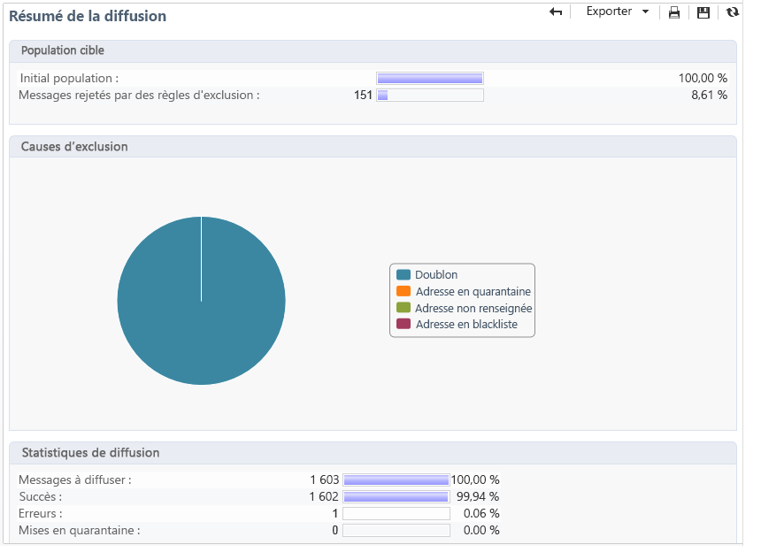

# Rapports de diffusion {#delivery-reports}

Vous pouvez suivre l’exécution des diffusions à partir de différents rapports accessibles depuis la vue d’ensemble des diffusions.

Pour accéder aux rapports, suivez les étapes suivantes :

1. Accédez à l’onglet **[!UICONTROL Campagnes]** et cliquez sur le lien **[!UICONTROL Diffusion]** pour afficher la liste des diffusions.
1. Cliquez sur le nom de la diffusion dont vous souhaitez accéder aux rapports.
1. Sélectionnez l&#39;onglet **[!UICONTROL Résumé]** et cliquez sur le lien **[!UICONTROL Rapports]** pour accéder aux rapports propres à la diffusion.

   

   Par défaut, les rapports disponibles sont les suivants :

   * **[!UICONTROL Débit de diffusion]**
   * **[!UICONTROL Partage vers les réseaux sociaux]**
   * **[!UICONTROL Statistiques des activités de partage]**
   * **[!UICONTROL Position des clics]**
   * **[!UICONTROL Statistiques de tracking]**
   * **[!UICONTROL URL et flux de clics]**
   * **[!UICONTROL Indicateurs de tracking]**
   * **[!UICONTROL Échecs et retours]**
   * **[!UICONTROL Activités utilisateurs]**
   * **[!UICONTROL Synthèse des diffusions]**
   * **[!UICONTROL Suivi des abonnements]**
   * **[!UICONTROL Statistiques de diffusion]**
   * **[!UICONTROL Répartition des ouvertures]**

## Indicateurs de tracking {#tracking-indicators}

Ce rapport regroupe les indicateurs clés qui permettent de suivre le comportement des destinataires à la réception de la diffusion. Il donne accès aux statistiques d’envoi, de réception, aux taux d’ouvertures et de clics, aux flux de clics générés, au tracking web et aux partages vers les réseaux sociaux.

>[!NOTE]
>
>Les valeurs calculées à partir d’ouvertures de messages sont toujours des estimations en raison notamment de la marge d’erreur liée aux emails au format texte. Les indicateurs **[!UICONTROL Ouvertures distinctes / Somme des ouvertures sur la population atteinte]** prennent en compte cette marge d’erreur. [En savoir plus](metrics-calculation.md#tracking-opens-).

**[!UICONTROL 1. Statistiques de diffusion]**

* **[!UICONTROL Message à diffuser]** : Nombre total de messages à diffuser après l&#39;analyse de la diffusion.
* **[!UICONTROL Succès]** : Nombre de messages traités avec succès.

**[!UICONTROL 2. Statistiques de réception]**

>[!NOTE]
>
>Les pourcentages associés sont calculés par rapport au nombre de messages transmis avec succès.

* **[!UICONTROL Ouvertures distinctes pour la population atteinte]** : estimation du nombre de destinataires ciblés ayant ouvert un message au moins une fois. Les clics sur les URL trackées sont pris en compte, car il faut ouvrir les e-mails pour cliquer sur un lien.
* **[!UICONTROL Somme des ouvertures sur la population atteinte]** : Estimation du nombre total d&#39;ouvertures effectuées par des destinataires ciblés.
* **[!UICONTROL Clics sur le lien d&#39;opt-out]** : Nombre de clics effectués sur le lien d&#39;opt-out.
* **[!UICONTROL Clics sur le lien de la page miroir]** : nombre de clics effectués sur le lien de la [page miroir](../send/mirror-page.md). Pour être pris en compte, le lien doit être défini comme tel dans l’assistant de diffusion (URL suivies).
* **[!UICONTROL Estimation des transferts]** : Estimation du nombre d&#39;emails transférés par les destinataires cibles de la diffusion à d&#39;autres personnes. Cette valeur est calculée en effectuant la différence entre le nombre de personnes distinctes et le nombre de destinataires distincts ayant cliqué au moins une fois dans le mail.

  >[!NOTE]
  >
  >Pour plus d’informations sur la distinction personnes / destinataires ciblés, consultez la section [Distinction personnes / destinataires ciblés](metrics-calculation.md#targeted-persons---recipients).

**[!UICONTROL 3. Taux d’ouvertures et de clics]**

Ce tableau de valeurs présente la répartition, par domaine Internet, des envois, des ouvertures, des clics et de la réactivité brute. Les indicateurs utilisés sont les suivants :

* **[!UICONTROL Envois]** : Nombre total de messages envoyés sur ce domaine.
* **[!UICONTROL Plaintes]** : Nombre de messages, sur ce domaine, qui ont été signalés par le destinataire comme indésirables. Le taux est calculé par rapport au nombre total de messages envoyés sur ce domaine.
* **[!UICONTROL Ouvertures]** : Nombre de destinataires ciblés distincts, sur ce domaine, ayant ouvert au moins une fois un même message. Le taux est calculé par rapport au nombre total de messages envoyés sur ce domaine.
* **[!UICONTROL Clics]** : Nombre de destinataires ciblés distincts ayant cliqué au moins une fois dans une même diffusion. Le taux est calculé par rapport au nombre total de messages envoyés sur ce domaine.
* **[!UICONTROL Réactivité brute]** : Pourcentage du nombre de destinataires ayant cliqué au moins une fois dans une même diffusion par rapport au nombre de destinataires ayant ouvert au moins une fois une même diffusion.

>[!NOTE]
>
>Les noms de domaine qui s’affichent dans ce rapport sont définis dans l’énumération utilisée au niveau des cubes. Pour modifier, ajouter ou supprimer des domaines par défaut, modifiez l’énumération **[!UICONTROL Domaines]**, et modifiez les valeurs et les alias. La catégorie **[!UICONTROL Autres]** regroupe les noms de domaine qui n’appartiennent à aucune valeur de l’énumération.
>
>Découvrez comment accéder à vos énumérations et la manière de les configurer sur [cette page](../config/ui-settings.md).

**[!UICONTROL 4. Flux de clics générés]**

>[!NOTE]
>
>Les pourcentages associés sont calculés par rapport au nombre de messages transmis avec succès.

* **[!UICONTROL Clics distincts sur la population atteinte]** : Nombre de personnes distinctes ayant cliqué au moins une fois dans une même diffusion.
* **[!UICONTROL Clics cumulés]** : Nombre total de clics effectués par des destinataires ciblés, hors liens de désinscription et pages miroir.
* **[!UICONTROL Clics des destinataires]** : Nombre de destinataires ciblés distincts ayant cliqué au moins une fois dans une même diffusion.
* **[!UICONTROL Réactivité estimée des destinataires]** : Ratio du nombre de destinataires ayant cliqué au moins une fois dans une même diffusion par rapport à l&#39;estimation du nombre de destinataires ayant ouvert au moins une fois une même diffusion. Ne tient pas compte des clics sur le lien d&#39;opt-out et la page miroir.
<!--
**[!UICONTROL 5. Web tracking]**

* **[!UICONTROL Visited pages]** : Number of web pages visited following message reception.
* **[!UICONTROL Transactions]** : Number of purchases following message reception.
* **[!UICONTROL Total amount]** : Total amount of purchases following message reception. 
* **[!UICONTROL Average transaction amount]** : Average purchase made by distinct delivery recipients. 
* **[!UICONTROL Articles]** : Number of articles purchased by the delivery recipients. 
* **[!UICONTROL Average count of articles per transaction]** : Average number of items per purchase made by distinct recipients.
* **[!UICONTROL Average amount per message]** : Average amount of purchases generated per message.

  >[!NOTE]
  >
  >In order for a visited page, transaction, amount or article to be taken into account, a webtracking tag must be inserted into the matching web page. Webtracking configuration is presented in [this section](../../configuration/using/about-web-tracking.md).

**[!UICONTROL 6. Sharing activities to email and social networks]**

This section shows the number of messages shared on each social network. For more on this, refer to [Sharing to social networks](../../reporting/using/global-reports.md#sharing-to-social-networks).

## URLs and click streams {#urls-and-click-streams}

This report shows the list of pages visited following a delivery. 

You can configure the contents of this report by selecting: the score chart to be displayed, the time filter (since the action launch, over the first 6 hours following launch, etc.) and the data display mode (by label, by URL, by category. Click **[!UICONTROL Refresh]** to confirm your selection.

The following rates are displayed in the upper section of the report:

* **[!UICONTROL Reactivity]** : Ratio of the number of targeted recipients having clicked in a delivery, in relation to the estimated number of targeted recipients having opened a delivery. Clicks on the opt-out link and on the mirror page are not taken into account.

  >[!NOTE]
  >
  >For more information on tracking opens, refer to [this section](metrics-calculation.md#tracking-opens-).

* **[!UICONTROL Distinct clicks]** : Number of distinct people having clicked at least once (excluding unsubscription link and mirror page) in a delivery. The rate displayed is calculated based on the number of messages delivered successfully. 
* **[!UICONTROL Cumulated clicks]** : Total number of clicks by targeted recipients (excluding unsubscription link and mirror page). The rate displayed is calculated based on the number of messages forwarded successfully.

**[!UICONTROL Platform average]** : This average rate, displayed under each rate (reactivity, distinct clicks, and cumulated clicks), is calculated for deliveries sent over the previous six months. Only deliveries with the same typology and on the same channel are taken into account. Proofs are excluded.

The central table provides the following information:

* **[!UICONTROL Clicks]** : Number of cumulated clicks, per link. 
* **[!UICONTROL Clicks (in %)]** : Breakdown of the number of clicks per link, in relation to the total number of cumulated clicks.

**[!UICONTROL Breakdown of clicks in time]**

This chart shows the breakdown of cumulated clicks per day.
-->

## Synthèse des diffusions {#delivery-summary}

Ce rapport présente l&#39;ensemble des informations principales relatives à la diffusion.

**[!UICONTROL Une population cible]**

Cette section comporte deux indicateurs :

* **[!UICONTROL Population initiale]** : Nombre total de destinataires auxquels la diffusion est destinée.
* **[!UICONTROL Messages rejetés par règle]** : nombre d&#39;adresses ignorées pendant l&#39;analyse lors de l&#39;application des règles de typologie : adresse manquante, mise en quarantaine, ajoutée à la liste bloquée, etc. <!--For more information on typology rules, refer to this [page](../../delivery/using/steps-validating-the-delivery.md#validation-process-with-typologies).-->

**[!UICONTROL Causes d&#39;exclusion]**

Le graphique central présente la répartition, par règle, des messages rejetés lors de l&#39;analyse.

**[!UICONTROL Statistiques de diffusion]**

Cette section comporte les indicateurs suivants :

* **[!UICONTROL Message à diffuser]** : Nombre total de messages à diffuser après l&#39;analyse des diffusions.
* **[!UICONTROL Succès]** : Nombre de messages traités avec succès. Le taux associé est le ratio avec le nombre de messages à diffuser.
* **[!UICONTROL Erreurs]** : Nombre total d&#39;erreurs cumulées lors des diffusions et du traitement automatique des retours. Le taux associé est le ratio avec le nombre de messages à diffuser.
* **[!UICONTROL Mises en quarantaine]** : Nombre d&#39;adresses mises en quarantaine à la suite d&#39;un échec (utilisateur inconnu, domaine invalide). Le taux associé est le ratio avec le nombre de messages à diffuser.

## Hot clicks {#hot-clicks}

Ce rapport présente le contenu du message (HTML et/ou texte) avec, sur chaque lien, le pourcentage de clics sur ce lien. Les liens situés dans les blocs de personnalisation, le lien de désinscription, le lien vers la page miroir et les liens des offres sont comptabilisés dans le total des clics cumulés mais ne sont pas affichés dans le rapport.

>[!NOTE]
>
>Si votre diffusion contient des offres (Interaction), un encadré apparaît dans la partie supérieure du rapport affichant le pourcentage de clics sur les offres.

## Statistiques de tracking {#tracking-statistics}

Ce rapport présente les statistiques sur les taux d&#39;ouverture, clics et transactions.

Il vous permet de suivre l&#39;impact marketing de la diffusion. Vous pouvez paramétrer l&#39;affichage des valeurs en sélectionnant le périmètre de la vue (vue sur 1 heure, 3 heures, 24 heures, etc.). Cliquez sur le bouton **[!UICONTROL Actualiser]** pour valider votre choix.

Ce rapport se présente sous la forme d&#39;un tableau de valeur et d&#39;un diagramme de Pareto permettant de mesurer le temps mis pour que la diffusion atteigne son efficacité maximum. Les indicateurs utilisés sont les suivants :

* **[!UICONTROL Ouvertures]** : estimation du temps mis pour atteindre un pourcentage du nombre total de messages ouverts. Les emails au format texte ne sont pas comptabilisés. [En savoir plus](metrics-calculation.md#tracking-opens-).
* **[!UICONTROL Clics]** : estimation du temps nécessaire pour atteindre un pourcentage du nombre total de clics enregistrés. Les clics sur le lien de désinscription et la page miroir ne sont pas pris en compte.
<!--
* **[!UICONTROL Transactions]** : Time required to achieve a percentage of the total number of transactions following message reception. In order for a transaction to be taken into account, a transaction type webtracking tag must be inserted into the matching web page. Webtracking configuration is presented in [this section](../../configuration/using/about-web-tracking.md).
-->

## Rapports cumulés {#cumulated-reports}

Vous pouvez afficher des rapports cumulés sur les diffusions. Pour cela, sélectionnez les diffusions à comparer pour obtenir la liste des rapports communs à ces diffusions.

Vous pouvez sélectionner des diffusions non consécutives dans la liste en maintenant la touche CTRL enfoncée pendant la sélection.

Pour sélectionner des diffusions enregistrées dans un autre dossier, cliquez sur l’icône **[!UICONTROL Afficher les fils]**, accessible dans la barre d’outils. Elles s’affichent alors dans la même liste.
