# Rapports globaux {#global-reports}

Ces rapports portent sur l&#39;activité de l&#39;ensemble des données de la base. Pour accéder au tableau de bord des rapports, positionnez-vous sur l&#39;onglet **[!UICONTROL Rapports]**.

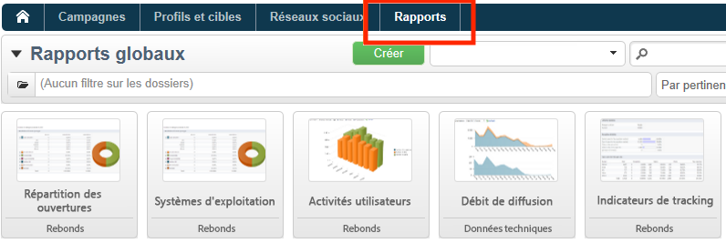

Cliquez sur les noms des rapports pour les afficher. Par défaut, les rapports suivants sont disponibles :

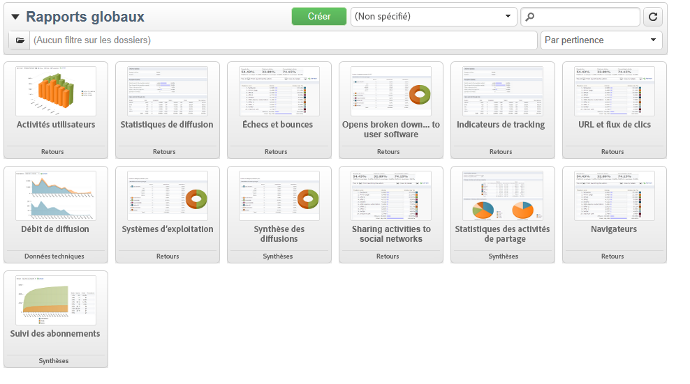

>[!NOTE]
>
>Cette section présente uniquement les rapports liés aux diffusions.

* **[!UICONTROL Débit des diffusions]** : voir [Débit des diffusions](#delivery-throughput).
* **[!UICONTROL Navigateurs]** : voir [Navigateurs](#browsers).
* **[!UICONTROL Partage vers les réseaux sociaux]** : voir [Partage vers les réseaux sociaux](#sharing-to-social-networks).
* **[!UICONTROL Statistiques des activités de partage]** : voir [Statistiques des activités de partage](#statistics-on-sharing-activities).
* **[!UICONTROL Systèmes d&#39;exploitation]** : voir [Systèmes d’exploitation](#operating-systems).
* **[!UICONTROL URL et flux de clics]** : voir [URL et flux de clics](delivery-reports.md#urls-and-click-streams).
* **[!UICONTROL Indicateurs de tracking]** : voir [Indicateurs de tracking](delivery-reports.md#tracking-indicators).
* **[!UICONTROL Non-délivrables et rebonds]** : voir [Non-délivrables et rebonds](#non-deliverables-and-bounces).
* **[!UICONTROL Activités utilisateurs]** : voir [Activités utilisateurs](#user-activities).
* **[!UICONTROL Suivi des abonnements]** : voir [Suivi des abonnements](#subscription-tracking).
* **[!UICONTROL Synthèse des diffusions]** : voir [Synthèse des diffusions](delivery-reports.md#delivery-summary).
* **[!UICONTROL Statistiques de diffusion]**: voir [Statistiques de diffusion](#delivery-statistics).
* **[!UICONTROL Répartition des ouvertures]** : voir [Répartition des ouvertures](#breakdown-of-opens).

## Débit des diffusions {#delivery-throughput}

Ce rapport contient les informations relatives au débit de diffusion de l’ensemble de la plateforme sur une période donnée. Pour mesurer la vitesse de diffusion des messages, les critères sont le nombre de messages diffusés par heure et la taille des messages, en bits par seconde. Dans l’exemple ci-dessous, le premier graphique indique, en bleu, les diffusions envoyées avec succès et, en orange, le nombre de messages en erreur.

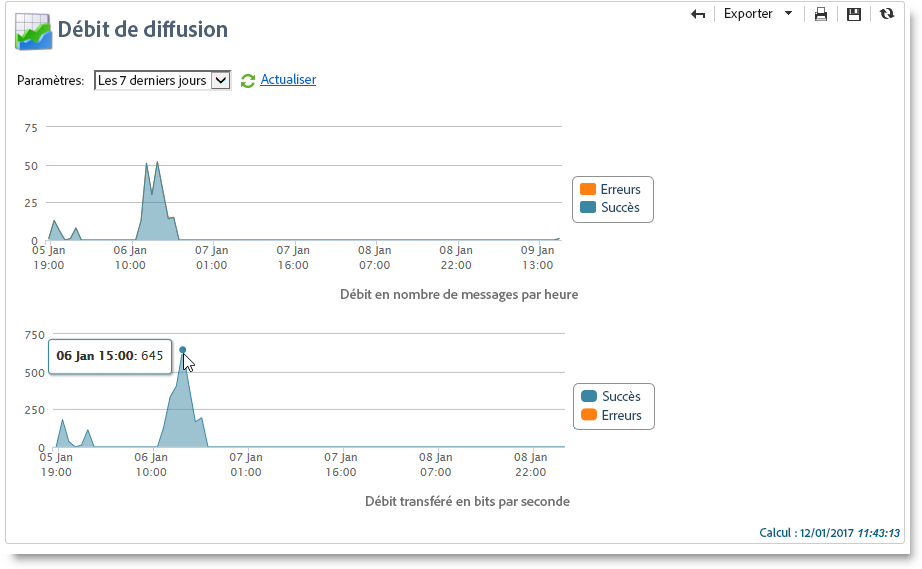

Vous pouvez paramétrer l’affichage des valeurs en modifiant l’échelle de temps : affichage sur 1 heure, sur 3 heures, sur 24 heures, etc. Cliquez sur **[!UICONTROL Actualiser]** pour confirmer votre sélection.

>[!NOTE]
>
>Vous pouvez également surveiller le nombre de diffusions envoyées par heure dans le [Panneau de contrôle](https://experienceleague.adobe.com/docs/control-panel/using/sftp-management/sftp-storage-management.html?lang=fr){target="_blank"}.
>
>Le Panneau de contrôle est accessible à tous les utilisateurs administrateurs et utilisatrices administratrices. Les étapes permettant d’accorder un accès d’administration à un utilisateur ou à une utilisatrice sont présentées sur [cette page](https://experienceleague.adobe.com/docs/control-panel/using/discover-control-panel/managing-permissions.html?lang=fr#discover-control-panel){target="_blank"}.
>

## Activités utilisateurs {#user-activities}

Ce rapport présente la répartition des ouvertures, clics et transactions, par demi-heure, par heure ou par jour, sous la forme d&#39;un graphique.

Les options disponibles sont les suivantes :

* **[!UICONTROL Ouvertures]** : Nombre total de messages ouverts. Les emails au format texte ne sont pas pris en compte. [En savoir plus](metrics-calculation.md#tracking-opens-).
* **[!UICONTROL Clics]** : nombre total de clics sur les liens dans les diffusions. Les clics sur les liens de désinscription et sur les pages miroir ne sont pas pris en compte.
<!--
* **[!UICONTROL Transactions]** : Total number of transactions after a message is received. In order for a transaction to be taken into account, a transaction type webtracking tag must be inserted into the matching web page. Webtracking configuration is presented in [this section](../../configuration/using/about-web-tracking.md).
-->

## Non-délivrables et rebonds {#non-deliverables-and-bounces}

Ce rapport présente la répartition des non-délivrables et la répartition des rebonds par domaine Internet.

Le **[!UICONTROL Nombre de messages traités]** représente le nombre total de messages traités par le serveur de diffusion. Cette valeur est inférieure au nombre de messages à diffuser lorsque certaines diffusions ont été stoppées ou mises en pause (avant d&#39;être traitées par le serveur).

**[!UICONTROL Répartition des erreurs par type]**

>[!NOTE]
>
>Les erreurs présentées dans ce rapport déclenchent le processus de mise en quarantaine. Pour plus d’informations sur la gestion de la quarantaine, consultez [Gestion de la quarantaine](../send/quarantines.md).

La première partie de ce rapport présente la répartition des messages en échec sous la forme d&#39;un tableau de valeurs et d&#39;un graphique.

A chaque type d&#39;erreur, est associé :

* le nombre de messages en erreur de ce type,
* le pourcentage du nombre de messages en erreur de ce type par rapport au nombre total de messages en erreur,
* le pourcentage du nombre de messages en erreur de ce type par rapport au nombre total de messages traités.

Les indicateurs utilisés sont les suivants :

* **[!UICONTROL Utilisateur inconnu]** : Type d&#39;erreur générée lors de l&#39;envoi d&#39;une diffusion indiquant que l&#39;adresse email est invalide.
* **[!UICONTROL Domaine invalide]** : Type d&#39;erreur générée lors de l&#39;envoi d&#39;une diffusion indiquant que le domaine de l&#39;adresse email est erroné ou n&#39;existe plus.
* **[!UICONTROL Boîte pleine]** : Type d&#39;erreur générée, après cinq tentatives d&#39;envoi d&#39;une diffusion, indiquant que la boîte de messagerie du destinataire contient trop de messages.
* **[!UICONTROL Compte désactivé]** : Type d&#39;erreur générée lors de l&#39;envoi d&#39;une diffusion indiquant que l&#39;adresse n&#39;existe plus.
* **[!UICONTROL Refusé]** : Type d&#39;erreur générée lorsqu&#39;une adresse est refusée par le FAI (Fournisseur d&#39;Accès Internet) suite, par exemple, à l&#39;application d&#39;une règle de sécurité (logiciel anti-spams).
* **[!UICONTROL Inatteignable]** : Type d&#39;erreur survenue dans la chaîne de distribution du message : incident sur le relais SMTP, domaine temporairement inatteignable, etc.
* **[!UICONTROL Non connecté]** : Type d&#39;erreur indiquant que le téléphone portable du destinataire est éteint ou n&#39;est pas connecté au réseau au moment de l&#39;envoi du message.

  >[!NOTE]
  >
  >Cet indicateur ne porte que sur les diffusions sur les [canaux mobiles](../send/send.md).

  Vous pouvez déplier chaque ligne du tableau de valeurs en cliquant sur le symbole `[+]` correspondant. Cela permet d’afficher, pour chaque type d’erreur, la répartition des messages d’erreur, par domaine.

**[!UICONTROL Répartition des erreurs par domaine]**

La seconde partie de ce rapport présente la répartition des échecs par domaine Internet sous la forme d&#39;un tableau de valeurs et d&#39;un graphique.

A chaque nom de domaine, est associé :

* le nombre de messages en erreur sur ce domaine,
* le pourcentage du nombre de messages en erreur sur ce domaine par rapport au nombre total de messages traités sur ce domaine.
* le pourcentage du nombre de messages en erreur sur ce domaine par rapport au nombre total de messages en erreur,

Vous pouvez déplier chaque ligne du tableau de valeurs en cliquant sur le symbole [+] correspondant. Cela permet d&#39;afficher, pour chaque type d&#39;erreur, la répartition des messages d’erreur, par domaine.

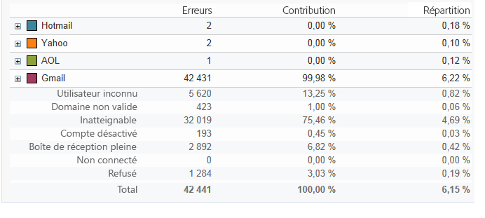

>[!NOTE]
>
>Les noms de domaine affichés dans ce rapport sont définis au niveau des cubes. Pour modifier ces valeurs, modifiez le cube des **[!UICONTROL Journaux de diffusion (broadlogrcp)]**. Pour plus d’informations, consultez [cette section](gs-cubes.md). La catégorie **[!UICONTROL Autres]** inclut les noms de domaine qui n’appartiennent pas à une classe spécifique.

## Navigateurs {#browsers}

Ce rapport présente la répartition entre les navigateurs internet utilisés par les destinataires des diffusions, pour la période sélectionnée.

>[!NOTE]
>
>Les valeurs affichées dans ce rapport sont des estimations. En effet, les destinataires des diffusions ne sont pas tous pris en compte. Seuls les destinataires ayant cliqué dans une diffusion sont comptabilisés.

**Statistiques globales**

Les statistiques globales d&#39;utilisation des navigateurs sont présentées sous la forme d&#39;un tableau de valeurs et d&#39;un graphique.

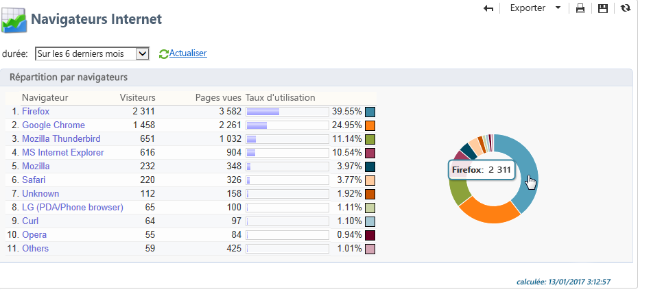

Les indicateurs utilisés sont les suivants :

* **[!UICONTROL Visiteurs]** : Nombre total de destinataires ciblés, par navigateur Internet, ayant cliqué au moins une fois dans une même diffusion.
* **[!UICONTROL Pages vues]** : Nombre total de clics sur les liens des diffusions, par navigateur Internet, dans l&#39;ensemble des diffusions.
* **[!UICONTROL Taux d&#39;utilisation]** : Ce taux représente la répartition des visiteurs, par navigateur Internet, par rapport au nombre total de visiteurs.

**Statistiques par navigateur**

Dans le tableau de valeurs des statistiques globales, vous pouvez cliquer sur le nom de chaque navigateur afin de visualiser les statistiques d&#39;utilisation correspondantes.

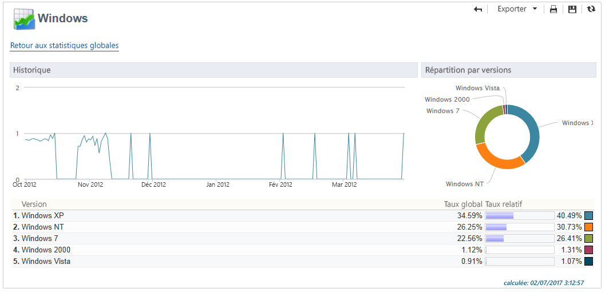

Les statistiques sont présentées sous la forme d&#39;une courbe, d&#39;un graphique et d&#39;un tableau de valeurs.

La courbe **[!UICONTROL Historique]** représente le taux de fréquentation, par jour, de ce navigateur. Ce taux est le ratio du nombre de visiteurs par jour, sur ce navigateur, par rapport au nombre de visiteurs mesuré le jour le plus fréquenté.

Le graphique **[!UICONTROL Répartition par version]** représente la répartition des visiteurs, par version, par rapport au nombre total de visiteurs sur ce navigateur.

Le tableau de valeurs utilise les indicateurs suivants :

* **[!UICONTROL Taux global]** : Ce taux représente la répartition des visiteurs, par version, par rapport au nombre total de visiteurs sur l&#39;ensemble des navigateurs.
* **[!UICONTROL Taux relatif]** : Ce taux représente la répartition des visiteurs, par version, par rapport au nombre total de visiteurs sur ce navigateur.

<!--
### Sharing to social networks {#sharing-to-social-networks}

Viral marketing lets delivery recipients share information with their contact network: they can add a link to their profile (Facebook, Twitter, etc.) or send a message to a friend. Each share and each access to shared information is tracked within the delivery. For more information on viral marketing, refer to [this section](../../delivery/using/viral-and-social-marketing.md).

This report shows the breakdown of shared and opened messages per social network (Facebook, Twitter, etc.) and/or per email.

**[!UICONTROL Email delivery statistics]**

In the email delivery statistics, two values are displayed:

* **[!UICONTROL Number of messages to be delivered]** : Total number of messages processed during delivery analysis.
* **[!UICONTROL Number of successful deliveries]** : Number of messages processed successfully.

**[!UICONTROL Sharing activities and mail open statistics]**

The central table shows the statistics on email shares and opens.

In the **[!UICONTROL Shares]** column, we have the following indicators:

* **[!UICONTROL No. of sharing activities]** : Total number of messages shared on each social network. This value equals the total number of clicks on the icon of the matching **[!UICONTROL Links for sharing to social networks]** personalization block.
* **[!UICONTROL Breakdown]** : This rate represents the breakdown of shares per social network, in relation to the total number of shares.
* **[!UICONTROL Sharing rate]** : This rate represents the breakdown of shares per social network, in relation to the number of messages to be delivered.

In the **[!UICONTROL Opens]** column, we have the following indicators:

* **[!UICONTROL No. of opens]** : Total number of messages opened by people whom the message was forwarded to (via the **[!UICONTROL Links for sharing to social networks]** personalization block). This value equals the number of times the mirror page was displayed. Opens by delivery recipients are not taken into account.
* **[!UICONTROL Breakdown]** : This rate represents the breakdown of opens per social network, in relation to the total number of opens.
* **[!UICONTROL Rate of opens]** : This rate represents the breakdown of opens per social network, in relation to the total number of shares.

**[!UICONTROL Breakdown of sharing activities and opens]**

This section includes two charts which represent the breakdown of sharing activities and opens per social network.

## Statistics on sharing activities {#statistics-on-sharing-activities}

This report shows the evolution of shares to social media in time.

For more information on viral marketing, refer to [this section](../../delivery/using/viral-and-social-marketing.md).

Statistics are presented in the form of a table of values and a chart.

The following indicators are used:

* **[!UICONTROL New contacts]** : Number of new subscriptions following the reception of a message shared via email. This value matches the number of people who received a message shared via email, clicked the **[!UICONTROL Subscription link]** and filled in the subscription form. 
* **[!UICONTROL Opens]** : Total number of messages opened by people whom the message was transferred to (via the **[!UICONTROL Link for sharing to social networks]** personalization block). This value equals the number of times the mirror page was displayed. Opens by delivery recipients are not taken into account.
* **[!UICONTROL Sharing activities]** : Total number of messages shared via social networks. This value matches the total number of clicks on the icon of the **[!UICONTROL Links for sharing to social networks]** personalization block.
-->

## Systèmes d’exploitation {#operating-systems}

Ce rapport présente la répartition entre les systèmes d&#39;exploitation utilisés par les destinataires des diffusions, pour la période sélectionnée.

>[!NOTE]
>
>Les valeurs affichées dans ce rapport sont des estimations. En effet, les destinataires des diffusions ne sont pas tous pris en compte. Seuls les destinataires ayant cliqué dans une diffusion sont comptabilisés.

**Statistiques globales**

Les statistiques globales d&#39;utilisation des systèmes d&#39;exploitation sont présentées sous la forme d&#39;un tableau de valeurs et d&#39;un graphique.

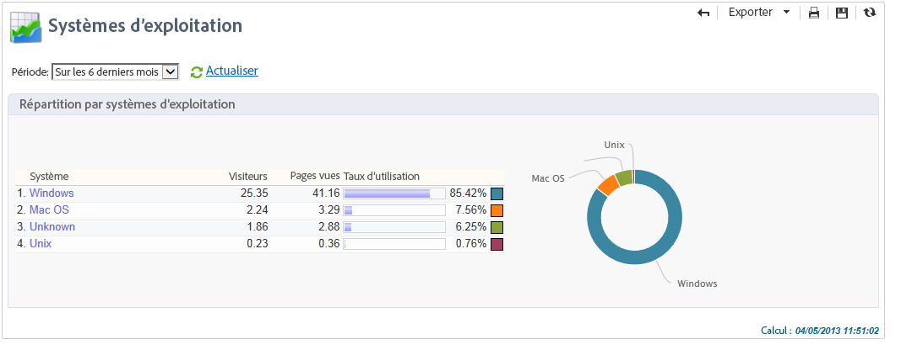

Les indicateurs utilisés sont les suivants :

* **[!UICONTROL Visiteurs]** : Moyenne par jour du nombre total de destinataires ciblés, par système d&#39;exploitation, ayant cliqué au moins une fois dans une même diffusion.
* **[!UICONTROL Pages vues]** : Moyenne par jour du nombre total de clics sur les liens des diffusions, par système d&#39;exploitation, dans l&#39;ensemble des diffusions.
* **[!UICONTROL Taux d&#39;utilisation]** : Ce taux représente la répartition des visiteurs, par système d&#39;exploitation, par rapport au nombre total de visiteurs.

**Statistiques par système d&#39;exploitation**

Dans le tableau de valeurs des statistiques globales, vous pouvez cliquer sur le nom de chaque système d&#39;exploitation afin de visualiser les statistiques d&#39;utilisation correspondantes.

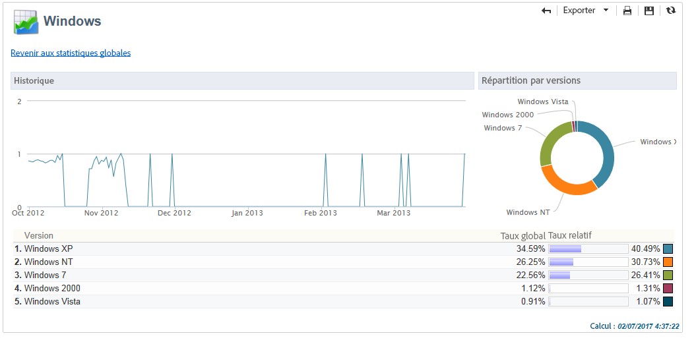

Les statistiques sont présentées sous la forme d&#39;une courbe, d&#39;un graphique et d&#39;un tableau de valeurs.

La courbe **[!UICONTROL Historique]** représente le taux d&#39;utilisation, par jour, de ce système d&#39;exploitation. Ce taux est le ratio du nombre de visiteurs par jour, sur ce système d&#39;exploitation, par rapport au nombre de visiteurs mesuré le jour le plus fréquenté.

Le graphique **[!UICONTROL Répartition par version]** représente la répartition des visiteurs, par version, par rapport au nombre total de visiteurs sur ce système d&#39;exploitation.

Le tableau de valeurs utilise les indicateurs suivants :

* **[!UICONTROL Taux global]** : Ce taux représente la répartition des visiteurs, par version, par rapport au nombre total de visiteurs sur l&#39;ensemble des systèmes d&#39;exploitation.
* **[!UICONTROL Taux relatif]** : Ce taux représente la répartition des visiteurs, par version, par rapport au nombre total de visiteurs sur ce système d&#39;exploitation.

## Tracking des abonnements {#subscription-tracking}

Ce rapport permet d’assurer la surveillance des abonnements aux services d’information. Il présente les inscriptions et désinscriptions.

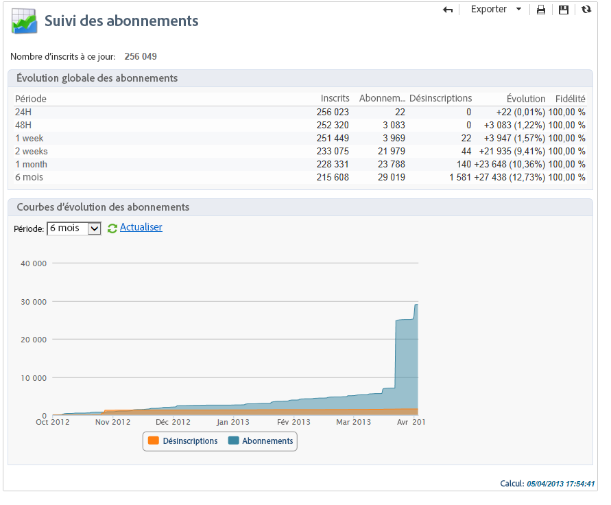

Il peut être affiché pour un abonnement en cliquant sur le nœud **[!UICONTROL Profils et cibles > Services et abonnements]** de la page d’accueil ou de l’explorateur. Sélectionnez l’abonnement souhaité, puis cliquez sur l’onglet **[!UICONTROL Rapports]**. Le rapport **[!UICONTROL Suivi des abonnements]** est disponible par défaut. Il vous permet de visualiser les tendances d’abonnement et de désinscription, ainsi que le taux de fidélité sur une période. Vous pouvez paramétrer la représentation de ces données dans la liste déroulante. Cliquez sur **[!UICONTROL Actualiser]** pour valider la configuration sélectionnée.

Voir à ce propos [cette page](../start/subscriptions.md).

Le **[!UICONTROL Nombre d&#39;inscrits à ce jour]** représente le nombre total d&#39;abonnés à ce jour.

**[!UICONTROL Evolution globale des inscriptions]**

Le tableau de valeurs utilise les indicateurs suivants :

* **[!UICONTROL Inscrits]** : Nombre total d&#39;abonnés sur la période correspondante.
* **[!UICONTROL Inscriptions]** : Nombre d&#39;abonnements sur la période correspondante.
* **[!UICONTROL Désinscriptions]** : Nombre de désabonnements sur la période correspondante.
* **[!UICONTROL Evolution]** : Nombre de désabonnements soustrait au nombre d&#39;abonnements. Le taux associé est calculé par rapport au nombre total d&#39;abonnés.
* **[!UICONTROL Fidélité]** : Taux de fidélité des abonnés sur la période correspondante.

**[!UICONTROL Courbes d&#39;évolution des inscriptions]**

Ce graphique représente l&#39;évolution dans le temps des inscriptions et désinscriptions, sur la période sélectionnée.

## Statistiques de diffusion {#delivery-statistics}

Ce rapport présente la répartition, par domaine Internet, des messages traités et envoyés, des rebonds définitifs et temporaires, des ouvertures, des clics et des désinscriptions.

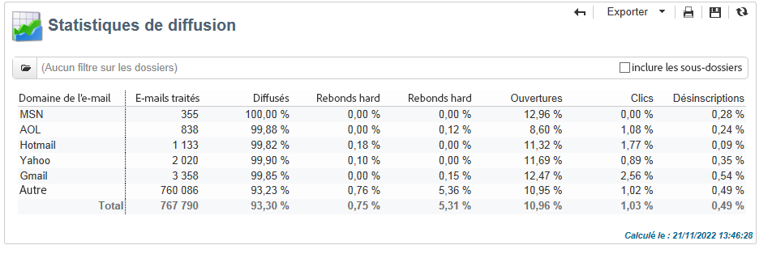

Les indicateurs utilisés sont les suivants :

* **[!UICONTROL Emails traités]** : Nombre total de messages traités par le serveur de diffusion.
* **[!UICONTROL Délivrés]** : Pourcentage du nombre de messages traités avec succès, par rapport au nombre total de messages traités.
* **[!UICONTROL Rebonds définitifs]** : pourcentage du nombre de rebonds « définitifs », par rapport au nombre total de messages traités.
* **[!UICONTROL Rebonds temporaires]** : pourcentage du nombre de rebonds « temporaires », par rapport au nombre total de messages traités.

  >[!NOTE]
  >
  >Pour plus d’informations sur les rebonds définitifs et temporaires, consultez [cette page](../send/quarantines.md).

* **[!UICONTROL Ouvertures]** : pourcentage du nombre de destinataires ciblés distincts ayant ouvert au moins une fois un même message, par rapport au nombre de messages traités avec succès.
* **[!UICONTROL Clics]** : Pourcentage du nombre de personnes distinctes ayant cliqué au moins une fois dans une même diffusion, par rapport au nombre de messages traités avec succès.
* **[!UICONTROL Désinscriptions]** : Pourcentage du nombre de clics effectués sur un lien de désinscription, par rapport au nombre de messages traités avec succès.

## Répartition des ouvertures {#breakdown-of-opens}

Ce rapport affiche la répartition des ouvertures par système d&#39;exploitation, par appareil, et par navigateur, sur la période sélectionnée. Pour chaque catégorie, deux graphiques sont utilisés. Le premier affiche les statistiques d&#39;ouvertures sur ordinateur et mobile. Le second affiche uniquement les statistiques d&#39;ouvertures sur mobiles.

Le nombre d&#39;ouvertures correspond au nombre total de messages ouverts. Les emails au format texte ne sont pas comptabilisés. Pour plus d’informations sur le tracking des ouvertures, consultez [cette section](metrics-calculation.md#tracking-opens-).

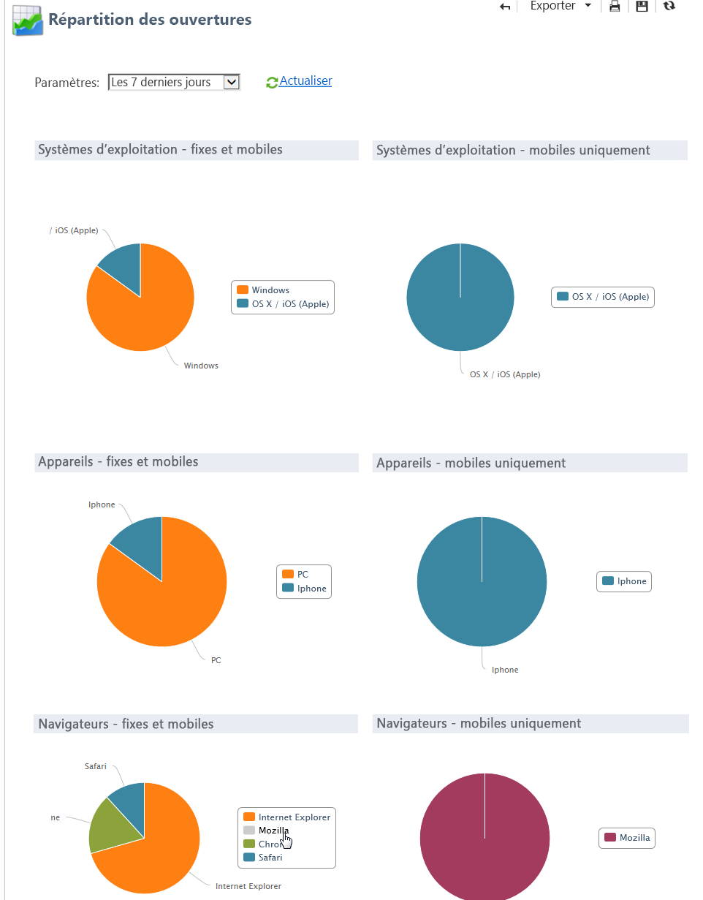

>[!NOTE]
>
>Les noms des navigateurs et des systèmes d&#39;exploitation font partie des informations envoyées par l&#39;agent utilisateur du navigateur vers lequel le message a été ouvert. Adobe Campaign détermine le type d&#39;appareil en utilisant ses informations sur l&#39;appareil.
