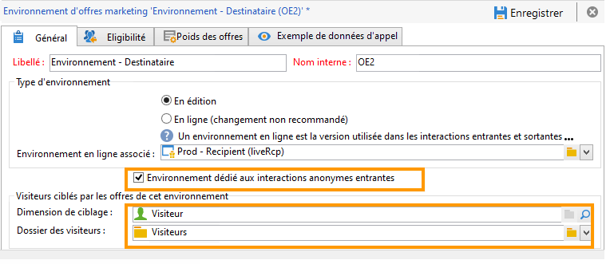
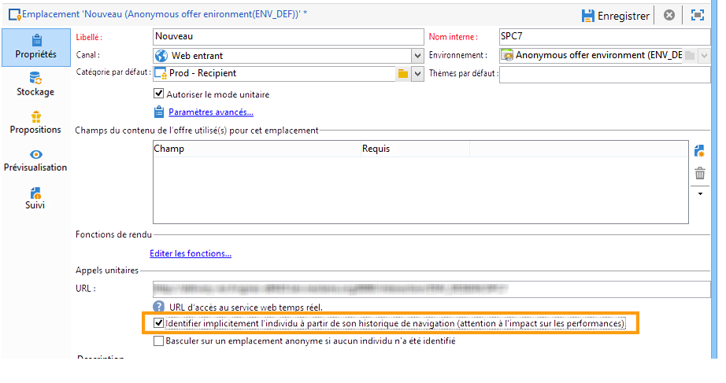
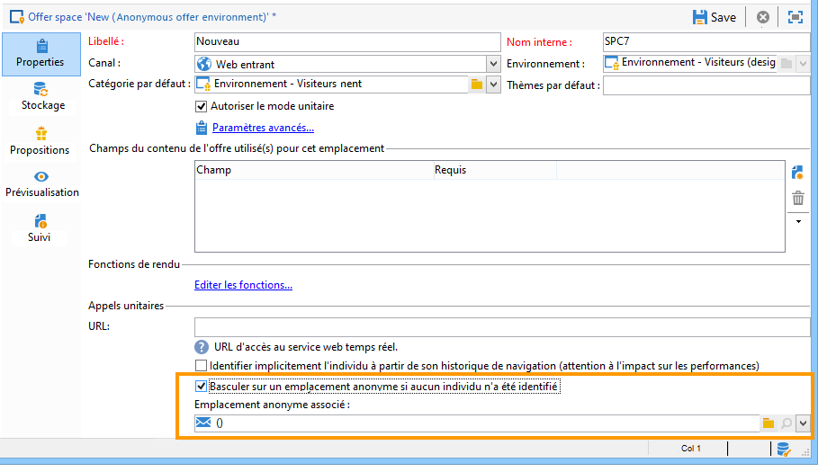

# Interactions anonymes{#anonymous-interactions}

## Environnement pour les interactions anonymes {#environment-for-anonymous-interactions}

Par défaut, le module **Interaction** de Campaign comprend un environnement préconfiguré pour cibler la table des destinataires intégrée (offres identifiées). Si vous devez cibler une autre table, par exemple, une table des visiteurs pour les offres anonymes ou une table des destinataires personnalisée, vous devez utiliser lʼassistant de mapping de ciblage pour créer lʼenvironnement. [En savoir plus sur les environnements](interaction-env.md).

Lorsque vous créez l&#39;environnement anonyme via l&#39;assistant de création de mapping, la case **[!UICONTROL Environnement dédié aux interactions anonymes entrantes]** est automatiquement cochée dans l&#39;onglet **[!UICONTROL Général]** de l&#39;environnement.

La **[!UICONTROL Dimension de ciblage]** est automatiquement préremplie. Elle pointe par défaut sur la table des visiteurs.

Le champ **[!UICONTROL Dossier des visiteurs]** s&#39;affiche. Il est automatiquement prérempli pour pointer sur le dossier **[!UICONTROL Visiteurs]**. Ce champ permet de spécifier l&#39;endroit où sont stockés les profils des visiteurs.

>[!NOTE]
>
>Si vous souhaitez trier plusieurs types de visiteurs, par exemple dans le cas d&#39;offres anonymes proposées pour plusieurs marques, vous devez créer un environnement pour chaque marque puis un dossier de type **[!UICONTROL Visiteurs]** pour chaque environnement.

## Catalogue d&#39;offres pour interactions anonymes {#offer-catalog-for-anonymous-interactions}

Tout comme les interactions sortantes, les interactions entrantes sont organisées au sein dʼun catalogue dʼoffres composé de catégories et dʼoffres.

Pour créer les catégories et emplacements, procédez de la même manière que dans le cas de visiteurs identifiés. Consultez les sections [Création dʼune catégorie dʼoffres](interaction-offer-catalog.md#creating-offer-categories) et [Création dʼun environnement dʼoffres](interaction-env.md#creating-an-offer-environment).

## Les visiteurs anonymes {#anonymous-visitors}

Les visiteurs anonymes peuvent être soumis à un processus dʼidentification par cookies intervenant au moment de la connexion. Cette reconnaissance implicite sʼeffectue à partir de lʼhistorique de navigation du visiteur.

Ce processus consiste à comparer les données récupérées par les cookies avec celles de votre base de données. Dans certains cas, les visiteurs sont reconnus (ils sont alors identifiés implicitement) ; dans d’autres cas, ils ne le sont pas (et restent donc anonymes).

Afin dʼeffectuer cette analyse, au niveau de lʼemplacement, cochez la case **[!UICONTROL Identifier implicitement lʼindividu à partir de son historique de navigation]**.

## Traitement des visiteurs anonymes non identifiés {#processing-unidentified-anonymous-visitors}

Après analyse, si un visiteur anonyme n&#39;est pas identifié, il vous est possible de stocker ses données dans un emplacement donné, ce qui vous permettra de proposer des offres spécifiquement destinées à ce type de visiteurs, répondant à des règles de typologie précises.

En cas d&#39;absence d&#39;élément permettant d&#39;identifier un contact ou si vous ne souhaitez pas proposer d&#39;offre identifiée à un contact pouvant être identifié implicitement, vous pouvez choisir d&#39;effectuer un basculement vers un environnement anonyme.

Pour cela, cochez la case **[!UICONTROL Basculer sur un emplacement anonyme si aucun individu n&#39;a été identifié]**, puis spécifiez l&#39;environnement dédié à ces visiteurs non identifiés dans la zone **[!UICONTROL Emplacement anonyme associé]** de la définition d&#39;un emplacement.

