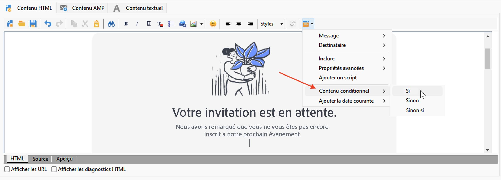
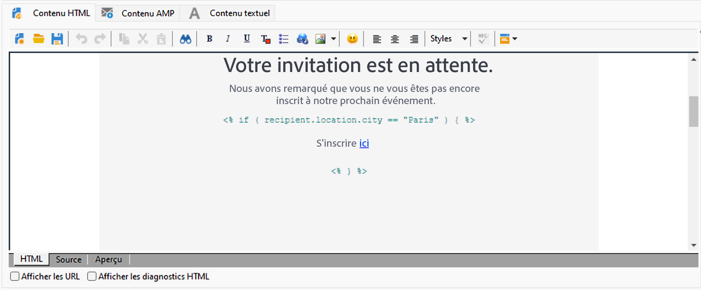

# Créer du contenu conditionnel{#conditional-content}

La configuration des champs de contenu conditionnel permet d’atteindre un niveau de personnalisation évolué. Des blocs complets de texte et/ou des images sont remplacés lorsqu’une condition particulière est remplie.


## Utiliser des conditions dans un e-mail {#conditions-in-an-email}

Dans l’exemple ci-dessous, découvrez comment créer de manière dynamique un message personnalisé selon la ville et les centres d’intérêt du ou de la destinataire.

* Modifiez le message en fonction de la ville du ou de la destinataire,
* Personnalisez le contenu de l’offre selon les centres d’intérêt du ou de la destinataire.

Pour créer un contenu conditionnel en fonction de la valeur d’un champ, respectez les étapes suivantes :

1. Ouvrez une diffusion existante ou créez une diffusion par e-mail.
1. Dans l’éditeur de contenu d’e-mail, cliquez sur l’icône de personnalisation et sélectionnez **[!UICONTROL Contenu conditionnel > Si]**.

   

   Les éléments de personnalisation sont insérés dans le corps du message : vous devez maintenant les configurer.

1. Renseignez les paramètres de l’expression **Si**.

   * Sélectionnez le premier élément de l’expression, **`<FIELD>`**, puis cliquez sur l’icône de personnalisation pour la remplacer par le champ de test.
   * Remplacez **`<VALUE>`** par la valeur du champ pour lequel la condition sera remplie. Cette valeur doit être entre guillemets.
   * Indiquez le contenu à insérer lorsque la condition est remplie. Il peut s’agir d’un texte, d’une image, d’un formulaire, d’un lien hypertexte, etc.

   

1. Cliquez sur l’onglet **[!UICONTROL Prévisualisation]** pour visualiser le contenu du message en fonction du ou de la destinataire de la diffusion. Sélectionnez un ou une destinataire pour lequel/laquelle la condition est remplie et vérifiez le contenu. Sélectionnez ensuite un ou une autre destinataire pour lequel/laquelle la condition n’est pas remplie et vérifiez à nouveau.

Vous pouvez ajouter d’autres cas et définir un contenu différent en fonction des valeurs d’un ou plusieurs champs. Utilisez pour cela les options **[!UICONTROL Contenu conditionnel > Sinon]** et **[!UICONTROL Contenu conditionnel > Sinon si]**. La configuration de ces expressions est la même que pour l’expression **if**.

>[!CAUTION]
>
>Les caractères **%> &lt;%** doivent être supprimés après l’ajout des conditions **Sinon** et **Autrement si**.


## Cas d’utilisation : créer un e-mail multilingue {#creating-multilingual-email}

Découvrez dans l’exemple ci-dessous comment créer un e-mail multilingue. Le contenu s’affiche dans une langue ou une autre, selon la préférence linguistique du ou de la destinataire.

1. Créez un email et sélectionnez la population cible. Dans cet exemple, la condition d&#39;affichage d&#39;une version ou d&#39;une autre sera basée sur la valeur **Langue** du profil du destinataire. Ces valeurs sont définies sur **EN**, **FR**, **ES**.
1. Dans le contenu HTML de l&#39;email, cliquez sur l&#39;onglet **[!UICONTROL Source]** et collez le code suivant :

   ```
   <% if (language == "EN" ) { %>
   <DIV id=en-version>Hello <%= recipient.firstName %>,</DIV>
   <DIV>Discover your new offers!</DIV>
   <DIV><a href="https://www.adobe.com/products/en">www.adobe.com/products/en</A></FONT></DIV><%
    } %>
   <% if (language == "FR" ) { %>
   <DIV id=fr-version>Bonjour <%= recipient.firstName %>,</DIV>
   <DIV>Découvrez nos nouvelles offres !</DIV>
   <DIV><a href="https://www.adobe.com/products/fr">www.adobe.com/products/fr</A></DIV><%
    } %>
    <% if (language == "ES" ) { %>
   <DIV id=es-version><FONT face=Arial>
   <DIV>Olà <%= recipient.firstName %>,</DIV>
   <DIV>Descubra nuestros nuevas ofertas !</DIV>
   <DIV><a href="https://www.adobe.com/products/es">www.adobe.com/products/es</A></DIV>
   <% } %>
   ```

1. Testez le contenu de l&#39;email dans l&#39;onglet **[!UICONTROL Aperçu]** en sélectionnant des destinataires avec des préférences linguistiques différentes.

   >[!NOTE]
   >
   >Comme aucune autre version n&#39;a été définie dans le contenu de l&#39;email, veillez à filtrer la population cible avant d&#39;envoyer l&#39;email.

## Tutoriel vidéo {#conditionnal-content-video}

Découvrez comment ajouter du contenu conditionnel à une diffusion en prenant pour exemple une newsletter multilingue.

>[!VIDEO](https://video.tv.adobe.com/v/335682?quality=12)
