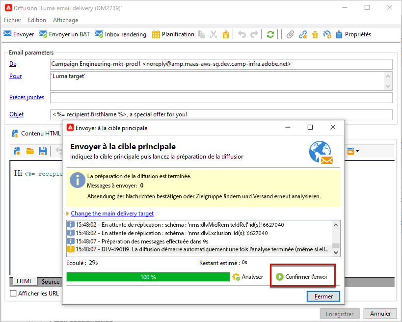

# Configurer et envoyer la diffusion {#configure-delivery}

Accédez aux paramètres de la diffusion pour configurer d&#39;autres paramètres et définir comment envoyer vos messages. Vous pouvez définir une diffusion. [priority](#delivery-priority), configurez [vagues](#sending-using-multiple-waves)et tester l&#39;envoi de la diffusion. Une fois cette configuration terminée, vous pouvez confirmer l’envoi, comme décrit dans la section [cette section](#confirm-delivery). Les messages sont alors envoyés immédiatement ou selon la diffusion. [planning](#schedule-delivery-sending).

## Configurer des paramètres supplémentaires {#delivery-additional-parameters}

Avant d’envoyer la diffusion, vous pouvez définir les paramètres d’envoi dans les propriétés de la diffusion, via l’onglet **[!UICONTROL Diffusion]**.

### Delivery priority {#delivery-priority}

Utilisez la variable **[!UICONTROL Priorité de diffusion]** pour modifier l&#39;ordre d&#39;envoi de vos diffusions en définissant leur niveau de priorité, à partir de **[!UICONTROL Très faible]** to **[!UICONTROL Très élevée]** (la valeur par défaut étant **[!UICONTROL Normal]**).

### Quantité par lot

Utilisez la variable  **[!UICONTROL Quantité de lot de messages]** pour définir le nombre de messages regroupés dans le même package de diffusion XML. Si le paramètre est défini sur 0, les messages sont automatiquement regroupés. La taille du paquet est définie par le calcul `<delivery size>/1024`, avec un minimum de 8 messages et un maximum de 256 messages par package.

>[!IMPORTANT]
>
>Lorsque vous créez la diffusion en dupliquant une diffusion existante, vous réinitialisez également ce paramètre.

### Tester l&#39;envoi de la diffusion

Utilisez la variable  **[!UICONTROL Tester la diffusion SMTP]** pour tester l&#39;envoi par SMTP. La diffusion est traitée jusqu’à la connexion au serveur SMTP mais n’est pas envoyée : pour chaque destinataire de la diffusion, Campaign se connecte au serveur du fournisseur SMTP, exécute la commande SMTP RCPT TO et ferme la connexion avant la commande SMTP DATA.

>[!NOTE]
>
>* Cette option ne doit pas être définie en midsourcing.
>
>* En savoir plus sur la configuration du serveur SMTP dans [Documentation de Campaign Classic v7](https://experienceleague.adobe.com/docs/campaign-classic/using/installing-campaign-classic/additional-configurations/configure-delivery-settings.html?lang=fr#smtp-relay){target="_blank"}.

## Envoi en plusieurs vagues {#sending-using-multiple-waves}

Pour équilibrer la charge, vous pouvez répartir les envois en plusieurs lots. Configurez le nombre de lots et leur proportion par rapport à l&#39;ensemble de la diffusion.

### Activer les vagues {#enable-waves}

Pour définir des vagues, procédez comme suit :

1. Ouvrez les propriétés de la diffusion et accédez à la **[!UICONTROL Diffusion]** .
1. Activez la variable **[!UICONTROL Envoyer en plusieurs vagues]** , puis cliquez sur le bouton **[!UICONTROL Définir des vagues...]** lien.

   

### Configurer des vagues {#config-waves}

>[!NOTE]
>
>Vous pouvez uniquement définir la taille et le délai entre deux vagues consécutives. Le critère de sélection des destinataires pour chaque vague n&#39;est pas paramétrable.

Vous pouvez soit définir la taille de chaque vague, soit les ajouter à un calendrier.

* **Définir la taille de chaque vague**. Par exemple, si vous saisissez **[!UICONTROL 30 %]** dans le champ correspondant, chaque vague représentera 30 % des messages inclus dans l’envoi, à l’exception de la dernière vague qui représentera 10 % des messages.

  Dans le champ **[!UICONTROL Période]**, définissez le délai entre le démarrage de deux vagues consécutives. Par exemple, si vous saisissez **[!UICONTROL 2 j]**, la première vague démarre immédiatement, la deuxième démarre dans deux jours, la troisième dans quatre jours, etc.

  

* **Définition d’un calendrier pour l’envoi de chaque vague**.  Par exemple, la première vague représente 25% du nombre total de messages inclus dans la diffusion et démarre immédiatement. Les deux vagues suivantes terminent la diffusion et sont définies pour commencer à six heures d’intervalle.

  Dans la colonne **[!UICONTROL Début]**, indiquez le délai entre le démarrage de deux vagues consécutives. Dans la colonne **[!UICONTROL Taille]**, saisissez un nombre fixe ou un pourcentage.

  

### Vérification de la planification des vagues {#check-waves}

Une règle de typologie spécifique, la **[!UICONTROL Vérification de la planification des vagues]**, garantit que la dernière vague est planifiée avant la limite de validité de la diffusion. Les typologies de campagnes et leurs règles, configurées dans l’onglet **[!UICONTROL Typologie]** des propriétés de diffusion, sont présentées dans [cette section.](../../automation/campaign-opt/campaign-typologies.md#typology-rules)<!--ref TBC-->

>[!IMPORTANT]
>
>Veillez à ce que les dernières vagues ne dépassent pas la date limite d’envoi qui est définie dans l’onglet **[!UICONTROL Validité]**.Sinon, certains messages peuvent ne pas être envoyés. En savoir plus sur la période de validité d’une diffusion dans [cette section](delivery-failures.md#valid-period).
>
>Vous devez également prévoir suffisamment de temps pour les reprises lors de la configuration des dernières vagues. En savoir plus sur les reprises dans [cette section](delivery-failures.md#retries).

### Surveiller les vagues {#monitor-waves}

Pour surveiller vos envois, accédez aux logs de diffusion. Voir [cette page](send.md).

Vous pouvez visualiser les diffusions qui ont déjà été envoyées dans les vagues traitées (statut **[!UICONTROL Envoyé]**) et celles à envoyer dans les vagues restantes (statut **[!UICONTROL En attente]**).

### Exemples de vagues {#samples-waves}

Les deux exemples ci-dessous constituent les cas d&#39;utilisation les plus fréquents de plusieurs vagues.

* **Lors de la phase de démarrage**

  Lorsque vous envoyez des emails à l&#39;aide d&#39;une nouvelle plateforme, rien n&#39;est plus suspect pour un FAI (fournisseur d&#39;accès internet) que les adresses IP qui ne sont pas reconnues. Si des emails sont subitement envoyés en masse, le FAI les range souvent dans le courrier indésirable.

  Pour éviter que les emails soient marqués comme spam, vous pouvez augmenter progressivement le volume envoyé à l&#39;aide de vagues. Cela permet d&#39;entamer la phase de démarrage en douceur et de réduire le nombre total d&#39;adresses invalides.

  Pour ce faire, utilisez l’option **[!UICONTROL Planifier les vagues selon un calendrier]**. Par exemple, définissez la première vague sur 10 %, la deuxième sur 15 %, etc.

  

* **Campagnes avec un centre d’appels**

  Lors de la gestion d’une campagne de fidélité par téléphone, votre entreprise dispose d’une capacité limitée de traitement du nombre d’appels pour contacter les abonnés.

  Grâce aux vagues, vous pouvez limiter le nombre de messages à 20 par jour, en tenant compte par exemple de la capacité de traitement quotidien d&#39;un centre d&#39;appels.

  Pour ce faire, sélectionnez l’option **[!UICONTROL Planification de plusieurs vagues de même taille]**. Saisissez **[!UICONTROL 20]** comme taille de vague et **[!UICONTROL 1 j]** dans le champ **[!UICONTROL Période]**.

  

## Confirmer la diffusion {#confirm-delivery}

Une fois la diffusion configurée et prête à être envoyée, vérifiez que vous avez exécuté l’analyse de la diffusion avant de confirmer l’envoi.

Pour ce faire, suivez les étapes ci-après.

1. Cliquez sur **[!UICONTROL Envoyer]**, puis sélectionnez l’action souhaitée.

   * Pour envoyer immédiatement la diffusion, sélectionnez [**Diffuser dès que possible**].
   * Pour planifier l’envoi à une date ultérieure, sélectionnez **[!UICONTROL Différer la diffusion]**. [En savoir plus](#schedule-delivery-sending).

1. Cliquez sur **[!UICONTROL Analyser]**. Pour plus d’informations, consultez [cette section](delivery-analysis.md).

   

1. Une fois que vous avez terminé, cliquez sur **[!UICONTROL Confirmer l’envoi]** pour lancer la diffusion des messages.

   

1. Vous pouvez ensuite fermer l’assistant de diffusion et suivre l’exécution de la diffusion depuis l’onglet **[!UICONTROL Diffusion]** accessible à partir du détail de cette diffusion ou depuis la liste des diffusions.

   Pour plus de détails, reportez-vous à la section ci-dessous :

   * [Contrôler une diffusion](send.md)
   * [Comprendre les échecs de diffusion](delivery-failures.md)

<!--About message tracking-->

## Planification de lʼenvoi de la diffusion {#schedule-delivery-sending}

Vous pouvez différer la diffusion des messages pour planifier l&#39;envoi ou pour gérer la pression commerciale afin de ne pas sur-solliciter une population.

1. Cliquez sur le bouton **[!UICONTROL Envoyer]** et sélectionnez l’option **[!UICONTROL Différer la diffusion]**.

1. Indiquez une date de démarrage dans le champ **[!UICONTROL Date de contact]**.

   

1. Lancez l’analyse de la diffusion et confirmez l&#39;envoi de celle-ci. Toutefois, cet envoi ne démarrera pas avant la date indiquée dans le champ **[!UICONTROL Date de contact]**.

   >[!IMPORTANT]
   >
   >Une fois que vous avez lancé l&#39;analyse, la date de contact que vous avez définie est figée.Si vous modifiez cette date, veillez à relancer l&#39;analyse pour que vos modifications soient bien prises en compte.

   

Dans la liste des diffusions, la diffusion apparaît avec le statut **[!UICONTROL En attente]**.

La planification peut aussi être paramétrée en amont via le bouton **[!UICONTROL Planification]** de la diffusion.

Elle vous permet de différer la diffusion à une date ultérieure ou enregistrer la diffusion dans le calendrier prévisionnel.

* L&#39;option **[!UICONTROL Planifier la diffusion (pas d&#39;exécution automatique)]** permet de planifier une analyse prévisionnelle de la diffusion.

  Lorsque ce paramétrage est enregistré, la diffusion passe alors dans l&#39;état **[!UICONTROL Ciblage en attente]**.L&#39;analyse sera lancée à la date indiquée.

* L&#39;option **[!UICONTROL Planifier la diffusion (exécution automatique à la date prévue)]** permet d&#39;indiquer la date de contact.

  Cliquez sur le bouton **[!UICONTROL Envoyer]** et choisissez **[!UICONTROL Différer la diffusion]** puis lancez l&#39;analyse et confirmez l&#39;envoi. Une fois l&#39;analyse terminée, la cible de la diffusion est prête et les messages seront automatiquement envoyés à la date indiquée.

Les dates et heures sont entendues dans le fuseau horaire de l&#39;opérateur courant. La liste déroulante **[!UICONTROL Fuseau horaire]** située sous la zone de saisie de la date de contact permet d&#39;adapter automatiquement la date et l&#39;heure saisie dans le fuseau horaire sélectionné.

Ainsi, si vous planifiez une diffusion pour qu&#39;elle s&#39;exécute automatiquement à 8h heure de Londres, l&#39;heure est automatiquement convertie dans le fuseau sélectionné :

<!--
## Adjust delivery failure management {#delivery-failure-management}

### Configure retries {#configure-retries}

Temporarily undelivered messages due to a **Soft** or **Ignored** error are subject to an automatic retry. The delivery failure types and reasons are presented in this [section](../../delivery/using/understanding-delivery-failures.md#delivery-failure-types-and-reasons).

>[!IMPORTANT]
>
>For hosted or hybrid installations, if you have upgraded to the [Enhanced MTA](../../delivery/using/sending-with-enhanced-mta.md), the retry settings in the delivery are no longer used by Campaign. Soft bounce retries and the length of time between them are determined by the Enhanced MTA based on the type and severity of the bounce responses coming back from the message's email domain.

For on-premise installations and hosted/hybrid installations using the legacy Campaign MTA, the central section of the **[!UICONTROL Delivery]** tab for delivery parameters indicates how many retries should be performed the day after the delivery and the minimum delay between retries.

By default, five retries are scheduled for the first day of the delivery with a minimum interval of one hour spread out over the 24 hours of the day. One retry per day is programmed after that and until the delivery deadline, which is defined in the **[!UICONTROL Validity]** tab (see [Defining validity period](#defining-validity-period)).

### Define the validity period {#define-validity-period}

When the delivery has been launched, the messages (and any retries) can be sent until the delivery deadline. This is indicated in the delivery properties, via the **[!UICONTROL Validity]** tab.

* The **[!UICONTROL Delivery duration]** field lets you enter the limit for global delivery retries. This means that Adobe Campaign sends the messages beginning on the start date, and then, for messages returning an error only, regular, configurable retries are performed until the validity limit is reached.

  You can also choose to specify dates. To do this, select **[!UICONTROL Explicitly set validity dates]**. In this case, the delivery and validity limit dates also let you specify the time. The current time is used by default, but you can modify this directly in the input field.

  >[!IMPORTANT]
  >
  >For hosted or hybrid installations, if you have upgraded to the [Enhanced MTA](../../delivery/using/sending-with-enhanced-mta.md), the **[!UICONTROL Delivery duration]** setting in your Campaign email deliveries will be used only if set to **3.5 days or less**. If you define a value higher than 3.5 days, it will not be taken into account.

* **Validity limit of resources**: The **[!UICONTROL Validity limit]** field is used for uploaded resources, mainly for the mirror page and images. The resources on this page are valid for a limited time (to save disk space).

  The values in this field can be expressed in the units listed in [this section](../../platform/using/adobe-campaign-workspace.md#default-units).
-->
