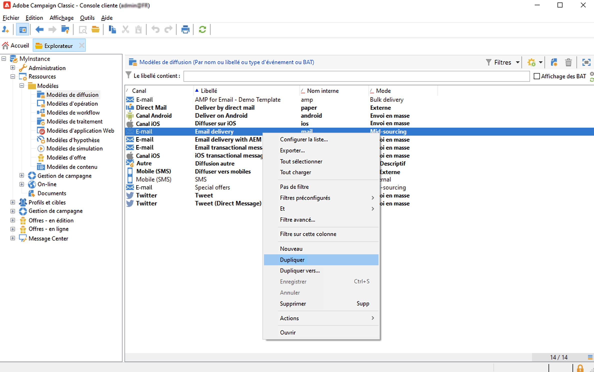
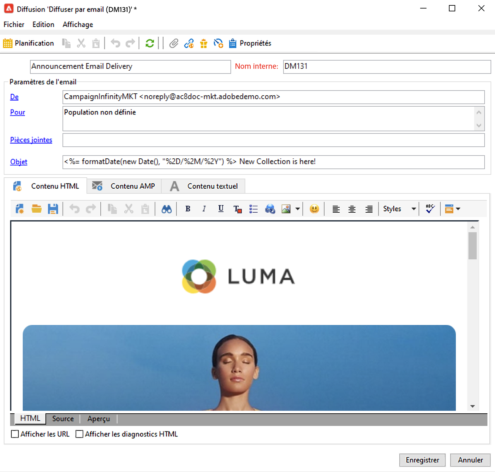
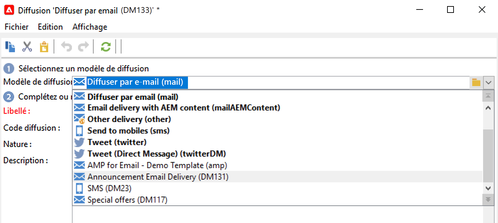
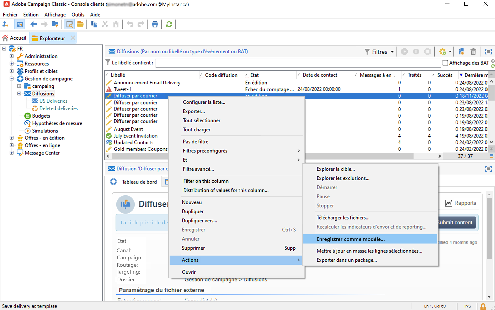
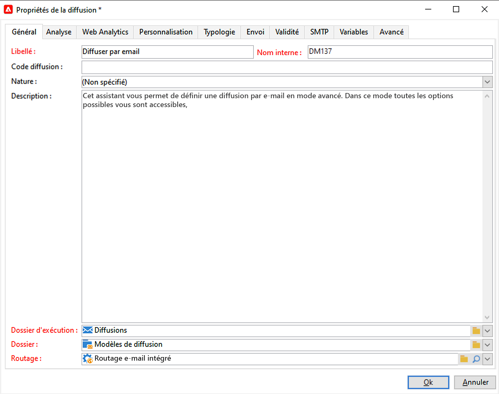
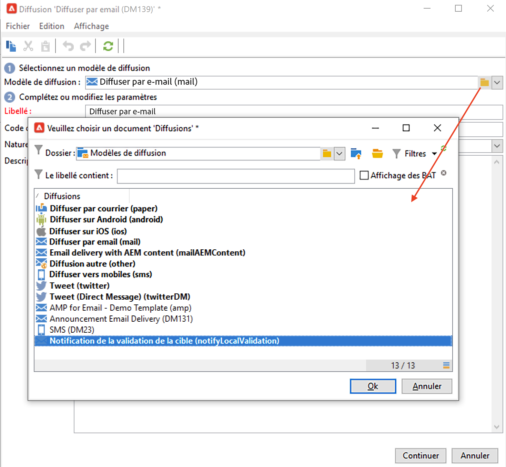
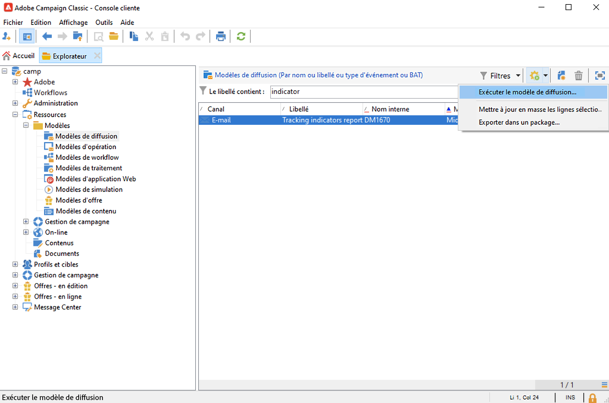

# Utilisation du modèle de diffusion {#work-with-delivery-template}

Chaque diffusion est créée à partir d&#39;un modèle. Des modèles natifs sont disponibles pour chaque canal. Vous pouvez les personnaliser pour appliquer les mêmes paramètres à un ensemble de diffusions.

Un modèle comprend :

* Règles de typologie
* Adresses d&#39;expéditeur et destinataire
* [Blocs de personnalisation](../send/personalization-blocks.md) de base
* Liens vers les [pages miroir](../send/mirror-page.md) et de désinscription
* Contenu, logo de la société ou signature
* Autres propriétés de diffusion, telles que la validité des ressources et les paramètres de reprise ou de mise en quarantaine.

 [Découvrez cette fonctionnalité en vidéo](#delivery-template-video)

## Création d’un modèle {#create-a-delivery-template}

Pour créer un modèle de diffusion, vous pouvez dupliquer un modèle intégré ou convertir une diffusion existante en modèle. Vous pouvez également créer entièrement un modèle de diffusion, mais cela n&#39;est pas recommandé. Ces méthodes sont présentées ci-dessous.

### Duplication d’un modèle existant{#copy-an-existing-template}

Un jeu de modèles intégrés pour chaque canal est inclus dans Campaign : e-mail, notification push, SMS, courrier, etc.

Le moyen le plus simple de créer un modèle de diffusion consiste à dupliquer et personnaliser un modèle intégré.

Pour dupliquer un modèle de diffusion, procédez comme suit :

1. Accédez à **[!UICONTROL Ressources > Modèles > Modèles de diffusion]** dans l’explorateur Adobe Campaign.
1. Sélectionnez un modèle de diffusion intégré. Les modèles intégrés sont affichés en gras dans la liste.
1. Cliquez avec le bouton droit et sélectionnez **[!UICONTROL Dupliquer]**.

   

1. Définissez les paramètres du nouveau modèle et enregistrez-le.

   

Le modèle est alors ajouté dans la liste des modèles de diffusion. Vous pouvez désormais le sélectionner lors de la création d’une diffusion.

### Conversion d’une diffusion existante en modèle {#convert-an-existing-delivery}

Une diffusion peut être convertie en modèle pour de nouvelles actions de diffusion répétées.

Pour convertir une diffusion en modèle, procédez comme suit :

1. Sélectionnez la diffusion dans la liste des diffusions, accessible à partir du nœud **[!UICONTROL Gestion de campagne]** de l’explorateur Campaign.

1. Cliquez avec le bouton droit et choisissez **[!UICONTROL Actions > Sauver comme modèle...]**.

   

1. Modifiez les propriétés de la diffusion et sélectionnez le dossier dans lequel le nouveau modèle doit être enregistré (dans le champ **[!UICONTROL Dossier]**), ainsi que celui où les diffusions créées à partir de ce modèle doivent être créées (dans le champ **[!UICONTROL Dossier d’exécution]**).

   

### Création d’un modèle {#create-a-new-template}

>[!NOTE]
>
>Afin d’éviter toute erreur de configuration, Adobe recommande de [dupliquer un modèle intégré](#copy-an-existing-template) et de personnaliser ses propriétés plutôt que de créer un modèle.

Pour configurer un modèle de diffusion à partir de zéro, procédez comme suit :

1. Accédez au dossier **Ressources** dans l’explorateur Campaign, puis sélectionnez **Modèles** et **Modèles de diffusion**.
1. Cliquez sur **Nouveau** dans la barre d’outils pour créer un modèle de diffusion.
1. Définissez le **Libellé** et le **Nom interne** du dossier.
1. Enregistrez le modèle et rouvrez-le.
1. Cliquez sur le bouton **Propriétés** pour adapter les paramètres.
1. Dans l&#39;onglet **Général**, validez ou modifiez les emplacements sélectionnés dans les menus déroulants **Dossier d&#39;exécution**, **Dossier** et **Routage**.
1. Remplissez la catégorie **Paramètres de l’e-mail** avec l’objet de l’e-mail et la population ciblée.
1. Ajoutez votre **contenu HTML** afin de personnaliser votre modèle. Vous pouvez afficher un [lien de page miroir](../send/mirror-page.md) et un lien de désinscription.
1. Sélectionnez l’onglet **Prévisualisation**. Dans le menu déroulant **Tester la personnalisation**, sélectionnez **Destinataire** pour obtenir un aperçu du modèle en tant que profil choisi.
1. Cliquez sur **Enregistrer**. Le modèle peut maintenant être utilisé dans une diffusion.

## Utilisation de modèles {#use-a-delivery-template}

### Création d’une diffusion depuis un modèle {#create-a-delivery-from-a-template}

Pour créer une diffusion basée sur un modèle existant, vous devez sélectionner le modèle dans la liste des modèles de diffusion proposés.

Si le modèle ne s’affiche pas, cliquez sur le dossier **[!UICONTROL Choisir le lien]** situé à droite du champ permettant de parcourir les dossiers de Campaign.

Sélectionnez le répertoire visé depuis le champ **[!UICONTROL Dossier]** ou cliquez sur l&#39;icône **[!UICONTROL Afficher les fils]** pour afficher le contenu des répertoires situés en sous-arborescence du répertoire courant.

Sélectionnez le modèle de diffusion à utiliser et cliquez sur **[!UICONTROL Ok]**.

### Exécution d’un modèle {#execute-a-template}

Vous pouvez lancer l’exécution d’un modèle directement depuis la liste des modèles, sans devoir créer de diffusion au préalable.

Pour ce faire, sélectionnez le modèle à exécuter et cliquez avec le bouton droit de la souris. Sélectionnez **[!UICONTROL Actions > Exécuter le modèle de diffusion...]**.

Vous pouvez aussi utiliser le menu **[!UICONTROL Fichier > Actions > Exécuter le modèle de diffusion...]**.

Renseignez ensuite les paramètres de la diffusion et cliquez sur **[!UICONTROL Envoyer]**.

Cette action génère une diffusion dans le dossier associé au modèle. Le nom de cette diffusion est le nom du modèle de diffusion à partir duquel elle a été créée.

## Tutoriels vidéo {#delivery-template-video}

### Comment configurer un modèle de diffusion

La vidéo suivante montre comment configurer un modèle pour une diffusion ad hoc.

>[!VIDEO](https://video.tv.adobe.com/v/342082?quality=12)

### Comment configurer les propriétés des modèles de diffusion

La vidéo suivante montre comment définir les propriétés des modèles de diffusion et explique en détail chaque propriété.

>[!VIDEO](https://video.tv.adobe.com/v/338969?quality=12)

### Comment déployer un modèle de diffusion ad hoc

Cette vidéo montre comment déployer un modèle de diffusion email ad hoc. Elle explique aussi la différence entre une diffusion email et un workflow de diffusion.

>[!VIDEO](https://video.tv.adobe.com/v/338965?quality=12)

D’autres vidéos pratiques sur Campaign sont disponibles [ici](https://experienceleague.adobe.com/docs/campaign-learn/tutorials/getting-started/introduction-to-adobe-campaign.html?lang=fr){target="_blank"}.
