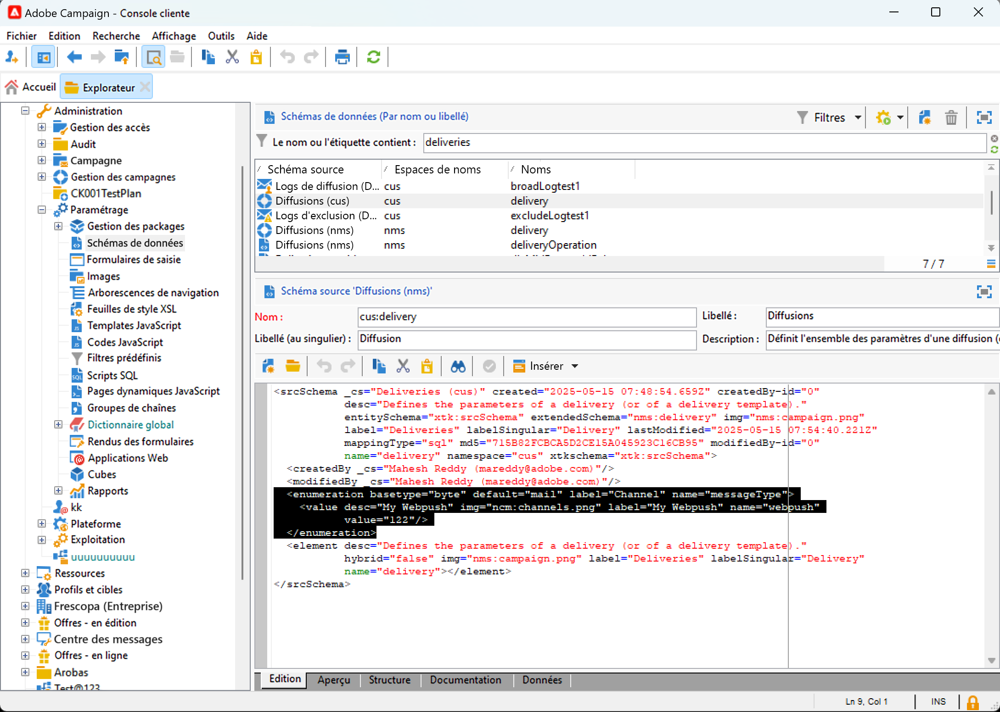
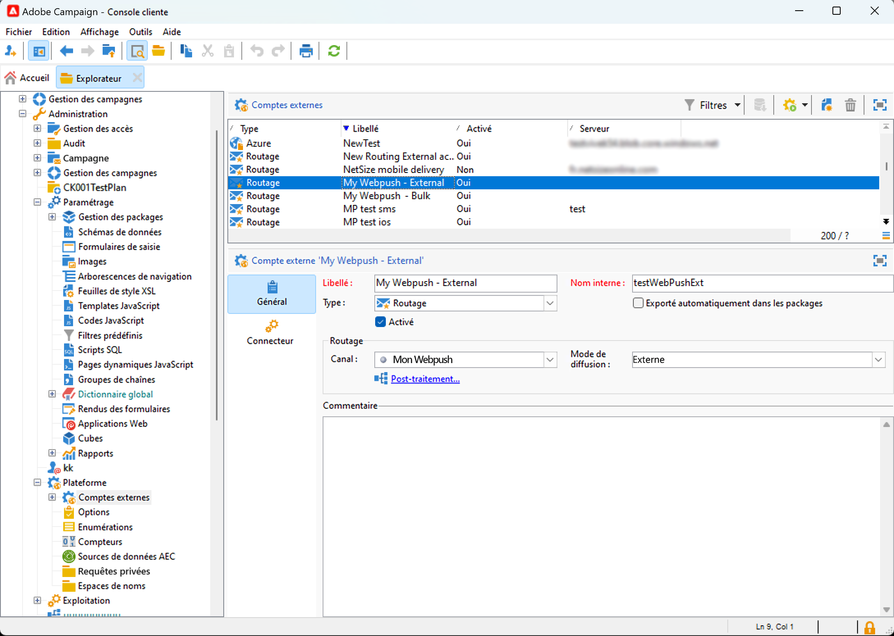
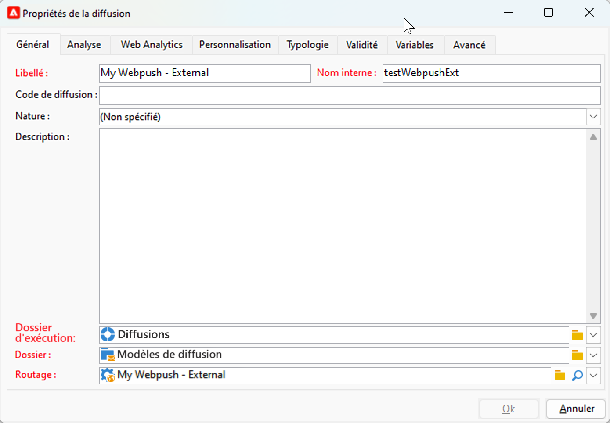

# Commencer avec les canaux personnalisés {#gs-custom-channel}

Adobe Campaign vous permet de créer des canaux externes ou API personnalisés intégrés à des tiers. Vous pouvez ensuite orchestrer et exécuter des diffusions en fonction de ces canaux.

La création et l’envoi de la diffusion peuvent être effectués dans la console cliente et dans l’interface d’utilisation web. Cependant, la configuration de canal personnalisé n’est effectuée que dans la console cliente.

Pour savoir comment créer et envoyer une diffusion basée sur un canal personnalisé, consultez cette [page](https://experienceleague.adobe.com/docs/campaign-web/v8/msg/gs-custom-channel.html?lang=fr){target="_blank"}.

Pour configurer un nouveau canal personnalisé dans la console cliente, procédez comme suit. Ces étapes sont communes aux canaux externes et d’API personnalisés :

1. Configurer le schéma, [en savoir plus](#configure-schema)
1. Créer un compte externe, [en savoir plus](#create-ext-account)
1. Créer un modèle de diffusion, [en savoir plus](#create-template)

Les canaux d’API personnalisés nécessitent une configuration supplémentaire. [En savoir plus](#api-additional)

## Configurer le schéma{#configure-schema}

Tout d’abord, configurez le schéma pour ajouter le nouveau canal à la liste des canaux disponibles.

1. Dans l’explorateur Campaign, sélectionnez **Administration** > **Configuration** > **Schémas de données**.

1. Créez une extension de schéma pour étendre l’énumération **messageType** [](../config/enumerations.md) avec le nouveau canal.

   Par exemple :

   ```
   <enumeration basetype="byte" default="mail" label="Channel" name="messageType">
   <value desc="My Webpush" img="ncm:channels.png" label="My Webpush" name="webpush"
          value="122"/>
   </enumeration>
   ```

   {zoomable="yes"}

## Créer un compte externe{#create-ext-account}

Ensuite, vous devez créer un compte externe de routage.

1. Dans l’explorateur Campaign, sélectionnez **Administration** > **Plateforme** > **Comptes externes**.

1. Créez un compte externe.

1. Sélectionnez le canal et changez le mode de diffusion. Choisissez **Externe** pour les canaux externes personnalisés, et **En bloc** pour les canaux d’API personnalisés.

   {zoomable="yes"}

## Créer un modèle de diffusion{#create-template}

À présent, nous allons créer le modèle associé au nouveau canal.

1. Dans l’explorateur Campaign, sélectionnez **Ressources** > **Modèles** > **Modèles de diffusion**.

1. Créez un modèle.

1. Cliquez sur **Propriétés** et sélectionnez le dossier et le routage appropriés.

   {zoomable="yes"}

Le nouveau canal est désormais disponible. Vous pouvez créer et exécuter des diffusions qui se déroulent sur ce canal.

## Configuration supplémentaire de l’API personnalisée{#api-additional}

Les principales étapes supplémentaires pour configurer des canaux d’API personnalisés sont les suivantes.

### Extension du schéma{#api-additional-schema}

À partir de la console cliente, étendez le schéma **Diffusion** avec toutes les propriétés supplémentaires requises pour le canal personnalisé.

Pour plus d’informations sur les extensions de schéma, consultez cette [page](../dev/extend-schema.md).

### Configurer la définition d’écran personnalisée{#api-additional-screen}

Dans l’interface utilisateur web de Campaign, configurez la définition d’écran personnalisée :

1. Ouvrez le schéma **Diffusion**, puis cliquez sur **Modification de l’écran**.

   {zoomable="yes"}

1. Sélectionnez l’onglet correspondant à votre canal et définissez comment les champs seront affichés dans l’écran de contenu de la diffusion. Pour plus d’informations sur la modification de l’écran, consultez cette [page](https://experienceleague.adobe.com/docs/campaign-web/v8/conf/schemas.html#fields){target="_blank"}.

   {zoomable="yes"}

1. Dans la section **Aperçu pour simuler du contenu**, sélectionnez le JSPP dédié. Cette option est facultative. L&#39;aperçu sera alors activé dans l&#39;écran de simulation de la diffusion. [En savoir plus](#api-additional-preview)

### Configuration de l’aperçu{#api-additional-preview}

Ce paramétrage est facultatif. Si vous souhaitez activer l’aperçu dans l’interface utilisateur web, dans l’écran de simulation de la diffusion, vous devez configurer un JSSP dédié dans la console cliente.

Lorsque vous cliquez sur **Ouvrir l’aperçu** dans l’écran de simulation d’une diffusion, dans l’interface utilisateur web, les paramètres suivants sont transmis dans l’URL :

`https://adobe.campaign.adobe.com/cus/webPushMessagePreview.jssp?deliveryId=%40ToPzTurO9aGzQxYcMArBbA%3D%3D&id=%40oF8Fi17txuLmtiOFj4OIjQ%3D%3D`

* `deliveryId` : identifiant de la diffusion
* `id` : identifiant du profil

Dans la console cliente, sélectionnez **Administration** > **Configuration** > **Pages Dynamic JavaScript** et créez un JSSP. Voici un exemple avec les paramètres qui doivent être récupérés.

```
<%@ page import="xtk:shared/nl.js"
%><%
  NL.require("/nl/core/shared/core.js")
    .require('/nl/core/jsspcontext.js')
    .require('/nl/core/shared/dataTypes.js')
    .require('/nl/core/schema.js');
    
  //response.setContentType("text/plain");
  var parameters = request.parameters;
  var deliveryId = decryptString(parameters.deliveryId);
  var oldUserContext = logonEscalation("neolane")
  
   var delivery = xtk.queryDef.create(<queryDef schema="nms:delivery" operation="getIfExists">
                                         <select>
                                           <node expr="[WebpushParameters/@richMediaOptions]" alias="@richMediaOptions"/>
                                           <node expr="[WebpushParameters/@mediaUrlInfo]" alias="@mediaUrlInfo"/>
                                           <node expr="[WebpushParameters/@WebpushMessageType]"/>
                                         </select>
                                         <where>
                                           <condition expr={"@id = " + NL.XTK.toXTKString(deliveryId)}/>
                                         </where>
                                       </queryDef>).ExecuteQuery();

  // Restore previous context
  logonWithContext(oldUserContext)
%>

<!DOCTYPE html ...
```

### Implémentation technique{#api-additional-technical}

En fonction de votre canal personnalisé, vous devrez configurer d’autres parties de l’application, telles que : comptes externes, mapping de ciblage, code JavaScript pour l’API, etc.

