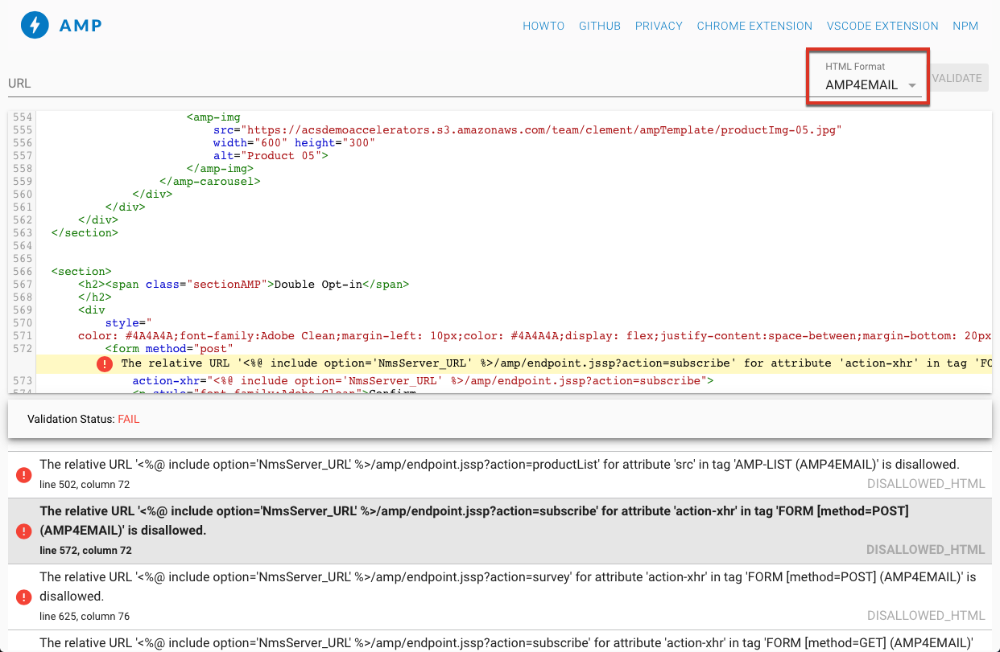

# Définir le contenu interactif{#defining-interactive-content}

Adobe Campaign permet d’utiliser le format interactif [AMP for Email](https://amp.dev/fr/about/email/) qui sert, sous certaines conditions, à envoyer des e-mails dynamiques.

Avec AMP for Email, vous pouvez :
* tester la diffusion des e-mails AMP vers des adresses spécifiques correctement configurées ;
* Diffusez des e-mails AMP vers des adresses Gmail ou Mail.ru après enregistrement auprès des fournisseurs correspondants.

Pour plus d’informations sur le test et l’envoi d’e-mails AMP, consultez [cette section](#targeting-amp-email).

Cette fonctionnalité est disponible via un package dédié dans Adobe Campaign. En fonction de vos autorisations et de votre modèle de déploiement, vous pouvez installer ce package ou contacter Adobe pour l’installer à votre place.

## À propos d’AMP for Email {#about-amp-for-email}

Utilisez le nouveau format **AMP for Email** pour inclure des composants AMP dans vos messages et améliorer l’expérience par e-mail avec un contenu riche et exploitable. Grâce à la fonctionnalité d’application moderne directement disponible dans les emails, les destinataires peuvent interagir dynamiquement avec le contenu du message.

Par exemple :
* Les emails écrits avec AMP peuvent contenir des éléments interactifs tels que des carrousels d’image.
* Le contenu reste à jour dans le message.
* Les destinataires peuvent répondre à un formulaire sans quitter leur boîte de réception.

AMP for Email est compatible avec les emails existants. La version AMP du message est incorporée dans l’email en tant que nouvelle partie MIME, en plus du code HTML et/ou du texte brut, assurant la compatibilité entre tous les clients de messagerie.

Pour plus d’informations sur le format d’email AMP, les spécifications et les exigences, consultez la documentation [destinée aux développeurs AMP](https://amp.dev/fr/documentation/guides-and-tutorials/learn/email-spec/amp-email-format/?format=email).

 [Découvrez cette fonctionnalité en vidéo](#amp-email-video)

## Étapes clés d’utilisation d’AMP for Email avec Adobe Campaign {#key-steps-to-use-amp}

Pour tester et envoyer un email AMP avec Adobe Campaign, procédez comme suit :
1. Créez un email et concevez le contenu AMP dans Adobe Campaign. Voir [Créer du contenu d’email AMP avec Adobe Campaign](#build-amp-email-content).
1. Veillez à respecter toutes les exigences en matière de diffusion des fournisseurs de messagerie qui prennent en charge le format AMP. Voir [Prérequis de diffusion AMP for Email](#amp-for-email-delivery-requirements).
1. Lorsque vous définissez votre cible, assurez-vous de sélectionner les destinataires qui pourront afficher le format AMP. Voir [Cibler un email AMP](#targeting-amp-email).

   >[!NOTE]
   >
   >Actuellement, vous pouvez uniquement diffuser des e-mails AMP vers des [adresses e-mail spécifiques](#testing-amp-delivery-for-selected-addresses) (à des fins de test) ou après [enregistrement](#delivering-amp-emails-by-registering) auprès des clients de messagerie pris en charge.

1. Envoyez votre email comme vous le feriez habituellement. Voir [Envoyer un email AMP](#sending-amp-email).

## Création de contenu d’e-mail AMP dans Adobe Campaign {#build-amp-email-content}

Pour créer un email au format AMP, procédez comme suit.

>[!IMPORTANT]
>
>Veillez à respecter les exigences et les spécifications d’AMP for Email de la [documentation destinée aux développeurs AMP](https://amp.dev/fr/documentation/guides-and-tutorials/learn/email_fundamentals/?format=email). Vous pouvez également consulter la page des [bonnes pratiques relatives à AMP for Email](https://amp.dev/fr/documentation/guides-and-tutorials/develop/amp_email_best_practices/?format=email).

1. Lors de la création de votre diffusion email, sélectionnez un modèle.

   >[!NOTE]
   >
   >Un modèle AMP spécifique contient un exemple des principales fonctionnalités que vous pouvez utiliser : liste de produits, carrousel, double opt-in, questionnaire et requête de serveur avancée.

1. Cliquez sur l’onglet **[!UICONTROL Contenu AMP]**.

   

1. Modifiez le contenu AMP selon vos besoins.

   >[!NOTE]
   >
   >Pour plus d’informations sur la création de votre premier email AMP, consultez la documentation [destinée aux développeurs AMP](https://amp.dev/fr/documentation/guides-and-tutorials/start/create_email/?format=email).

   Vous pouvez, par exemple, utiliser le composant de liste de produits du modèle AMP et tenir à jour une liste de produits d’un système tiers, voire dans Adobe Campaign. Chaque ajustement de prix ou de tout autre élément est automatiquement reflété lorsque les destinataires ouvrent l’e-mail à partir de leur boîte aux lettres.

1. Personnalisez votre contenu AMP selon vos besoins, comme vous le feriez habituellement avec le format HTML dans Adobe Campaign. Utilisez des champs de personnalisation et des blocs de personnalisation.

   

1. Une fois la modification terminée, sélectionnez tout votre contenu AMP et effectuez un copier-coller dans le [validateur Web AMP](https://validator.ampproject.org) ou un site Web similaire.

   >[!NOTE]
   >
   >Veillez à sélectionner **AMP4 EMAIL** dans la liste déroulante en haut de l’écran.

   

   Les erreurs sont marquées de manière intégrée.

   >[!NOTE]
   >
   >L’éditeur AMP d’Adobe Campaign n’est pas conçu pour la validation du contenu. Utilisez un site web externe tel que le [programme de validation web AMP](https://validator.ampproject.org) pour vérifier que votre contenu est correct.

1. Apportez les modifications nécessaires jusqu’à ce que le contenu AMP soit validé.

   

1. Pour prévisualiser votre contenu, copiez votre contenu validé puis collez-le dans [AMP Playground](https://playground.amp.dev/fr) ou un site web similaire.

   >[!NOTE]
   >
   >Veillez à sélectionner **AMP for Email** dans la liste déroulante en haut de l’écran.

   

   >[!NOTE]
   >
   >Vous ne pouvez pas prévisualiser votre contenu AMP directement dans Adobe Campaign. Utilisez un site Web externe tel que [AMP Playground](https://playground.amp.dev/fr).

1. Retournez dans Adobe Campaign et copiez-collez votre contenu validé dans l’onglet **[!UICONTROL Contenu AMP]**.

1. Passez à l’onglet **[!UICONTROL Contenu HTML]** ou **[!UICONTROL Contenu texte]** et définissez le contenu pour l’un de ces deux formats au moins.

   >[!IMPORTANT]
   >
   >Si votre email ne contient pas de version HTML ou texte brut en plus du contenu AMP, il ne peut pas être envoyé.

## Prérequis de diffusion AMP for Email {#amp-for-email-delivery-requirements}

Lors de la création de votre contenu AMP dans Adobe Campaign, vous devez respecter les conditions de diffusion d’un email dynamique, qui sont spécifiques aux fournisseurs de messagerie de vos destinataires.

Deux fournisseurs de messagerie prennent actuellement en charge le test de ce format : Gmail et Mail.ru.

Toutes les étapes et spécifications requises pour tester la diffusion avec le format AMP sur les comptes Gmail sont présentées dans les documentations [Gmail](https://developers.google.com/gmail/ampemail?) et [Mail.ru](https://postmaster.mail.ru/amp) correspondantes destinées aux développeurs et développeuses.

En particulier, les prérequis suivants doivent être remplis :
* Nous vous invitons à suivre les exigences de sécurité AMP spécifiques à [Gmail](https://developers.google.com/gmail/ampemail/security-requirements) et [Mail.ru](https://postmaster.mail.ru/amp/#howto).
* La partie MIME AMP doit contenir un [document AMP valide](https://amp.dev/fr/documentation/guides-and-tutorials/learn/validation-workflow/validate_emails/?format=email).
* La partie MIME AMP doit être inférieure à 100 Ko.

Vous pouvez également consulter la documentation [Conseils et limites connues de Gmail](https://developers.google.com/gmail/ampemail/tips).

## Ciblage d’un e-mail AMP {#targeting-amp-email}

Actuellement, vous pouvez tester l&#39;envoi d&#39;un email AMP en deux étapes :

1. Adobe Campaign vous permet de tester la diffusion d’un email dynamique piloté par AMP vers des adresses email sélectionnées correctement configurées, afin de vérifier son contenu et son comportement. Voir [Tester la diffusion d’un email AMP pour des adresses sélectionnées](#testing-amp-delivery-for-selected-addresses).

1. Une fois testée, vous pouvez envoyer une diffusion ou une campagne dans le cadre du programme AMP for Email en vous enregistrant auprès du ou des fournisseurs de messagerie concernés pour que votre domaine d’expéditeur soit ajouté à la liste autorisée. Voir [Diffuser des emails AMP en s’enregistrant auprès d’un fournisseur de messagerie](#delivering-amp-emails-by-registering).

### Tester la diffusion d’un email AMP pour des adresses sélectionnées {#testing-amp-delivery-for-selected-addresses}

Vous pouvez tester l’envoi de messages dynamiques d’Adobe Campaign vers des adresses email sélectionnées.

>[!NOTE]
>
>Actuellement, seuls Gmail et Mail.ru prennent en charge le test du format AMP.

En ce qui concerne Gmail, vous devez d’abord ajouter à la liste autorisée la ou les adresses d’expéditeur et d’expéditrice que vous utilisez pour procéder à la diffusion depuis Adobe Campaign pour les comptes Gmail ciblés.

Pour cela :
1. Vérifiez que l’option d’activation de l’e-mail est cochée par le ou les fournisseurs de messagerie appropriés.
1. Copiez l’adresse de l’expéditeur affichée dans le champ **[!UICONTROL De]** de la diffusion et collez-la dans la section appropriée des paramètres du compte du fournisseur de messagerie.

Pour plus d’informations, consultez la documentation [Gmail](https://developers.google.com/gmail/ampemail/testing-dynamic-email) destinée aux développeurs et développeuses.

Pour tester l’envoi d’un e-mail AMP à une adresse Mail.ru, procédez comme indiqué dans la [documentation Mail.ru destinée aux développeurs](https://postmaster.mail.ru/amp/#howto) (section **Si vous êtes un utilisateur**).

### Diffuser des emails AMP en s’enregistrant auprès d’un fournisseur de messagerie {#delivering-amp-emails-by-registering}

Vous pouvez tester la diffusion d’e-mails dynamiques en vous enregistrant auprès des fournisseurs de messagerie pris en charge afin que votre domaine d’expéditeur soit ajouté à la liste autorisée.

>[!NOTE]
>
>Actuellement, seuls Gmail et Mail.ru prennent en charge le format AMP.

Après avoir testé avec quelques adresses, vous pouvez envoyer des e-mails AMP à n’importe quelle adresse Gmail. Pour cela, vous devez vous enregistrer auprès de Google et attendre leur réponse. Procédez comme indiqué dans la documentation [Gmail](https://developers.google.com/gmail/ampemail/register) destinées aux développeurs et développeuses. Une fois l’enregistrement effectué, vous devenez un expéditeur autorisé.

Pour envoyer des emails AMP aux adresses Mail.ru, respectez les exigences et procédures indiquées dans la [documentation Mail.ru destinée aux développeurs](https://postmaster.mail.ru/amp/#howto) (section **Si vous êtes un expéditeur d’emails**).

## Envoi d’un e-mail AMP {#sending-amp-email}

Une fois que votre contenu AMP et vos basculements sont prêts, et une fois que vous avez défini une cible compatible, vous pouvez envoyer l’e-mail comme vous le feriez normalement.

Actuellement, seuls Gmail et Mail.ru prennent en charge le format AMP, sous certaines conditions. Vous pouvez cibler les adresses d’autres fournisseurs de messagerie, mais ils recevront la version HTML ou en texte brut de votre email.

>[!IMPORTANT]
>
>Si votre email ne contient pas de version HTML ou texte brut en plus du contenu AMP, il ne peut pas être envoyé.

Les destinataires correspondants verront la version AMP de l’email affichée dans leur boîte aux lettres.

Si, par exemple, vous avez inclus une liste de produits dans votre email, lors de la modification des prix dans un système tiers les prix sont automatiquement ajustés chaque fois que vos destinataires ouvrent à nouveau l’email dans leur boîte aux lettres.

>[!NOTE]
>
>Par défaut, l’option **[!UICONTROL Inclusion AMP]** est définie sur **[!UICONTROL Non]**.

## Tutoriel vidéo {#amp-email-video}

La vidéo ci-dessous explique comment activer AMP dans Adobe Campaign et présente son utilisation.

>[!VIDEO](https://video.tv.adobe.com/v/33568?quality=12&learn=on&captions=fre_fr)
