# Définition du contenu de l’e-mail {#defining-the-email-content}

## Expéditeur {#sender}

Pour définir le nom et l’adresse de l’expéditeur qui apparaîtront dans l’en-tête des messages envoyés, cliquez sur le lien **[!UICONTROL De]**.

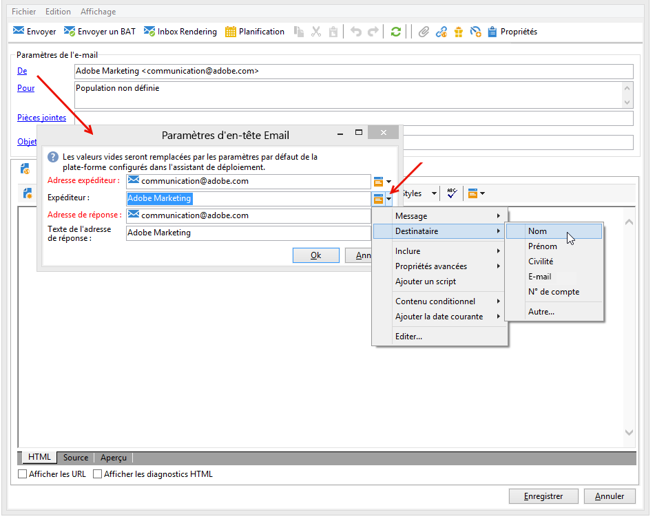

Cette fenêtre permet de saisir toutes les informations nécessaires à l&#39;élaboration des en-têtes de messages email. Ces informations peuvent être personnalisées.Pour cela, vous devez utiliser des champs de personnalisation, insérés via des boutons situés à droite des champs de saisie.

Pour savoir comment insérer et utiliser des champs de personnalisation, consultez [cette section](personalize.md).

>[!NOTE]
>
>* Par défaut, l’adresse de réponse est l’adresse de l’expéditeur ou de l’expéditrice.
>* Les paramètres d’en-tête ne doivent pas être vides. Par défaut, ils contiennent les valeurs saisies lors de la configuration de l’assistant de déploiement.
>* L&#39;adresse de l&#39;expéditeur est obligatoire pour permettre l&#39;envoi d&#39;un email (norme RFC).
>* Adobe Campaign effectue une vérification syntaxique des adresses email saisies.

>[!CAUTION]
>
>Pour éviter tout problème de délivrabilité, les comptes e-mail qui correspondent aux adresses spécifiées pour les diffusions et les réponses doivent exister et doivent être surveillés. Parlez-en avec l’administrateur ou l’administratrice système.

## Objet du message {#message-subject}

L&#39;objet du message est paramétré dans le champ correspondant. Vous pouvez le saisir directement dans le champ ou cliquer sur le lien **[!UICONTROL Objet]** pour saisir un script. Le lien de personnalisation permet d&#39;insérer des champs de la base dans l&#39;objet.

>[!IMPORTANT]
>
>L&#39;objet du message est obligatoire.

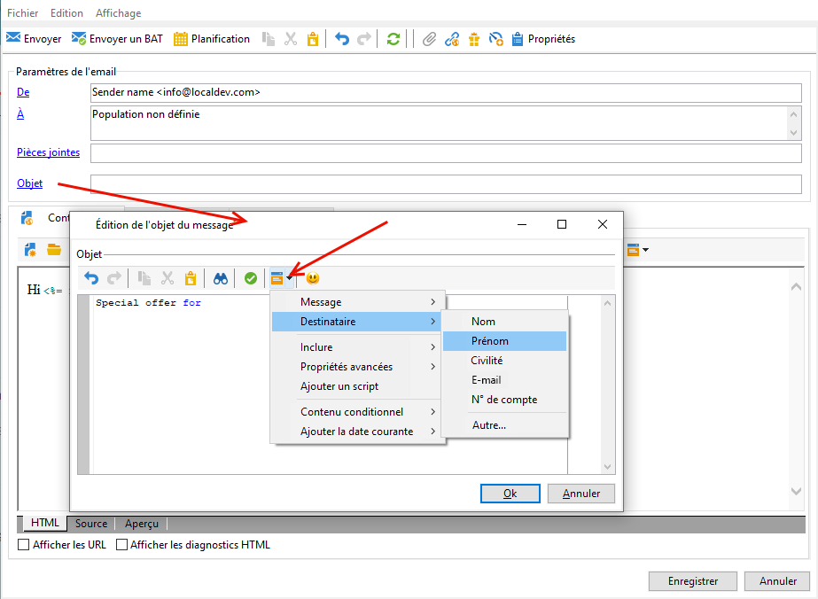

Le contenu des champs sera remplacé par la valeur enregistrée dans le profil du destinataire lors de l&#39;envoi du message.

Par exemple, dans le message ci-dessus, l’objet du message est personnalisé pour chaque destinataire avec les données de son profil.

>[!NOTE]
>
>L’utilisation des champs de personnalisation est présentée dans [cette section](personalize.md).

Vous pouvez également insérer des émoticônes dans votre ligne Objet à l’aide de la fenêtre pop-up **[!UICONTROL Insérer une émoticône]**.

## Contenu du message {#message-content}

>[!IMPORTANT]
>
>Pour des raisons de confidentialité, nous vous recommandons d’utiliser HTTPS pour toutes les ressources externes.

Le contenu du message est défini dans la section inférieure de la fenêtre de configuration de la diffusion.

Par défaut, les messages sont envoyés en HTML ou en Texte, selon les préférences des destinataires. Il est recommandé de créer un contenu dans les deux formats afin de permettre un affichage correct dans toutes les messageries. Voir à ce sujet la section [Sélection des formats du message](email-parameters.md#selecting-message-formats).

* Pour importer un contenu HTML, utilisez le bouton **[!UICONTROL Ouvrir]**. Vous pouvez également coller le code source directement dans le sous-onglet **[!UICONTROL Source]**.

  Si vous utilisez le Digital Content Editor (DCE), consultez la documentation de [Campaign Classic](https://experienceleague.adobe.com/docs/campaign-classic/using/designing-content/editing-html-content/use-case-creating-an-email-delivery.html#step-3---selecting-a-content).

  >[!IMPORTANT]
  >
  >Le contenu HTML doit être préalablement créé puis importé dans Adobe Campaign. L&#39;éditeur HTML n&#39;est pas conçu pour la création de contenu.

  Le sous-onglet **[!UICONTROL Aperçu]** permet, pour chaque contenu, de visualiser le rendu pour un destinataire. Les champs de personnalisation et les éléments conditionnels du contenu sont remplacés par les informations correspondantes pour le profil sélectionné.

  Les boutons de la barre d&#39;outils permettent d&#39;accéder aux paramètres de mise en forme standard pour la page HTML.

  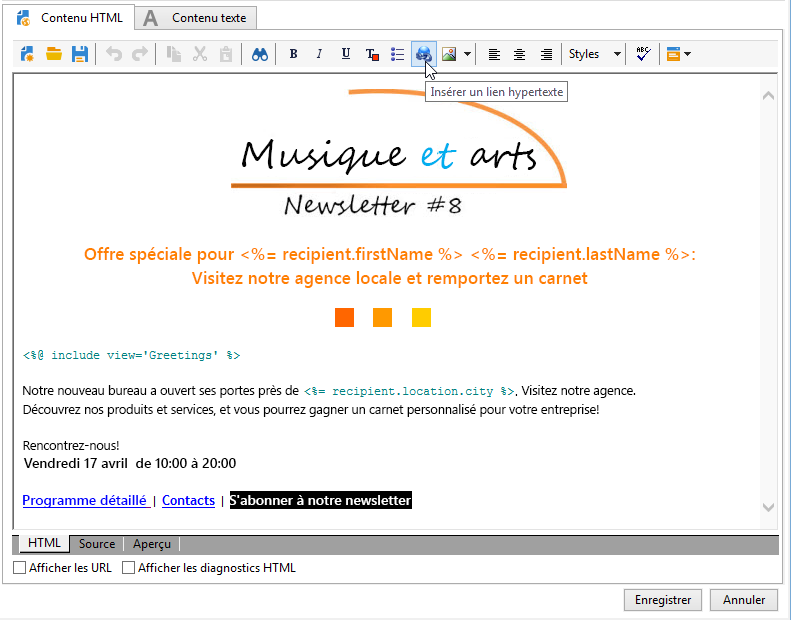

  Vous pouvez insérer des images dans les messages depuis un fichier local ou depuis la bibliothèque d&#39;images disponible dans Adobe Campaign. Pour cela, cliquez sur l&#39;icône **[!UICONTROL Image]** et sélectionnez l&#39;option adéquate.

  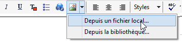

  Les images de la bibliothèque sont accessibles depuis le dossier **[!UICONTROL Ressources>On-line>Ressources publiques]** de l’arborescence. Voir aussi la section [Ajout d’images](#adding-images).

  Le dernier bouton de la barre d&#39;outils permet d&#39;insérer des champs de personnalisation.

  >[!NOTE]
  >
  >L’utilisation des champs de personnalisation est présentée dans [cette section](personalize.md).

  Les onglets en bas de page permettent d&#39;afficher le code HTML associé à la page en cours de création et de visualiser le rendu du message, avec sa personnalisation. Pour lancer la visualisation, cliquez sur l&#39;onglet **[!UICONTROL Aperçu]** et sélectionnez un destinataire à partir du bouton **[!UICONTROL Tester la personnalisation]** situé dans la barre d&#39;outils. Vous pouvez sélectionner un destinataire parmi la ou les cibles définies ou choisir un autre destinataire.

  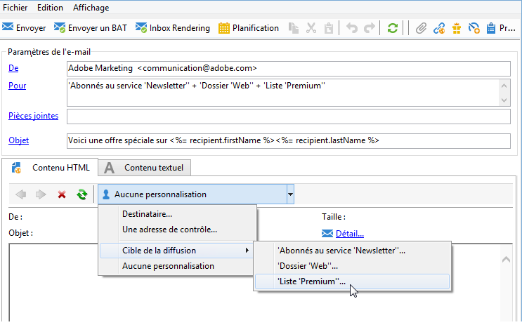

  Vous pouvez valider le message HTML. Vous pouvez également visualiser le contenu de l&#39;en-tête de l&#39;email.

  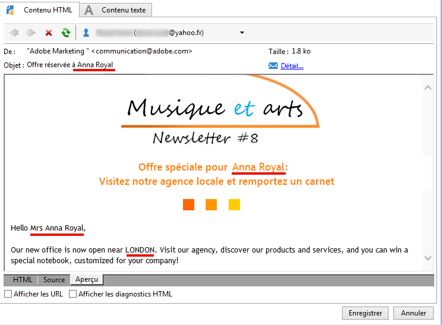

* Pour importer un contenu texte, utilisez le bouton **[!UICONTROL Ouvrir]** ou l&#39;onglet **[!UICONTROL Contenu texte]** pour saisir le contenu du message lorsqu&#39;il sera affiché au format texte. Les boutons de la barre d&#39;outils permettent d&#39;accéder aux actions sur le contenu. Le dernier bouton permet d&#39;insérer des champs de personnalisation.

  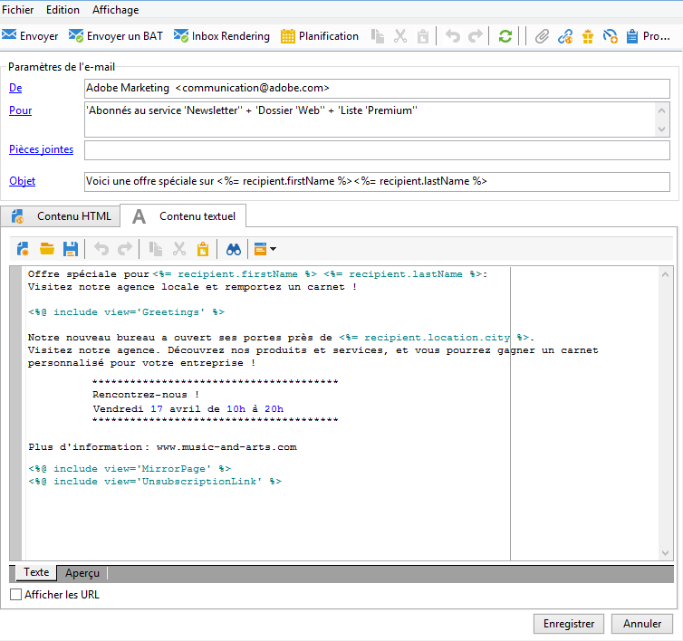

  Comme pour le format HTML, cliquez sur l&#39;onglet **[!UICONTROL Aperçu]** en bas de page pour visualiser le rendu du message, avec sa personnalisation.

  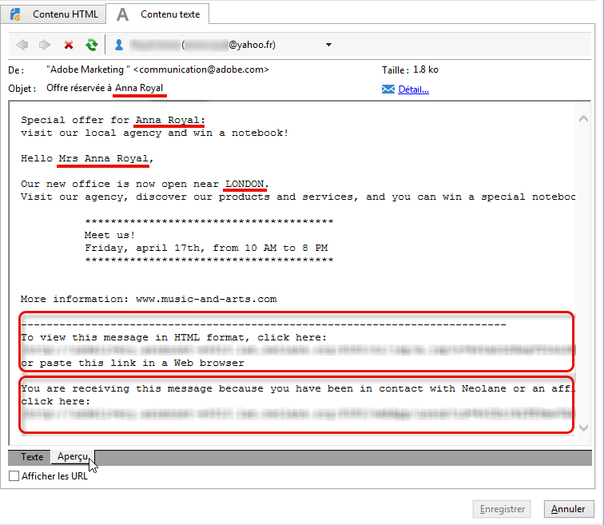

## Définition du contenu interactif {#amp-for-email-format}

Adobe Campaign permet de tester le nouveau format interactif [AMP for email](https://amp.dev/fr/about/email/) qui sert, sous certaines conditions, à envoyer des emails dynamiques.

Voir à ce propos [cette section](defining-interactive-content.md).

## Utiliser la gestion de contenu {#using-content-management}

Vous pouvez définir le contenu de la diffusion en utilisant les formulaires d’une gestion de contenu, directement dans l’assistant de diffusion. Pour cela, vous devez référencer le modèle de publication de la gestion de contenu à utiliser, dans l&#39;onglet **[!UICONTROL Avancé]** des propriétés de la diffusion.

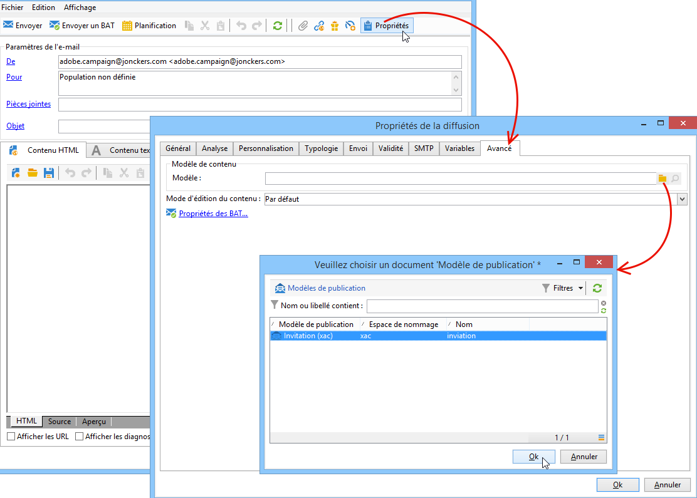

Ainsi, un onglet supplémentaire permet de saisir un contenu qui sera automatiquement intégré et mis en forme selon les règles de la gestion de contenu.

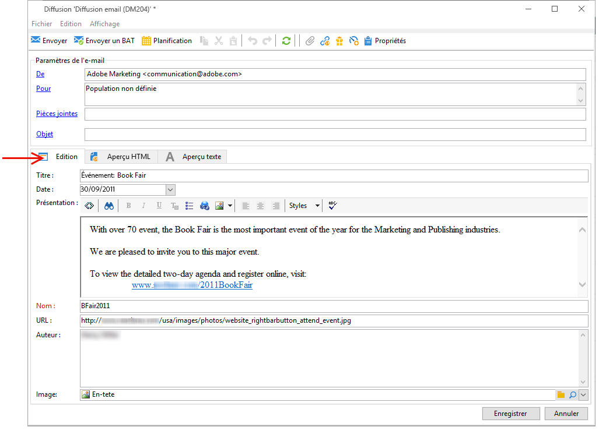

>[!NOTE]
>
>Pour plus d&#39;informations sur la gestion de contenu dans Adobe Campaign, consultez la documentation de [Campaign Classic](https://experienceleague.adobe.com/docs/campaign-classic/using/sending-messages/content-management/about-content-management.html?lang=fr).

## Insérer des émoticônes {#inserting-emoticons}

Vous pouvez insérer des émoticônes dans le contenu d’un email.

1. Cliquez sur l’icône **[!UICONTROL Insérer une émoticône]**.
1. Sélectionnez une émoticône dans la fenêtre pop-up.

   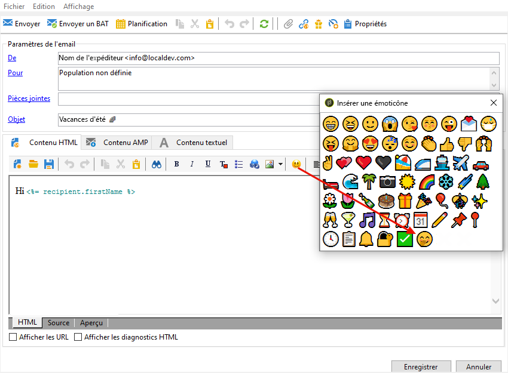

1. Cliquez sur le bouton **[!UICONTROL Fermer]** lorsque vous avez terminé.

Pour personnaliser la liste des émoticônes, consultez la documentation de [Campaign Classic](https://experienceleague.adobe.com/docs/campaign-classic/using/sending-messages/personalizing-deliveries/customizing-emoticon-list.html).

## Ajouter des images {#adding-images}

Les diffusions par e-mail au format HTML peuvent contenir des images. Depuis l’assistant de diffusion, vous pouvez importer une page HTML contenant des images ou insérer des images directement depuis l’éditeur HTML à partir de l’icône **[!UICONTROL Image]**.

### Mécanismes de sécurisation {#img-guardrails}

Pour éviter des problèmes de performances, les images incluses dans les e-mails ne doivent pas dépasser 100 Ko. Cette limite, définie par défaut, peut être modifiée à partir de l’option `NmsDelivery_MaxDownloadedImageSize`. Cependant, Adobe recommande vivement d’éviter les images volumineuses dans vos diffusions e-mail.

Pour en savoir plus sur la liste des options de Campaign, consultez la documentation de Campaign Classic [&#128279;](https://experienceleague.adobe.com/docs/campaign-classic/using/installing-campaign-classic/appendices/configuring-campaign-options.html#delivery).

### Types d’images {#img-types}

Ces images peuvent être :

* locales ou appelées depuis un serveur
* stockées dans la bibliothèque des ressources publiques d&#39;Adobe Campaign

  Les ressources publiques sont accessibles à partir du nœud **[!UICONTROL Ressources > On-line]** de l’arborescence Adobe Campaign. Elles sont regroupées dans une bibliothèque et peuvent être incluses dans les e-mails, mais aussi utilisées au niveau des opérations ou des tâches, ainsi que pour la gestion de contenu.

* Une ressource partagée via Adobe Experience Cloud. Consultez la documentation de [Campaign Classic](https://experienceleague.adobe.com/docs/campaign-classic/using/integrating-with-adobe-experience-cloud/asset-sharing/sharing-assets-with-adobe-experience-cloud.html).

### Insérer et gérer des images {#manage-images}

L’assistant de diffusion vous permet d’ajouter dans le contenu des messages des images locales ou des images stockées dans la bibliothèque. Pour cela, cliquez sur le bouton **[!UICONTROL Image]** situé dans la barre d&#39;outils du contenu HTML.

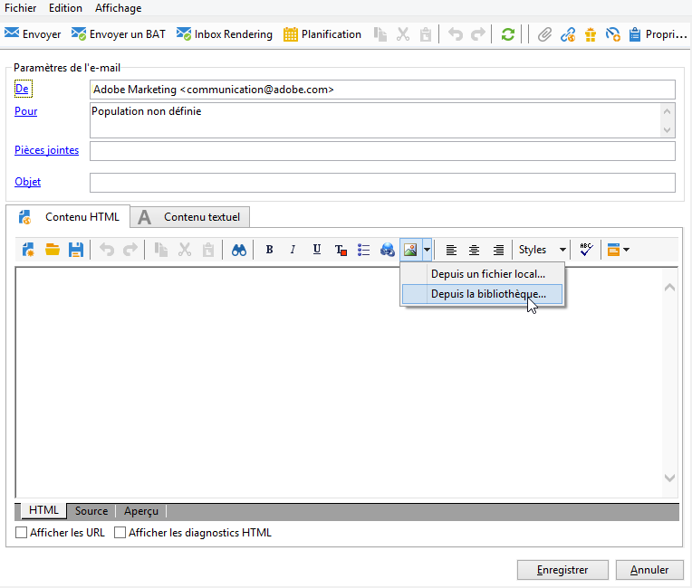

>[!IMPORTANT]
>
>Pour être visibles par les destinataires, ces images dans les messages doivent être présentes sur un serveur accessible depuis l&#39;extérieur.

Pour gérer les images via l’assistant de diffusion, procédez comme suit :

1. Cliquez sur l’icône **[!UICONTROL Tracking &amp; Images]** dans la barre d’outils.
   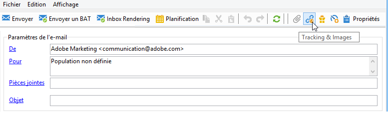

1. Sélectionnez **[!UICONTROL Chargement des images]** dans l’onglet **[!UICONTROL Images]**.
1. Vous pouvez ensuite choisir d’inclure les images dans le message email.
   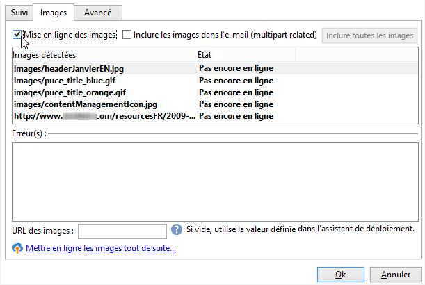

* Vous pouvez charger les images manuellement sans attendre la phase d’analyse de la diffusion. Pour ce faire, cliquez sur le lien **[!UICONTROL Charger les images tout de suite...]**.
* Vous pouvez spécifier un autre chemin d’accès aux images sur le serveur de tracking. Pour ce faire, renseignez-le dans le champ **[!UICONTROL URL des images]**. Cette valeur remplace la valeur définie dans les paramètres de l’assistant d’installation.

Dans l’assistant de diffusion, lorsque vous ouvrez un contenu HTML avec des images incluses, un message vous propose alors de charger immédiatement les images, selon les paramètres de la diffusion.

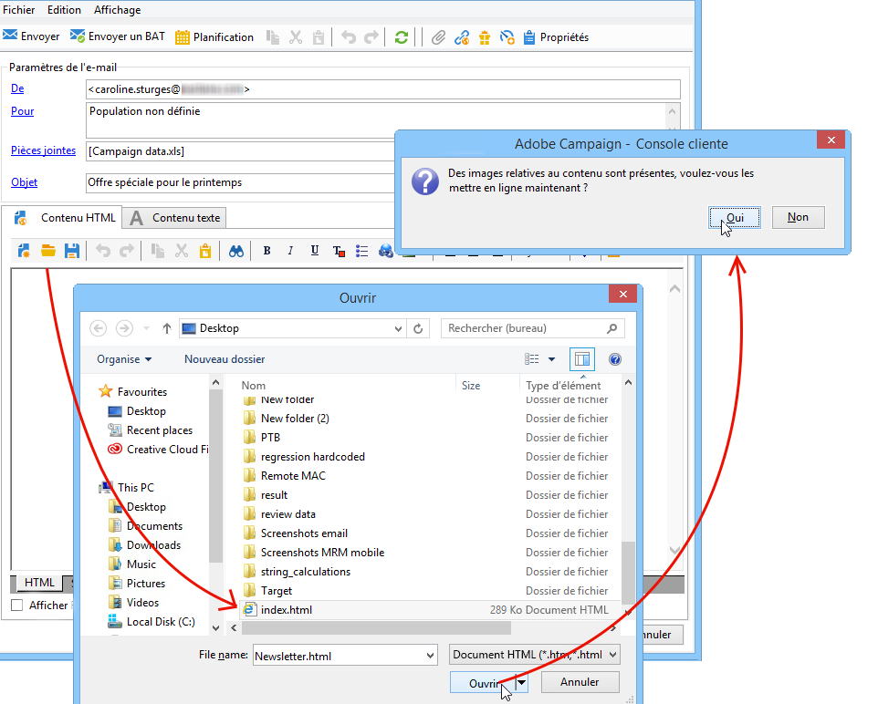

>[!IMPORTANT]
>
> Les URL des images sont modifiées lors d’un chargement manuel ou lors de l’envoi des messages.
> 

### Cas pratique : envoyer un message avec des images {#uc-images}

Voici un exemple de diffusion avec quatre images :

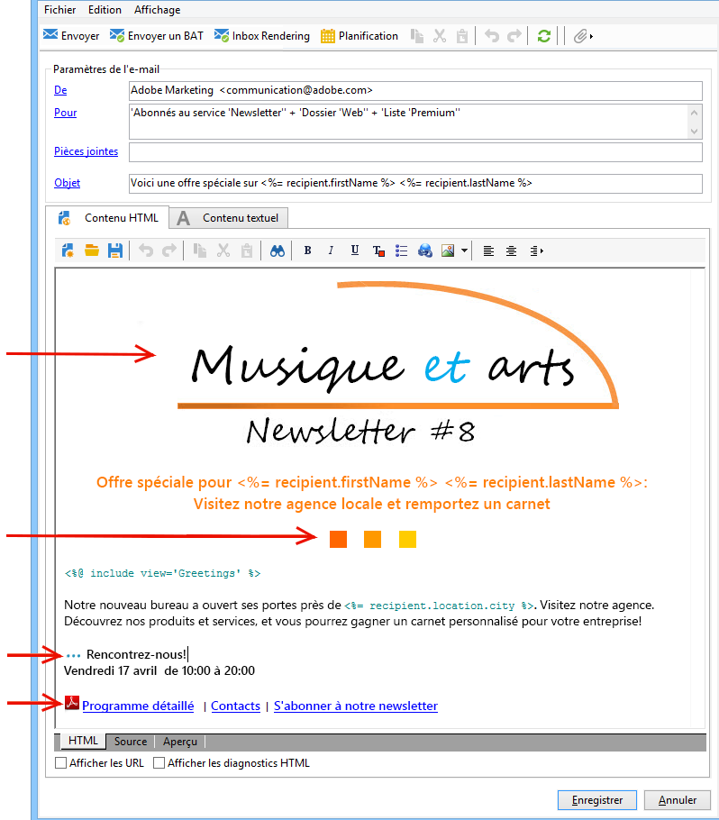

Ces images sont issues d&#39;un répertoire local ou d&#39;un site web, comme vous pouvez le vérifier depuis l&#39;onglet **[!UICONTROL Source]**.

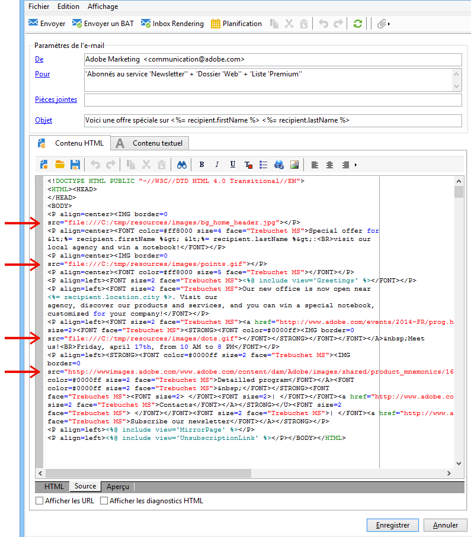

Cliquez sur l&#39;icône **[!UICONTROL Tracking &amp; Images]** puis sur l&#39;onglet **[!UICONTROL Images]** pour lancer la détection des images présentes dans le message.

Pour chaque image détectée, vous pouvez visualiser son état :

* Si une image est locale ou enregistrée sur un autre serveur, et même si ce serveur est accessible depuis l&#39;extérieur (sur un site internet par exemple), elle sera détectée comme **[!UICONTROL Pas encore en ligne]**.
* Les images sont détectées comme **[!UICONTROL Déjà en ligne]** si elles ont été chargées antérieurement lors de la création d’une autre diffusion.
* Dans l’assistant de déploiement, vous pouvez définir des URL pour lesquelles la détection des images ne sera pas active : le chargement de ces images est alors **[!UICONTROL Ignorée]**.

>[!NOTE]
>
>Une image est identifiée par son contenu, et non par son nom ou son chemin d’accès. Ainsi, une image chargée antérieurement sous un autre nom ou depuis un autre répertoire sera détectée comme **[!UICONTROL Déjà en ligne]**.

Lors de la phase d&#39;analyse du message, les images sont automatiquement téléchargées sur le serveur afin d&#39;être accessibles depuis l&#39;extérieur, sauf les images locales qui doivent avoir été téléchargées préalablement.

Vous pouvez anticiper le chargement des images afin qu&#39;elles puissent être visualisées par d&#39;autres opérateurs d’Adobe Campaign. Cela peut s’avérer utile si vous travaillez en collaboration. Pour cela, sélectionnez l&#39;option **[!UICONTROL Charger les images tout de suite]** et cliquez sur le lien pour charger les images sur le serveur.

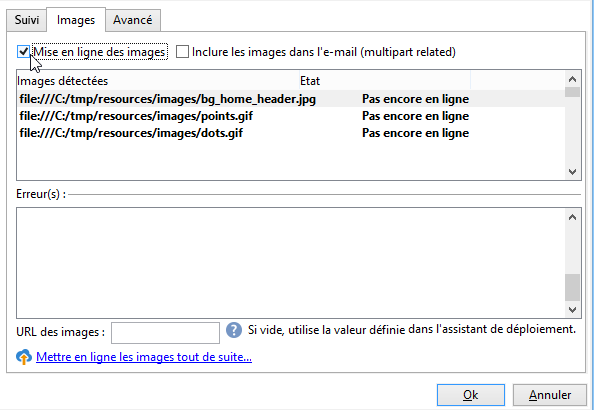

>[!NOTE]
>
>Les URL des images de l&#39;email sont alors modifiées, et notamment les noms des images.

Une fois les images en ligne, vous pouvez visualiser la modification de leur nom et de leur chemin d&#39;accès depuis l&#39;onglet **[!UICONTROL Source]** du message.

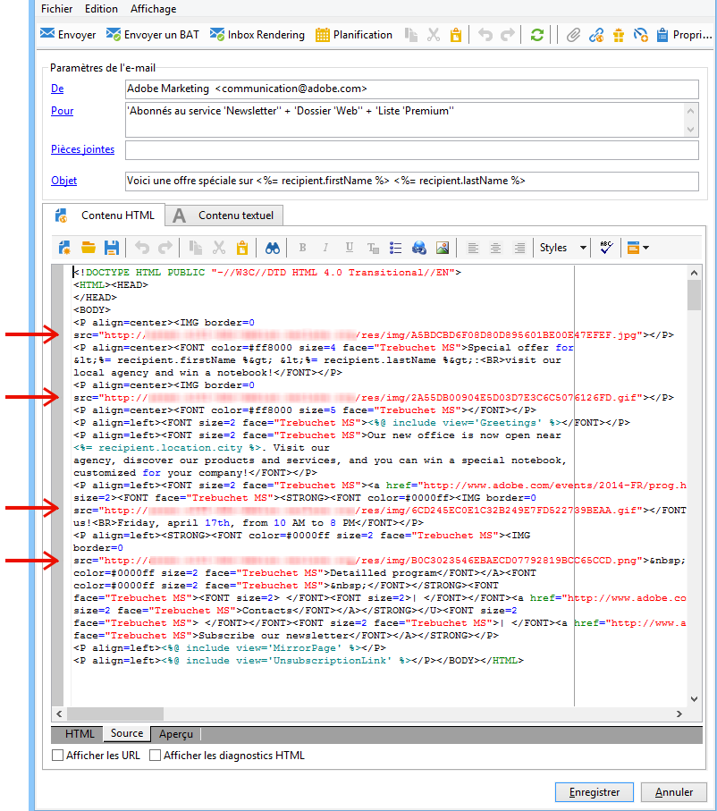

Si vous cochez l&#39;option **[!UICONTROL Inclure les images dans l&#39;email]**, vous pouvez choisir quelles images inclure ou ne pas inclure depuis la colonne correspondante.

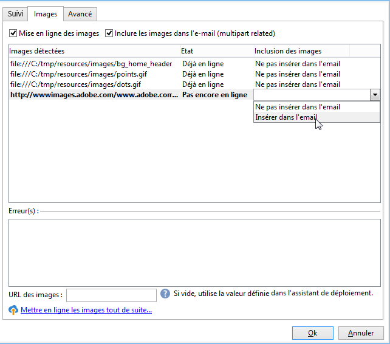

>[!NOTE]
>
>Si des images locales sont incluses dans le message, vous devez confirmer la modification du code source du message.

## Insertion d’un code-barres personnalisé{#insert-a-barcode}

Le module de génération de codes-barres permet de créer plusieurs types de codes-barres répondant aux normes les plus courantes, dans les formats 1D (unidimensionnel) et 2D (bidimensionnel).

Il est possible de générer dynamiquement un code-barres sous la forme d’un bitmap au moyen d’une valeur définie grâce à des critères client. Des code-barres personnalisés peuvent être inclus dans des campagnes par e-mail. Le destinataire pourra imprimer ce message et le présenter à la société émettrice qui le scannera (lors d’un passage en caisse par exemple).

Pour insérer un code-barres dans un email, positionnez le curseur dans le contenu, là où vous souhaitez l&#39;afficher, et cliquez sur le bouton de personnalisation. Choisissez **[!UICONTROL Inclure > Code-barres...]**.

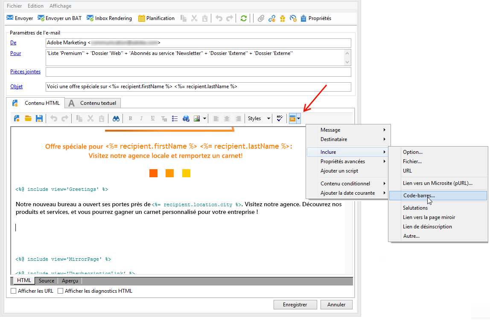

Puis paramétrez les éléments suivants en fonction de vos besoins :

1. Choisissez le type de code-barres.

   * Pour le format 1D, Adobe Campaign propose les types suivants: Codabar, Code 128, GS1-128 (anciennement EAN-128), UPC-A, UPC-E, ISBN, EAN-8, Code39, Interleaved 2 of 5, POSTNET et Royal Mail (RM4SCC).

     Exemple de code-barres 1D :

     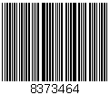

   * Les types DataMatrix et PDF417 concernent le format 2D.

     Exemple de code-barres 2D :

     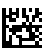

   * Pour insérer un QR Code, sélectionnez ce type et indiquez le taux de correction d&#39;erreur à appliquer. Ce taux définit la quantité d&#39;informations répétées et donc une tolérance plus ou moins importante aux dégradations.

     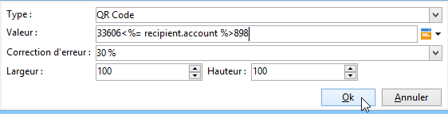

     Exemple de QR Code :

     

1. Indiquez la taille du code-barres à insérer dans l&#39;email : le paramétrage de l&#39;échelle permet d&#39;augmenter ou de réduire la taille du code-barres, de x 1 à x 10.
1. Le champ **[!UICONTROL Valeur]** permet de définir la valeur du code-barres. Une valeur peut correspondre à une offre promotionnelle et peut être une fonction d&#39;un critère, ce peut être la valeur d&#39;un champ de la base de données relative aux clients.

   L&#39;exemple ci-dessous montre un code-barres de type EAN-8 auquel a été ajouté le numéro de compte d&#39;un destinataire. Pour ajouter ce numéro de compte, cliquez sur le bouton de personnalisation situé à droite du champ **[!UICONTROL Valeur]** et sélectionnez **[!UICONTROL Destinataire > N° de compte]**.

   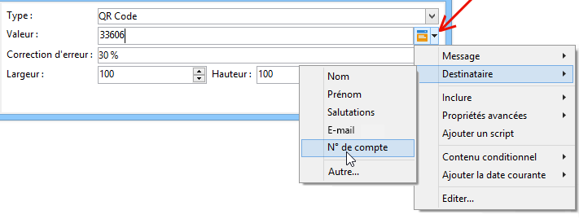

1. Le champ **[!UICONTROL Hauteur]** permet de paramétrer la hauteur du code-barres sans en modifier la largeur, soit l&#39;espacement entre chaque barre.

   Il n&#39;existe pas de contrôle restrictif de saisie en fonction du type de code-barres sélectionné. Si une valeur de code-barres est erronée, vous ne le saurez que lorsque vous passerez en vue **Aperçu** avec le code-barres marqué d&#39;une croix rouge.

   >[!NOTE]
   >
   >La valeur donnée à un code-barres dépend du type choisi. Par exemple, un type EAN-8 devra comporter exactement huit chiffres.
   >
   >Le bouton de personnalisation situé à droite du champ **[!UICONTROL Valeur]** permet d&#39;ajouter une ou plusieurs données en plus de la valeur elle-même. Ceci vient enrichir le code-barres sous réserve que la norme du code-barres l&#39;accepte.
   >
   >Par exemple, si vous utilisez un code-barres de type GS1-128 et que vous souhaitez renseigner le numéro de compte d&#39;un destinataire en plus de la valeur, cliquez sur le bouton de personnalisation et sélectionnez **[!UICONTROL Destinataire > N° de compte]**. Si le numéro de compte du destinataire sélectionné est correctement renseigné, le code-barres le prend en considération.

Une fois ces éléments paramétrés, vous pouvez finaliser votre email et l&#39;envoyer. Pour éviter toute erreur, vérifiez toujours avant une diffusion que votre contenu s&#39;affiche correctement en cliquant sur l&#39;onglet **[!UICONTROL Aperçu]**.

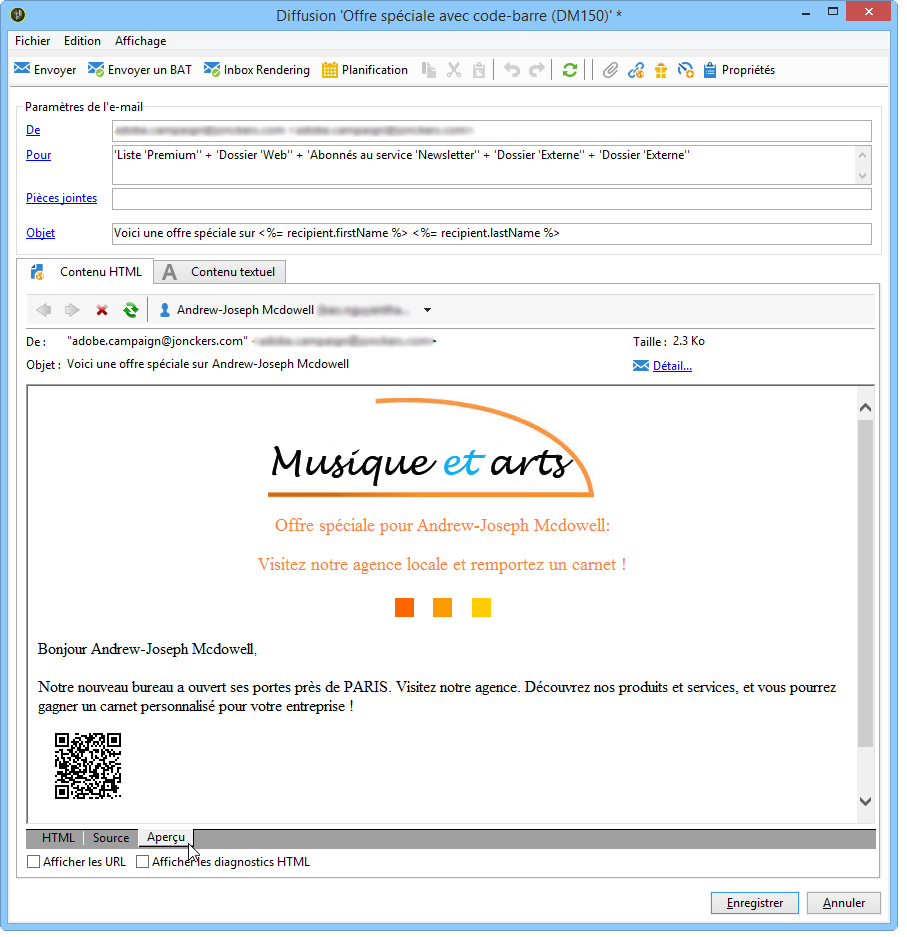

>[!NOTE]
>
>Si la valeur d&#39;un code-barres s&#39;avère incorrecte, le bitmap qui le représente s&#39;affiche barré d&#39;une croix rouge.

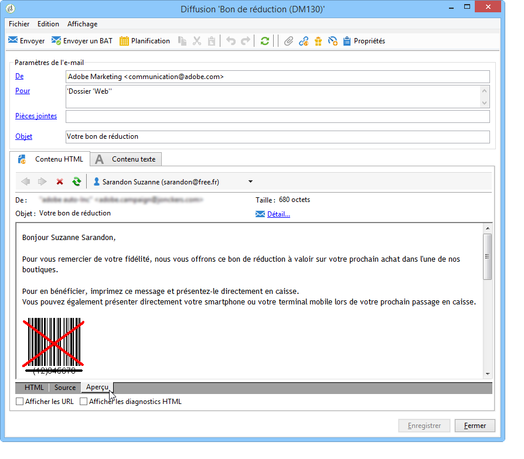
