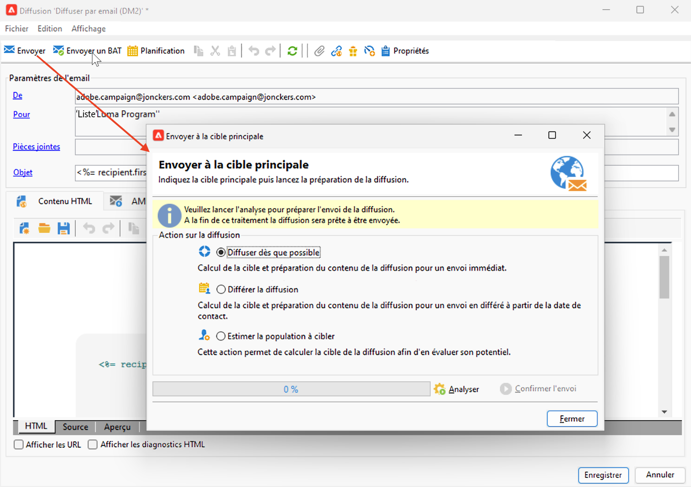
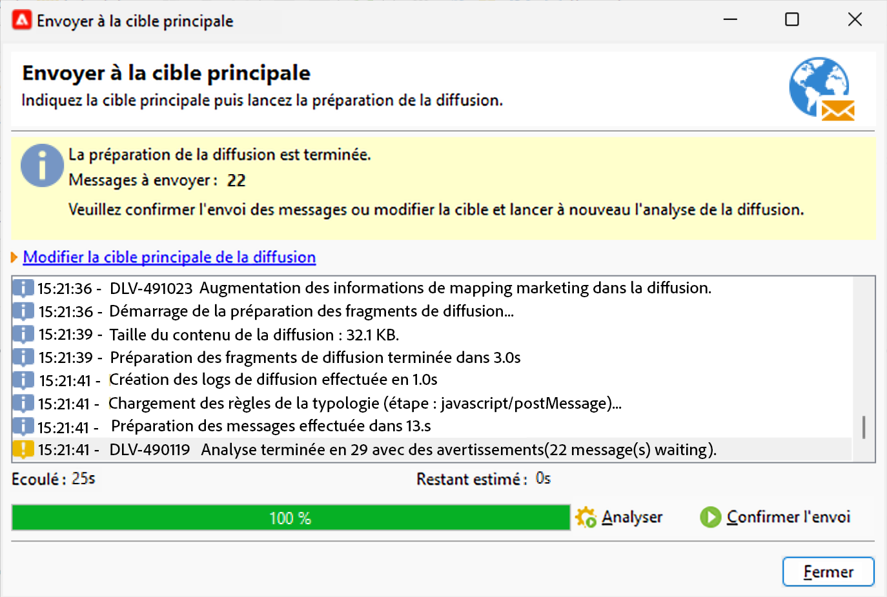
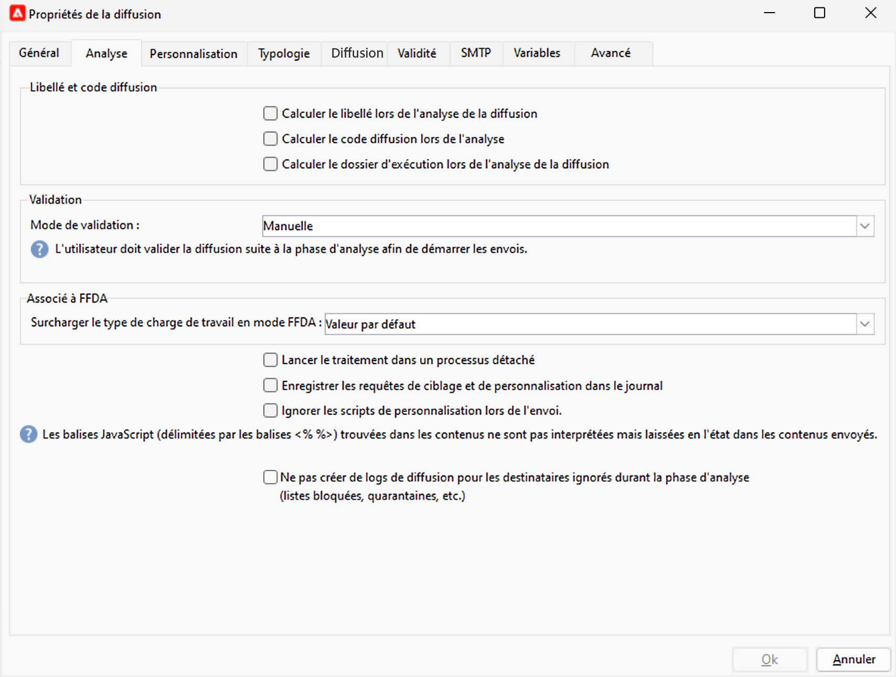

# Analyse des diffusions {#analyze-delivery}

L’analyse est l’étape de préparation de la diffusion. Lancez l’analyse une fois que l’audience cible est définie et que le contenu du message est rédigé et testé. L’analyse effectue le calcul de la population cible et prépare le contenu de la diffusion. Une fois la diffusion terminée, elle est prête à être envoyée.

## Lancer l’analyse {#start-the-analysis}

Pour préparer la diffusion, vérifiez que le contenu et la cible de la diffusion ont été définis, puis effectuez les étapes suivantes :

1. Dans la fenêtre de la diffusion, cliquez sur le bouton **[!UICONTROL Envoyer]**.
1. Sélectionnez **[!UICONTROL Diffuser dès que possible]** pour effectuer le calcul de l’audience et la préparation du contenu en vue d’un envoi immédiat. Vous pouvez également reporter la diffusion à une date ultérieure ou obtenir une estimation de la population sans préparer le contenu.

   

1. Cliquez sur **[!UICONTROL Analyser]** pour lancer l’analyse manuellement. La barre de progression indique la progression de l’analyse.

   Un jeu de règles de vérification est appliqué lors de l’analyse de la diffusion. Ces règles sont définies dans une **typologie**, accessible sous l’onglet **[!UICONTROL Typologie]** des propriétés de la diffusion. En savoir plus sur les typologies dans [cette section](../../automation/campaign-opt/campaign-typologies.md).

   Par défaut pour les e-mails, l’analyse exécute les tâches suivantes :

   * validation de l&#39;objet,
   * validation des URL et des images,
   * validation des libellés des URL,
   * validation du lien de désinscription,
   * vérification de la taille des BAT,
   * vérification de la durée de validité,
   * vérification de la planification des vagues.

1. Vous pouvez arrêter à tout moment l’analyse par le biais du bouton **[!UICONTROL Arrêter]**.

   Aucun message n’est envoyé pendant la phase de préparation. Vous pouvez donc démarrer ou annuler l’analyse sans risque.

   >[!IMPORTANT]
   >
   >Lors de l’exécution, l’analyse gèle la diffusion (ou le BAT). Toute modification apportée à la diffusion (ou au BAT) doit être suivie d’une autre analyse pour devenir applicable.

   Une fois l’analyse terminée, la section supérieure de la fenêtre indique si la préparation de la diffusion est terminée ou si des erreurs se sont produites. Toutes les étapes de validation, les avertissements et les erreurs sont répertoriés. Les icônes colorées indiquent le type de message :

   * L’icône bleue indique un message informatif.
   * L’icône jaune indique une erreur de traitement non critique.
   * L’icône rouge indique une erreur critique qui empêche l’envoi de la diffusion.

   {width="800" align="left"}

1. Cliquez sur **[!UICONTROL Fermer]** pour corriger les erreurs, le cas échéant. Après avoir effectué les modifications, redémarrez l’analyse en cliquant sur **[!UICONTROL Analyser]**.

   >[!NOTE]
   >
   >Cliquez sur le lien **[!UICONTROL Modifier la cible principale de la diffusion]** si le nombre de messages à envoyer ne correspond pas à vos attentes. Cette option permet de modifier la définition de la population cible et de relancer l’analyse.
   >

1. Vérifiez le résultat de l’analyse, puis cliquez sur **[!UICONTROL Confirmer la diffusion]** pour envoyer le message à la cible principale.

## Paramètres d’analyse {#analysis-settings}

Accédez à l’onglet **[!UICONTROL Analyse]** des propriétés de la diffusion pour définir les paramètres de préparation du message lors de la phase d’analyse.

{width="800" align="left"}

Cet onglet permet d&#39;accéder aux options suivantes :

* **[!UICONTROL Libellé et code diffusion]** : les options de cette section sont utilisées pour calculer les valeurs de ces champs pendant la phase d’analyse de diffusion. Le champ **[!UICONTROL Calculer le dossier d’exécution lors de l’analyse de la diffusion]** calcule le nom du dossier qui contiendra cette action de diffusion pendant la phase d’analyse.

* **[!UICONTROL Mode de validation]** : ce champ permet de définir une diffusion manuelle ou automatique, une fois l’analyse terminée.

  Si l’analyse génère des avertissements, (par exemple, si certains caractères sont accentués dans l’objet de la diffusion, etc.), vous pouvez choisir de continuer son exécution ou non dans les paramètres de la diffusion. Par défaut, l’utilisateur ou l’utilisatrice doit confirmer l’envoi des messages à la fin de la phase d’analyse : il s’agit d’une validation **manuelle**.

  Vous pouvez choisir un autre mode de validation dans la liste déroulante du champ correspondant.

  Les modes de validation possibles sont les suivants :

   * **[!UICONTROL Manuel]** : à la fin de la phase d’analyse, l’utilisateur doit confirmer la diffusion pour commencer l’envoi. Pour cela, cliquez sur le bouton **[!UICONTROL Démarrer]** afin de lancer la diffusion.
   * **[!UICONTROL Semi-automatique]** : les envois démarrent automatiquement si la phase d’analyse ne génère aucun message d’avertissement.
   * **[!UICONTROL Automatique]** : les envois démarrent automatiquement à la fin de la phase d’analyse, quel qu’en soit le résultat.

* **[!UICONTROL Lancer le traitement dans un processus détaché]** : cette option permet de lancer l’analyse de la diffusion dans un processus à part. Par défaut, la fonction d’analyse utilise le processus du serveur applicatif d’Adobe Campaign (nlserver web). En cochant cette option, vous êtes assuré que l’analyse sera menée à son terme, même en cas de défaillance du serveur applicatif.
* **[!UICONTROL Enregistrer les requêtes SQL générées pendant l’analyse dans le journal]** : cette option permet d&#39;ajouter les logs des requêtes SQL dans le journal de la diffusion lors de la phase d’analyse.
* **[!UICONTROL Ignorer les scripts de personnalisation lors de l’envoi]** : cette option permet de ne pas interpréter les directives JavaScript présentes dans le contenu HTML. Elles seront affichées telles quelles dans le contenu diffusé. Ces directives sont introduites par la balise `<%=`.
