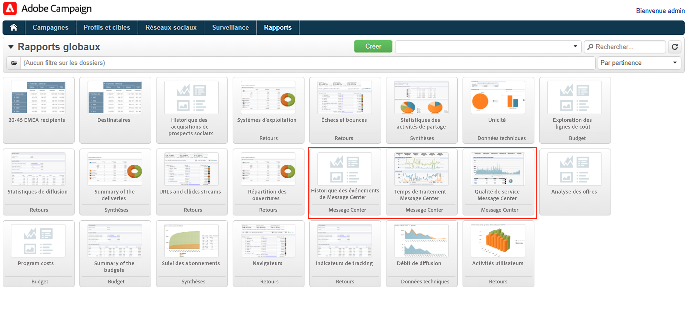
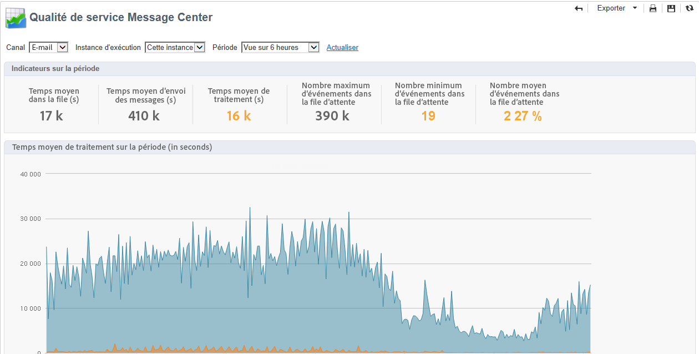
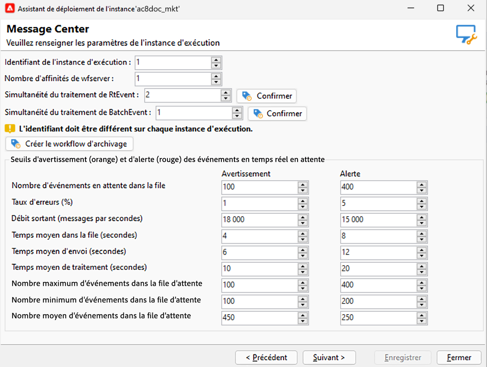

# Envoyer et surveiller les messages transactionnels {#delivery-execution}

## Envoyer des messages{#send-transactional-msg}

Une fois que l’enrichissement est terminé et qu’un modèle de diffusion a été associé à l’événement, la diffusion est envoyée depuis l’instance d’exécution.

>[!NOTE]
>
>Les messages transactionnels sont prioritaires sur toutes les autres diffusions.

Toutes les diffusions sont regroupées dans le dossier **[!UICONTROL Administration > Exploitation > Message Center > Défaut > Diffusions]**.

Par défaut, elles sont classées dans un sous-dossier correspondant au mois d&#39;envoi. Vous pouvez modifier cela dans les propriétés du modèle de message.

## Surveiller les messages {#monitor-transactional-msg}

Pour surveiller vos messages transactionnels, vérifiez les [logs de diffusion](send.md).

Les diffusions transactionnelles envoyées à partir de l&#39;instance d&#39;exécution sont synchronisées à nouveau vers l&#39;instance de pilotage par le biais d&#39;un workflow technique (**[!UICONTROL instance d&#39;exécution Message Center]**) qui s&#39;exécute toutes les heures.

>[!NOTE]
>
>Les diffusions hebdomadaires accumulent les événements en fonction de la dernière mise à jour de l&#39;événement, et non de la date de création de l&#39;événement. Par conséquent, lors de l’extraction de logs de diffusion de messagerie transactionnelle à partir de l’instance de pilotage, l’identifiant de diffusion associé à chaque identifiant de log de diffusion peut changer au fil du temps lorsque le journal est mis à jour (par exemple, lorsqu’un rebond entrant est reçu pour l’événement).

<!--
To monitor the activity and running of the execution instance(s), see [Transactional messaging reports](transactional-messaging-reports.md).-->

## Créer des rapports{#reporting-transactional-msg}

Adobe Campaign propose plusieurs rapports qui permettent de contrôler l&#39;activité et le bon fonctionnement des instances d&#39;exécution.

Ces rapports Message Center sont accessibles à partir de l&#39;onglet **[!UICONTROL Rapports]** de l&#39;**instance de pilotage**.

### Historique des événements de Message Center {#history-events}

Le rapport **[!UICONTROL Historique des événements de Message Center]** présente une vue d’ensemble de l’activité du module Message Center, c’est-à-dire le nombre d’événements traités et envoyés sous forme de messages transactionnels.

Lors de l&#39;ouverture du rapport, les informations affichées par défaut correspondent au taux de messages transactionnels envoyés avec succès. Pour visualiser davantage de niveaux, vous pouvez déplier ou replier les différents noeuds et positionner le pointeur de la souris pour mettre en surbrillance le niveau voulu.

Vous pouvez afficher les données spécifiques à chaque type d’événement, par période. Le **[!UICONTROL Événements]** colonne correspond au nombre d&#39;événements reçus par instance de pilotage. Le nombre d&#39;événements transformés en messages transactionnels personnalisés est détaillé dans la **[!UICONTROL Envoyé]** colonne.

### Temps de traitement Message Center {#processing-time}

Le rapport **[!UICONTROL Temps de traitement Message Center]** affiche les principaux indicateurs relatifs à la file d’attente en temps réel. Ce rapport est également accessible à partir de l’onglet **[!UICONTROL Surveillance]** de l’instance de pilotage.

Vous pouvez choisir d’afficher les statistiques globales ou relatives à une instance d’exécution particulière. Vous pouvez également filtrer les données par canal et sur une période spécifique.

Les indicateurs affichés dans la section **[!UICONTROL Indicateurs sur la période]** sont calculés sur la période sélectionnée :

* **[!UICONTROL Temps moyen dans la file]** : temps moyen passé dans Message Center pour les événements traités avec succès. Seul le temps de traitement est pris en compte.
* **[!UICONTROL Temps moyen d’envoi des messages (s)]** : temps moyen passé dans Message Center pour les événements traités avec succès. Seul le temps d’envoi par le MTA est pris en compte.
* **[!UICONTROL Temps moyen de traitement]** : temps moyen passé dans Message Center pour les événements traités avec succès. Ce calcul prend en compte le temps de traitement et le temps d’envoi par le MTA.
* **[!UICONTROL Nombre maximum d’événements en file d’attente]** : nombre maximum d’événements présents dans la file d’attente Message Center à un moment donné.
* **[!UICONTROL Nombre minimum d’événements en file d’attente]** : nombre minimum d’événements présents dans la file d’attente Message Center à un même moment.
* **[!UICONTROL Nombre moyen d’événements en file d’attente]** : nombre moyen d’événements présents dans la file d’attente Message Center à un moment donné.

>[!NOTE]
>
>Les seuils d’avertissement (orange) et d’alerte (rouge) des indicateurs sont paramétrables dans l’assistant de déploiement d’Adobe Campaign. Voir [Seuils de suivi](#thresholds).

### Niveau de service Message Center {#service-level}

Le rapport **[!UICONTROL Niveau de service Message Center]** affiche les statistiques de diffusion relatives aux messages transactionnels, ainsi que la répartition des erreurs. Vous pouvez cliquer sur un type d’erreur pour en afficher les détails.

Ce rapport destiné aux administrateurs et administratrices techniques est également accessible à partir de l’onglet **[!UICONTROL Surveillance]** de l’instance de pilotage.

Vous pouvez choisir d’afficher les statistiques globales ou relatives à une instance d’exécution particulière. Vous pouvez également filtrer les données par canal et sur une période spécifique.

Les indicateurs affichés dans la section **[!UICONTROL Indicateurs sur la période]** sont calculés sur la période sélectionnée :

* **[!UICONTROL Entrant (débit evt/h)]** : moyenne horaire du nombre d’événements entrés dans la file d’attente Message Center.
* **[!UICONTROL Entrant (volume evt)]** : nombre d’événements entrés dans la file d’attente Message Center.
* **[!UICONTROL Sortant (débit msg/h)]** : moyenne horaire du nombre d’événements sortant avec succès de Message Center (envoyés par une diffusion).
* **[!UICONTROL Sortant (volume msg)]** : nombre d’événements sortant avec succès de Message Center (envoyés par une diffusion).
* **[!UICONTROL Temps d’envoi moyen]** : temps moyen passé dans Message Center pour les événements traités avec succès. Ce calcul prend en compte le temps de traitement et le temps d’envoi par le MTA.
* **[!UICONTROL Taux d’erreur]** : nombre d’événements en erreur par rapport au nombre d’événements entrés dans la file d’attente Message Center. Les erreurs suivantes sont prises en compte : erreur de routage, événement ayant expiré (événement resté trop longtemps dans la file d’attente), erreur de diffusion, ignoré par la diffusion (quarantaine, etc.).

>[!NOTE]
>
>Les seuils d’avertissement (orange) et d’alerte (rouge) des indicateurs sont paramétrables dans l’assistant de déploiement d’Adobe Campaign. Voir [Seuils de suivi](#thresholds).

### Surveiller les seuils {#thresholds}

Vous pouvez configurer les seuils d’avertissement (orange) et d’alerte (rouge) des indicateurs qui s’affichent dans les rapports **Niveau de service Message Center** et **Temps de traitement Message Center**.

Pour ce faire, procédez comme suit :

1. Ouvrez l’assistant de déploiement dans l’**instance d’exécution** et accédez à la page **[!UICONTROL Message Center]**.
1. Utilisez les flèches pour modifier les seuils.

   
