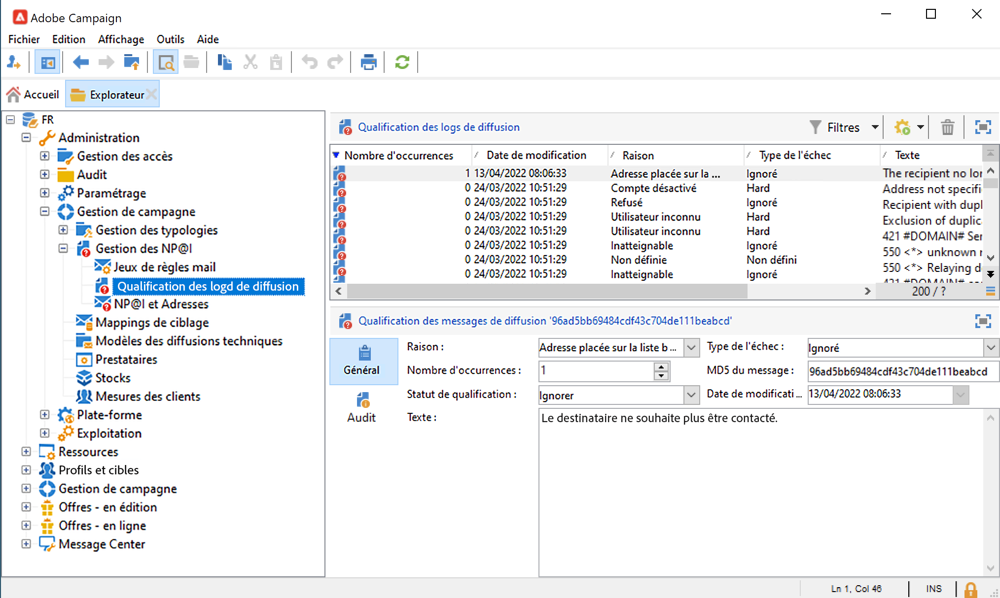
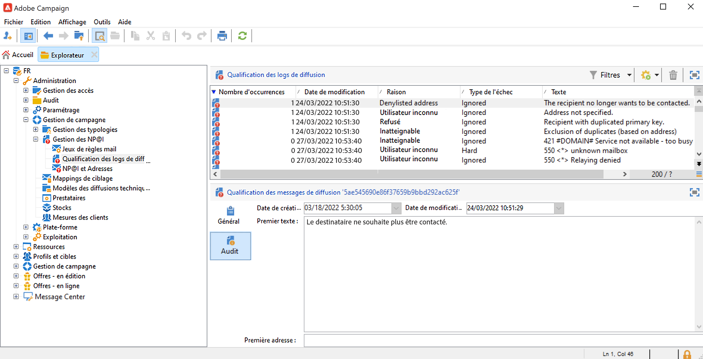
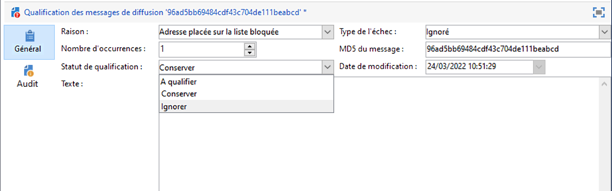

# Présentation des diffusions en échec {#delivery-failures}

Les retours sont le résultat d&#39;une tentative de diffusion ayant échoué pour laquelle le FAI renvoie des avis d&#39;échec. Le traitement de la gestion des retours est un aspect essentiel de l&#39;hygiène des listes. Une fois qu&#39;un e-mail donné a été retourné plusieurs fois de suite, ce processus le signale pour qu&#39;il soit supprimé.

Ce processus empêche les systèmes de continuer à envoyer des e-mails à des adresses e-mail non valides. Les retours sont l&#39;un des éléments clés des données que les FAI utilisent pour déterminer la réputation des adresses IP. Il est important de garder un œil sur cette mesure. « Diffusé » par rapport à « Retourné » est probablement le moyen le plus courant de mesurer la diffusion des messages marketing : plus le pourcentage de diffusion est élevé, mieux c&#39;est.

Si un message ne peut pas être envoyé à un profil, le serveur distant envoie automatiquement un message d&#39;erreur à Adobe Campaign. Cette erreur est qualifiée pour déterminer si l&#39;adresse e-mail, le numéro de téléphone ou l&#39;appareil doit être mis en quarantaine. Pour plus d&#39;informations, consultez la section [Qualification des e-mails bounce](#bounce-mail-qualification).

Une fois un message envoyé, vous pouvez visualiser l&#39;état de la diffusion pour chaque profil, le type d&#39;échec et la raison associés dans les logs de diffusion.

Lorsqu&#39;une adresse e-mail est mise en quarantaine ou qu&#39;un profil est en liste bloquée, le destinataire est exclu à l&#39;étape de préparation des diffusions. Les messages exclus sont répertoriés dans le tableau de bord de la diffusion.

## Pourquoi la diffusion du message a-t-elle échoué ? {#delivery-failure-reasons}

Deux types d&#39;erreur sont liés à un message en échec. Chaque type d&#39;échec de diffusion détermine si une adresse est envoyée en [quarantaine](quarantines.md#quarantine-reason) ou non.

* **Erreurs hard**
Les erreurs hard sont des échecs permanents générés lorsqu&#39;un FAI détermine qu&#39;une tentative de publipostage vers une adresse d&#39;abonné n&#39;est pas livrable. Dans Adobe Campaign, les erreurs hard classées comme non livrables sont ajoutées à la liste de quarantaine, ce qui signifie qu&#39;elles ne seront pas retentées. Dans certains cas, une erreur hard peut être ignorée si la cause de l&#39;échec est inconnue.

   Voici quelques exemples courants d&#39;erreurs hard : adresse inexistante, compte désactivé, syntaxe incorrecte, domaine incorrect.

* **Erreurs soft**
Les erreurs soft sont des échecs temporaires que les FAI génèrent lorsqu&#39;ils ont des difficultés à diffuser des e-mails. Les échecs de type soft feront l&#39;objet de plusieurs [reprises](#retries) (avec des variations selon l&#39;utilisation de paramètres de diffusion personnalisés ou prêts à l&#39;emploi) afin de tenter une diffusion réussie. Les adresses qui continuent à provoquer des erreurs soft ne seront pas mises en quarantaine tant que le nombre maximum de reprises n&#39;aura pas été tenté (qui varie encore selon les paramètres).

   Voici quelques causes courantes des erreurs soft : boîte pleine, serveur de messagerie de réception en panne, problèmes de réputation de l&#39;expéditeur

Le type d&#39;erreur **ignoré** est une erreur temporaire, par exemple « Absent du bureau », ou une erreur technique, par exemple si l&#39;expéditeur est de type « postmaster ».

La boucle des retours fonctionne comme les e-mails rebonds : lorsqu&#39;un utilisateur qualifie un e-mail de spam, vous pouvez configurer des règles de messagerie dans Adobe Campaign pour bloquer toutes les diffusions à cet utilisateur. Les adresses de ces utilisateurs figurent sur la liste bloquée même s&#39;ils n&#39;ont pas cliqué sur le lien de désinscription. Les adresses sont ajoutées à la table des quarantaines (**NmsAddress**) et non à la table des destinataires (**NmsRecipient**), avec le statut **[!UICONTROL Placée sur la liste bloquée]**. Apprenez-en davantage sur le mécanisme de boucle des retours dans le [guide des bonnes pratiques en matière de délivrabilité d&#39;Adobe](https://experienceleague.adobe.com/docs/deliverability-learn/deliverability-best-practice-guide/transition-process/infrastructure.html?lang=fr#feedback-loops).

## Erreurs synchrones et asynchrones {#synchronous-and-asynchronous-errors}

Une diffusion de message peut échouer immédiatement. Dans ce cas, nous qualifions cela d&#39;erreur synchrone. Si l&#39;envoi du message échoue ou si l&#39;envoi échoue plus tard, une fois qu&#39;il a été envoyé, l&#39;erreur est asynchrone.

Ces types d&#39;erreurs sont gérés comme suit :

* **Erreur synchrone** : le serveur distant contacté par le serveur de diffusion Adobe Campaign retourne immédiatement un message d&#39;erreur. L&#39;envoi de la diffusion au serveur du profil n&#39;est pas autorisé. Le MTA (Mail Transfer Agent) détermine le type de rebond et qualifie l’erreur, puis renvoie ces informations à Campaign afin de déterminer si les adresses e-mail concernées doivent être mises en quarantaine. Voir [Qualification des e-mails bounce](#bounce-mail-qualification).

* **Erreur asynchrone** : un e-mail bounce ou un SR est renvoyé plus tard par le serveur de réception. Cette erreur est qualifiée avec un libellé associé à l&#39;erreur. Les erreurs asynchrones peuvent se produire jusqu&#39;à une semaine après l&#39;envoi d&#39;une diffusion.

>[!NOTE]
>
>En tant qu’utilisateur Cloud Services géré, la configuration de la boîte des mails rebonds est effectuée par Adobe.

## Qualification des mails rebonds {#bounce-mail-qualification}

<!--NO LONGER WITH MOMENTUM - Rules used by Campaign to qualify delivery failures are listed in the **[!UICONTROL Administration > Campaign Management > Non deliverables Management > Delivery log qualification]** node. It is non-exhaustive, and is regularly updated by Adobe Campaign and can also be managed by the user.

-->

Actuellement, le traitement de la qualification des e-mails bounce dans Adobe Campaign dépend du type d’erreur :

* **Erreurs synchrones** : le MTA détermine le type et la qualification du rebond, puis renvoie ces informations à Campaign. Les qualifications de mails rebonds dans la table **[!UICONTROL Qualification des logs de diffusion]** ne sont plus utilisées pour les messages d&#39;erreur relatifs aux échecs des diffusions **synchrones**.

* **Erreurs asynchrones** : les règles utilisées par Campaign pour qualifier les diffusions en échec asynchrones sont répertoriées dans le nœud **[!UICONTROL Administration > Gestion de campagne > Gestion des échecs > Qualification des logs de diffusion]**. Les retours asynchrones restent qualifiés par le processus inMail grâce aux règles de **[!UICONTROL mail entrant.]** Pour en savoir plus à ce sujet, consultez la [documentation Adobe Campaign Classic v7](https://experienceleague.adobe.com/docs/campaign-classic/using/sending-messages/monitoring-deliveries/understanding-delivery-failures.html?lang=fr#bounce-mail-qualification){target=&quot;_blank&quot;}. 

<!--NO LONGER WITH MOMENTUM - The message returned by the remote server on the first occurrence of this error type is displayed in the **[!UICONTROL First text]** column of the **[!UICONTROL Audit]** tab.



Adobe Campaign filters this message to delete the variable content (such as IDs, dates, email addresses, phone numbers, etc.) and displays the filtered result in the **[!UICONTROL Text]** column. The variables are replaced with **`#xxx#`**, except addresses that are replaced with **`*`**.

This process allows to bring together all failures of the same type and avoid multiple entries for similar errors in the Delivery log qualification table.
  
>[!NOTE]
>
>The **[!UICONTROL Number of occurrences]** field displays the number of occurrences of the message in the list. It is limited to 100 000 occurrences. You can edit the field, if you want, for example, to reset it.

Bounce mails can have the following qualification status:

* **[!UICONTROL To qualify]** : the bounce mail could not be qualified. Qualification must be assigned to the Deliverability team to guarantee efficient platform deliverability. As long as it is not qualified, the bounce mail is not used to enrich the list of email management rules.
* **[!UICONTROL Keep]** : the bounce mail was qualified and will be used by the **Refresh for deliverability** workflow to be compared to existing email management rules and enrich the list.
* **[!UICONTROL Ignore]** : the bounce mail is ignored, meaning that this bounce will never cause the recipient's address to be quarantined. It will not be used by the **Refresh for deliverability** workflow and it will not be sent to client instances.



>[!NOTE]
>
>In case of an outage of an ISP, emails sent through Campaign will be wrongly marked as bounces. To correct this, you need to update bounce qualification.-->


## Gestion des reprises {#retries}

Si la diffusion d&#39;un message échoue suite à une erreur temporaire (**Soft** ou **Ignoré**), Campaign réalise une nouvelle tentative d&#39;envoi. Ces reprises peuvent être effectuées jusqu&#39;à la fin de la durée de diffusion.

Les reprises des soft bounces et l’intervalle qui les sépare sont déterminés par le MTA en fonction du type et de la gravité des réponses des bounces provenant du domaine de messagerie du message.

>[!NOTE]
>
>Les paramètres de reprise dans les propriétés de la diffusion ne sont pas utilisés par Campaign.

## Période de validité

Le paramètre de la période de validité dans vos diffusions Campaign est limité à **3,5 jours ou moins**. Si vous définissez une valeur supérieure à 3,5 jours pour une diffusion dans Campaign, elle ne sera pas prise en compte.

Par exemple, si la période de validité est définie sur la valeur par défaut de 5 jours dans Campaign, les messages soft bounce seront placés dans la file d’attente de reprises du MTA et ne feront l’objet d’une reprise que pendant 3,5 jours à compter du moment où ils ont atteint le MTA. Dans ce cas, la valeur définie dans Campaign ne sera pas utilisée.

Une fois qu’un message figure dans la file d’attente du MTA depuis 3,5 jours et qu’il n’a pas été diffusé, il expire et son statut est mis à jour de **[!UICONTROL Envoi]** à **[!UICONTROL Échec]** dans les logs de diffusion.

Pour plus d’informations sur la période de validité, consultez la [documentation Adobe Campaign Classic v7](https://experienceleague.adobe.com/docs/campaign-classic/using/sending-messages/key-steps-when-creating-a-delivery/steps-sending-the-delivery.html?lang=fr#defining-validity-period){target=&quot;_blank&quot;}.


## Types d&#39;erreur e-mail {#email-error-types}

Pour le canal e-mail, les raisons possibles d&#39;un échec de diffusion sont répertoriées ci-dessous.

<table> 
 <tbody> 
  <tr> 
   <td> Libellé de l'erreur </td> 
   <td> Type d'erreur </td> 
   <td> Valeur technique </td> 
   <td> Description </td> 
  </tr> 
  <tr> 
   <td> Compte désactivé </td> 
   <td> Soft/Hard </td> 
   <td> 4 </td> 
   <td> Le compte associé à l'adresse n'est plus actif. Lorsque le Fournisseur d'Accès Internet (FAI) détecte une inactivité prolongée, il peut fermer le compte de l'utilisateur, ce qui rend les diffusions vers son adresse impossibles. Si le compte est temporairement désactivé en raison d'une inactivité de 6 mois et qu'il peut toujours être activé, le statut En erreur sera affecté. Une tentative d'utilisation du compte est alors effectuée jusqu'à ce que le compteur d'erreurs atteigne 5. Si l'erreur signale que le compte est désactivé de manière permanente, il sera directement défini comme étant en quarantaine.<br /> </td> 
  </tr> 
  <tr> 
   <td> Adresse en quarantaine </td> 
   <td> Hard </td> 
   <td> 9 </td> 
   <td> L'adresse a été mise en quarantaine.<br /> </td> 
  </tr> 
  <tr> 
   <td> Adresse non renseignée </td> 
   <td> Hard </td> 
   <td> 7 </td> 
   <td> L'adresse du destinataire n'est pas renseignée.<br /> </td> 
  </tr> 
  <tr> 
   <td> Adresse de mauvaise qualité </td> 
   <td> Ignoré </td> 
   <td> 14 </td> 
   <td> L'indice de qualité de l'adresse postale est trop faible.<br /> </td> 
  </tr> 
  <tr> 
   <td> Adresse placée sur la liste bloquée </td> 
   <td> Hard </td> 
   <td> 8 </td> 
   <td> L'adresse a été ajoutée à la liste bloquée au moment de l'envoi. Cet état est utilisé pour importer des données à partir de listes externes et de systèmes externes dans la liste Quarantaine d'Adobe Campaign.<br /> </td> 
  </tr> 
  <tr> 
   <td> Adresse témoin </td> 
   <td> Ignoré </td> 
   <td> 127 </td> 
   <td> L'adresse de l'expéditeur fait partie de la population témoin.<br /> </td> 
  </tr> 
  <tr> 
   <td> Double </td> 
   <td> Ignoré </td> 
   <td> 10 </td> 
   <td> L'adresse du destinataire apparaissait déjà dans cette diffusion.<br /> </td> 
  </tr> 
  <tr> 
   <td> Erreur ignorée </td> 
   <td> Ignoré </td> 
   <td> 25 </td> 
   <td> L'adresse est sur la liste autorisée. L'erreur est donc ignorée et un email sera envoyé.<br /> </td> 
  </tr> 
  <tr> 
   <td> Exclu par un arbitrage </td> 
   <td> Ignoré </td> 
   <td> 12 </td> 
   <td> Le destinataire a été exclu par une règle de typologie de campagne de type 'arbitrage'.<br /> </td> 
  </tr> 
  <tr> 
   <td> Exclu par une règle SQL </td> 
   <td> Ignoré </td> 
   <td> 11 </td> 
   <td> Le destinataire a été exclu par une règle de typologie de campagne de type 'SQL'.<br /> </td> 
  </tr> 
  <tr> 
   <td> Domaine invalide </td> 
   <td> Soft </td> 
   <td> 2 </td> 
   <td> Le domaine de l'adresse email est erroné ou n'existe plus. Ce profil sera ciblé de nouveau jusqu'à ce que le nombre d'erreurs atteigne 5. Une fois ce chiffre atteint, l'enregistrement sera défini sur le statut Quarantaine et aucune autre reprise ne sera effectuée.<br /> </td> 
  </tr> 
  <tr> 
   <td> Boîte pleine </td> 
   <td> Soft </td> 
   <td> 5 </td> 
   <td> La boîte de messagerie de l'utilisateur est pleine et ne peut plus accepter d'autres messages. Ce profil sera ciblé de nouveau jusqu'à ce que le nombre d'erreurs atteigne 5. Une fois ce chiffre atteint, l'enregistrement sera défini sur le statut Quarantaine et aucune autre reprise ne sera effectuée.<br /> Ce type d'erreur est géré par un processus de nettoyage, l'adresse est défini sur un statut valide au bout de 30 jours.<br /> Avertissement : pour que l'adresse soit automatiquement retirée de la liste des adresses en quarantaine, le workflow technique Nettoyage de la base de données doit être démarré.<br /> </td> 
  </tr> 
  <tr> 
   <td> Non connecté </td> 
   <td> Ignoré </td> 
   <td> 6 </td> 
   <td> Le téléphone portable du destinataire est éteint ou n'est pas connecté au réseau au moment de l'envoi du message.<br /> </td> 
  </tr> 
  <tr> 
   <td> Non définie </td> 
   <td> Non définie </td> 
   <td> 0 </td> 
   <td> L'adresse est en cours de qualification parce que l'erreur n'a pas encore été incrémentée. Ce type d'erreur apparaît lorsqu'un nouveau message d'erreur est envoyé par le serveur : il peut s'agir d'une erreur isolée, mais si elle se répète, le compteur d'erreur augmente, ce qui permet d'alerter les équipes techniques. Elles peuvent ensuite analyser les messages et qualifier cette erreur, via le nœud <span class="uicontrol">Administration</span>/<span class="uicontrol">Gestion de campagne</span>/<span class="uicontrol">Gestion des NP@I</span> dans l'arborescence.<br /> </td> 
  </tr> 
  <tr> 
   <td> Non éligible aux offres </td> 
   <td> Ignoré </td> 
   <td> 16 </td> 
   <td> Le destinataire n'était pas éligible aux offres de la diffusion.<br /> </td> 
  </tr> 
  <tr> 
   <td> Refusés </td> 
   <td> Soft/Hard </td> 
   <td> 20 </td> 
   <td> L'adresse a été mise en quarantaine en raison d'un retour de sécurité signalant du spam. Selon l'erreur, l'adresse sera utilisée de nouveau jusqu'à ce que le compteur d'erreur atteigne 5 ou elle sera directement mise en quarantaine.<br /> </td> 
  </tr> 
  <tr> 
   <td> Cible limitée en taille </td> 
   <td> Ignoré </td> 
   <td> 17 </td> 
   <td> La taille de diffusion maximale a été atteinte pour le destinataire.<br /> </td> 
  </tr> 
  <tr> 
   <td> Adresse non qualifiée </td> 
   <td> Ignoré </td> 
   <td> 15 </td> 
   <td> L'adresse postale n'a pas été qualifiée.<br /> </td> 
  </tr> 
  <tr> 
   <td> Inatteignable </td> 
   <td> Soft/Hard </td> 
   <td> 3 </td> 
   <td> Une erreur s'est produite dans la chaîne de distribution du message. Il peut s'agir d'un incident sur le relais SMTP, d'un domaine temporairement inatteignable, etc. Selon l'erreur, l'adresse sera utilisée de nouveau jusqu'à ce que le compteur d'erreur atteigne 5 ou elle sera directement mise en quarantaine.<br /> </td> 
  </tr> 
  <tr> 
   <td> Utilisateur inconnu </td> 
   <td> Hard </td> 
   <td> 1 </td> 
   <td> L'adresse n'existe pas. Aucune autre diffusion ne sera envoyée pour ce profil.<br /> </td> 
  </tr> 
 </tbody> 
</table>


## Types d&#39;erreur des notifications push {#push-error-types}

Pour le canal des applications mobiles, les raisons possibles d&#39;un échec de diffusion sont répertoriées ci-dessous.

### Quarantaine iOS {#ios-quarantine}

Le protocole HTTP/V2 permet des retours et un état directs pour chaque diffusion push. Si le connecteur de protocole HTTP/V2 est utilisé, le service des retours n&#39;est plus appelé par le workflow **[!UICONTROL mobileAppOptOutMgt]**. Un jeton est considéré comme non enregistré lorsqu&#39;une application mobile est désinstallée ou réinstallée.

Si l&#39;APNS renvoie de manière synchrone un statut &quot;désinscrit&quot; pour un message, le jeton cible est immédiatement mis en quarantaine.

<table> 
 <tbody> 
  <tr> 
   <td> <strong>Scénario</strong><br /> </td> 
   <td> <strong>Status</strong><br /> </td> 
   <td> <strong>Message de l'erreur</strong><br /> </td> 
   <td> <strong>Type de l'échec</strong><br /> </td> 
   <td> <strong>Raison de l'échec</strong><br /> </td> 
   <td> <strong>Réessayer</strong><br /> </td> 
  </tr> 
  <tr> 
   <td> Appareil ciblé sous tension<br /> </td> 
   <td> Ok<br /> </td> 
   <td> </td> 
   <td> </td> 
   <td> </td> 
   <td> </td> 
  </tr> 
  <tr> 
   <td> Appareil ciblé hors tension<br /> </td> 
   <td> Ok<br /> </td> 
   <td> </td> 
   <td> </td> 
   <td> </td> 
   <td> </td> 
  </tr> 
  <tr> 
   <td> L'utilisateur désactive les notifications de l'application<br /> </td> 
   <td> Ok<br /> </td> 
   <td> </td> 
   <td> </td> 
   <td> </td> 
   <td> </td> 
  </tr> 
  <tr> 
   <td> Création du message/phase d'analyse - payload trop volumineuse<br /> </td> 
   <td> Echec<br /> </td> 
   <td> Payload trop longue<br /> </td> 
   <td> Soft<br /> </td> 
   <td> Refusés<br /> </td> 
   <td> Non<br /> </td> 
  </tr> 
  <tr> 
   <td> Création du message/phase d'analyse - problème lié à un format de contenu inattendu<br /> </td> 
   <td> Echec<br /> </td> 
   <td> Messages d'erreur différents selon l'erreur<br /> </td> 
   <td> Soft<br /> </td> 
   <td> Indéfinie<br /> </td> 
   <td> Non<br /> </td> 
  </tr> 
  <tr> 
   <td> Problème de certificat (mot de passe, endommagement, etc.) et problème de test de connexion à l'APNS<br /> </td> 
   <td> Echec<br /> </td> 
   <td> Messages d'erreur différents selon l'erreur<br /> </td> 
   <td> Soft<br /> </td> 
   <td> Refusés<br /> </td> 
   <td> Non<br /> </td> 
  </tr> 
  <tr> 
   <td> Perte de la connexion réseau pendant l'envoi<br /> </td> 
   <td> Echec<br /> </td> 
   <td> Erreur de connexion<br /> </td> 
   <td> Indéfinie<br /> </td> 
   <td> Inatteignable<br /> </td> 
   <td> Oui<br /> </td> 
  </tr> 
  <tr> 
   <td> Rejet du message par l'APNS : désinscription<br /> l'utilisateur a supprimé l'application ou le jeton a expiré<br /> </td> 
   <td> Echec<br /> </td> 
   <td> Désinscrit<br /> </td> 
   <td> Hard<br /> </td> 
   <td> Utilisateur inconnu<br /> </td> 
   <td> Non<br /> </td> 
  </tr> 
  <tr> 
   <td> Rejet du message par l'APNS : toutes les autres erreurs<br /> </td> 
   <td> Echec<br /> </td> 
   <td> La raison de l'erreur de rejet est indiquée dans le message d'erreur<br /> </td> 
   <td> Soft<br /> </td> 
   <td> Refusés<br /> </td> 
   <td> Non<br /> </td> 
  </tr> 
 </tbody> 
</table>

### Quarantaine Android {#android-quarantine}

**Pour Android V1**

Pour chaque notification, Adobe Campaign reçoit les erreurs synchrones directement du serveur FCM. Adobe Campaign les gère à la volée et génère des erreurs hard ou soft selon la gravité des erreurs. Des reprises peuvent être effectuées :

* Dépassement de la longueur de la payload, problème de connexion, problème lié à la disponibilité du service : reprise effectuée, erreur soft, raison de l&#39;échec : **[!UICONTROL Refusés]**.
* Dépassement du quota d&#39;appareils : aucune reprise, erreur soft, raison de l&#39;échec : **[!UICONTROL Refusés]**.
* Jeton non valide ou désinscrit, erreur inattendue, problème lié au compte de l&#39;expéditeur : aucune reprise, erreur hard, raison de l&#39;erreur : **[!UICONTROL Refusés]**.

Le workflow **[!UICONTROL mobileAppOptOutMgt]** s&#39;exécute toutes les 6 heures pour mettre à jour la table **AppSubscriptionRcp**. Pour les jetons déclarés comme désinscrits ou qui ne sont plus valides, le champ **Désactivé** est défini sur **True** et l&#39;inscription associée à ce jeton d&#39;appareil est automatiquement exclue des prochaines diffusions.

Pendant l&#39;analyse de la diffusion, tous les appareils qui sont exclus de la cible sont automatiquement ajoutés à la table **excludeLogAppSubRcp**.

>[!NOTE]
>
>Pour les utilisateurs qui ont recours au connecteur Baidu, voici les différents types d&#39;erreur :
>
>* Problème de connexion au début de la diffusion : type d&#39;échec **[!UICONTROL Indéfini]**, raison d&#39;échec **[!UICONTROL Inatteignable]**, reprise effectuée.
>* Perte de connexion pendant une diffusion : erreur soft, raison d&#39;échec **[!UICONTROL Refusés]**, reprise effectuée.
>* Erreur synchrone renvoyée par Baidu pendant l&#39;envoi : erreur hard, raison d&#39;échec **[!UICONTROL Refusés]**, aucune reprise.
>
>Adobe Campaign contacte le serveur Baidu toutes les 10 minutes pour récupérer le statut du message envoyé et met à jour les broadlogs. Si un message est déclaré comme envoyé, le statut du message dans les broadlogs est défini sur **[!UICONTROL Reçu]**. Si Baidu déclare une erreur, le statut est défini sur **[!UICONTROL Echoué]**.

**Pour Android V2**

Le mécanisme de mise en quarantaine d&#39;Android V2 utilise le même processus qu&#39;Android V1. Il en va de même pour la mise à jour des abonnements et des exclusions. Pour en savoir plus, consultez la section [Android V1](#android-quarantine).

<table> 
 <tbody> 
  <tr> 
   <td> <strong>Scénario</strong><br /> </td> 
   <td> <strong>État</strong><br /> </td> 
   <td> <strong>Message de l'erreur</strong><br /> </td> 
   <td> <strong>Type de l'échec</strong><br /> </td> 
   <td> <strong>Raison de l'échec</strong><br /> </td> 
   <td> <strong>Réessayer</strong><br /> </td> 
  </tr> 
  <tr> 
   <td> Création du message/phase d'analyse : mots-clés illégaux utilisés dans les champs personnalisés<br /> </td> 
   <td> Echec<br /> </td> 
   <td> Les mots-clés suivants ne peuvent être utilisés : {1}<br /> </td> 
   <td> Soft<br /> </td> 
   <td> </td> 
   <td> Non<br /> </td> 
  </tr> 
  <tr> 
   <td> Création du message/phase d'analyse : payload trop volumineuse<br /> </td> 
   <td> Echec<br /> </td> 
   <td> La notification est trop lourde : {1} bits contre {2} autorisés<br /> </td> 
   <td> Soft<br /> </td> 
   <td> Refusés<br /> </td> 
   <td> Non<br /> </td> 
  </tr> 
  <tr> 
   <td> Perte de la connexion réseau pendant l'envoi<br /> </td> 
   <td> Echec<br /> </td> 
   <td> Aucune réponse du service Firebase Cloud Messaging pour cette adresse : {1}<br /> </td> 
   <td> Soft<br /> </td> 
   <td> Inatteignable<br /> </td> 
   <td> Oui<br /> </td> 
  </tr> 
  <tr> 
   <td> Rejet du message par le FCM : le serveur FCM est temporairement hors service (par exemple avec des délais). <br /> </td> 
   <td> Echec<br /> </td> 
   <td> Le service Firebase Cloud Messaging est temporairement hors service<br /> </td> 
   <td> Soft<br /> </td> 
   <td> Inatteignable<br /> </td> 
   <td> Oui<br /> </td> 
  </tr> 
  <tr> 
   <td> Rejet du message par le FCM : erreur lors de l'authentification du compte de l'expéditeur<br /> </td> 
   <td> Echec<br /> </td> 
   <td> Echec de l'identification du compte développeur, vérifiez votre identifiant et mot de passe<br /> </td> 
   <td> Soft<br /> </td> 
   <td> Refusés<br /> </td> 
   <td> Non<br /> </td> 
  </tr> 
  <tr> 
   <td> Rejet du message par le FCM : dépassement du quota d'appareils<br /> </td> 
   <td> Echec<br /> </td> 
   <td> </td> 
   <td> Soft<br /> </td> 
   <td> Refusés<br /> </td> 
   <td> Oui<br /> </td> 
  </tr> 
  <tr> 
   <td> Rejet du message par le FCM : inscription invalide / non inscrit<br /> </td> 
   <td> Echec<br /> </td> 
   <td> </td> 
   <td> Hard<br /> </td> 
   <td> Utilisateur inconnu<br /> </td> 
   <td> Non<br /> </td> 
  </tr> 
  <tr> 
   <td> Rejet du message par le FCM : toutes les autres erreurs<br /> </td> 
   <td> Echec<br /> </td> 
   <td> Le serveur Firebase Cloud Messaging a retourné un code d'erreur non attendu : {1} </td> 
   <td> </td> 
   <td> Refusés<br /> </td> 
   <td> Non<br /> </td> 
  </tr> 
    <tr> 
   <td> Rejet du message par le FCM : argument non valide<br /> </td> 
   <td> Echec<br /> </td> 
   <td> INVALID_ARGUMENT </td> 
   <td> Ignoré</td> 
   <td> Indéfinie<br /> </td> 
   <td> Non<br /> </td> 
  </tr>
    <tr> 
   <td> Rejet du message par le FCM : erreur d'authentification tierce<br /> </td> 
   <td> Echec<br /> </td> 
   <td> THIRD_PARTY_AUTH_ERROR </td> 
   <td> Ignoré</td>
   <td> Refusés<br /> </td> 
   <td> Oui<br /> </td> 
  </tr>
    <tr> 
   <td> Rejet du message par le FCM : le Sender ID ne correspond pas<br /> </td> 
   <td> Echec<br /> </td> 
   <td> SENDER_ID_MISMATCH </td> 
   <td> Soft</td>
   <td> Utilisateur inconnu<br /> </td> 
   <td> Non<br /> </td> 
  </tr>
    <tr> 
   <td> Rejet du message par le FCM : non enregistré<br /> </td> 
   <td> Echec<br /> </td>
   <td> UNREGISTERED </td> 
   <td> Hard</td> 
   <td> Utilisateur inconnu<br /> </td> 
   <td> Non<br /> </td> 
  </tr>
    <tr> 
   <td> Rejet du message par le FCM : interne<br /> </td> 
   <td> Echec<br /> </td> 
   <td> INTERNAL </td> 
   <td> Ignoré</td> 
   <td> Refusés<br /> </td> 
   <td> Oui<br /> </td> 
  </tr>
    <tr> 
   <td> Rejet du message par le FCM : non disponible<br /> </td> 
   <td> Echec<br /> </td> 
   <td> UNAVAILABLE</td> 
   <td> Ignoré</td> 
   <td> Refusés<br /> </td> 
   <td> Oui<br /> </td> 
  </tr>
    <tr> 
   <td> Rejet du message par le FCM : code d'erreur inattendu<br /> </td> 
   <td> Echec<br /> </td> 
   <td> code d'erreur inattendu</td> 
   <td> Ignoré</td> 
   <td> Refusés<br /> </td> 
   <td> Non<br /> </td> 
  </tr>
  <tr> 
   <td> Authentification : problème de connexion<br /> </td> 
   <td> Echec<br /> </td> 
   <td> Impossible de se connecter au serveur d'authentification </td> 
   <td> Ignoré</td>
   <td> Refusés<br /> </td> 
   <td> Oui<br /> </td> 
  </tr>
    <tr> 
   <td> Authentification : client non autorisé ou périmètre demandé.<br /> </td> 
   <td> Echec<br /> </td> 
   <td> unauthorized_client </td> 
   <td> Ignoré</td>
   <td> Refusés<br /> </td> 
   <td> Non<br /> </td> 
  </tr>
    <tr> 
   <td> Authentification : le client n'est pas autorisé à récupérer des jetons d'accès à l'aide de cette méthode, ou le client n'est pas autorisé pour l'un des paramètres demandés.<br /> </td> 
   <td> Echec<br /> </td> 
   <td> unauthorized_client </td> 
   <td> Ignoré</td>
   <td> Refusés<br /> </td> 
   <td> Non<br /> </td> 
  </tr>
    <tr> 
   <td> Authentification : accès refusé<br /> </td> 
   <td> Echec<br /> </td>
   <td> access_denied</td> 
   <td> Ignoré</td>
   <td> Refusés<br /> </td> 
   <td> Non<br /> </td> 
  </tr>
    <tr> 
   <td> Authentification : adresse électronique non valide<br /> </td> 
   <td> Echec<br /> </td> 
   <td> invalid_grant </td> 
   <td> Ignoré</td> 
   <td> Refusés<br /> </td> 
   <td> Non<br /> </td> 
  </tr>
    <tr> 
   <td> Authentification : JWT non valide<br /> </td> 
   <td> Echec<br /> </td> 
   <td> invalid_grant </td> 
   <td> Ignoré</td> 
   <td> Refusés<br /> </td> 
   <td> Non<br /> </td> 
  </tr>
    <tr> 
   <td> Authentification : signature JWT non valide<br /> </td> 
   <td> Echec<br /> </td> 
   <td> invalid_grant </td> 
   <td> Ignoré</td> 
   <td> Refusés<br /> </td> 
   <td> Non<br /> </td> 
  </tr>
    <tr> 
   <td> Authentification : périmètre OAuth non valide ou audience de jeton d'ID non valide fourni<br /> </td> 
   <td> Echec<br /> </td> 
   <td> unauthorized_client</td> 
   <td> Ignoré</td> 
   <td> Refusés<br /> </td> 
   <td> Non<br /> </td> 
  </tr>
    <tr> 
   <td> Authentification : client OAuth désactivé<br /> </td> 
   <td> Echec<br /> </td> 
   <td> disabled_client</td> 
   <td> Ignoré</td> 
   <td> Refusés<br /> </td> 
   <td> Non<br /> </td> 
  </tr>
 </tbody> 
</table>

## Quarantaines des SMS {#sms-quarantines}

**Pour les connecteurs standards**

Les spécificités du canal SMS sont énumérées ci-dessous.

>[!NOTE]
>
>Le tableau **[!UICONTROL Qualification des logs de diffusion]** ne s&#39;applique pas au connecteur **SMPP Générique étendu**.

<table> 
 <tbody> 
  <tr> 
   <td> <strong>Scénario</strong><br /> </td> 
   <td> <strong>État</strong><br /> </td> 
   <td> <strong>Message de l'erreur</strong><br /> </td> 
   <td> <strong>Type de l'échec</strong><br /> </td> 
   <td> <strong>Raison de l'échec</strong><br /> </td> 
  </tr> 
  <tr> 
   <td> Transmis au prestataire<br /> </td> 
   <td> Envoyés<br /> </td> 
   <td> </td> 
   <td> </td> 
   <td> </td> 
  </tr> 
  <tr> 
   <td> Reçu sur le mobile<br /> </td> 
   <td> Reçu<br /> </td> 
   <td> </td> 
   <td> </td> 
   <td> </td> 
  </tr> 
  <tr> 
   <td> Erreur retournée par le prestataire<br /> </td> 
   <td> Echec<br /> </td> 
   <td> Erreur lors de la récupération de données (SR ou MO).<br /> </td> 
   <td> Soft<br /> </td> 
   <td> Inatteignable<br /> </td> 
  </tr> 
  <tr> 
   <td> Accusé de réception du MT non valide<br /> </td> 
   <td> Echec<br /> </td> 
   <td> Erreur '{1}' lors du traitement de la trame d'accusé réception d'une requête d'envoi.<br /> </td> 
   <td> Soft<br /> </td> 
   <td> Inatteignable<br /> </td> 
  </tr> 
  <tr> 
   <td> Erreur lors de l'envoi du MT<br /> </td> 
   <td> Echec<br /> </td> 
   <td> Erreur lors de l'envoi des messages.<br /> </td> 
   <td> Soft<br /> </td> 
   <td> Inatteignable<br /> </td> 
  </tr> 
 </tbody> 
</table>

**Pour le connecteur SMPP générique étendu**

Lors de l&#39;utilisation du protocole SMPP pour envoyer des SMS, la gestion des erreurs est traitée différemment.

Le connecteur SMPP récupère les données du message du SR (rapport d&#39;état) qui est renvoyé à l&#39;aide d&#39;expressions régulières (regex) pour filtrer son contenu. Ces données sont alors mises en correspondance avec les informations figurant dans la table **[!UICONTROL Qualification des logs de diffusion]** (disponible via le menu **[!UICONTROL Administration]** > **[!UICONTROL Gestion de campagnes]** > **[!UICONTROL Gestion des NP@I]**).

Avant qu&#39;un nouveau type d&#39;erreur ne soit qualifié, la raison de l&#39;échec est toujours défini sur **Refusé** par défaut.

>[!NOTE]
>
>Les raisons et les types des échecs sont les mêmes que pour les e-mails.
>
>Demandez à votre prestataire la liste des codes d&#39;erreur et des états pour définir les types et les raisons corrects des erreurs dans la table Qualification des logs de diffusion.

Exemple de message généré :

```
SR Generic DELIVRD 000|#MESSAGE#
```

* Tous les messages d&#39;erreur commencent par **SR** pour faire la distinction entre les codes d&#39;erreur SMS et les codes d&#39;erreur email.
* La seconde partie (**Generic**, dans cet exemple) du message d&#39;erreur fait référence au nom de l&#39;implémentation du SMSC comme défini dans le champ **[!UICONTROL Nom de l&#39;implémentation du SMSC]** du compte externe SMS.

   Comme un même code d&#39;erreur peut avoir une signification différente pour chaque prestataire, ce champ vous permet de déterminer quel prestataire a généré le code d&#39;erreur. Vous pouvez alors rechercher l&#39;erreur dans la documentation du prestataire adéquat.

* La troisième partie (**DELIVRD**, dans cet exemple) du message d&#39;erreur correspond au code d&#39;état récupéré du SR à l&#39;aide de la regex d&#39;extraction de code d&#39;état définie dans le compte externe SMS.

   Cette regex est spécifiée dans l&#39;onglet **[!UICONTROL Spécificités du SMSC]** du compte externe.
Par défaut, la regex extrait le champ **stat:** comme défini dans la section **Appendix B** de la **spécification SMPP 3.4**.

* La quatrième partie (**000**, dans cet exemple) du message d&#39;erreur correspond au code d&#39;erreur extrait du SR à l&#39;aide de la regex d&#39;extraction de code d&#39;erreur définie dans le compte externe SMS.

   Cette regex est spécifiée dans l&#39;onglet **[!UICONTROL Spécificités du SMSC]** du compte externe.

   Par défaut, la regex extrait le champ **err:** comme défini dans la section **Appendix B** de la **spécification SMPP 3.4**.

* Tous les éléments qui se trouvent après la barre verticale (|) ne sont affichés que dans la colonne **[!UICONTROL Premier texte]** de la table **[!UICONTROL Qualification des logs de diffusion]**. Le contenu est toujours remplacé par **#MESSAGE#**, une fois le message normalisé. Ce processus permet d&#39;éviter plusieurs entrées pour des erreurs similaires et est le même que pour les e-mails.

Le connecteur SMPP générique étendu applique une méthode heuristique pour rechercher des valeurs par défaut sensibles : si l&#39;état commence par **DELIV**, il est considéré comme une réussite, car il correspond aux états **DELIVRD** ou **DELIVERED** courants, utilisés par la plupart des prestataires. Tout autre état correspond à un échec hard.
