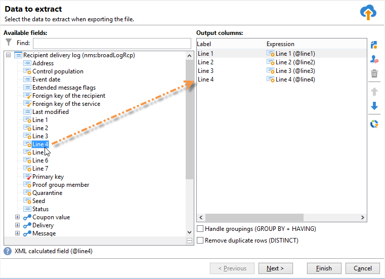

# Création de diffusions courrier

Les diffusions courrier permettent de générer un fichier d&#39;extraction contenant les données relatives à la population cible. Vous pouvez ensuite partager ce fichier avec le fournisseur qui enverra les messages aux populations cibles.

Les étapes de génération du fichier sont les suivantes :

1. [Création de la diffusion](#creating-a-direct-mail-delivery)
1. [Définir l’audience](#defining-the-direct-mail-audience)
1. [Définition du contenu du fichier](#defining-the-direct-mail-content)
1. [Validation de la diffusion](#validating)
1. [Lancement de la diffusion](#start-delivery)

## Création de la diffusion{#creating-a-direct-mail-delivery}

Créez une diffusion courrier à partir du modèle. Vous pouvez dupliquer et configurer le modèle intégré **[!UICONTROL Diffuser par courrier (papier)]**.

Pour créer une diffusion courrier, procédez comme suit :

>[!NOTE]
>
>Les concepts généraux relatifs à la création d&#39;une diffusion sont présentés dans [cette section](../start/create-message.md).

1. Créez une diffusion, par exemple depuis le tableau de bord des diffusions.
1. Sélectionnez le modèle de diffusion **Diffuser par courrier (papier)**.

   

1. Identifiez votre diffusion avec un libellé, un code et une description. Pour plus d’informations, consultez [cette section](../start/create-message.md#create-the-delivery).
1. Cliquez sur **Continuer** pour valider ces informations et afficher la fenêtre de configuration du message.

## Définition de l’audience{#defining-the-direct-mail-audience}

Les profils des destinataires doivent contenir au minimum leurs noms et adresses postales.

Les adresses postales sont des champs calculés. Par défaut, une adresse peut contenir jusqu’à six lignes : la première contient le prénom et le nom, les suivantes contiennent les coordonnées postales (rue et compléments), et la dernière contient le code postal et la ville. La définition du champ postalAddress calculé par défaut peut être consultée dans le schéma nms:recipient .

Une adresse est considérée comme complète si les champs relatifs au nom, au code postal et à la ville ne sont pas vides. Les personnes destinataires dont les adresses sont incomplètes seront exclues des diffusions par courrier.

En savoir plus dans [cette section](../start/create-message.md#target-population).

## Définition du contenu du fichier{#defining-the-direct-mail-content}

Utilisez l&#39;assistant d&#39;extraction pour définir les informations (colonnes) à exporter dans le fichier de sortie.

Le nom du fichier contenant les données extraites est défini dans le champ **[!UICONTROL Fichier]**. Le bouton situé à droite du champ permet d&#39;utiliser des champs de personnalisation pour créer le nom du fichier.

Par défaut, le fichier d&#39;extraction est créé et stocké sur le serveur. Vous pouvez l&#39;enregistrer sur votre ordinateur. Pour cela, cochez l&#39;option **[!UICONTROL Rapatrier en local le fichier généré après l&#39;export]**. Dans ce cas, vous devez indiquer le chemin d&#39;accès au répertoire de stockage local et le nom du fichier.

Pour une diffusion par courrier, le contenu de l’extraction est défini à partir du lien **[!UICONTROL Éditer le format du fichier d’extraction...]**.

Ce lien permet d’accéder à l’assistant d’extraction afin de définir les informations (colonnes) à exporter dans le fichier de sortie.

Vous pouvez insérer une URL personnalisée dans le fichier d’extraction. Pour plus d’informations à ce sujet, consultez la [documentation](https://experienceleague.adobe.com/docs/campaign-classic/using/designing-content/web-forms/publishing-a-web-form.html?lang=fr){target="_blank"} de Adobe Campaign Classic.

>[!NOTE]
>
>Cet assistant comprend les étapes de l’assistant d’exportation décrites dans la [&#x200B; documentation de Adobe Campaign Classic](https://experienceleague.adobe.com/docs/campaign-classic/using/getting-started/importing-and-exporting-data/generic-imports-exports/executing-export-jobs.html?lang=fr){target="_blank"}.

## Validation de la diffusion{#validating}

Vérifiez le résultat de l&#39;analyse et le contenu du fichier de sortie.

Dans le cadre d&#39;une opération marketing, à la date d&#39;extraction, le fichier d&#39;extraction est créé. Vous pouvez visualiser le contenu du fichier extrait, le valider ou modifier le format et relancer l&#39;extraction en cas de besoin. Une fois le fichier validé, vous pouvez envoyer l’e-mail de notification au routeur. En savoir plus sur [cette page](https://experienceleague.adobe.com/docs/campaign/automation/campaign-orchestration/marketing-campaign-approval.html?lang=fr){target="_blank"}.

Les concepts généraux de validation d&#39;une diffusion sont présentés dans [cette section](../start/create-message.md#validate-the-delivery).

Le fichier de sortie d&#39;une diffusion par courrier est généré pendant l&#39;analyse de la diffusion. Le contenu du fichier dépend des colonnes de sortie sélectionnées (voir cette [section fichier](#defining-the-direct-mail-content)).

>[!NOTE]
>
>La phase d’analyse est détaillée dans cette [section](delivery-analysis.md).

Pendant la phase d&#39;analyse, le fichier est généré mais aucune information concernant les destinataires (à savoir les logs de diffusion) n&#39;est mise à jour. Vous pouvez donc annuler cette opération sans aucun risque.

Vérifiez le résultat de l&#39;analyse et le contenu du fichier de sortie avant de cliquer sur le bouton **[!UICONTROL Confirmer l&#39;envoi]**. Un message d&#39;avertissement vous permet de confirmer la diffusion.

La confirmation de l&#39;envoi lance l&#39;extraction des données dans le fichier spécifié.

Vous pouvez ensuite fermer l’assistant et consulter les logs de diffusion depuis l’onglet **[!UICONTROL Diffusion]** accessible à partir du détail de cette diffusion.

Vous pouvez paramétrer le mode de récupération des logs de diffusion à partir de l&#39;onglet **[!UICONTROL Analyse]** des Propriétés de la diffusion.

Deux modes sont proposés :

* **[!UICONTROL Les messages sont considérés envoyés suite à la validation]** (mode par défaut) : dans ce mode de fonctionnement, tous les broadlogs sont mis à jour lorsque l&#39;opérateur confirme l&#39;envoi (leur statut passe de &#39;En attente de diffusion&#39; à &#39;Envoyé&#39;) et le statut de la diffusion devient automatiquement **[!UICONTROL Terminé]**.
* **[!UICONTROL Un fichier de résultats détermine les messages envoyés et en échec]** : ce mode permet de mettre à jour les broadlogs via un fichier externe transmis par le prestataire. Dans ce cas, il est nécessaire de mettre en place un workflow de traitement de ces informations afin de mettre à jour le statut des broadlogs.

  >[!NOTE]
  >
  >Dans ce cas, l&#39;utilisateur doit aussi modifier l&#39;état de la diffusion en **[!UICONTROL Terminé]** dès que les broadlogs sont mis à jour.

## Démarrer la diffusion{#start-delivery}

Une fois le fichier d&#39;extraction validé, cliquez sur **Confirmer l&#39;envoi**. Un message de confirmation vous permet de lancer la diffusion.

La confirmation démarre l&#39;extraction des données dans le fichier spécifié.

Dans le cadre d’une campagne marketing, lorsque toutes les validations ont été accordées, les fichiers d’extraction sont créés via un workflow spécifique qui, dans une configuration par défaut, démarre automatiquement lorsqu’une diffusion de publipostage direct est en attente d’extraction. En savoir plus dans [cette section](https://experienceleague.adobe.com/docs/campaign/automation/campaign-orchestration/marketing-campaign-deliveries.html?lang=fr){target="_blank"}.
