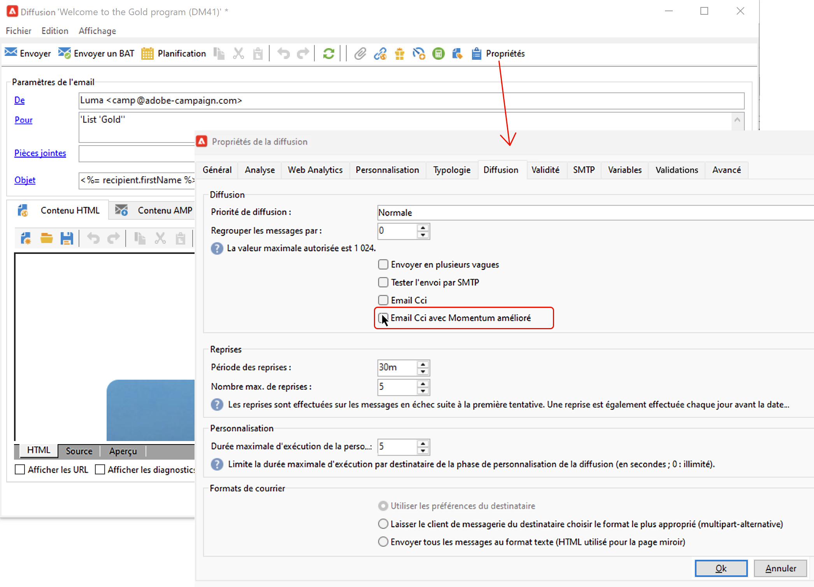

# Envoyer une copie de vos messages à une adresse en Cci {#bcc}

<!--
>[!NOTE]
>
>This capability is available starting Campaign v8.3. To check your version, refer to [this section](../start/compatibility-matrix.md#how-to-check-your-campaign-version-and-buildversion)-->

## À propos de la mise en copie Cci des e-mails {#gs-bcc}

Vous pouvez configurer Adobe Campaign pour conserver une copie des e-mails envoyés depuis votre plateforme. Cette option vous permet d’envoyer les messages de votre choix à une adresse e-mail Cci (copie carbone invisible) dédiée, à partir de laquelle ils peuvent être traités et archivés au moyen d’un système externe.
Adobe Campaign ne gère pas les fichiers archivés. Les fichiers .eml correspondant aux e-mails envoyés peuvent ensuite être transférés vers un serveur distant, tel qu’un serveur de messagerie SMTP.

La destination d’archivage est l’adresse e-mail en Cci de votre choix, qui restera invisible pour les personnes destinataires de la diffusion. Une fois l’adresse e-mail en Cci définie, vous devez activer l’option dédiée au niveau du [modèle de diffusion](create-templates.md).

>[!NOTE]
>
>En tant qu’utilisateur ou utilisatrice Managed Cloud Services, [contactez Adobe](../start/campaign-faq.md#support){target="_blank"} pour communiquer l’adresse e-mail en Cci à utiliser pour l’archivage.

>[!CAUTION]
>
>Pour des raisons de confidentialité, les e-mails en Cci doivent être traités dans un système d’archivage capable de stocker en toute sécurité les informations d’identification personnelles (PII).

## Activer la mise en copie Cci des e-mails {#enable-bcc}

Pour activer la mise en copie Cci pour un [modèle de diffusion](create-templates.md) spécifique, procédez comme suit :

1. Depuis l’explorateur Campaign, accédez au dossier des modèles de diffusion. Par défaut, les modèles de diffusion sont stockés dans le dossier **[!UICONTROL Ressources]** > **[!UICONTROL Modèles]** > **[!UICONTROL Modèles de diffusion]**.
1. Modifiez le modèle de diffusion à mettre à jour pour la mise en copie Cci.
1. Cliquez sur le bouton **[!UICONTROL Propriétés]**.
1. Dans l’onglet **[!UICONTROL Diffusion]**, cochez l’option **[!UICONTROL E-mail cci]**.

   

1. Cliquez sur **[!UICONTROL OK]** pour confirmer.

Une copie de tous les messages envoyés pour chaque diffusion basée sur ce modèle sera envoyée à l’adresse e-mail en Cci qui a été configurée pour votre plateforme.

## Mécanismes de sécurisation et recommandations {#recommendations-bcc}

Lors de l’utilisation de la fonctionnalité de mise en copie Cci des e-mails avec Adobe Campaign, ces mécanismes de sécurisation et recommandations s’appliquent :

* Vous ne pouvez utiliser qu’une seule adresse e-mail en Cci.

* Vérifiez que l’adresse en Cci dispose de suffisamment de capacité pour archiver tous les e-mails envoyés.

* L’option E-mail Cci <!--with Enhanced MTA--> assure la diffusion auprès de l’adresse e-mail en Cci avant la diffusion aux destinataires, ce qui peut entraîner l’envoi de messages en Cci même si les diffusions d’origine ont pu faire l’objet de rebonds. Pour plus d’informations sur les rebonds, voir [Présentation des diffusions en échec](delivery-failures.md).

* Les e-mails envoyés à l’adresse en Cci ne doivent pas être ouverts ni faire l’objet de clics, car ces activités sont prises en compte dans la variable **[!UICONTROL Ouvertures totales]** et **[!UICONTROL Clics]** de l’analyse d’envoi, ce qui peut entraîner des erreurs de calcul.

<!--Only successfully sent emails are taken in account, bounces are not.-->
