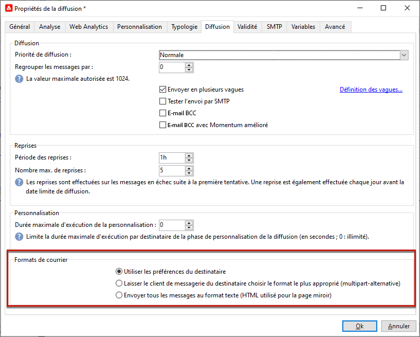
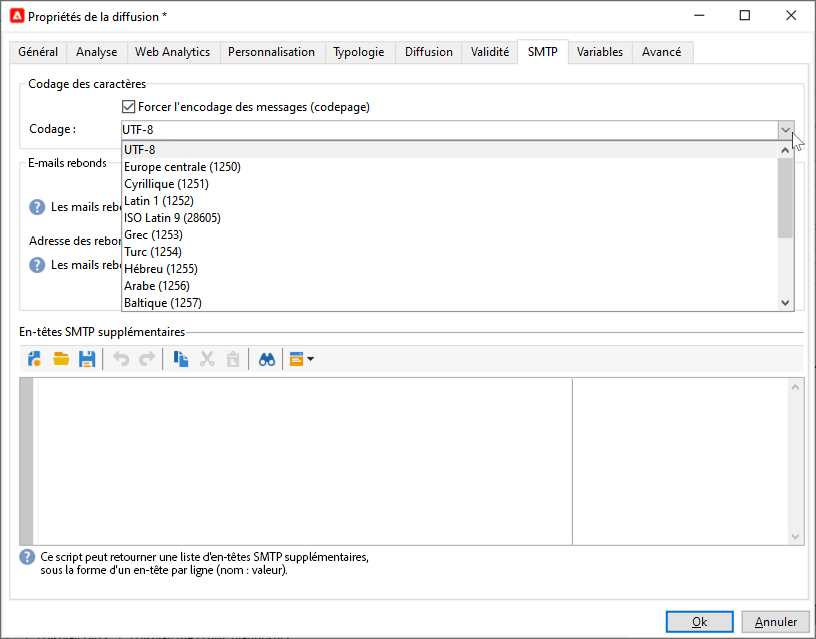
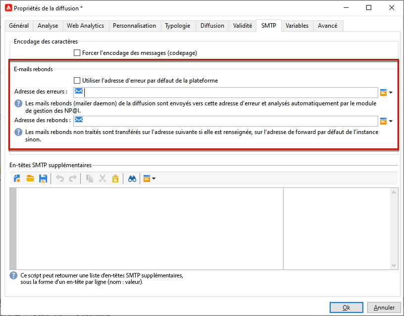
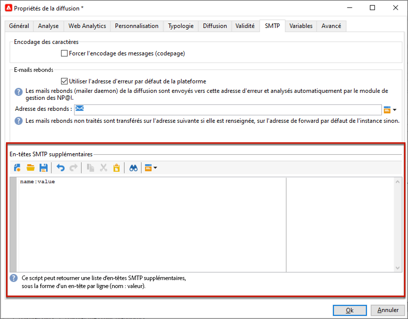

# Paramètres de l’e-mail {#email-parameters}

Cette section présente les options et paramètres disponibles dans les propriétés de diffusion spécifiques à la diffusion e-mail.

## Utiliser E-mail Cci {#email-bcc}

Vous pouvez configurer Adobe Campaign pour conserver une copie des emails envoyés depuis votre plateforme. Cette option est présentée dans la section [cette page](email-bcc.md).

## Sélectionner des formats de message {#selecting-message-formats}

Vous pouvez modifier le format des emails envoyés. Pour cela, éditez les propriétés de la diffusion et cliquez sur le bouton **[!UICONTROL Diffusion]** .

Sélectionnez le format du mail dans la section inférieure de la fenêtre :

* **[!UICONTROL Tenir compte des préférences des destinataires]** (mode par défaut)

  Le format du message est défini en fonction des informations enregistrées dans le profil du destinataire et stockées par défaut dans le champ **[!UICONTROL Format des emails]** (@emailFormat). Si un destinataire souhaite recevoir les messages dans un format particulier, ce format lui est envoyé. Si ce champ n&#39;est pas renseigné, le message sera envoyé en multipart-alternative (voir ci-dessous).

* **[!UICONTROL Laisser le mailer des destinataires choisir le format le plus adapté]**

  Le message contient les deux formats : texte et HTML. Le format affiché lors de la réception dépend de la configuration du logiciel de messagerie du destinataire (multipart-alternative).

  >[!IMPORTANT]
  >
  >Cette option inclut les deux versions du document. Par conséquent, elle affecte le débit de diffusion, car la taille du message est supérieure.

* **[!UICONTROL Envoyer tous les messages au format texte]**

  Le message est envoyé au format texte. Le format HTML ne sera pas envoyé mais uniquement utilisé pour la page miroir, lorsque le destinataire clique sur le lien dans le message.

<!--
>[!NOTE]
>
>For more on defining the email content, see [this section]().-->

## Configurer le codage des caractères {#character-encoding}

Dans l’onglet **[!UICONTROL SMTP]** des paramètres de diffusion, la section **[!UICONTROL Encodage des caractères]** vous permet de définir un encodage spécifique.

L’encodage par défaut est UTF-8. Si certains fournisseurs de messagerie de vos destinataires ne prennent pas en charge l’encodage UTF-8 standard, vous pouvez définir un encodage spécifique pour afficher correctement les caractères spéciaux sur les emails de vos destinataires.

Par exemple, vous souhaitez envoyer un email contenant des caractères japonais. Pour vous assurer que tous les caractères s’afficheront correctement à vos destinataires au Japon, vous pouvez utiliser un encodage prenant en charge les caractères japonais plutôt que le format UTF-8 standard.

Pour ce faire, sélectionnez l’option **[!UICONTROL Forcer l&#39;encodage des messages (codepage)]** dans la section **[!UICONTROL Encodage des caractères]**, puis choisissez un encodage dans la liste déroulante qui s’affiche.

## Gérer les e-mails de rebond {#managing-bounce-emails}

L’onglet **[!UICONTROL SMTP]** des propriétés de la diffusion permet de configurer la gestion des e-mails de rebond.

* **[!UICONTROL Adresse en cas d’erreur]** : par défaut, les e-mails de rebond sont réceptionnés dans la boîte d’erreur par défaut de la plateforme. Vous pouvez toutefois définir une adresse d’erreur spécifique pour une diffusion.

* **[!UICONTROL Adresse des rebonds]** : vous pouvez également définir une autre adresse vers laquelle les e-mails de rebond non traités seront transférés. Cette adresse permet d’étudier les raisons des rebonds lorsque les e-mails n’ont pas pu être qualifiés automatiquement par l’application.

Chacun de ces champs peut être personnalisé à l’aide de l’icône dédiée. En savoir plus sur les champs de personnalisation dans [cette section](personalization-fields.md).

Pour plus d’informations sur la gestion des e-mails de rebond, consultez [cette section](delivery-failures.md#bounce-mail-management).

## Ajouter des en-têtes SMTP {#adding-smtp-headers}

Vous pouvez ajouter des en-têtes SMTP à vos diffusions. Pour ce faire, utilisez la section correspondante du **[!UICONTROL SMTP]** dans la diffusion.

Le script saisi dans cette fenêtre doit référencer un en-tête par ligne, sous la forme **nom: valeur**.

Les valeurs sont automatiquement encodées, si nécessaire.

>[!IMPORTANT]
>
>L&#39;ajout d&#39;un script pour l&#39;insertion d&#39;en-têtes SMTP supplémentaires est réservé aux utilisateurs expérimentés.
>
>La syntaxe de ce script doit être strictement conforme aux exigences de ce type de contenu : aucun espace superflu, aucune ligne vide, etc.

## Générer une page miroir {#generating-mirror-page}

La page miroir est une page HTML accessible en ligne via un navigateur web et dont le contenu est identique à celui de l’email. Cela peut s&#39;avérer utile si vos destinataires rencontrent des problèmes de rendu ou des images endommagées lors de la tentative d&#39;affichage de votre email dans leur boîte de réception.

Découvrez comment insérer un lien vers la page miroir dans [cette section](mirror-page.md)
