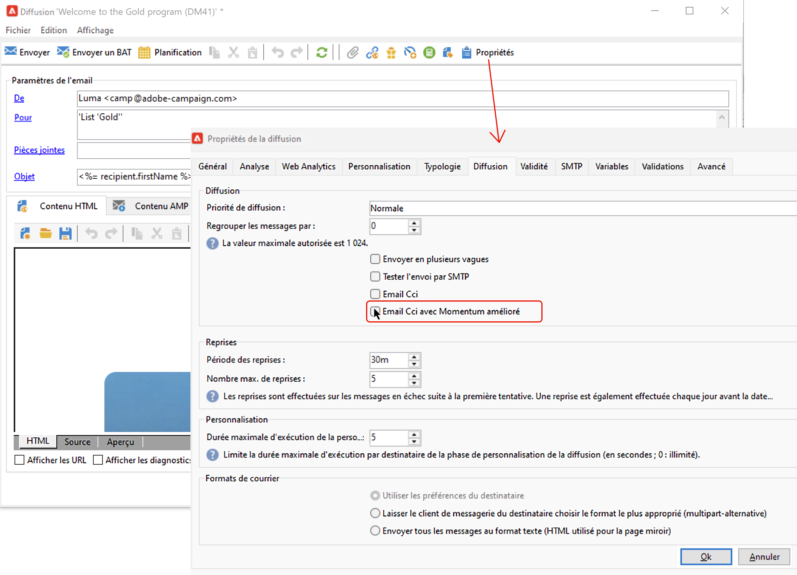

# Paramètres de l’e-mail {#email-parameters}

Cette section présente les options et paramètres disponibles dans les propriétés de diffusion spécifiques à la diffusion par email.

## Utiliser la fonctionnalité Email Cci {#email-bcc}

<!--
>[!NOTE]
>
>This capability is available starting Campaign v8.3. To check your version, refer to [this section](../start/compatibility-matrix.md#how-to-check-your-campaign-version-and-buildversion)-->

Vous pouvez paramétrer Adobe Campaign pour conserver une copie des e-mails envoyés depuis votre plateforme.

Adobe Campaign ne gère pas les fichiers archivés. Il vous permet d&#39;envoyer les messages de votre choix à une adresse email dédiée en Cci (copie carbone invisible), à partir de laquelle ils peuvent être traités et archivés à l&#39;aide d&#39;un système externe. Les fichiers .eml correspondant aux e-mails envoyés peuvent ensuite être transférés vers un serveur distant, tel qu’un serveur de messagerie SMTP.

>[!CAUTION]
>
>Pour des raisons de confidentialité, les e-mails en Cci doivent être traités dans un système d’archivage capable de stocker en toute sécurité les informations d’identification personnelles (PII).

La destination d&#39;archivage est l&#39;adresse email en Cci de votre choix, qui restera invisible pour les destinataires de la diffusion.

En tant qu’utilisateur ou utilisatrice Managed Cloud Services, [contactez Adobe](../start/campaign-faq.md#support){target="_blank"} pour communiquer l’adresse e-mail en Cci à utiliser pour l’archivage.

Une fois l&#39;adresse e-mail en Cci définie, vous devez activer l&#39;option dédiée au niveau de la diffusion.

>[!CAUTION]
>
>**[!UICONTROL Email Cci]** n’est pas activé par défaut. Vous devez l’activer manuellement au niveau de la diffusion e-mail ou du modèle de diffusion.

Pour ce faire, procédez comme suit :

1. Accédez à **[!UICONTROL Gestion de campagne]** > **[!UICONTROL Diffusions]** ou **[!UICONTROL Ressources]** > **[!UICONTROL Modèles]** > **[!UICONTROL Modèles de diffusion]**.
1. Sélectionnez la diffusion de votre choix ou dupliquez le modèle d&#39;usine **[!UICONTROL Diffusion email]**, puis sélectionnez le modèle dupliqué.
1. Cliquez sur le bouton **[!UICONTROL Propriétés]**.
1. Sélectionnez l&#39;onglet **[!UICONTROL Diffusion]**.
1. Cochez l’option **[!UICONTROL Email Cci]**.

   

1. Cliquez sur **[!UICONTROL OK]**.

Une copie de tous les messages envoyés pour chaque diffusion basée sur ce modèle sera envoyée à l’adresse e-mail en Cci qui a été configurée.

Notez les spécificités et recommandations suivantes :

* Vous ne pouvez utiliser qu’une seule adresse email en Cci.

* Vérifiez que l’adresse en Cci dispose de suffisamment de capacité pour archiver tous les e-mails envoyés.

* L’option Email Cci <!--with Enhanced MTA--> assure la diffusion auprès de l’adresse e-mail en Cci avant la diffusion aux destinataires, ce qui peut entraîner l’envoi de messages en Cci même si les diffusions d’origine ont pu l’objet de retours. Pour plus d’informations sur les retours, voir [Présentation des diffusions en échec](delivery-failures.md).

* Si les e-mails envoyés à l&#39;adresse en Cci sont ouverts et font l’objet de clics, cela sera pris en compte dans les **[!UICONTROL Ouvertures totales]** et les **[!UICONTROL Clics]** provenant de l’analyse d’envoi, ce qui pourrait entraîner des erreurs de calcul.

<!--Only successfully sent emails are taken in account, bounces are not.-->

## Sélection des formats de message {#selecting-message-formats}

Vous pouvez paramétrer le format des emails envoyés. Pour cela, éditez les propriétés de la diffusion et cliquez sur l&#39;onglet **[!UICONTROL Envoi]**.

Sélectionnez le format du mail dans la section inférieure de la fenêtre :

* **[!UICONTROL Tenir compte des préférences des destinataires]** (mode par défaut)

  Le format du message est défini en fonction des informations enregistrées dans le profil du destinataire et stockées par défaut dans le champ **[!UICONTROL Format des emails]** (@emailFormat). Si un destinataire souhaite recevoir les messages dans un format particulier, ce format lui est envoyé. Si ce champ n&#39;est pas renseigné, le message sera envoyé en multipart-alternative (voir ci-dessous).

* **[!UICONTROL Laisser le mailer des destinataires choisir le format le plus adapté]**

  Le message contient les deux formats : texte et HTML. Le format affiché lors de la réception dépend de la configuration du logiciel de messagerie du destinataire (multipart-alternative).

  >[!IMPORTANT]
  >
  >Cette option inclut les deux versions du document. Cela réduit donc le débit de diffusion, car la taille du message est supérieure.

* **[!UICONTROL Envoyer tous les messages au format texte]**

  Le message est envoyé au format texte. Le format HTML ne sera pas envoyé mais uniquement utilisé pour la page miroir, lorsque le destinataire clique sur le lien dans le message.

<!--
>[!NOTE]
>
>For more on defining the email content, see [this section]().-->

## Définir le codage des caractères {#character-encoding}

Dans l’onglet **[!UICONTROL SMTP]** des paramètres de diffusion, la section **[!UICONTROL Encodage des caractères]** vous permet de définir un encodage spécifique.

L’encodage par défaut est UTF-8. Si certains fournisseurs de messagerie de vos destinataires ne prennent pas en charge l’encodage UTF-8 standard, vous pouvez définir un encodage spécifique pour afficher correctement les caractères spéciaux sur les emails de vos destinataires.

Par exemple, vous souhaitez envoyer un email contenant des caractères japonais. Pour vous assurer que tous les caractères s’afficheront correctement à vos destinataires au Japon, vous pouvez utiliser un encodage prenant en charge les caractères japonais plutôt que le format UTF-8 standard.

Pour ce faire, sélectionnez l’option **[!UICONTROL Forcer l&#39;encodage des messages (codepage)]** dans la section **[!UICONTROL Encodage des caractères]**, puis choisissez un encodage dans la liste déroulante qui s’affiche.

## Gérer les mails rebonds {#managing-bounce-emails}

Le **[!UICONTROL SMTP]** l&#39;onglet des propriétés de la diffusion permet également de paramétrer la gestion des mails rebonds.

* **[!UICONTROL Erreurs à adresse]**: Par défaut, les mails rebonds sont reçus dans la boîte d&#39;erreur par défaut de la plateforme, mais vous pouvez définir une adresse d&#39;erreur spécifique pour une diffusion.

* **[!UICONTROL Adresse bounce]**: Vous pouvez également définir une autre adresse à laquelle les mails rebonds non traités seront transférés. Cette adresse permet d&#39;étudier les raisons des rebonds lorsque les emails n&#39;ont pas pu être qualifiés automatiquement par l&#39;application.

Chacun de ces champs peut être personnalisé à l&#39;aide de l&#39;icône dédiée. En savoir plus sur les champs de personnalisation dans [cette section](personalization-fields.md).

Pour plus d’informations sur la gestion des mails rebonds, consultez [cette section](delivery-failures.md#bounce-mail-management).

## Ajouter des en-têtes SMTP {#adding-smtp-headers}

Vous pouvez ajouter des en-têtes SMTP supplémentaires à vos diffusions. Pour cela, utilisez la section correspondante dans l&#39;onglet **[!UICONTROL SMTP]** des propriétés de la diffusion.

Le script saisi dans cette fenêtre doit référencer un en-tête par ligne, sous la forme **nom: valeur**.

Les valeurs sont automatiquement encodées, si nécessaire.

>[!IMPORTANT]
>
>L&#39;ajout d&#39;un script pour l&#39;insertion d&#39;en-têtes SMTP supplémentaires est réservé aux utilisateurs expérimentés.
>
>La syntaxe de ce script doit être strictement conforme aux exigences de ce type de contenu : aucun espace superflu, aucune ligne vide, etc.

<!--
## Generate mirror page {#generating-mirror-page}

The mirror page is an HTML page accessible online via a web browser. Its content is identical to the email. It can be useful if your recipients are experiencing rendering issues or broken images when trying to view your email in their inbox.

Learn how to insert a link to the mirror page in [this section](mirror-page.md).-->