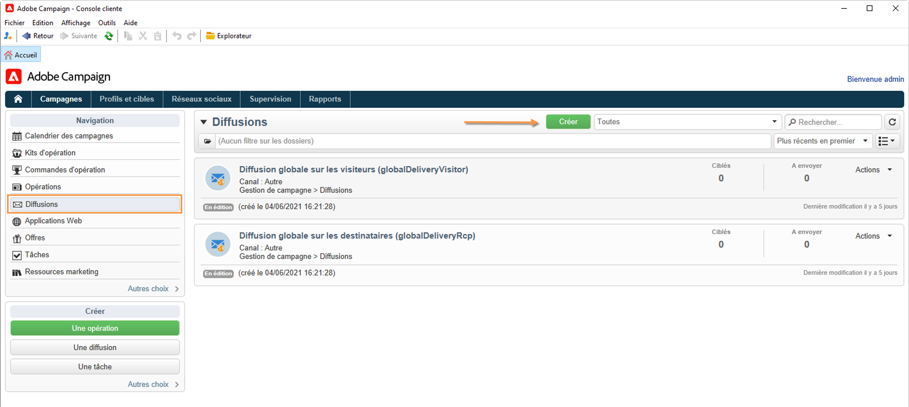

# Concevoir et envoyer des e-mails

Avec Adobe Campaign, créez des diffusions e-mail pour envoyer des e-mails personnalisés à la population cible. [En savoir plus](../send/send.md)

Découvrez les étapes clés de la création et de la configuration d’une diffusion dans [cette page](../start/create-message.md).

## Créer une diffusion e-mail

Créez des e-mails personnalisés et pertinents qui sont également conformes au reste de l&#39;expérience client.

Dans l&#39;exemple suivant, vous découvrirez les étapes de conception d&#39;une diffusion e-mail dans Adobe Campaign contenant des données personnalisées, des liens vers une URL externe et un lien vers la page miroir.

1. **Création de la diffusion**

   Pour créer une nouvelle diffusion, accédez à l&#39;onglet **Campagnes**, cliquez sur **Diffusions** et cliquez sur le bouton **Créer** au-dessus de la liste des diffusions existantes.

   

1. **Sélection du modèle**

   Sélectionnez un modèle de diffusion, puis nommez votre diffusion. Ce nom sera visible uniquement par les utilisateurs de la console Adobe Campaign et non par vos destinataires mais cet intitulé s&#39;affichera dans la liste de vos diffusions. Cliquez sur **[!UICONTROL Continuer]**.

   

1. **Importation de votre contenu**

   Cliquez sur l&#39;onglet **Source** pour coller votre contenu HTML.

   

   >[!NOTE]
   >
   >Pour éviter des problèmes de performances, les images incluses dans les e-mails ne doivent pas dépasser 100 Ko.

1. **Personnalisation de votre message**

   * Ajoutez les nom et prénom de vos destinataires

     Pour insérer les noms et prénoms des profils ciblés dans le contenu du message, placez le curseur à l&#39;endroit où vous souhaitez les insérer, cliquez sur la dernière icône de la barre d&#39;outils, puis cliquez sur **[!UICONTROL Inclure]** et sélectionnez **[!UICONTROL Salutations]**.

     

     Accédez à l’onglet Aperçu pour vérifier la personnalisation en sélectionnant un destinataire.

     

     En savoir plus sur les options de personnalisation dans [cette section](personalize.md).

   * Insertion d&#39;un lien tracké

     Pour amener les destinataires d&#39;une diffusion vers une adresse externe via une image ou un texte, sélectionnez-la et cliquez sur l&#39;icône **[!UICONTROL Ajouter un lien]** dans la barre d&#39;outils.

     Saisissez l&#39;URL pour le lien dans le champ **URL** à l&#39;aide du format suivant **https://www.monURL.com**, puis confirmez.

     

   * Ajouter une page miroir

     Pour permettre à vos destinataires d’accéder au contenu de votre diffusion dans un navigateur web, ajoutez un lien vers la [page miroir](mirror-page.md) de votre message.

     Placez le curseur à l’endroit où vous souhaitez insérer ce lien, cliquez sur la dernière icône de la barre d’outils, puis sur **[!UICONTROL Inclure]** et sélectionnez **[!UICONTROL Lien vers la page miroir]**.

     En savoir plus sur la gestion de la page miroir dans [cette section](mirror-page.md#link-to-mirror-page).

1. Vous pouvez configurer des paramètres supplémentaires pour votre e-mail, tels que l’envoi d’une copie de vos messages à une adresse BBC, la modification du format du message, la configuration d’un encodage spécifique, etc. En savoir plus dans [cette section](email-parameters.md).

1. Une fois le contenu prêt, cliquez sur **Enregistrer** : elle s’affiche désormais dans votre liste de diffusions, sous l’onglet **[!UICONTROL Campagnes > Diffusions]**.

Votre première diffusion e-mail est prête. Vous devez maintenant définir l&#39;audience, valider la diffusion et l&#39;envoyer.

Découvrez comment créer un workflow pour importer le contenu d’un e-mail dans ce [cas d’utilisation](https://experienceleague.adobe.com/docs/campaign/automation/workflows/use-cases/deliveries/load-delivery-content.html?lang=fr){target="_blank"}.

>[!MORELIKETHIS]
>
>* [Créer une diffusion](../start/create-message.md)
>* [Créer et utiliser un modèle d’e-mail](create-templates.md)
>* [Sélectionner l’audience de votre e-mail](../audiences/gs-audiences.md)
>* [Valider une diffusion et envoyer des BAT](preview-and-proof.md)
>* [Configurer et envoyer la diffusion](configure-and-send.md)
>* [Bonnes pratiques de diffusion](../start/delivery-best-practices.md)

## Tester et valider vos e-mails

Campaign propose plusieurs méthodes permettant de tester et valider vos e-mails avant de les envoyer à vos audiences. Découvrez comment prévisualiser et tester le contenu de votre e-mail dans [cette section](../send/preview-and-proof.md).

Vous pouvez ainsi :

* [Envoi de BAT](preview-and-proof.md)
* [Ajouter des adresses de contrôle](../audiences/test-profiles.md)
* [Vérifier les logs d’analyses de diffusion](delivery-analysis.md)

