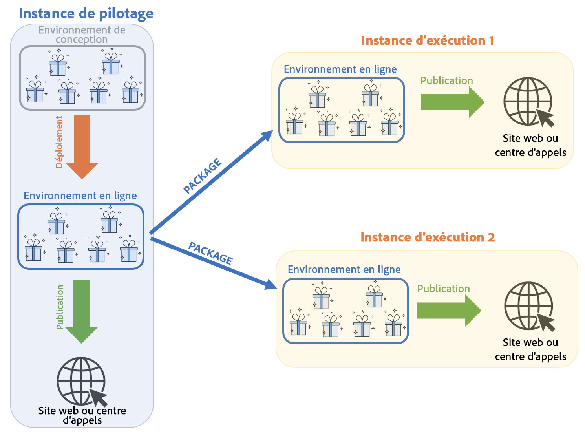
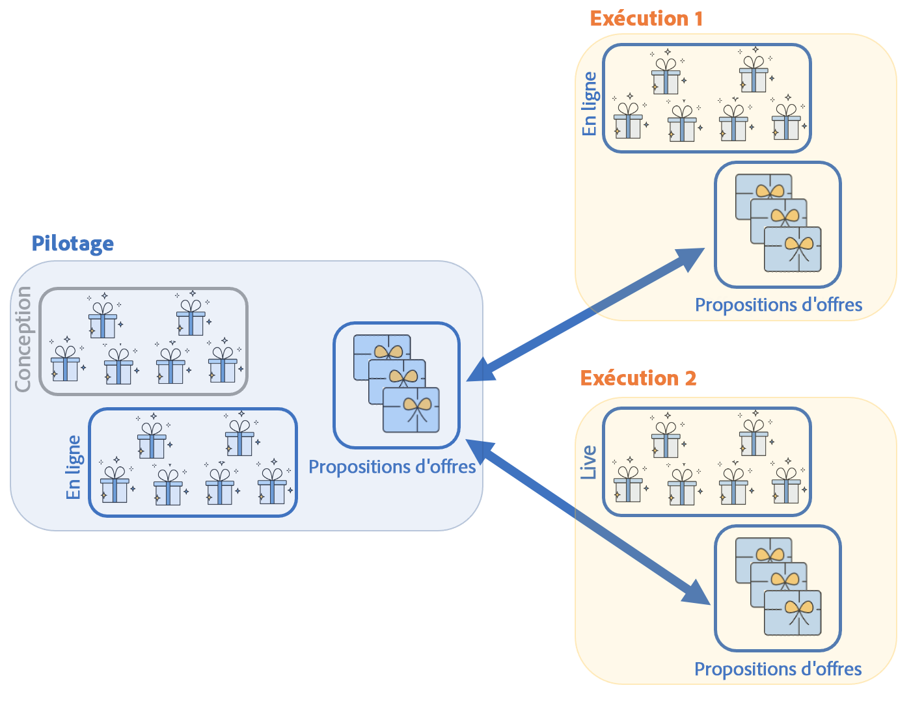
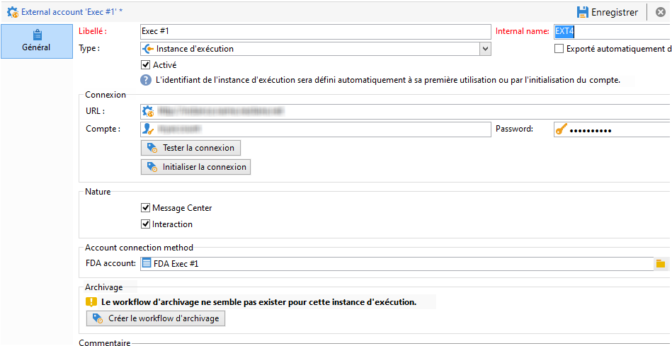
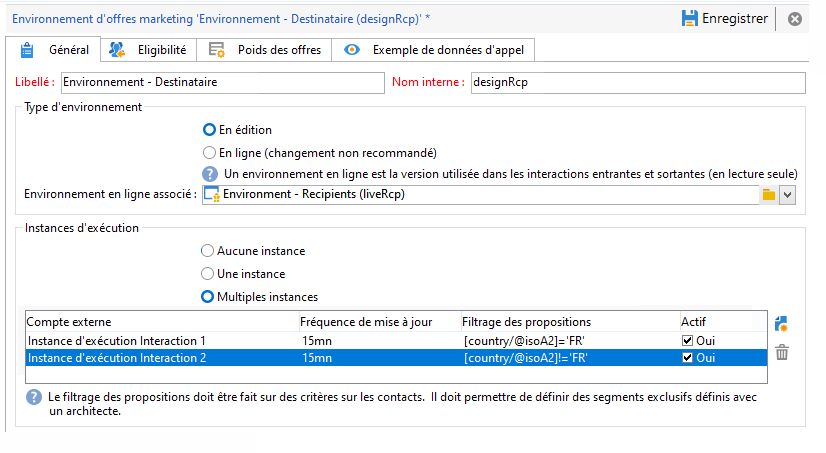
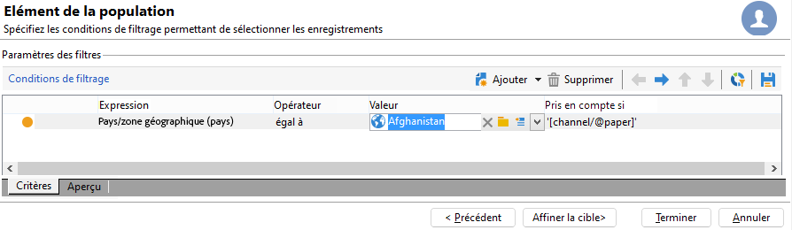

# Compréhension des environnements et de lʼarchitecture des interactions dans Campaign

## Environnements {#environments}

Pour chaque dimension de ciblage utilisée dans le cadre de la gestion des offres existe un duo dʼenvironnements :

* Un environnement **en édition**, dans lequel le chargé dʼoffre sʼoccupe de créer et catégoriser les offres, de les modifier, de lancer le processus de validation afin quʼelles puissent être utilisées. Dans cet environnement sont également définis les règles propres à chaque catégorie, les emplacements sur lesquels les offres peuvent être présentées et les filtres prédéfinis utilisables pour définir lʼéligibilité dʼune offre.

   Les catégories peuvent également être publiées manuellement dans lʼenvironnement en ligne.

   La validation des offres est détaillée [dans cette section](interaction-offer.md#approve-offers).

* Un environnement **en ligne**, dans lequel se trouvent les offres validées de lʼenvironnement en édition, ainsi que les différents emplacements, filtres, catégories et règles paramétrés dans lʼenvironnement en édition. Lors dʼun appel au moteur dʼoffres, ce dernier utilisera toujours les offres de lʼenvironnement en ligne.

Une offre nʼest déployée que sur les emplacements sélectionnés lors de la validation. Ainsi, une offre peut être en ligne mais non utilisable sur un emplacement lui aussi en ligne.

## Interactions entrantes et sortantes {#interaction-types}

Le module Interaction dʼAdobe Campaign propose deux types dʼinteractions :

* interactions **entrantes**, initiées par un contact. [En savoir plus](interaction-present-offers.md)
* interactions **sortantes**, initiées par un chargé de diffusion Campaign. [En savoir plus](interaction-send-offers.md)

Ces deux types dʼinteractions peuvent être réalisés soit en **mode unitaire** (lʼoffre est calculée pour un seul contact), soit en **mode batch** (lʼoffre est calculée pour un ensemble de contacts). Généralement, les interactions entrantes sont réalisées en mode unitaire et les interactions sortantes en mode batch. Néanmoins, des exceptions peuvent exister, par exemple pour des [messages transactionnels](transactional.md), où lʼinteraction sortante est réalisée en mode unitaire.

Dès lors quʼune offre peut ou doit être présentée (en fonction des paramétrages réalisés), le moteur dʼoffre joue le rôle dʼintermédiaire : il calcule automatiquement la meilleure offre possible pour un contact parmi celles disponibles, en combinant les données recueillies sur le contact et les différentes règles applicables définies dans lʼapplication.


## Architecture répartie

Pour être en mesure dʼassurer l’évolutivité et dʼoffrir un service 24h/24, 7j/7 sur le canal entrant, le module **Interaction** est implémenté dans une architecture distribuée. Ce type dʼarchitecture est déjà utilisé avec [Message Center](../dev/architecture.md#transac-msg-archi) et est constitué de plusieurs instances :

* une ou plusieurs instances de pilotage dédiées au canal sortant et contenant la base marketing et l&#39;environnement en édition
* une ou plusieurs instances d&#39;exécution dédiées au canal entrant



Les instances de pilotage sont dédiées au canal entrant et contiennent la version en ligne du catalogue. Chaque instance dʼexécution est indépendante et consacrée à un segment de contact (par exemple, une instance dʼexécution par pays). Les appels au moteur dʼoffre doivent être effectués directement sur lʼinstance dʼexécution (une URL spécifique par instance dʼexécution). Étant donné que la synchronisation entre les instances nʼest pas automatique, les interactions dʼun même contact doivent être envoyées à travers la même instance.

### Synchronisation {#synchronization}

La synchronisation des offres sʼeffectue par packages. Sur les instances dʼexécution, tous les objets du catalogue ont comme préfixe le nom du compte externe. Cela permet la prise en charge de plusieurs instances de pilotage (instances de développement et de production par exemple) sur une même instance dʼexécution.

>[!CAUTION]
>
>Utilisez des noms internes courts et explicites.

Les offres sont automatiquement déployées puis publiées sur les instances d&#39;exécution et l&#39;instance de pilotage.

Les offres supprimées dans l&#39;environnement en édition sont désactivées sur toutes les instances en ligne. Les propositions et les offres obsolètes sont automatiquement supprimées de toutes les instances lorsque la période de purge (définie dans l&#39;assistant de déploiement sur chaque instance) et la période glissante (définie dans les règles de typologie des propositions entrantes) sont dépassées.



Un workflow est créé pour chaque compte externe et environnement pour la synchronisation des propositions. La fréquence de synchronisation peut être ajustée pour chaque environnement et compte externe.

Vous devez prendre en compte les mécanismes de synchronisation suivants :

* Si vous utilisez la fonction de basculement (fall back) d&#39;un environnement anonyme vers un environnement identifié, ces deux environnements doivent être sur la même instance d&#39;exécution.
* La synchronisation entre plusieurs instances d&#39;exécution ne s&#39;effectue pas en temps réel. Les interactions d&#39;un même contact doivent être envoyées vers une même instance. L&#39;instance de pilotage doit être dédiée au canal sortant (pas de temps réel).
* La synchronisation de la base marketing n&#39;est pas automatique. Les données marketing utilisées dans le cadre des règles d&#39;éligibilité et des poids doivent être dupliquées sur les instances d&#39;exécution. Ce processus n&#39;est pas fourni en standard, vous devez le développer pendant la phase d&#39;intégration.
* La synchronisation des propositions s&#39;effectue exclusivement par connexion FDA.
* Si vous utilisez Interaction et Message Center sur une même instance, la synchronisation s&#39;effectuera par protocole FDA dans les deux cas.

### Configuration des packages {#packages-configuration}

Les éventuelles extensions de schémas directement liées à **Interaction** (offres, propositions, destinataires, etc.) doivent être déployées sur les instances dʼexécution.

Le package **Interaction** est installé sur toutes les instances (de pilotage et dʼexécution). Deux packages supplémentaires sont disponibles : lʼun pour les instances de pilotage et lʼautre pour chaque instance dʼexécution.

>[!NOTE]
>
>Lors de lʼinstallation du package, les champs de type **long** de la table **nms:proposition** tels que lʼidentifiant de la proposition, deviennent des champs de type **int64**. Ce type de données est détaillé dans la [documentation de Campaign Classic v7](https://experienceleague.adobe.com/docs/campaign-classic/using/configuring-campaign-classic/schema-reference/schema-structure.html?lang=fr#mapping-the-types-of-adobe-campaign-dbms-data){target=&quot;_blank&quot;}.

La durée de conservation des données est configurée sur chaque instance (via la fenêtre **[!UICONTROL Purge des données]** dans lʼassistant de déploiement). Sur les instances dʼexécution, cette période doit correspondre à la profondeur historique nécessaire au calcul des règles de typologie (période glissante) et dʼéligibilité.

Sur les instances de pilotage :

1. Créez un compte externe par instance dʼexécution :

   

   * Renseignez le libellé et un nom interne court et explicite.
   * Sélectionnez le type **[!UICONTROL Instance d&#39;exécution]**.
   * Cochez l&#39;option **[!UICONTROL Activé]**.
   * Renseignez les paramètres de connexion à l&#39;instance d&#39;exécution.
   * Chaque instance d&#39;exécution doit être associée à un identifiant. Cet identifiant est attribué lorsque vous cliquez sur le bouton **[!UICONTROL Initialiser la connexion]**.
   * Cochez le type d&#39;application utilisée : **[!UICONTROL Message Center]**, **[!UICONTROL Interaction]**, ou les deux.
   * Renseignez le compte FDA utilisé. Un opérateur doit être créé sur les instances d&#39;exécution et doit posséder les droits de lecture et de modification suivants au niveau de la base de données de l&#39;instance en question :

      ```
      grant SELECT ON nmspropositionrcp, nmsoffer, nmsofferspace, xtkoption, xtkfolder TO user;
      grant DELETE, INSERT, UPDATE ON nmspropositionrcp TO user;
      ```
   >[!NOTE]
   >
   >L&#39;adresse IP de l&#39;instance de pilotage doit être autorisée sur les instances d&#39;exécution.

1. Configurez l&#39;environnement :

   

   * Ajoutez la liste des instances d&#39;exécutions.
   * Définissez pour chacune la fréquence de synchronisation et les critères de filtrage (par exemple par pays).

      >[!NOTE]
      >
      >En cas d&#39;erreur, vous pouvez consulter les workflows de synchronisation et de notification des offres, disponibles dans les workflows techniques de l&#39;application.

Si, pour des raisons d&#39;optimisation, seulement une partie de la base marketing est dupliquée sur les instances d&#39;exécution, il est possible de définir un schéma restreint associé à l&#39;environnement afin de permettre aux utilisateurs de n&#39;utiliser que les données disponibles sur les instances d&#39;exécution. Il est possible de créer une offre utilisant des données non disponibles sur les instances d&#39;exécution. Pour cela, vous devez désactiver la règle sur les autres canaux en limitant cette règle au canal sortant (champ **[!UICONTROL Pris en compte si]**).



### Options de maintenance {#maintenance-options}

Voici la liste des options de maintenance disponibles sur l&#39;instance de pilotage :

>[!CAUTION]
>
>Ces options ne doivent être utilisées que dans des cas de maintenance spécifiques.

* **`NmsInteraction_LastOfferEnvSynch_<offerEnvId>_<executionInstanceId>`** : date de dernière synchronisation d’un environnement sur une instance donnée.
* **`NmsInteraction_LastPropositionSynch_<propositionSchema>_<executionInstanceIdSource>_<executionInstanceIdTarget>`** : date de dernière synchronisation des propositions d’un schéma donné d’une instance vers une autre.
* **`NmsInteraction_MapWorkflowId`** : option contenant la liste de tous les workflows de synchronisation générés.

L&#39;option suivante est disponible sur les instances d&#39;exécution :

**NmsExecutionInstanceId** : option contenant l&#39;identifiant de l&#39;instance.

### Installation des packages {#packages-installation}

Si votre instance ne possédait pas le package **Interaction** auparavant, aucune migration nʼest nécessaire. Par défaut, la table des propositions sera en 64 bits une fois les packages installés.

>[!CAUTION]
>
>Selon le volume de propositions existantes dans votre instance, cette opération peut être très longue.

* Si votre instance ne comporte pas ou peu de propositions, aucune modification manuelle de la table des propositions n&#39;est nécessaire. La modification sera faite au moment de l&#39;installation des packages.
* Si votre instance comporte un grand nombre de propositions, il est préférable de changer la structure de la table des propositions avant l&#39;installation des packages de pilotage et d&#39;exécution. Nous vous conseillons d&#39;exécuter les requêtes à une période creuse.

>[!NOTE]
>
>Si vous avez effectué des paramétrages spécifiques dans la table des propositions, adaptez les requêtes en conséquence.


Deux méthodes sont disponibles :

**Table de travail** (recommandée)

```
CREATE TABLE NmsPropositionRcp_tmp AS SELECT * FROM nmspropositionrcp WHERE 0=1;
ALTER TABLE nmspropositionrcp_tmp
  ALTER COLUMN ipropositionid TYPE bigint,
  ALTER COLUMN iinteractionid TYPE bigint;
INSERT INTO nmspropositionrcp_tmp SELECT * FROM nmspropositionrcp;
DROP TABLE nmspropositionrcp;
CREATE INDEX proposition_id ON NmsPropositionRcp (ipropositionid);
CREATE INDEX nmspropositionrcp_deliveryid ON NmsPropositionRcp (ideliveryid);
CREATE INDEX nmspropositionrcp_lastmodified ON NmsPropositionRcp (tslastmodified);
CREATE INDEX nmspropositionrcp_offerid ON NmsPropositionRcp (iofferid);
CREATE INDEX nmspropositionrcp_offerspaceid ON NmsPropositionRcp (iofferspaceid);
CREATE INDEX nmspropositionrcp_recipientidid ON NmsPropositionRcp (irecipientid);
ALTER TABLE nmspropositionrcp_tmp RENAME TO nmspropositionrcp;
```

**Alter Table**

```
ALTER TABLE nmspropositionrcp
  ALTER COLUMN ipropositionid TYPE bigint,
  ALTER COLUMN iinteractionid TYPE bigint;
```
