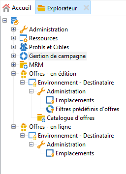
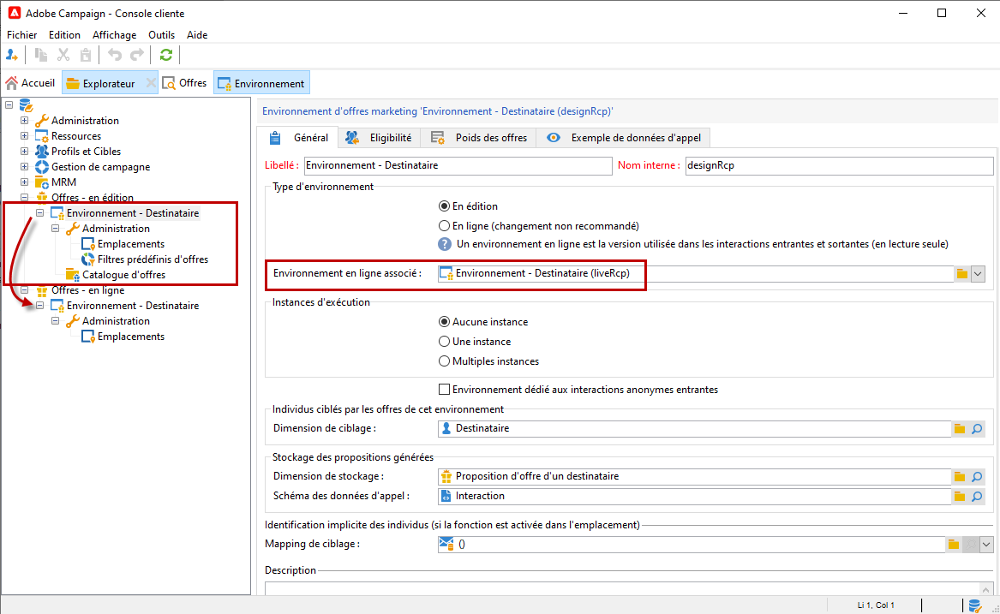
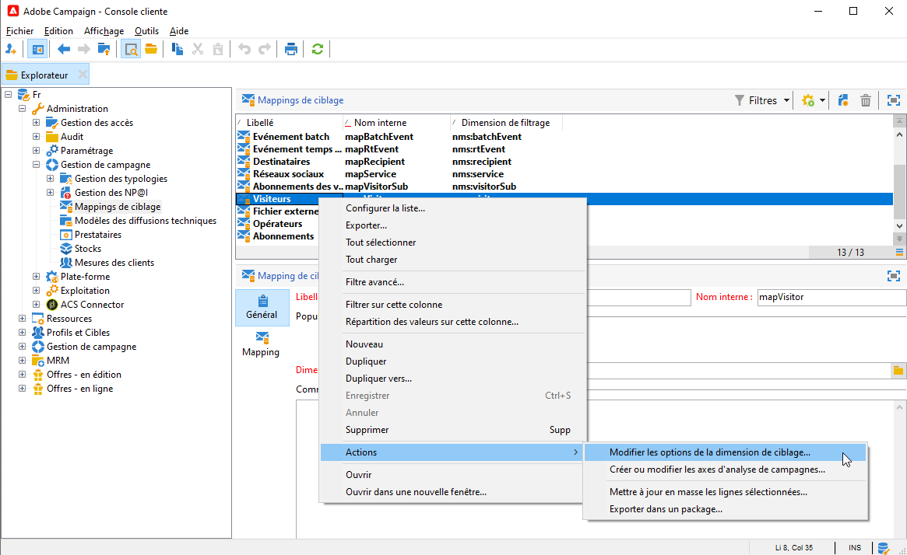
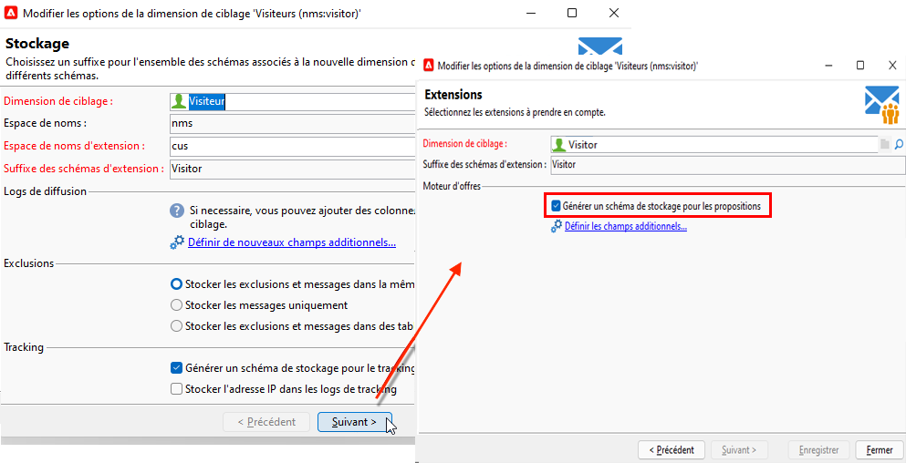

# Environnements de création et de production{#live-design-environments}

Interaction fonctionne avec deux types d&#39;environnements d&#39;offres :

* des environnements d&#39;offres **[!UICONTROL En édition]**, dans lesquels les offres sont en cours de création et peuvent être modifiées. Ces offres ne sont pas encore passées par un cycle de validation et ne sont donc pas diffusées aux contacts.
* des environnements d&#39;offres **[!UICONTROL En ligne]** qui contiennent les offres validées, telles qu&#39;elles sont présentées aux contacts. Les offres contenues dans ces environnements sont en lecture seule.

Chaque environnement **[!UICONTROL En édition]** est associé à un environnement **[!UICONTROL En ligne]**. Lorsqu&#39;une offre est finalisée, son contenu et ses règles d&#39;éligibilité passent par un cycle de validation. Lorsque le cycle de validation est complet, l&#39;offre concernée est automatiquement déployée dans l&#39;environnement **[!UICONTROL En ligne]**. Dès lors, elle est disponible pour être diffusée.

Par défaut, Campaign est fourni avec un environnement **[!UICONTROL Design]** et un environnement **[!UICONTROL Live]** associé. Les deux environnements sont préconfigurés pour cible de la table de destinataire intégrée .

>[!NOTE]
>
>Pour cible à la table destinataire, vous devez utiliser l&#39;assistant de mapping de ciblage pour créer les environnements. [En savoir plus](#creating-an-offer-environment).

Les gestionnaires de diffusions peuvent uniquement vue l&#39;environnement **[!UICONTROL Live]** et exploiter les offres pour les fournir. Les gestionnaires d&#39;Offres peuvent vue et utiliser l&#39;environnement **[!UICONTROL Conception]** et vue de l&#39;environnement **[!UICONTROL En direct]**. [En savoir plus](interaction-operators.md).

## Création d’un environnement d’offre {#creating-an-offer-environment}

Par défaut, Campaign est fourni avec un environnement intégré pour cible de la table destinataire (offres identifiées). Pour cible à un autre tableau, procédez comme suit :

1. Accédez à **[!UICONTROL Administration]** > **[!UICONTROL Gestion de campagne]** > **[!UICONTROL mappages de Diffusions]**, cliquez avec le bouton droit sur le mappage de diffusions à utiliser et sélectionnez **[!UICONTROL Actions]** > **[!UICONTROL Modifier les options de la dimension de ciblage]**.

   

1. Cliquez sur **[!UICONTROL Suivant]**, sélectionnez l&#39;option **[!UICONTROL Générer un schéma d&#39;enregistrement pour les propositions]** et cliquez sur **[!UICONTROL Enregistrer]**.

   

   >[!NOTE]
   >
   >Si l’option est déjà cochée, décochez-la, puis cochez-la à nouveau.

1. Adobe Campaign crée deux environnements - **[!UICONTROL Conception]** et **[!UICONTROL Live]** - avec les informations de ciblage du mapping de ciblage précédemment activé. L’environnement est préconfiguré avec les informations de ciblage.
