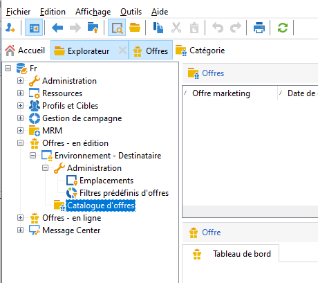
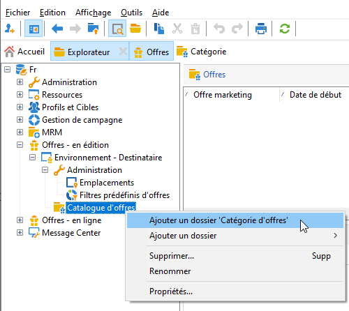
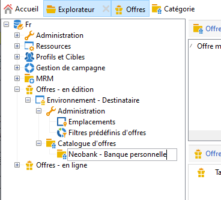
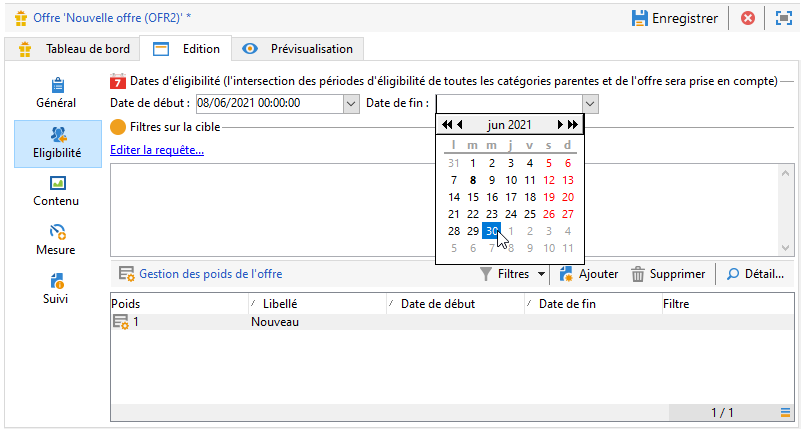
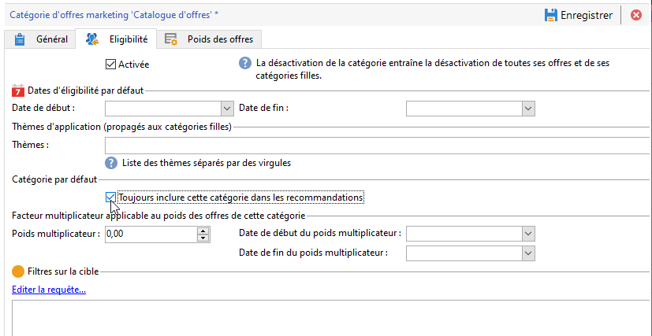

# Création d&#39;un catalogue d&#39;offres

En tant que **Chargé d&#39;offres**, vous êtes responsable de la création du catalogue d&#39;offres.

Un catalogue d&#39;offres est associé à un seul environnement préexistant. Les offres de ce catalogue ne peuvent être associées qu&#39;aux espaces spécifiés dans ce même environnement.

Avant de créer vos offres, vous devez d&#39;abord définir un [environnement](interaction-env.md) qui contient toutes les caractéristiques (éligibilité, contraintes sur la cible, règles de présentation) d&#39;un ensemble d&#39;offres, classées par catégories, ainsi que la liste de leurs emplacements.

## Création de catégories d&#39;offres{#creating-offer-categories}

Les offres sont organisées en catégories/sous-catégories. Les catégories sont créées dans l&#39;environnement **[!UICONTROL En édition]** et déployées automatiquement dans l&#39;environnement **[!UICONTROL En ligne]** (c&#39;est-à-dire mises à disposition) lorsque les offres qu&#39;elles contiennent sont validées. L&#39;environnement **[!UICONTROL En édition]** contient une catégorie par défaut pour recevoir toutes les offres. Il est possible de créer des sous-catégories pour ajouter une hiérarchie aux offres du catalogue.

Pour chaque catégorie, vous pouvez définir des **dates d&#39;éligibilité**, c&#39;est-à-dire la période pendant laquelle les offres contenues dans la catégorie peuvent être présentées à leur cible. Vous pouvez également ajuster le poids d&#39;une catégorie pour donner la priorité à la présentation de l&#39;offre.

Pour créer une nouvelle catégorie, procédez comme suit :

1. Accédez au dossier **[!UICONTROL Catalogue d&#39;offres]**.

   

1. Cliquez avec le bouton droit de la souris et sélectionner **[!UICONTROL Ajouter un dossier &quot;Catégorie d&#39;offres&quot;]** dans le menu contextuel.

   

1. Renommez la catégorie. Vous pourrez modifier le libellé ultérieurement via l&#39;onglet **[!UICONTROL Général]** de la catégorie.

   

   >[!NOTE]
   >
   >Répétez ces étapes pour créer autant de catégories que nécessaire.

   Par la suite, il vous est possible, selon vos besoins :

   * D&#39;attribuer des dates d&#39;éligibilité, depuis l&#39;onglet **[!UICONTROL Éligibilité]**.

      

   * **[!UICONTROL Éditez la requête]** pour appliquer des filtres à la cible de l&#39;offre.

   * Un récapitulatif des règles d&#39;éligibilité. Pour les visualiser, cliquez sur le lien **[!UICONTROL Planning et règles d&#39;éligibilité de l&#39;offre]**.

## Ajouter une catégorie de secours

Afin de s&#39;assurer que tous les destinataires reçoivent une proposition d&#39;offre, il est possible d&#39;ajouter systématiquement une ou plusieurs catégories d&#39;offres dans les recommandations.

Ces offres de secours doivent avoir un poids faible (mais non nul), de sorte qu&#39;elles ne soient prises en compte que si aucune offre de poids supérieur n&#39;est éligible.

En outre, aucune règle de présentation ne doit être appliquée à ces offres pour assurer qu&#39;elles sont toujours incluses dans les recommandations. Cela signifie que, lors d&#39;une proposition, si aucune offre de poids supérieur n&#39;est disponible, le destinataire recevra au moins une offre de cette catégorie.

Pour inclure une catégorie de secours dans les recommandations, procédez comme suit :

1. Accédez à votre catalogue d&#39;offres.
1. Cliquez sur l&#39;onglet **[!UICONTROL Éligibilité]** et sélectionnez l&#39;option **[!UICONTROL Toujours inclure cette catégorie dans les recommandations]**.
1. Cliquez sur **[!UICONTROL Enregistrer]**.

   

