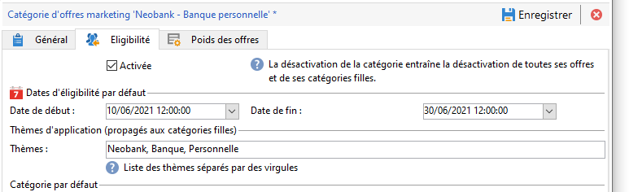
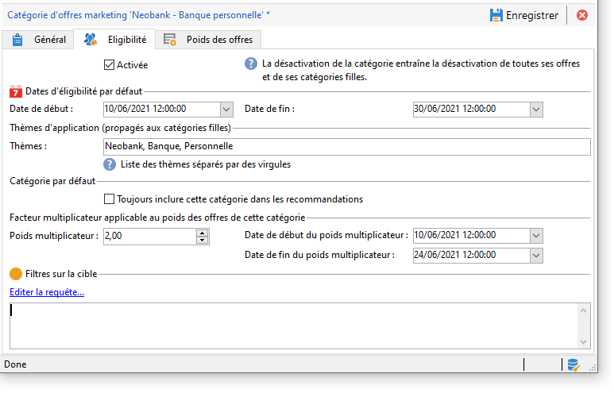

# Création d’un catalogue d&#39;offres

En tant que **gestionnaire d&#39;Offres**, vous êtes responsable de la création du catalogue d&#39;offres.

Un catalogue d&#39;offres est associé à un seul environnement préexistant. Les Offres de ce catalogue ne peuvent être associées qu&#39;aux espaces spécifiés dans ce même environnement.

Avant de créer vos offres, vous devez d&#39;abord spécifier un [environnement](interaction-env.md) qui contient toutes les caractéristiques (éligibilité, contraintes sur la cible, règles de présentation) d&#39;un ensemble d&#39;offres, triées en catégories, ainsi que la liste de leurs espaces.

## Création de catégories d’offres{#creating-offer-categories}

Les Offres sont organisées en catégories/sous-catégories. Les catégories sont créées dans l&#39;environnement **[!UICONTROL Conception]** et déployées automatiquement dans l&#39;environnement **[!UICONTROL Live]** (c&#39;est-à-dire mises à disposition) lorsque les offres qu&#39;elles contiennent sont approuvées. L&#39;environnement **[!UICONTROL Conception]** contient une catégorie par défaut pour recevoir toutes les offres. Il est possible de créer des sous-catégories pour ajouter une hiérarchie aux offres de catalogue.

Pour chaque catégorie, vous pouvez définir **des dates d&#39;éligibilité**, c&#39;est-à-dire la période pendant laquelle les offres contenues dans la catégorie peuvent être présentées à leur cible. Vous pouvez également ajuster le poids d’une catégorie pour classer par priorité la présentation de l’offre.

Pour créer une catégorie, procédez comme suit :

1. Navigateur vers le dossier **[!UICONTROL Catalogue d&#39;offres]**.

   

1. Cliquez avec le bouton droit de la souris et sélectionner **[!UICONTROL Ajouter un dossier &quot;Catégorie d&#39;offres&quot;]** dans le menu contextuel.

   

1. Renommez la catégorie. Vous pourrez modifier le libellé ultérieurement via l&#39;onglet **[!UICONTROL Général]** de la catégorie.

   

   >[!NOTE]
   >
   >Répétez ces étapes pour créer autant de catégories que nécessaire.

   Par la suite, il vous est possible, selon vos besoins :

   * D&#39;attribuer des dates d&#39;éligibilité, depuis l&#39;onglet **[!UICONTROL Éligibilité]**.

      

   * D&#39;entrer des mots-clés qui pourront être utilisés pour sélectionner les offres de cette catégorie, depuis le champ **[!UICONTROL Thèmes]**.

      

      >[!NOTE]
      >
      >Lors de l&#39;appel au moteur d&#39;offres, seule la partie du catalogue dont les thèmes ou les catégories correspondent aux paramètres est sélectionnée.

   * &quot;Boostez&quot; temporairement le poids des offres de la catégorie pour une période donnée, depuis le champ **[!UICONTROL Poids multiplicateur]**.

      

Un récapitulatif des règles d&#39;éligibilité est disponible sur le tableau de bord des offres faisant partie de la catégorie. Pour les visualiser, cliquez sur le lien **[!UICONTROL Planning et règles d&#39;éligibilité de l&#39;offre]**.

## Ajouter une catégorie de secours

Afin que tous les destinataires reçoivent une Proposition d&#39;offre, il est possible d&#39;ajouter systématiquement une ou plusieurs catégories d&#39;offre dans les recommandations.

Ces offres de secours doivent avoir un poids faible (mais non nul), de sorte qu&#39;elles ne soient prises en compte que si aucune offre de poids supérieure n&#39;est admissible.

En outre, aucune règle de présentation ne doit être appliquée à ces offres pour s&#39;assurer qu&#39;elles sont toujours incluses dans les recommandations. Cela signifie que, pendant une proposition, si aucune offre d&#39;poids supérieure n&#39;est disponible, le destinataire recevra au moins une offre de cette catégorie.

Pour inclure une catégorie de secours dans les recommandations, procédez comme suit :

1. Accédez à votre catalogue d&#39;offres.
1. Cliquez sur l&#39;onglet **[!UICONTROL Eligibility]** et sélectionnez **[!UICONTROL Toujours inclure cette catégorie dans l&#39;option recommendations]**.
1. Cliquez sur **[!UICONTROL Enregistrer]**.

   

