# Créer des emplacements d&#39;offres{#creating-offer-spaces}

Le contenu du catalogue d&#39;offres est paramétré dans des emplacements. Par défaut, le contenu peut contenir les champs suivants : **[!UICONTROL Titre]**, **[!UICONTROL URL de destination]**, **[!UICONTROL URL d&#39;image]**, **[!UICONTROL Contenu HTML]** et **[!UICONTROL Contenu texte]**. La séquence des champs est paramétrée dans l&#39;emplacement.

En tant qu&#39;**administrateur technique**, vous pouvez créer des emplacements dans l&#39;environnement en édition. Vous devez avoir accès au sous-dossier de l&#39;emplacement. Une fois créés, ces emplacements sont automatiquement dupliqués dans l&#39;environnement en ligne lors de la validation des offres.

Le rendu HTML est créé à partir d&#39;une fonction de rendu. L&#39;ordre des champs définis dans la fonction de rendu doit être identique à celui paramétré dans le contenu.

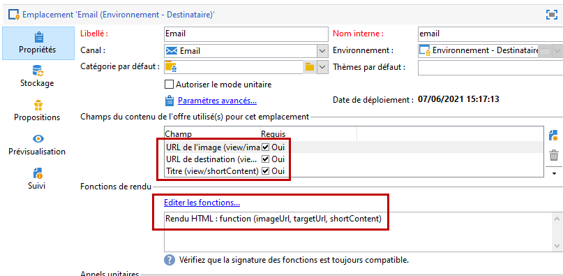

Pour créer un nouvel emplacement, procédez comme suit :

1. Dans la liste des emplacements, cliquez sur **[!UICONTROL Nouveau]**.

   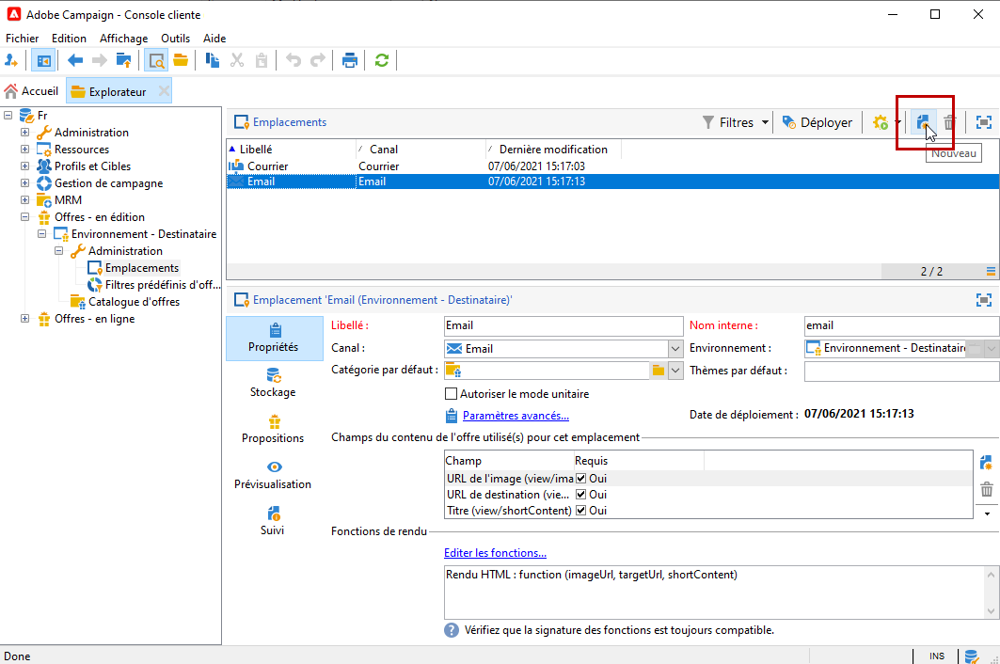

1. Sélectionnez le canal de votre choix et modifiez le libellé de l&#39;emplacement.

   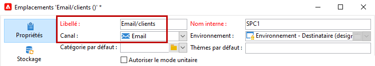

1. Cochez l&#39;option **[!UICONTROL Autoriser le mode unitaire]**.

1. Dans la fenêtre **[!UICONTROL Champs du contenu]**, cliquez sur **[!UICONTROL Ajouter]**.

   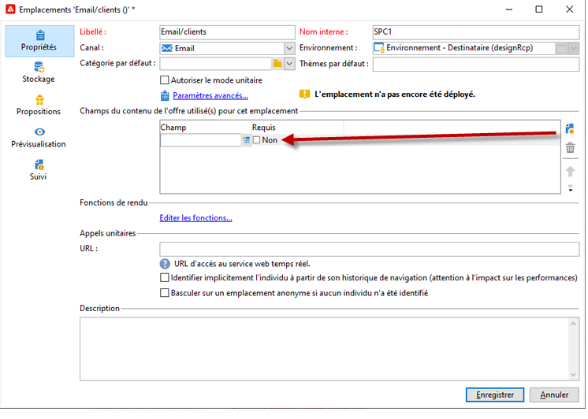

1. Depuis le nœud **[!UICONTROL Contenu]** sélectionnez successivement les champs dans l&#39;ordre suivant : **[!UICONTROL Titre]**, puis **[!UICONTROL URL de l&#39;image]**, puis **[!UICONTROL Contenu HTML]**, puis **[!UICONTROL URL de destination]**.

   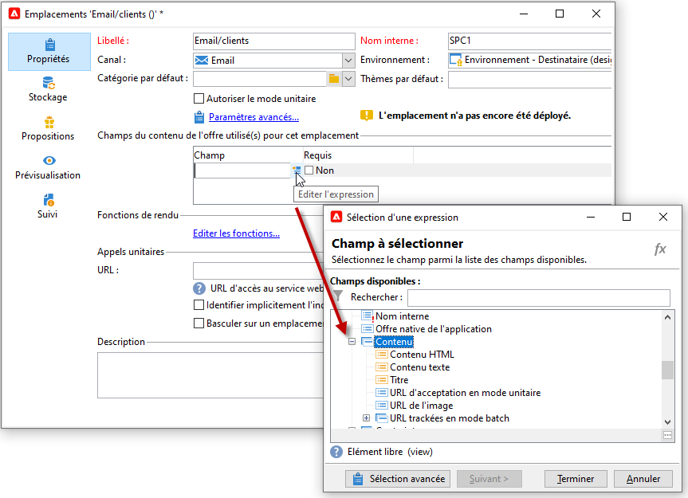

1. Cochez l&#39;option **[!UICONTROL Obligatoire]** afin de rendre chaque champ obligatoire.

   >[!NOTE]
   >
   >Cette option est utilisée lors de la prévisualisation et rend les emplacements non valides lors de la publication si l&#39;un des champs obligatoires est absent de l&#39;offre. Toutefois, si une offre est déjà en ligne sur un emplacement, ces critères ne sont pas pris en compte.

   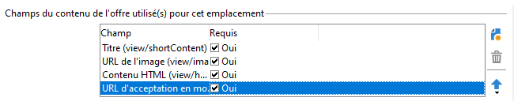

1. Cliquez sur **[!UICONTROL Éditer les fonctions]** pour créer une fonction de rendu.

   Ces fonctions sont utilisées pour générer des représentations d&#39;offres sur un emplacement. Il existe plusieurs formats possibles : HTML ou texte.

   **Remarque** - Le format XML est limité aux interactions entrantes qui ne sont pas disponibles dans cette version du produit. [En savoir plus](../start/capability-matrix.md#gs-unavailable-features)

   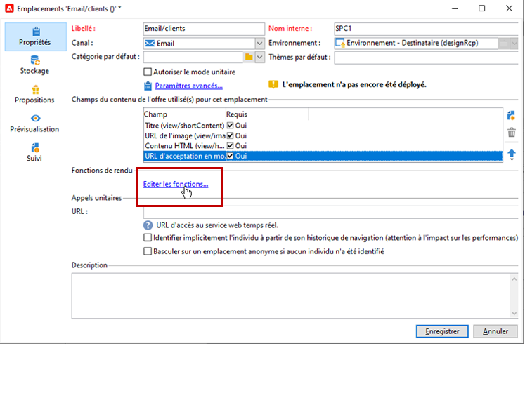_

1. Positionnez-vous sur l&#39;onglet **[!UICONTROL Rendu HTML]** et sélectionnez **[!UICONTROL Surcharger la fonction de rendu HTML]**.
1. Insérez votre fonction de rendu.

   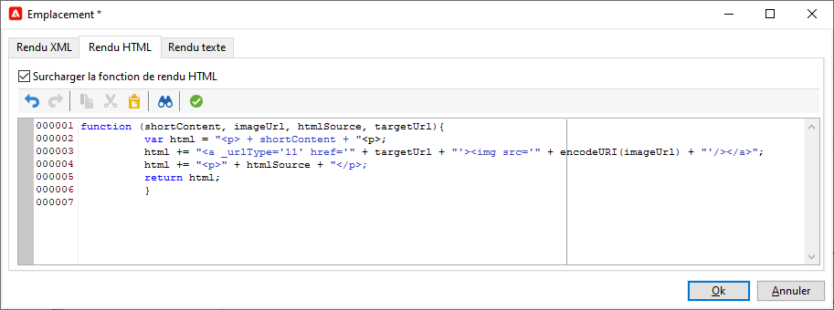

## États de la proposition d&#39;offre {#offer-proposition-statuses}

L&#39;état de la proposition d&#39;offre varie en fonction des interactions avec la population ciblée. Le module Interaction de Campaign comprend un ensemble de valeurs qui peuvent être appliquées à la proposition d&#39;offre tout au long de son cycle de vie. Vous devez paramétrer la plateforme afin que l&#39;état de la proposition d&#39;offre soit modifié lors de sa création et de son acceptation.

>[!NOTE]
>
>La mise à jour de l&#39;état est un processus **asynchrone**. Elle est réalisée par le workflow de tracking qui se déclenche toutes les heures.

### Liste des statuts d&#39;offre {#status-list}

Les statuts d&#39;offre disponibles sont les suivants :

* **[!UICONTROL Acceptée]**
* **[!UICONTROL Différée]**
* **[!UICONTROL Générée]**
* **[!UICONTROL Intéressante]**
* **[!UICONTROL Présentée]**
* **[!UICONTROL Rejetés]**

Ces valeurs ne sont pas appliquées par défaut et doivent donc être paramétrées.

>[!NOTE]
>
>Le statut d&#39;une proposition d&#39;offre est automatiquement changée en &quot;Présentée&quot; si l&#39;offre est associée à une diffusion avec le statut &quot;Envoyé&quot;.

### État de l&#39;offre à la création de la proposition {#configuring-the-status-when-the-proposition-is-created}

Lorsqu&#39;une proposition d&#39;offre est **créée**, son état est mis à jour.

Dans l&#39;environnement **[!UICONTROL En édition]**, configurez pour chaque emplacement l&#39;état à appliquer lors de la création d&#39;une proposition, en fonction des informations que vous souhaitez afficher dans les rapports d&#39;offre.

Pour ce faire, procédez comme suit :

1. Accédez à l&#39;onglet **[!UICONTROL Stockage]** de l&#39;emplacement de votre choix.
1. Sélectionnez l&#39;état à appliquer lors de la création de la proposition.

   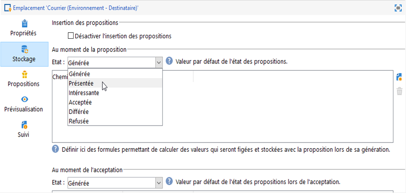

### État de l&#39;offre à l&#39;acceptation de la proposition {#configuring-the-status-when-the-proposition-is-accepted}

Une fois qu&#39;une proposition d&#39;offre a été **acceptée**, utilisez l&#39;une des valeurs fournies par défaut pour configurer le nouvel état de la proposition. La mise à jour est appliquée lorsqu&#39;un destinataire clique sur un lien dans l&#39;offre.

Pour ce faire, procédez comme suit :

1. Accédez à l&#39;onglet **[!UICONTROL Stockage]** de l&#39;emplacement de votre choix.
1. Sélectionnez l&#39;état que vous souhaitez appliquer à la proposition lorsqu&#39;elle est acceptée.

   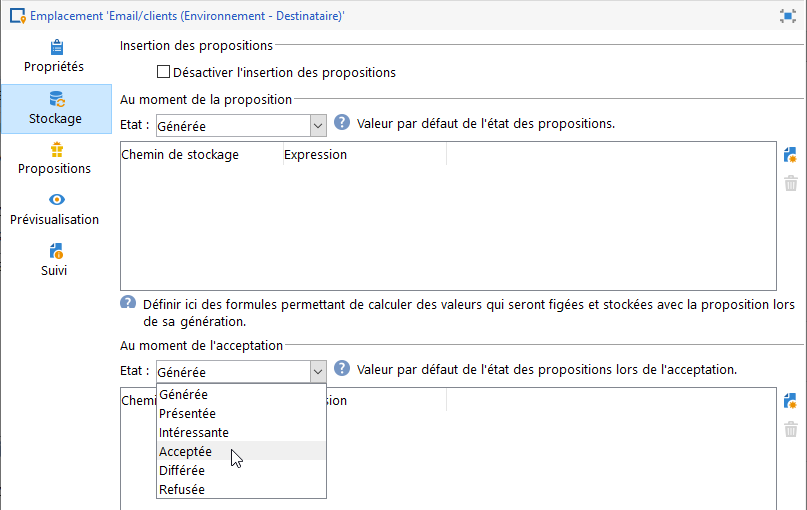

<!--
**Inbound interaction**

The **[!UICONTROL Storage]** tab lets you define statuses for **proposed** and **accepted** offer propositions only. For inbound interaction, the status of offer propositions should be specified directly in the URL for calling the offer engine, rather than through the interface. This way, you will be able to specify which status to apply in other cases, for example if an offer proposition is rejected.

```
<BASE_URL>?a=UpdateStatus&p=<PRIMARY_KEY_OF_THE_PROPOSITION>&st=<NEW_STATUS_OF_THE_PROPOSITION>&r=<REDIRECT_URL>
```

For instance, the proposition (identifier **40004**) that matches the **Home insurance** offer displayed on the **Neobank** site contains the following URL:

```
<BASE_URL>?a=UpdateStatus&p=<40004>&st=<3>&r=<"http://www.neobank.com/insurance/subscribe.html">
```

As soon as a visitor clicks the offer, and therefore the URL, the **[!UICONTROL Accepted]** status (value **3**) is applied to the proposition and the visitor is redirected to a new page of the **Neobank** site to take out the insurance contract.

>[!NOTE]
>
>If you want to specify another status in the url (for example if an offer proposition is rejected), use the value corresponding to the desired status. Example: **[!UICONTROL Rejected]** = "5", **[!UICONTROL Presented]** = "1" and so on.
>
>Statuses and their values can be retrieved in the **[!UICONTROL Offer propositions (nms)]** data schema. For more on this, refer to [this page](../../configuration/using/data-schemas.md).

**Outbound interaction**
-->

Vous pouvez appliquer automatiquement l&#39;état **[!UICONTROL Intéressante]** à une proposition d&#39;offre lorsque la diffusion contient un lien. Ajoutez simplement la valeur **_urlType=&quot;11&quot;** au lien :

```
<a _urlType="11" href="<DEST_URL>">Link inserted into the delivery</a>
```

## Prévisualisation des offres par emplacement {#offer-preview-per-space}

Dans l&#39;onglet **[!UICONTROL Aperçu]**, vous pouvez visualiser les offres auxquelles le destinataire est éligible via une méthode sélectionnée. Dans l&#39;exemple ci-dessous, le destinataire est éligible à trois propositions d&#39;offres par mail.

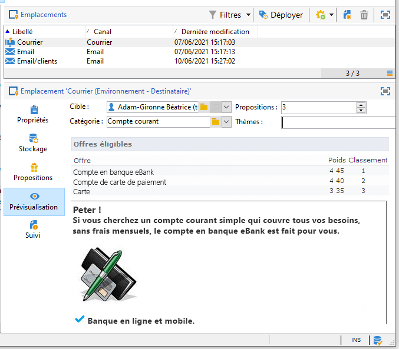

Dans le cas où le destinataire n&#39;est éligible à aucune offre, la prévisualisation vous permet d&#39;en faire la vérification.

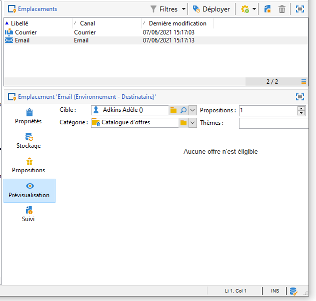

<!--
The preview can ignore contexts when they are restricted to a space. This is the case when the interaction schema has been extended to add fields referenced in a space using an inbound channel (for more on this, refer to Extension example.
-->
