# Création d’une offre

Pour créer une offre, procédez comme suit :

1. Accédez à l&#39;onglet **[!UICONTROL Campagnes]** et cliquez sur le lien **[!UICONTROL Offres]**.

1. Cliquez sur le bouton **[!UICONTROL Créer]**.

1. Modifiez le libellé et sélectionnez la catégorie à laquelle doit appartenir l&#39;offre.

1. Cliquez sur **[!UICONTROL Enregistrer]** pour créer l&#39;offre.

   L&#39;offre est disponible dans la plateforme et son contenu peut être paramétré.

## Paramètres d’éligibilité

Vous pouvez désormais utiliser l&#39;onglet **[!UICONTROL Eligibility]** pour définir :

* Période d’éligibilité de l’offre. [En savoir plus](#eligibility-period)
* Filtres sur la population de cibles d&#39;offre. [En savoir plus](#filters-on-the-target)
* Le poids offre. [En savoir plus](#offer-weight)

### Période d&#39;éligibilité des Offres{#eligibility-period}

Dans l&#39;onglet **[!UICONTROL Eligibility]** de l&#39;offre, définissez la période d&#39;éligibilité de l&#39;offre. utilisez les listes déroulantes pour sélectionner un début et une date de fin dans le calendrier.

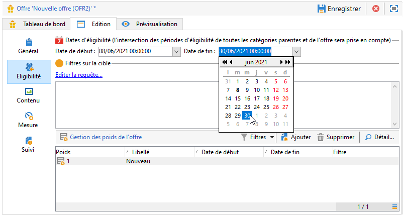

En dehors de cette période, l’offre ne sera pas sélectionnée. Si vous avez également configuré des dates d’éligibilité pour la catégorie d’offre, la période la plus restrictive s’applique.

### Filtres d&#39;Ajoute sur la cible {#filters-on-the-target}

Dans l&#39;onglet **[!UICONTROL Eligibility]** de l&#39;offre, appliquez des filtres à la cible d&#39;offre.

Pour ce faire, cliquez sur le lien **[!UICONTROL Modifier la requête]** et sélectionnez le filtre à appliquer.

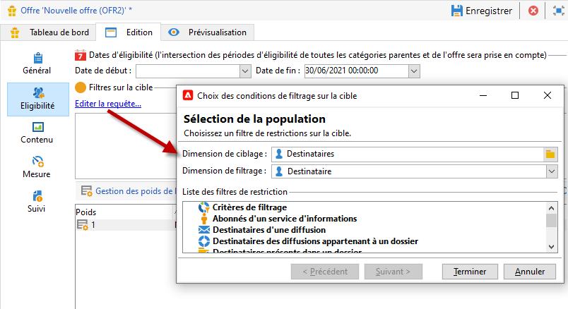

Si des filtres prédéfinis ont déjà été créés, vous pouvez les sélectionner dans la liste des filtres utilisateur. [En savoir plus](interaction-predefined-filters.md).

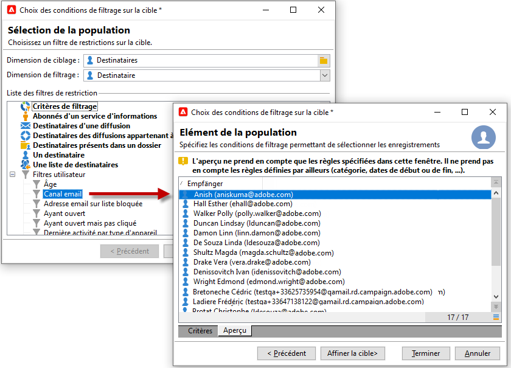

### Définir le poids d&#39;offre {#offer-weight}

Pour permettre au moteur d&#39;arbitrer entre plusieurs offres auxquelles la personne ciblée serait éligible, vous devez attribuer un ou plusieurs poids à l&#39;offre. Vous pouvez également appliquer des filtres sur la cible si nécessaire ou restreindre l&#39;emplacement auquel doit s&#39;appliquer le poids. Une offre dont le poids est plus important sera préférée à une offre avec un poids moindre.

Vous pouvez paramétrer plusieurs poids pour une même offre, notamment en fonction d&#39;une période, d&#39;une cible ou encore d&#39;un emplacement.

Par exemple, une offre peut avoir un poids A pour les contacts âgés de 18 à 25 ans et un poids B pour les contacts plus âgés. Ou, si une offre est éligible tout l&#39;été, elle peut avoir un poids A au mois de juillet, et un poids B au mois d&#39;août.

>[!NOTE]
>
>Le poids affecté peut être temporairement modifié en fonction des paramètres de la catégorie de l&#39;offre. [En savoir plus](interaction-offer-catalog.md#creating-offer-categories).

Pour créer un poids dans une offre, procédez comme suit :

1. Dans l&#39;onglet **[!UICONTROL Eligibility]** de l&#39;offre, cliquez sur **[!UICONTROL Ajouter]**.

   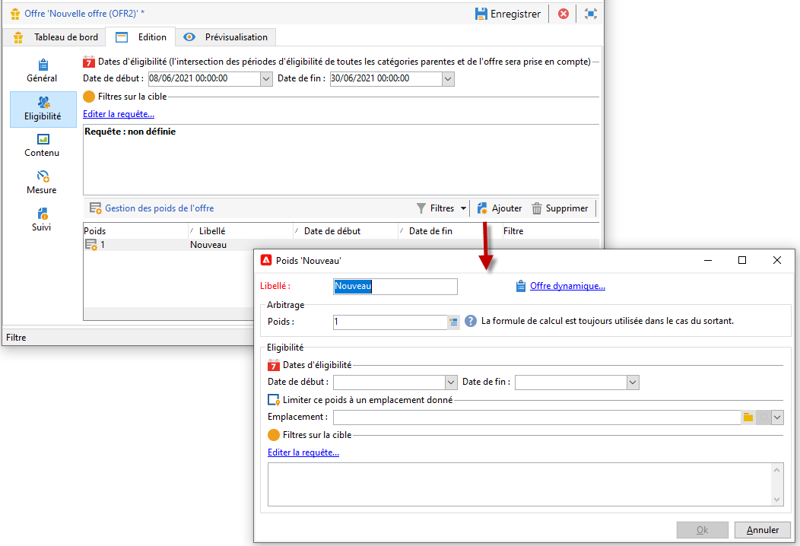

1. Modifiez l’étiquette et affectez un poids. La valeur par défaut est 1.

   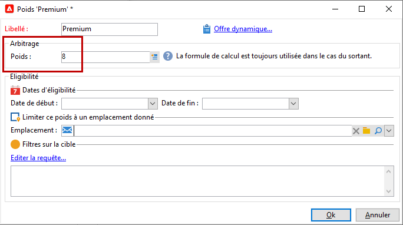

   >[!CAUTION]
   >
   >Si aucun poids n&#39;est renseigné (0), la cible est considérée comme inéligible à l&#39;offre.

1. Définissez des dates d&#39;éligibilité si vous souhaitez que le poids ne s&#39;applique que pendant une période donnée.

   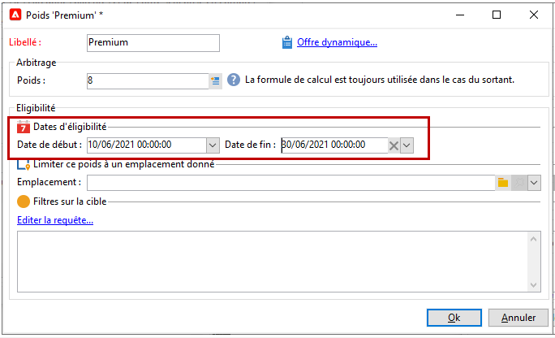

1. Si besoin est, choisissez un emplacement auquel se limitera le poids.

   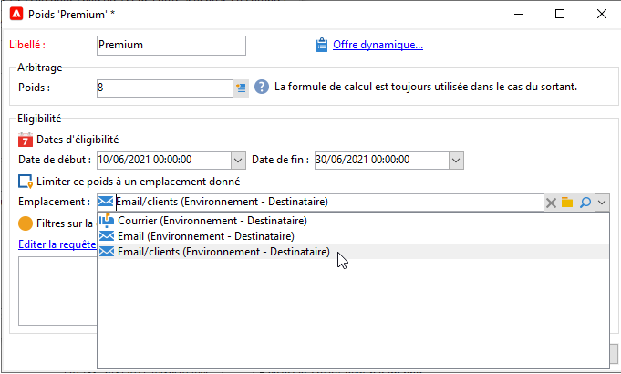

1. Appliquez un filtre sur la cible.

   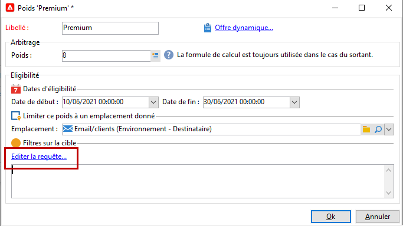

1. Cliquez sur **[!UICONTROL OK]** pour enregistrer le poids.

   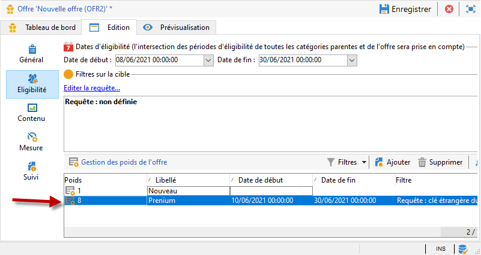

   >[!NOTE]
   >
   >Si un contact est éligible à plusieurs poids pour une offre sélectionnée, le moteur garde le meilleur poids (le plus grand). Lors d&#39;un appel au moteur, une offre ne sort qu&#39;une seule fois maximum par contact.

### Résumé des règles d&#39;éligibilité d&#39;une offre {#a-summary-of-offer-eligibility-rules}

Une fois le paramétrage terminé, un résumé des règles d&#39;éligibilité est disponible dans le tableau de bord de l&#39;offre.

Pour le visualiser, cliquez sur le lien **[!UICONTROL Planning et règles d&#39;éligibilités de l&#39;offre]**.

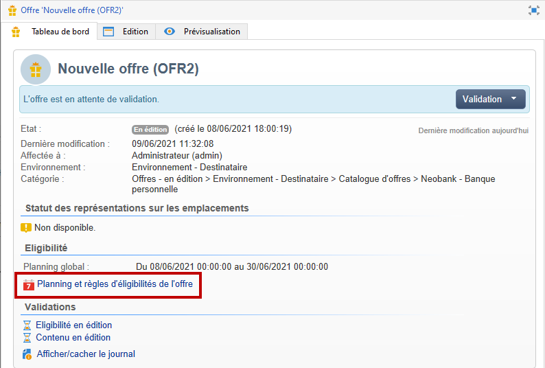

## Créer le contenu de l’offre {#creating-the-offer-content}

Utilisez l&#39;onglet **[!UICONTROL Contenu]** pour définir le contenu de l&#39;offre.

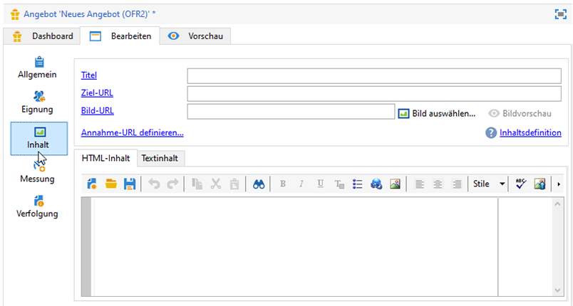

1. Définissez les différents paramètres du contenu de l’offre.

   * **[!UICONTROL Titre]** : indiquez le titre que vous souhaitez faire apparaître dans votre offre. Attention, il ne s&#39;agit pas du libellé de l&#39;offre défini dans l&#39;onglet **[!UICONTROL Général]**.
   * **[!UICONTROL URL]**  de destination : spécifiez l’URL de votre offre. Il doit être début avec &quot;http://&quot; ou &quot;https://&quot;.
   * **[!UICONTROL URL de l&#39;image]** : indiquez une URL ou un chemin d&#39;accès vers l&#39;image de votre offre.
   * **[!UICONTROL Contenu HTML]** / **[!UICONTROL Contenu texte]** : saisissez le corps de votre offre dans l&#39;onglet de votre souhait. Pour générer le tracking, le **[!UICONTROL contenu HTML]** doit être constitué d&#39;éléments HTML intégrables dans un élément de type `<div>`. Par exemple, le résultat d&#39;un élément `<table>` dans la page HTML sera le suivant :

   ```
      <div> 
       <table>
        <tr>
         <th>Month</th>
         <th>Savings</th>   
        </tr>   
        <tr>    
         <td>January</td>
         <td>$100</td>   
        </tr> 
       </table> 
      </div>
   ```

   Découvrez comment définir l&#39;URL d&#39;acceptation dans [cette section](interaction-offer-spaces.md#configuring-the-status-when-the-proposition-is-accepted).

   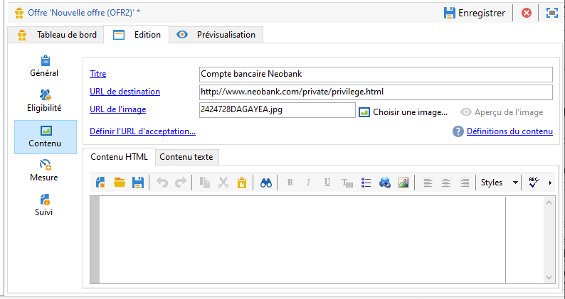

   Pour retrouver les champs requis tels qu&#39;ils ont été définis lors du paramétrage des emplacements, cliquez sur le lien **[!UICONTROL Définitions du contenu]** pour afficher la liste. [En savoir plus](interaction-offer-spaces.md).

   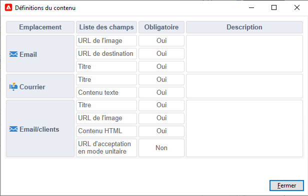

   Dans notre exemple, l&#39;offre doit être constituée d&#39;un titre, d&#39;une image, d&#39;un contenu en HTML et d&#39;une URL de destination.

## Prévisualisation de l&#39;offre {#previewing-the-offer}

Une fois le contenu de l’offre configuré, vous pouvez prévisualisation l’offre telle qu’elle apparaîtra pour son destinataire.

Pour cela :

1. Cliquez sur l&#39;onglet **[!UICONTROL Aperçu]**.

   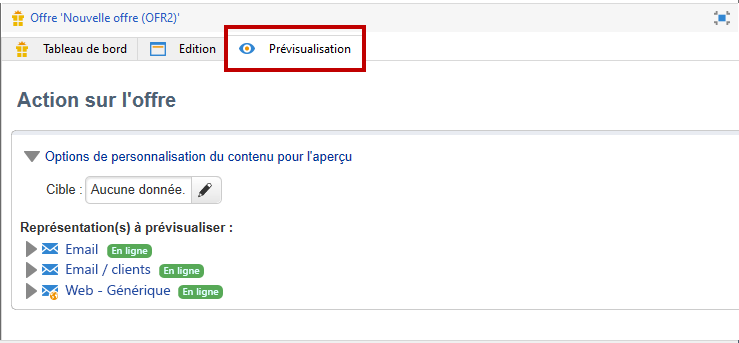

1. Sélectionnez la représentation de l&#39;offre que vous souhaitez voir.

   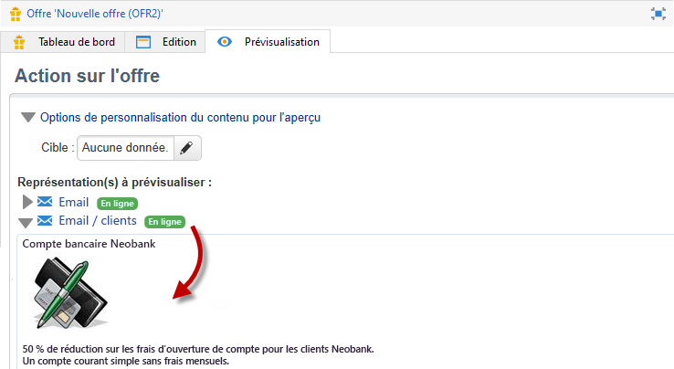

1. Si vous avez personnalisé le contenu de l&#39;offre, sélectionnez la cible de l&#39;offre afin de visualiser la personnalisation.

   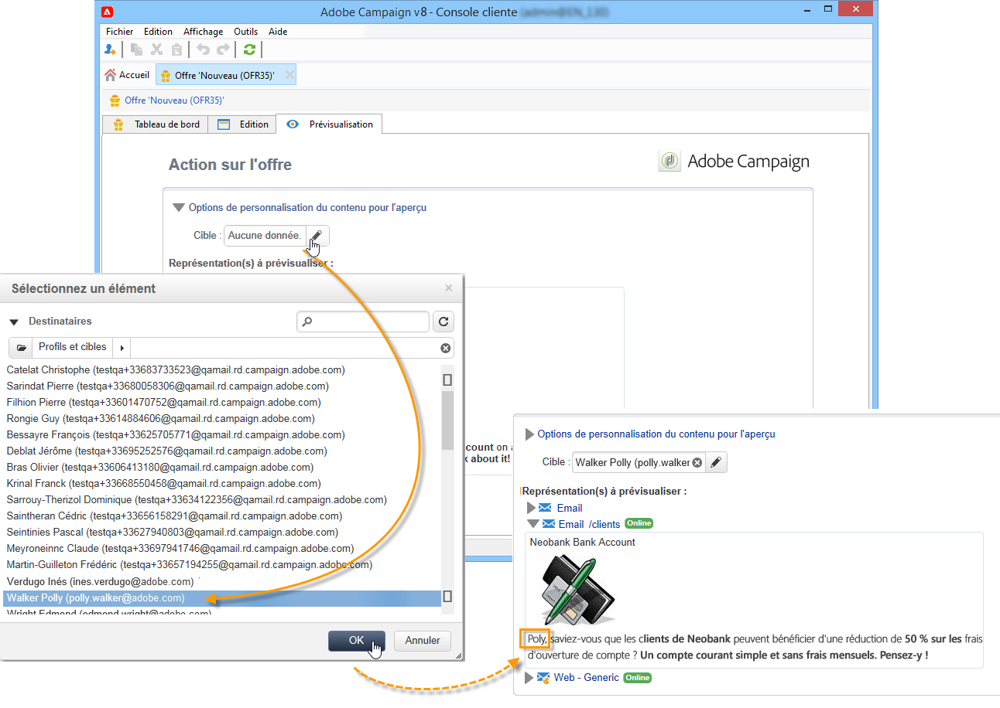

<!--

## Create a hypothesis on an offer {#creating-a-hypothesis-on-an-offer}

You can create hypotheses on your offer propositions. This lets you determine the impact of your offers on purchases carried out for the product concerned.

>[!NOTE]
>
>These hypotheses are carried out via Response Manager. Please check your license agreement.

Hypotheses carried out on an offer proposition are referenced in their **[!UICONTROL Measure]** tab.

Creating hypotheses is detailed in [this page](../../campaign/using/about-response-manager.md).

-->

## Validation et activation d’une offre{#approve-offers}

Vous pouvez maintenant approuver et activer l’offre pour la rendre disponible dans l’environnement **Live**.

:flèche_supérieur_droite : Pour plus d’informations à ce sujet, consultez la [documentation du Campaign Classic](https://experienceleague.adobe.com/docs/campaign-classic/using/managing-offers/managing-an-offer-catalog/approving-and-activating-an-offer.html?lang=en#approving-offer-content).

## Gestion de la présentation des offres{#offer-presentation}

Campaign vous permet de contrôler le flux des Propositions d&#39;offre à l’aide de règles de présentation. Ces règles, spécifiques à Campaign Interaction, sont **règles de typologie**. Ils vous permettent d&#39;exclure les offres basées sur l&#39;historique des propositions déjà faites à un destinataire. Ils sont référencés dans l’environnement.

:flèche_supérieur_droite : Pour plus d’informations à ce sujet, consultez la [documentation du Campaign Classic](https://experienceleague.adobe.com/docs/campaign-classic/using/managing-offers/managing-an-offer-catalog/managing-offer-presentation.html?lang=en#managing-offers).

## Simulation Offre

Le module Simulation vous permet de tester la répartition des offres d&#39;une catégorie ou d&#39;un environnement avant de lancer votre proposition auprès de vos destinataires.

La simulation tient compte des contextes et règles d&#39;éligibilité précédemment appliqués aux offres et à leurs règles de présentation. Il est ainsi possible de tester et d&#39;affiner différentes versions de votre proposition sans utiliser effectivement une offre ou solliciter excessivement ou insuffisamment une cible. La simulation n&#39;a en effet aucun impact sur les destinataires ciblés.

:flèche_supérieur_droite : Pour plus d’informations sur la simulation des Offres, voir [la documentation Campaign Classic](https://experienceleague.adobe.com/docs/campaign-classic/using/managing-offers/simulating-offers/about-offers-simulation.htm).
