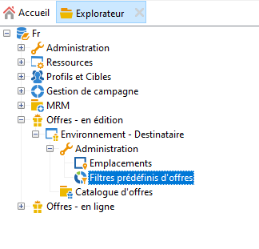
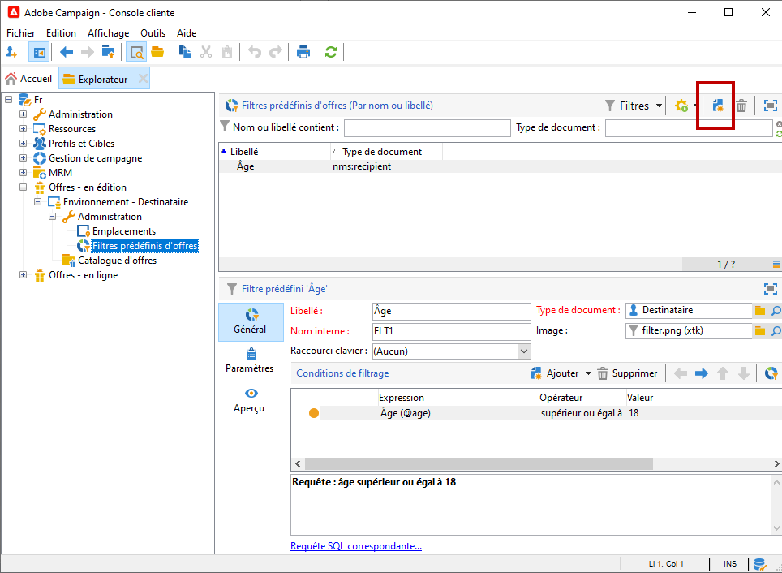
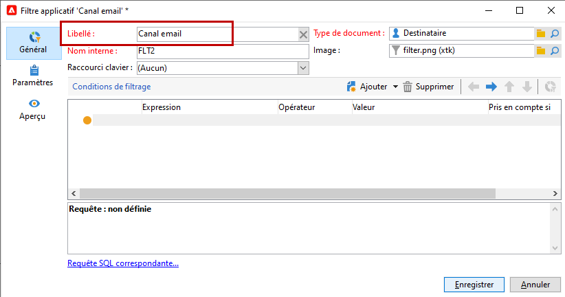
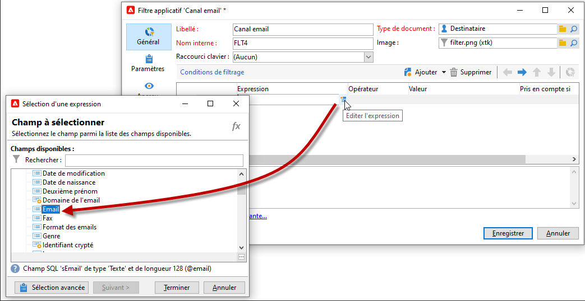
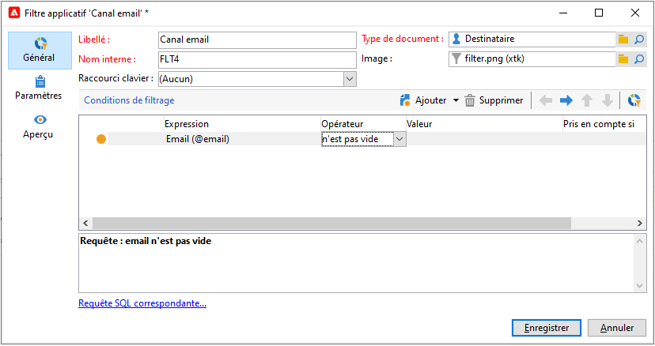
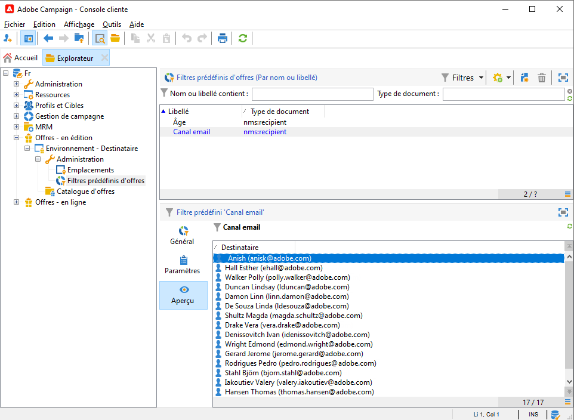

# Création de filtres prédéfinis{#creating-predefined-filters}

Créez des filtres prédéfinis afin de définir des règles d&#39;éligibilité pour la population cible qui pourront facilement être réutilisées lors de la création de l&#39;offre. Ils sont spécifiques à chaque environnement et prennent en compte les paramètres de l&#39;offre.

Pour créer un filtre prédéfini, procédez comme suit :

1. Accédez au dossier **[!UICONTROL Administration]** et sélectionnez **[!UICONTROL Filtres d&#39;offre prédéfinis]**.

   

1. Cliquez sur **[!UICONTROL Nouveau]**.

   

1. Modifiez le libellé afin de pouvoir identifier le filtre ultérieurement.

   

1. Choisissez le champ sur lequel doit porter la condition de filtrage.

   

1. Choisissez un opérateur et si nécessaire une valeur, puis enregistrez la requête.

   

1. Cliquez sur **[!UICONTROL Aperçu]** pour visualiser le résultat du filtre.

   

