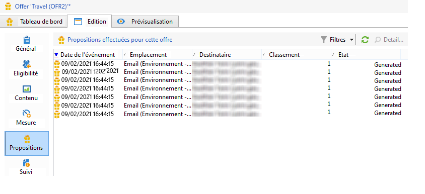
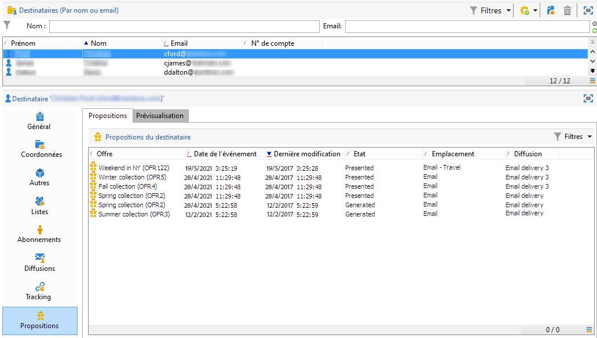
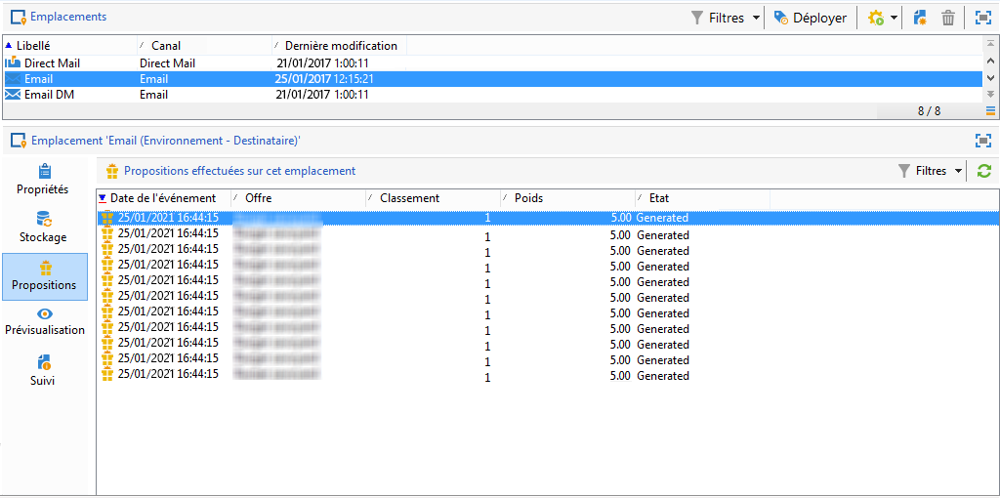
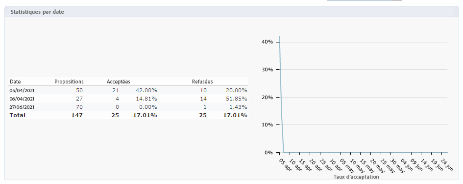
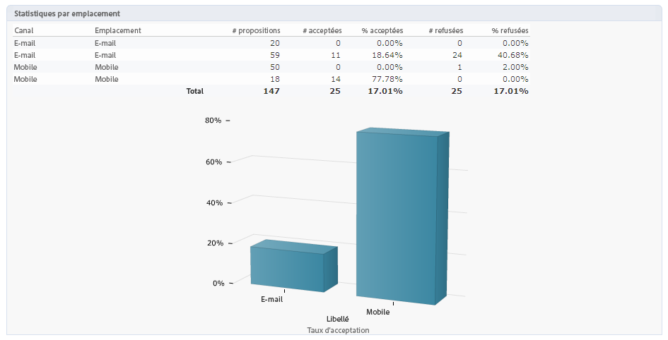
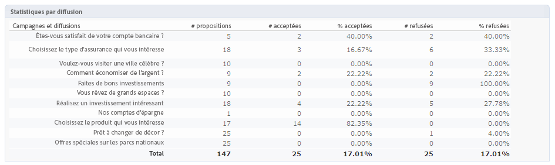

# Historique et rapports des interactions en temps réel

>[!NOTE]
>
>Ces fonctionnalités ne sont visibles quʼen ligne et uniquement pour les **Chargés de diffusion**.

## Historique des propositions dʼoffres{#offer-proposition-history}

Une fois vos propositions dʼoffres effectuées, vous pouvez consulter lʼhistorique de vos différentes présentations.

* Au niveau de l&#39;offre, dans l&#39;onglet **[!UICONTROL Edition]**, cliquez sur **[!UICONTROL Propositions]**.

   

* Depuis le profil d&#39;un destinataire, cliquez sur l&#39;onglet **[!UICONTROL Propositions]**.

   

* Au niveau des emplacements, cliquez sur l&#39;onglet **[!UICONTROL Propositions]**.

   

## Rapport Analyse des offres{#offer-analysis-report}

Le rapport **[!UICONTROL Analyse des offres]** vous permet dʼavoir une vue dʼensemble du nombre de propositions acceptées ou refusées.

Les statistiques sont classées selon trois critères :

* Par date :

   

* Par emplacement :

   

* Par diffusions :

   

Vous pouvez filtrer les données à l&#39;aide de différents critères disponibles dans la partie supérieure du rapport. Lorsque vous avez choisi les critères, cliquez sur le lien **[!UICONTROL Actualiser]** pour les appliquer au rapport.
