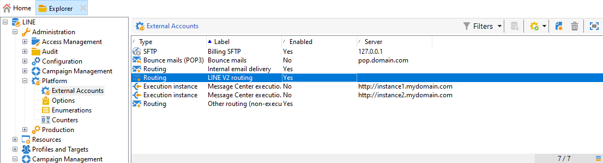
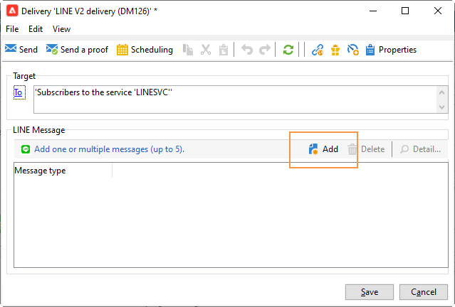
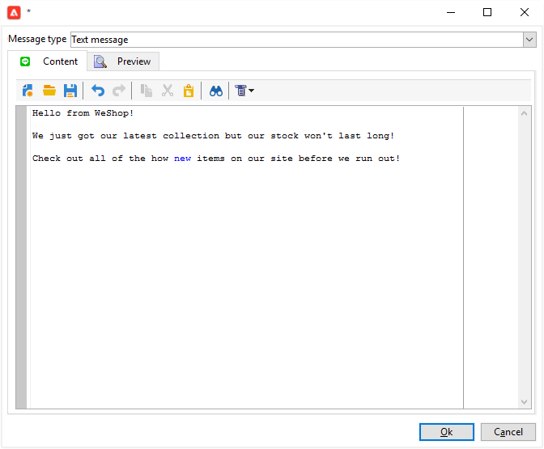
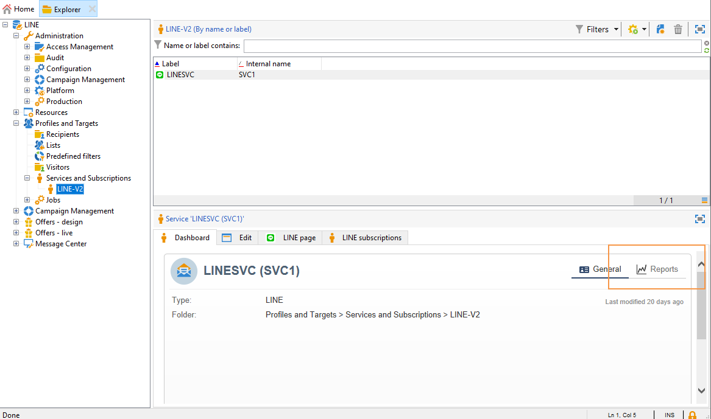
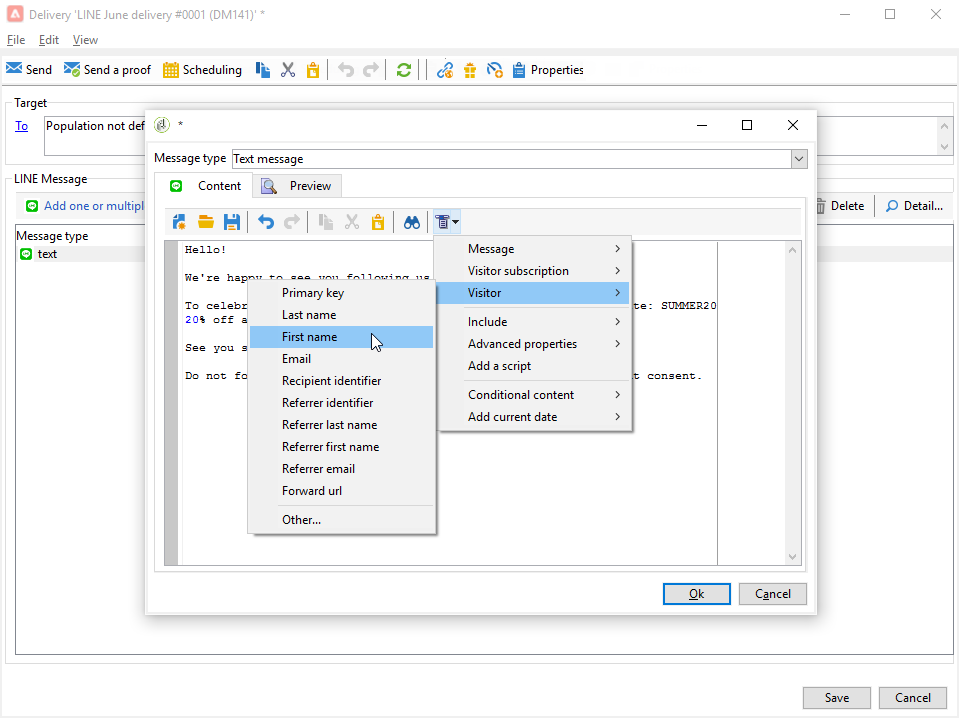

# Création de diffusions LINE

LINE est une application gratuite de messagerie instantanée, d’appels vocaux et vidéo, disponible sur tous les appareils mobiles et sur PC. Vous pouvez utiliser Adobe Campaign pour envoyer des messages LINE.

[!DNL LINE] peut également être associé au module des messages transactionnels pour envoyer des messages en temps réel sur l&#39;application [!DNL LINE] installée sur les appareils mobiles des clients. Pour en savoir plus à ce sujet, consultez cette [page](https://experienceleague.adobe.com/fr/docs/campaign-classic/using/transactional-messaging/configure-transactional-messaging/transactional-messaging-architecture#transactional-messaging-and-line) dans la documentation de Campaign Classic v7.

Pour utiliser le canal [!DNL LINE], les étapes sont les suivantes :

1. [Configuration du canal LINE](#setting-up-line-channel)
1. [Création d&#39;une diffusion](#creating-the-delivery)
1. [Configuration du type de contenu](#defining-the-content)
1. [Suivi de la diffusion (tracking, mise en quarantaine, rapports, etc.)](#accessing-reports)

## Configuration du canal LINE {#setting-up-line-channel}

Avant de créer un compte [!DNL LINE] et un compte externe, le package LINE doit être installé sur votre instance. Contactez votre représentant Adobe.

Vous devez d&#39;abord créer un compte [!DNL LINE] afin de pouvoir ensuite l&#39;associer à Adobe Campaign. Vous pouvez ensuite envoyer des messages [!DNL LINE] aux utilisateurs qui ont ajouté votre compte [!DNL LINE] dans leur application mobile. Les comptes externes et le compte [!DNL LINE] ne peuvent être gérés que par l&#39;administrateur fonctionnel de la plateforme.

Pour créer et configurer un compte [!DNL LINE], consultez la [documentation destinée aux développeurs LINE](https://developers.line.me/).

### Création et configuration du service LINE {#configure-line-service}

Pour créer votre service [!DNL LINE] :

1. Sur la page d&#39;accueil d&#39;Adobe Campaign Classic, sélectionnez l&#39;onglet **[!UICONTROL Profils et Cibles]**.

1. Dans le menu de gauche, sélectionnez **[!UICONTROL Services et abonnements]** et cliquez sur **[!UICONTROL Créer]**.

   

1. Ajoutez un **[!UICONTROL libellé]** et un **[!UICONTROL nom interne]** à votre nouveau service.

1. Sélectionnez **[!UICONTROL LINE]** dans la liste déroulante **[!UICONTROL Type]**.

   

1. Cliquez sur **[!UICONTROL Enregistrer]**.

Pour plus d&#39;informations sur les abonnements et les services, voir [Gestion des abonnements](../../start/subscriptions.md).

### Configuration du compte externe LINE {#configure-line-external}

Après avoir créé votre service [!DNL LINE], vous devez configurer le compte externe [!DNL LINE] sur Adobe Campaign :

1. Dans l&#39;arborescence **[!UICONTROL Administration]** > **[!UICONTROL Plateforme]**, cliquez sur l&#39;onglet **[!UICONTROL Comptes externes]**.

1. Sélectionnez le compte externe **[!UICONTROL Routage LINE V2]** intégré.

   

1. Cliquez sur l&#39;onglet **[!UICONTROL LINE]** de votre compte externe pour commencer à le configurer. Remplissez les champs suivants :

   

   * **[!UICONTROL Alias du canal]**&#x200B;[!DNL LINE] : est fourni via votre compte dans l&#39;onglet **[!UICONTROL Channels]** > **[!UICONTROL Technical configuration]**.
   * **[!UICONTROL Identifiant du canal]**&#x200B;[!DNL LINE] : est fourni via votre compte dans l&#39;onglet **[!UICONTROL Channels]**> **[!UICONTROL Basic Information panel]**.
   * **[!UICONTROL Clé secrète du canal]**&#x200B;[!DNL LINE] : est fourni via votre compte dans l&#39;onglet **[!UICONTROL Channels]**> **[!UICONTROL Basic Information panel]**.
   * **[!UICONTROL Jeton d&#39;accès]**&#x200B;[!DNL LINE] : est fourni via votre compte sur le portail destiné aux développeurs ou en cliquant sur le bouton **[!UICONTROL Récupérer le jeton d&#39;accès]**.
   * **[!UICONTROL Date d&#39;expiration du jeton d&#39;accès]** : permet de spécifier la date d&#39;expiration d&#39;Access token.
   * **[!UICONTROL Service d&#39;abonnement LINE]** : permet de spécifier le service auquel les utilisateurs seront abonnés.

1. Une fois la configuration effectuée, cliquez sur **[!UICONTROL Enregistrer]**.

1. Dans l&#39;**[!UICONTROL Explorateur]**, sélectionnez **[!UICONTROL Administration]** > **[!UICONTROL Exploitation]** > **[!UICONTROL Workflows techniques]** > **[!UICONTROL Workflows LINE]** pour vérifier si la **[!UICONTROL mise à jour du jeton d&#39;accès LINE V2 (updateLineAccessToken)]** et les workflows **[!UICONTROL Nettoyage des utilisateurs LINE bloqués (deleteBlockedLineUsers)]** ont commencé.

[!DNL LINE] est maintenant configuré dans Adobe Campaign. Vous pouvez commencer à créer et à envoyer des diffusions LINE aux abonnés.

## Création d&#39;une diffusion LINE {#creating-the-delivery}

>[!NOTE]
>
>Lors de l&#39;envoi initial d&#39;une diffusion [!DNL LINE] à un nouveau destinataire, vous devez y ajouter le message LINE officiel concernant les conditions d&#39;utilisation et de consentement. Le message officiel est disponible sur le [lien suivant](https://terms.line.me/OA_privacy/).

Pour créer une diffusion [!DNL LINE] vous devez suivre les étapes suivantes :

1. Depuis l&#39;onglet **[!UICONTROL Campagnes]**, sélectionnez **[!UICONTROL Diffusions]** puis cliquez sur le bouton **[!UICONTROL Créer]**.

   

1. Sélectionnez le modèle de diffusion **[!UICONTROL Diffusion LINE V2]**.

   

1. Identifiez votre diffusion avec un **[!UICONTROL Libellé]**, un **[!UICONTROL Code de diffusion]** et une **[!UICONTROL Description]**. Pour plus d’informations, consultez [cette section](../../start/create-message.md#create-the-delivery).

1. Cliquez sur **[!UICONTROL Continuer]** pour valider la création de votre diffusion.

1. Dans l&#39;éditeur de diffusion, sélectionnez **[!UICONTROL Pour]** afin de cibler les destinataires de votre diffusion [!DNL LINE]. Le ciblage est réalisé sur **[!UICONTROL abonnements des visiteurs (nms:visitorSub)]**.

   Pour plus d’informations, consultez [cette page](../../audiences/target-mappings.md).

   

1. Cliquez sur **[!UICONTROL Ajouter]** pour sélectionner la **[!UICONTROL population cible de la diffusion]**.

   

1. Choisissez si vous souhaitez cibler directement les abonnés [!DNL LINE] ou si vous souhaitez cibler les utilisateurs en fonction de leur abonnement [!DNL LINE] et cliquez sur **[!UICONTROL Suivant]**. Dans cet exemple, nous avons sélectionné **[!UICONTROL Par abonnement LINE V2]**.

1. Sélectionnez **[!UICONTROL Line-V2]** dans la liste déroulante **[!UICONTROL Dossier]**, puis votre service [!DNL LINE]. Cliquez sur **[!UICONTROL Terminer]** puis sur **[!UICONTROL Ok]** pour commencer à personnaliser votre diffusion.

   

1. Dans l&#39;éditeur de diffusion, cliquez sur **[!UICONTROL Ajouter]** pour ajouter un ou plusieurs messages et sélectionnez le **[!UICONTROL type de contenu]**.

   Pour plus d&#39;informations sur les différents **[!UICONTROL types de contenu]** disponibles, consultez la section [Définition du type de contenu](#defining-the-content).

   

1. Lorsque votre diffusion est correctement créée et paramétrée, vous pouvez l&#39;envoyer à la cible définie précédemment.

   Pour plus d&#39;informations sur l&#39;envoi d&#39;une diffusion, voir la section [Envoyer les messages](../configure-and-send.md).

1. Une fois votre message envoyé, accédez à votre rapport pour mesurer l&#39;efficacité de votre diffusion.

   Pour plus d&#39;informations sur les rapports [!DNL LINE], voir [Consultation des rapports](#accessing-reports).

## Définition du type de contenu {#defining-the-content}

Pour définir le contenu d&#39;une diffusion [!DNL LINE], vous devez d&#39;abord ajouter un type de message à votre diffusion. Chaque diffusion [!DNL LINE] peut contenir jusqu&#39;à 5 messages.

Vous pouvez effectuer un choix entre trois types de messages :

* [Message texte](#configuring-a-text-message-delivery)
* [Image et lien](#configuring-an-image-and-link-delivery)
* [Message vidéo](#configuring-a-video-message-delivery)

### Paramétrer une diffusion de type Message texte {#configuring-a-text-message-delivery}

>[!NOTE]
>
>La syntaxe `<%@ include option='NmsServer_URL' %>/webApp/APP3?id=<%=escapeUrl(cryptString(visitor.id))%>` permet d&#39;inclure un lien vers une application web dans un message LINE.

Une diffusion [!DNL LINE] de type **[!UICONTROL Message texte]** est un message envoyé aux destinataires sous forme de texte.

La configuration de ce type de message est similaire à la configuration du format **[!UICONTROL texte]** dans un e-mail. Pour plus d’informations, consultez cette [page](../defining-the-email-content.md#message-content).

### Paramétrer une diffusion de type Image et lien {#configuring-an-image-and-link-delivery}

Une diffusion de type **[!UICONTROL Image et lien]** est un message envoyé aux destinataires sous la forme d&#39;une image pouvant contenir une ou plusieurs URL.[!DNL LINE]

Vous pouvez utiliser :

* une **[!UICONTROL image personnalisée]**,

  >[!NOTE]
  >
  >Vous pouvez utiliser la variable **%SIZE%** pour optimiser l&#39;affichage de l&#39;image en fonction de la taille de l&#39;écran de l&#39;appareil mobile du destinataire de la diffusion.

  

* une **[!UICONTROL URL d&#39;image]** par taille d&#39;écran de l&#39;appareil,

  

  L&#39;option **[!UICONTROL Définir les images par taille d&#39;écran d&#39;appareil]** vous permet d&#39;utiliser différentes résolutions d&#39;image pour optimiser la visibilité de la diffusion sur les appareils mobiles. Seules les images de même hauteur et largeur sont prises en charge.

  Les images peuvent être définies en fonction de la taille de l&#39;écran :

   * 1040 px
   * 700 px
   * 460 px
   * 300 px
   * 240 px

  >[!CAUTION]
  >
  >La taille 1 040 x 1 040 px est obligatoire pour toutes les images LINE avec un lien.

  Vous devez ensuite ajouter un texte alternatif qui apparaîtra en pop-up sur l&#39;appareil mobile du destinataire.

* et les **[!UICONTROL Liens]**.

  La section **[!UICONTROL Liens]** permet d’effectuer un choix parmi différentes dispositions qui divisent votre image en plusieurs zones cliquables. Vous pouvez ensuite affecter à chacune d&#39;elles une **[!UICONTROL URL de lien]** dédiée.

  

### Paramétrage d&#39;une diffusion de type Message vidéo {#configuring-a-video-message-delivery}

Une diffusion **[!UICONTROL Message vidéo]** [!DNL LINE] est un message envoyé aux destinataires sous la forme d&#39;une vidéo pouvant contenir une URL.

Le champ **[!UICONTROL URL de l&#39;image d&#39;aperçu]** permet d&#39;ajouter l&#39;URL d&#39;une image d&#39;aperçu avec une limite de caractères de 1 000. Les formats JPEG et PNG sont pris en charge avec une taille de fichier limitée à 1 Mo.

Le champ **[!UICONTROL URL de l&#39;image vidéo]** vous permet d&#39;ajouter l&#39;URL de votre fichier vidéo avec une limite de caractères de 1 000. Seul le format mp4 est pris en charge avec une taille de fichier limitée à 200 Mo.

Veuillez noter que les vidéos larges ou de grande taille peuvent être recadrées lors de la lecture sur certains appareils.

## Accès aux rapports {#accessing-reports}

Après l&#39;envoi de votre diffusion, vous pouvez afficher vos rapports [!DNL LINE] à partir du menu **[!UICONTROL Gestion de campagnes]** > **[!UICONTROL Diffusions]** à partir de l&#39;**[!UICONTROL Explorateur]**.

>[!NOTE]
>
>Les rapports de suivi indiquent le taux de clics. [!DNL LINE] ne prend pas en compte le taux d&#39;ouverture.

Pour les rapports de service [!DNL LINE], accédez au menu **[!UICONTROL Profils et Cibles]** > **[!UICONTROL Services et abonnements]** > **[!UICONTROL LINE-V2]** à partir de l&#39;onglet **[!UICONTROL Explorateur]**. Cliquez ensuite sur l&#39;icône **[!UICONTROL Rapports]** dans le service [!DNL LINE].

## Exemple : créer et envoyer un message LINE personnalisé {#example--create-and-send-a-personalized-line-message}

Dans cet exemple, nous allons créer et paramétrer un message texte et une image contenant des données qui seront personnalisées en fonction du destinataire.

1. Créez votre diffusion [!DNL LINE] en cliquant sur le bouton **[!UICONTROL Créer]** depuis l&#39;onglet **[!UICONTROL Campagne]**.

   

1. Sélectionnez le modèle de diffusion **[!UICONTROL Diffusion LINE V2]** et nommez votre diffusion.

   

1. Dans la fenêtre de paramétrage de votre diffusion, sélectionnez votre population cible.

   Pour plus d&#39;informations, voir la section [Identification des populations ciblées](../../start/create-message.md#target-population).

   

1. Cliquez sur **[!UICONTROL Ajouter]** pour créer votre message et sélectionnez le **[!UICONTROL Type de contenu]**.

   Nous voulons d&#39;abord créer un **[!UICONTROL message texte]**.

   

1. Positionnez votre curseur à l&#39;endroit où vous souhaitez insérer le texte personnalisé, cliquez sur l&#39;icône déroulante, puis sélectionnez **[!UICONTROL Visiteur]** > **[!UICONTROL Prénom]**.

   

1. Suivez la même procédure pour ajouter une image, en sélectionnant **[!UICONTROL Image et liens]** dans la liste déroulante **[!UICONTROL Type de message]**.

   Ajoutez l&#39;**[!UICONTROL image URL]**.

   

1. Dans la section **[!UICONTROL Liens]**, sélectionnez la disposition qui divisera l’image en plusieurs zones cliquables.

1. Affectez une URL à chaque zone de votre image.

   

1. Sauvegardez votre diffusion puis cliquez sur **[!UICONTROL Envoyer]** afin de l&#39;analyser puis de l&#39;envoyer à la cible.

   La diffusion est envoyée à la cible :

   

