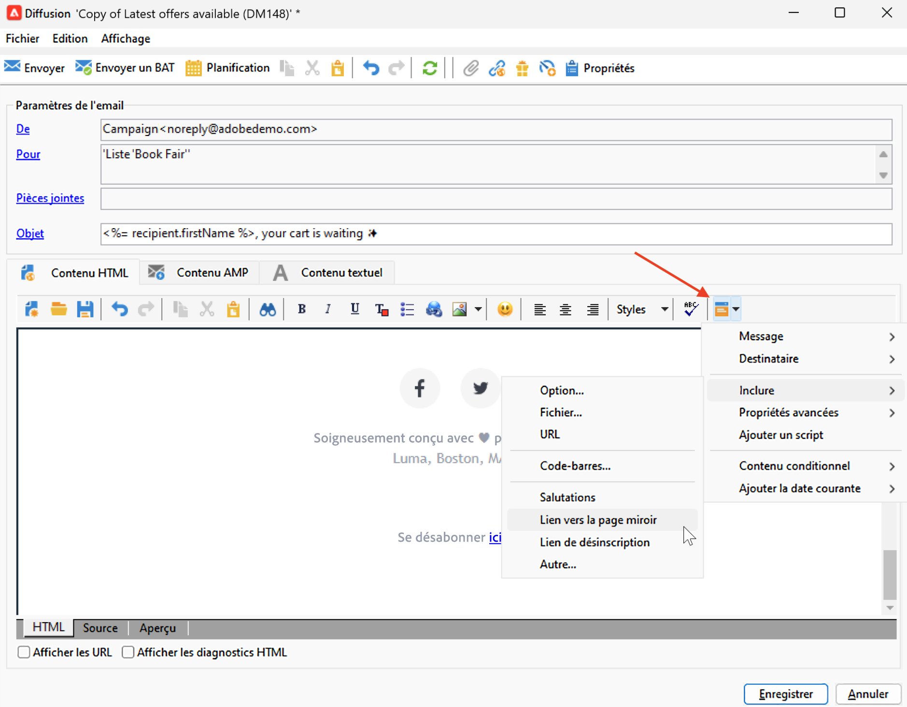
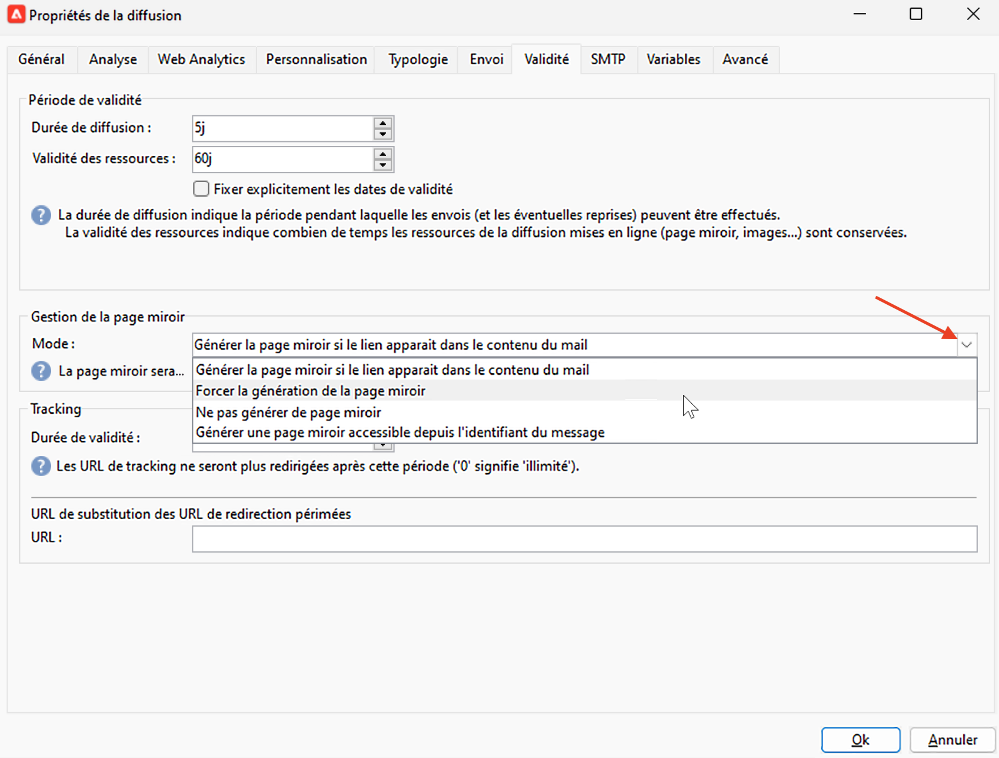
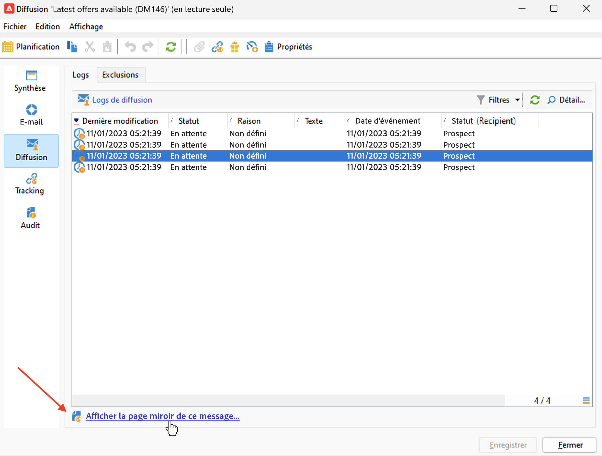

# Lien vers la page miroir{#mirror-page}

## A propos de la page miroir{#about-mirror-page}

La page miroir est une version en ligne de votre email.

Bien que la plupart des clients de messagerie rendent les images sans problème, certains paramètres prédéfinis peuvent éviter d’afficher les images pour des raisons de sécurité. Les utilisateurs peuvent accéder à la page miroir d’un email, par exemple s’ils rencontrent des problèmes de rendu ou des images endommagées lors de la tentative de l’afficher dans leur boîte de réception. Il est également recommandé de fournir une version en ligne pour des raisons d’accessibilité ou d’encourager le partage sur les réseaux sociaux.

La page miroir générée par Adobe Campaign contient toutes les données de personnalisation.

## Ajouter un lien vers la page miroir{#link-to-mirror-page}

L’insertion d’un lien vers la page miroir est une bonne pratique. Ce lien peut, par exemple, &quot;Afficher cet email dans votre navigateur&quot; ou &quot;Lire ceci en ligne&quot;. Il se trouve souvent dans l’en-tête ou le pied de page de l’email.

Dans Adobe Campaign, vous pouvez insérer un lien vers la page miroir dans le contenu de l&#39;email à l&#39;aide du **bloc de personnalisation**. La version intégrée **Lien vers la page miroir** le bloc de personnalisation insère le code suivant dans le contenu de votre email : `<%@ include view='MirrorPage' %>`.

<!--For more on personalization blocks insertion, refer to [Personalization blocks](personalization-blocks.md).-->

## Génération de pages miroir{#mirror-page-generation}

Par défaut, la page miroir est automatiquement générée par Adobe Campaign si le contenu de l&#39;email n&#39;est pas vide et s&#39;il contient un lien vers la page miroir (ou lien miroir).

Vous pouvez contrôler le mode de génération de la page miroir de l&#39;email. Les options sont disponibles dans les propriétés de la diffusion. Pour accéder à ces options :

1. Accédez au **[!UICONTROL Validité]** de la propriété email.
1. Dans le **Gestion des pages miroir** , vérifiez les **[!UICONTROL Mode]** Liste déroulante.

Outre le mode par défaut, les options disponibles sont les suivantes :

* **[!UICONTROL Forcer la génération de la page miroir]**: utilisez ce mode pour générer la page miroir même si aucun lien vers la page miroir n&#39;est inséré dans la diffusion.
* **[!UICONTROL Ne pas générer de page miroir]**: utilisez ce mode pour éviter de générer une page miroir, même si le lien est présent dans la diffusion.
* **[!UICONTROL Génère une page miroir accessible à l’aide de l’identifiant du message uniquement]**: lorsque le lien de la page miroir n&#39;est pas présent dans le contenu de l&#39;email, utilisez cette option pour permettre l&#39;accès au contenu de la page miroir, dans la fenêtre du log de diffusion, comme décrit ci-dessous.

## Vérifier la page miroir d&#39;un destinataire{#mirror-page-access}

Vous pouvez accéder au contenu de la page miroir pour un destinataire spécifique d&#39;une diffusion, avec des données de personnalisation.

Pour accéder à cette page miroir :

1. Une fois la diffusion envoyée, ouvrez-la et accédez à son **[!UICONTROL Diffusion]** .

1. Sélectionnez un destinataire et cliquez sur le bouton **[!UICONTROL Afficher la page miroir de ce message...]** lien.

   

   La page miroir s&#39;affiche dans un écran dédié, avec les données de personnalisation du destinataire sélectionné.

