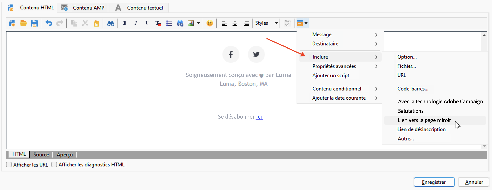
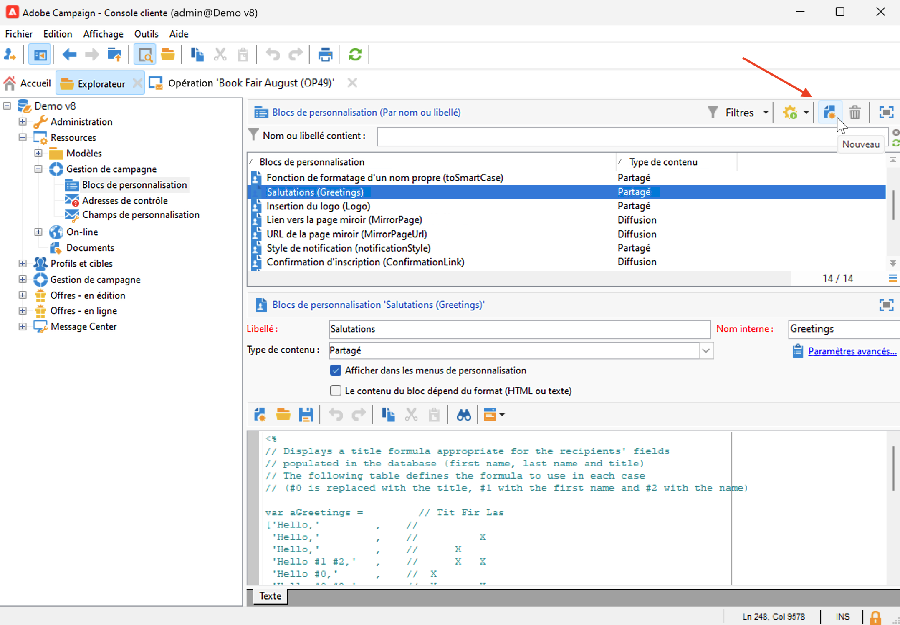
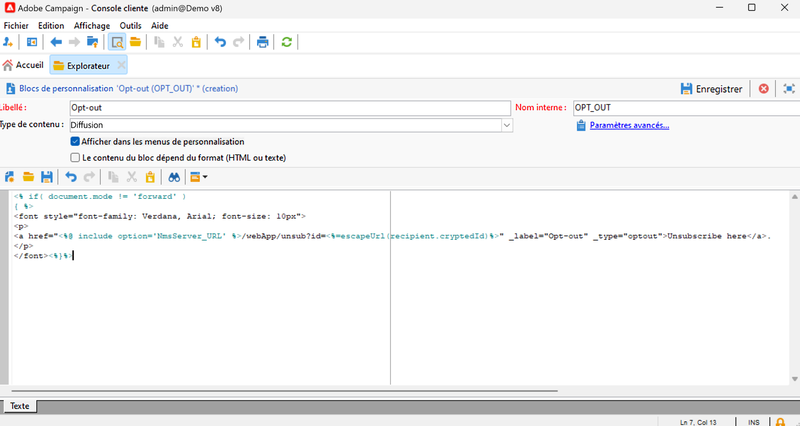

# Utiliser les blocs de personnalisation{#personalization-blocks}

Les blocs de personnalisation sont du contenu dynamique, qui contiennent un rendu spécifique que vous pouvez insérer dans vos diffusions. Vous pouvez par exemple ajouter un logo, un message de salutations ou un lien vers une page miroir.

Pour accéder aux blocs de contenu personnalisés, accédez au nœud **[!UICONTROL Ressources > Gestion de campagne > Blocs de personnalisation]** de l’explorateur Campaign. Les blocs de personnalisation intégrés sont répertoriés dans [cette section](#ootb-personalization-blocks).

Vous pouvez également définir de nouveaux blocs pour optimiser la personnalisation de vos diffusions. [En savoir plus](#create-custom-personalization-blocks).

## Insertion de blocs de personnalisation {#insert-personalization-blocks}

Pour insérer un bloc de personnalisation dans un message, procédez comme suit :

1. Dans l’éditeur de contenu de l’assistant de diffusion, cliquez sur l’icône de personnalisation et sélectionnez le menu **[!UICONTROL Inclure]**.
1. Sélectionnez un bloc de personnalisation dans la liste ou cliquez sur le menu **[!UICONTROL Autre...]** pour accéder à la liste complète.

   

1. Le bloc de personnalisation est alors inséré sous forme de script. Il sera automatiquement adapté au profil du ou de la destinataire lors de la génération de la personnalisation.
1. Accédez à l’onglet **[!UICONTROL Prévisualisation]**, puis sélectionnez un destinataire pour visualiser le contenu de ce bloc en fonction de ce dernier.

Vous pouvez inclure le code source d&#39;un bloc de personnalisation dans le contenu de la diffusion. Pour ce faire, sélectionnez **[!UICONTROL Inclure le code source du HTML du bloc]** lors de sa sélection.

## Blocs de personnalisation intégrés {#ootb-personalization-blocks}

Les blocs de personnalisation intégrés sont les suivants :

* **[!UICONTROL Enabled by Adobe Campaign]** : insère le logo « Enabled by Adobe Campaign ».
* **[!UICONTROL Fonction de formatage d’un nom propre]** : génère la fonction JavaScript **[!UICONTROL toSmartCase]** qui convertit la première lettre de chaque mot en majuscule.
* **[!UICONTROL Salutations]** : permet d’insérer des salutations avec le nom complet du ou de la destinataire, suivi d’une virgule. Exemple : « Bonjour Pierre Martin, ».
* **[!UICONTROL Insertion du logo]** : insère un logo défini dans les paramètres de l’instance.
* **[!UICONTROL Lien vers la page miroir]** : insère un lien vers la [page miroir](mirror-page.md). Le format par défaut est : « Si vous ne parvenez pas à voir correctement ce message, cliquez ici »
* **[!UICONTROL URL de page miroir]** : insère l’URL de page miroir qui permet aux concepteurs et conceptrices de diffusion de vérifier le lien.
* **[!UICONTROL URL d’acceptation d’une offre en mode unitaire]** : insère une URL permettant de définir une offre comme étant **[!UICONTROL Acceptée]**. (Ce bloc est disponible si le module Interaction est activé).
* **[!UICONTROL Confirmation de votre inscription]** : insère un lien permettant de confirmer l’abonnement.
* **[!UICONTROL Lien d’inscription]** : insère un lien d’abonnement. Ce lien est défini dans les paramètres de l’instance. Le contenu par défaut est le suivant : « Pour vous inscrire, cliquez ici. ».
* **[!UICONTROL Lien d’inscription (avec parrain)]** : insère un lien d’abonnement permettant d’identifier le visiteur ou la visiteuse et la diffusion. Ce lien est défini dans les paramètres de l’instance.
* **[!UICONTROL URL de la page d’inscription]** : insère une URL d’abonnement.
* **[!UICONTROL Style des e-mails de contenu]** et **[!UICONTROL Style de notification]** : permettent de générer un code qui formate l’e-mail avec les styles HTML par défaut.
* **[!UICONTROL Lien de désinscription]** : insère un lien permettant de se désabonner de toutes les diffusions (liste bloquée). Le contenu associé par défaut est : « Vous recevez ce message car vous avez été en contact avec ***nom de votre organisation*** ou une entité associée. Pour ne plus recevoir de messages de ***nom de votre organisation***, cliquez ici. »

## Créer des blocs de personnalisation personnalisés {#create-custom-personalization-blocks}

Vous pouvez définir de nouveaux blocs de contenu personnalisés à insérer à partir de l’icône de personnalisation.

Pour créer un bloc de personnalisation, procédez comme suit :

1. Accédez au dossier **[!UICONTROL Ressources > Gestion de campagne > Blocs de personnalisation]** de l’explorateur Campaign.
1. Au-dessus de la liste des blocs intégrés, cliquez sur **[!UICONTROL Nouveau]**.

   

1. Renseignez les paramètres du bloc de personnalisation :

   

   * Saisissez le libellé du bloc. Ce libellé est affiché dans la fenêtre d’insertion du champ de personnalisation.
   * Sélectionnez un type de contenu de **Diffusion**.
   * Sélectionnez l’option **[!UICONTROL Afficher dans les menus de personnalisation]** pour pouvoir accéder à ce bloc à partir de l’icône d’insertion de champs de personnalisation.
   * Le cas échéant, sélectionnez l’option **[!UICONTROL Le contenu du bloc de personnalisation dépend du format]** pour définir deux blocs distincts pour les e-mails au format HTML et texte.
   * Saisissez le contenu (en langage HTML, texte, JavaScript, etc.) du bloc de personnalisation, puis cliquez sur **[!UICONTROL Enregistrer]**.

Une fois enregistré, le nouveau bloc de personnalisation est disponible dans l’éditeur de diffusion.

## Tutoriel vidéo {#personalization-blocks-video}

Dans la vidéo suivante, découvrez comment créer des blocs de contenu dynamiques et apprenez à les utiliser pour personnaliser le contenu de votre diffusion e-mail.

>[!VIDEO](https://video.tv.adobe.com/v/342088?quality=12)
