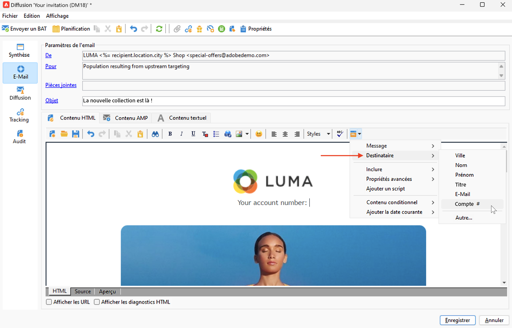
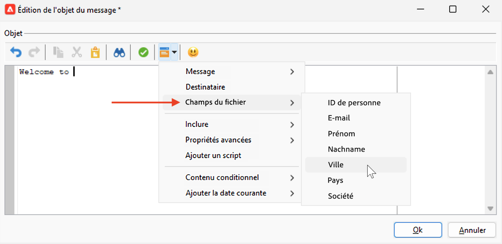
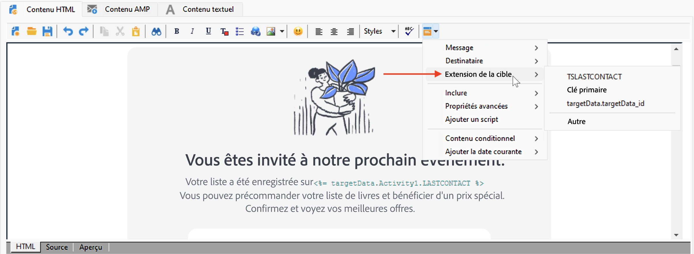

# Sources de données de personnalisation{#personalization-data}

Les données de personnalisation peuvent être récupérées à partir de différents types de sources : source de données de la base de données Campaign, de fichier externe ou de base de données externe.

## Source de données de la base de données Campaign

Dans le cas le plus courant, les données de personnalisation sont stockées dans la base de données. Par exemple, les « champs de personnalisation des destinataires » sont tous les champs définis dans le tableau des destinataires, les champs standard (généralement ceux-ci : nom, prénom, adresse, ville, date de naissance, etc.) ou les champs personnalisés.

## Source de données de fichier externe

Vous pouvez utiliser un fichier externe contenant tous les champs définis dans les colonnes. Ce fichier est utilisé comme entrée lors de la définition de la diffusion d’un message. Vous pouvez choisir d’insérer ou non ces profils dans la base de données.

Pour sélectionner le fichier à utiliser comme source de données, accédez au lien « Vers » dans la fenêtre de création du message et sélectionnez l’option **Défini dans un fichier externe**. Une fois le fichier téléchargé, accédez aux données du ou de la destinataire dans les options de personnalisation, à partir de l’entrée **Champs du fichier**.

## Source de données FDA

Les données de personnalisation peuvent être récupérées à partir d’un tableau externe via [Federated Data Access](../connect/fda.md).  Si vous souhaitez effectuer une personnalisation dans vos diffusions en utilisant les données de la base externe, collectez les données à utiliser dans un workflow afin de les rendre disponibles dans un tableau temporaire.

Pour ce faire, ajoutez une activité **Requête** dans le workflow de ciblage et utilisez le lien **Ajouter des données...** pour sélectionner la base externe. Consultez le processus complet dans [cette section](../../automation/workflow/query.md#adding-data).

Utilisez ensuite les données du tableau temporaire pour personnaliser votre diffusion. Une fois l’activité de requête paramétrée, accédez aux données externes dans les options de personnalisation, à partir de l’entrée **Extension de la cible**.

Lors de l’utilisation de données externes accessibles dans FDA, il est recommandé de pré-traiter la personnalisation des messages dans un workflow dédié à l’aide de l’option **Préparer les données de personnalisation avec un workflow**, comme indiqué ci-dessous.

### Optimiser la personnalisation {#optimize-personalization}

Vous pouvez optimiser la personnalisation à l&#39;aide d&#39;une option dédiée : **[!UICONTROL Préparer les données de personnalisation avec un workflow]**, disponible dans l&#39;onglet **[!UICONTROL Analyse]** des propriétés d&#39;une diffusion.

Cette option permet, lors de l&#39;analyse de la diffusion, de créer automatiquement et d&#39;exécuter un workflow qui stocke dans une table temporaire toutes les données liées à la cible, notamment les données issues des tables liées en FDA.

Si vous cochez cette option, les performances de l’analyse des diffusions peuvent être améliorées lorsque de nombreuses données sont en cours de traitement, en particulier si les données de personnalisation proviennent d’une table externe par le biais de FDA. [En savoir plus](../connect/fda.md).

Pour utiliser cette option, procédez comme suit :

1. Créez une campagne.
1. Sous l’onglet **[!UICONTROL Ciblages et workflows]** de votre campagne, ajoutez une activité **Requête** à votre workflow.
1. Ajoutez ue activité **[!UICONTROL Diffusion E-mail]** dans le workflow et ouvrez-la.
1. Accédez à l&#39;onglet **[!UICONTROL Analyse]** des **[!UICONTROL Propriétés de la diffusion]** et sélectionnez l&#39;option **[!UICONTROL Préparer les données de personnalisation avec un workflow]**.
1. Configurez la diffusion et démarrez le workflow afin de lancer l&#39;analyse.

Une fois l&#39;analyse terminée, les données de personnalisation sont stockées dans une table temporaire via un workflow technique temporaire créé à la volée lors de l&#39;analyse.

Ce workflow n&#39;est pas visible dans l&#39;interface d&#39;Adobe Campaign. Il s&#39;agit uniquement d&#39;un moyen technique permettant de stocker et de traiter rapidement les données de personnalisation.

Une fois l&#39;analyse terminée, accédez aux **[!UICONTROL Propriétés]** du workflow et sélectionnez l&#39;onglet **[!UICONTROL Variables]**. Celui-ci contient le nom de la table temporaire que vous pouvez utiliser pour effectuer un appel SQL afin d&#39;afficher les identifiants qu&#39;elle contient.

## Données de personnalisation dans un workflow

Lorsqu’une diffusion est créée dans le cadre d’un workflow, vous pouvez utiliser les données du tableau de workflow temporaire. Les données stockées dans la table de travail temporaire du workflow sont disponibles pour les tâches de personnalisation. Vous pouvez utiliser les données dans les champs de personnalisation.

Ces données sont rassemblées dans le menu **[!UICONTROL Extension de la cible]**. Pour plus d’informations, consultez [cette section](../../automation/workflow/use-workflow-data.md#target-data).
