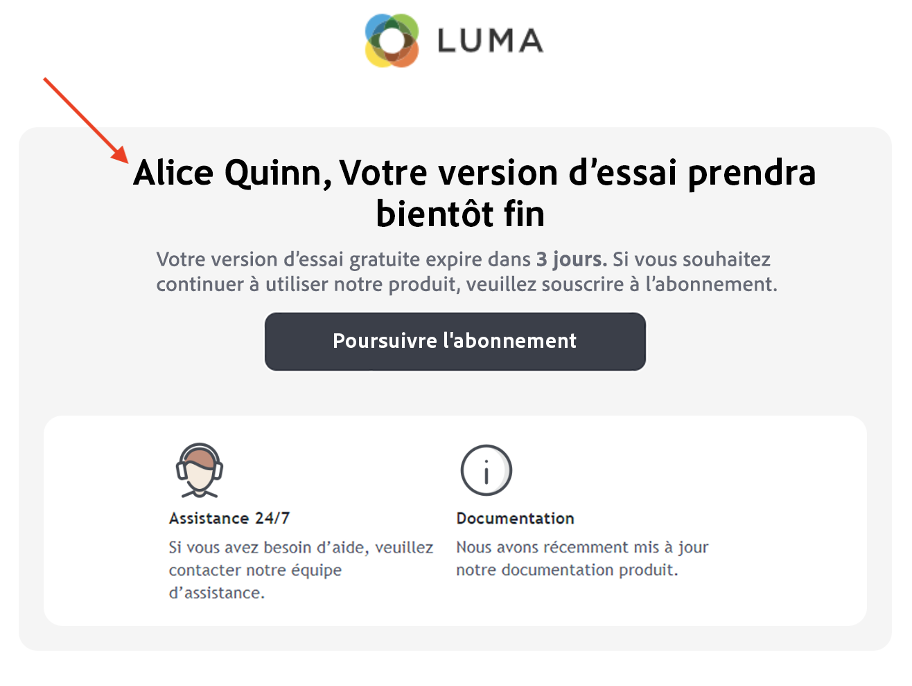
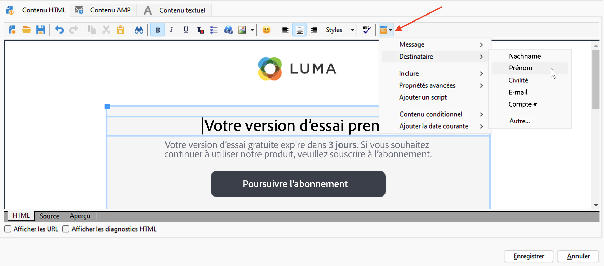
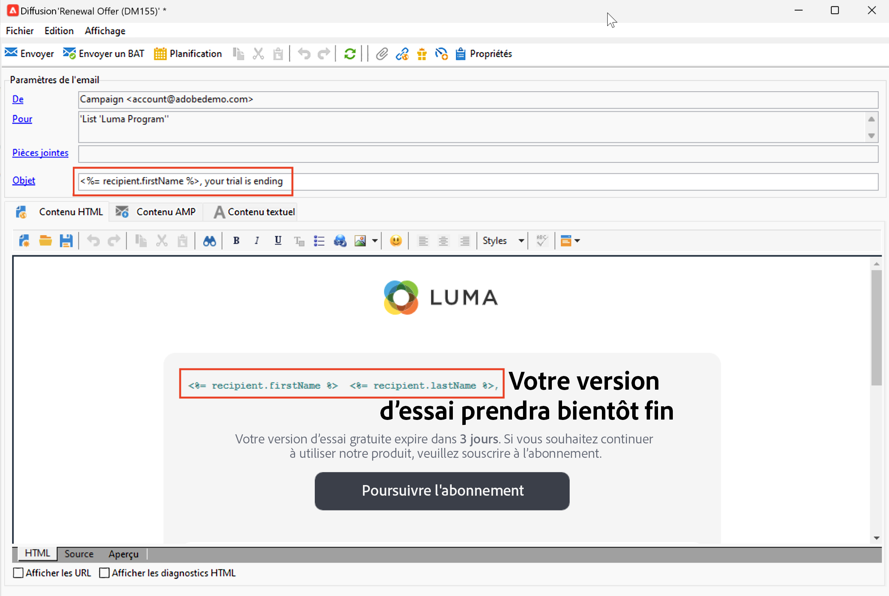

# ajouter des champs de personnalisation,{#personalization-fields}

Utilisez des champs de personnalisation pour diffuser du contenu personnalisé adapté à chaque destinataire, selon les règles que vous avez définies pour cette personne.

Un champ de personnalisation est une référence de champ de données unique utilisée lors de la personnalisation d’une diffusion pour un destinataire spécifique. La valeur réelle des données est insérée lors de la phase d’analyse de la diffusion.

## Syntaxe

Une balise de personnalisation utilise toujours la syntaxe suivante : `<%=table.field%>`.

Par exemple, pour insérer le nom du ou de la destinataire, stocké dans le tableau des destinataires, le champ de personnalisation utilise la syntaxe `<%= recipient.lastName %>`.

>[!CAUTION]
>
>Le contenu des champs de personnalisation ne peut pas dépasser 1 024 caractères.

## Insérer un champ de personnalisation {#insert-a-personalization-field}

Pour insérer des champs de personnalisation, cliquez sur l’icône déroulante accessible à partir d’un champ d’en-tête, d’objet ou de corps principal du message.

Les champs de personnalisation sont insérés et peuvent être interprétés par Adobe Campaign : lors de la préparation du message, les champs sont remplacés par la valeur associée à un ou une destinataire donné(e).

Vous pouvez ensuite tester le remplacement des champs dans l’onglet **[!UICONTROL Prévisualisation]**.

<!--Learn more about message preview in [this page]().-->

## Cas d’utilisation : personnaliser l’objet d’un e-mail {#personalization-fields-uc}

Dans le cas d’utilisation ci-dessous, apprenez à personnaliser l’objet et le corps d’un e-mail avec les données du destinataire :

1. Créez une nouvelle diffusion ou ouvrez une diffusion existante d’e-mail.
1. Accédez au lien **[!UICONTROL Objet]** pour modifier l’objet du message.
1. Saisissez le texte « **Offre spéciale pour** » et utilisez le dernier bouton de la barre d’outils pour insérer un champ de personnalisation. Choisissez **[!UICONTROL Destinataire>Prénom]**.
1. Répétez l&#39;opération pour insérer le nom du destinataire. Insérez des espaces entre chacun de ces champs de personnalisation.
1. Cliquez sur **[!UICONTROL OK]** pour valider.
1. Insérez ensuite la personnalisation dans le corps du message. Pour cela, cliquez dans le contenu du message et cliquez sur le bouton d&#39;insertion de champs.
1. Choisissez **[!UICONTROL Destinataire > Autre...]**.
1. Sélectionnez le champ contenant l&#39;information à afficher et cliquez sur **[!UICONTROL Ok]**.
1. Cliquez sur l&#39;onglet **[!UICONTROL Aperçu]** pour visualiser le résultat de la personnalisation. Vous devez sélectionner un destinataire pour afficher son message.

## Tutoriel vidéo {#personalization-field-video}

Dans la vidéo suivante, découvrez comment ajouter un champ de personnalisation à la ligne d’objet et au contenu d’une diffusion e-mail.

>[!VIDEO](https://video.tv.adobe.com/v/24925?quality=12)
