# Coupons personnalisés{#personalized-coupons}

L’ajout de coupons à vos diffusions peut offrir une valeur ajoutée à vos destinataires pour vos produits et services. Vous pouvez utiliser le module de coupons Campaign pour créer un ensemble de coupons que vous prévoyez d’ajouter aux offres marketing à venir. Lorsque vous êtes prêt(e) à créer une diffusion, attribuez les coupons applicables. Comme les coupons sont valides pour une période sélectionnée, un coupon attribué est lié de manière unique à son message de diffusion. En outre, Campaign confirme qu’il y a suffisamment de coupons pour le nombre de messages avant l’envoi de la diffusion.

>[!AVAILABILITY]
>
>La gestion des coupons n’est pas disponible dans Campaign v8 dans le contexte d’un déploiement Entreprise (FFDA). En savoir plus dans la [documentation de Campaign v8](../architecture/enterprise-deployment.md).

La gestion des coupons nécessite un package qui doit être installé. Pour confirmer que vous disposez de la Gestion des coupons, allez dans **[!UICONTROL Administration > Configuration > Gestion des packages > Packages installés.]**

Les données des coupons peuvent être importées et exportée à l’aide de formats CSV et XML. [En savoir plus](../start/import.md).

## Créer un coupon {#creating-a-coupon}

Le module de gestion des coupons vous donne le choix entre deux options lorsque vous créez des coupons :

* **Anonyme** : un coupon générique pour des destinataires précis ou une liste de destinataires.
* **Individuel** : un coupon personnalisé pour des destinataires précis.

Avant d&#39;appliquer les étapes ci-dessous, vérifiez que vous savez quel type de coupon vous souhaitez créer.

1. Dans l&#39;arborescence Campaign, allez dans **[!UICONTROL Ressources > Gestion de campagne > Coupons]**.

   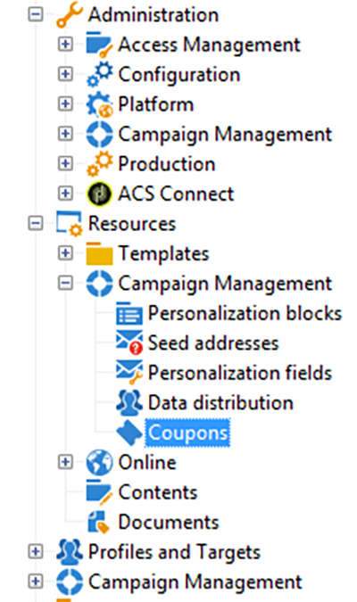

1. Cliquez sur le bouton **[!UICONTROL Nouveau]**.
1. Saisissez le nom du coupon dans le champ **[!UICONTROL Libellé]**. Un code unique apparaît automatiquement dans **[!UICONTROL Code coupon]**. Vous pouvez garder ce code ou en saisir un nouveau.

   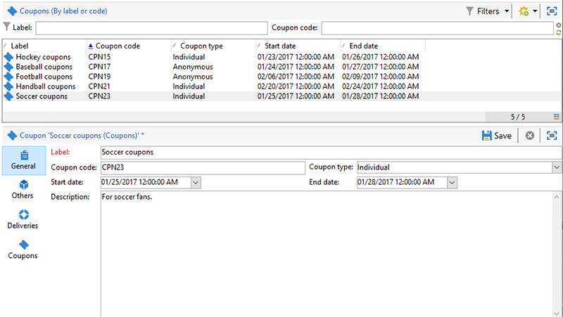

1. Sélectionnez **[!UICONTROL Date de début]** et **[!UICONTROL Date de fin]** pour configurer la période de validité du coupon.
1. Dans **[!UICONTROL Type de coupon]**, sélectionnez Anonyme ou Individuel.

   **[!UICONTROL Coupons anonymes]** : un coupon anonyme est identique pour tous les destinataires. Confirmez la sélection du type Anonyme dans le menu **Type de coupon** et cliquez sur **Enregistrer** pour générer le coupon.

   **[!UICONTROL Coupons individuels]** : un coupon individuel peut être davantage personnalisé avec des codes de coupon supplémentaires. Par exemple, un coupon individuel est créé pour une vente dans un magasin d’équipements de sport. Cependant, la liste des récipiendaires est longue et ils ne partagent pas le même enthousiasme pour un seul sport. Vous pouvez ajouter des noms de code pour le coupon individuel en fonction d’un sport (par exemple, football, baseball, etc.) et envoyez chaque code aux destinataires applicables.

   1. Lorsque vous sélectionnez le type Individuel, un nouvel onglet, Coupons, apparaît en bas à gauche. Allez dans l&#39;onglet **[!UICONTROL Coupons]** et cliquez sur **[!UICONTROL Ajouter]**.
   1. Lorsque la fenêtre pop-up vous y invite, saisissez un code unique pour le coupon individuel.
   1. Cliquez sur **[!UICONTROL Enregistrer]** pour générer le coupon.

   Pour plus dʼinformations sur lʼonglet Coupons, consultez la section [Configuration de coupons individuels](#configuring-individual-coupons).

   >[!NOTE]
   >
   >Les coupons individuels peuvent être importés en masse. Pour plus de détails sur lʼimport et lʼexport, consultez [cette section](../start/import.md).

### Configuration de coupons individuels {#configuring-individual-coupons}

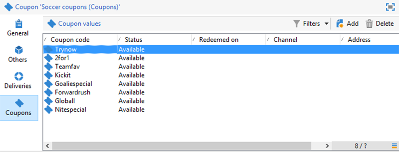

L’onglet Coupons n’est disponible qu’avec des coupons individuels. Une fois qu’un coupon est associé à une diffusion, l’onglet Coupons fournit les détails suivants :

* **[!UICONTROL Etat]** : Disponibilité du coupon.
* **[!UICONTROL Consommé le]** : Date à laquelle le coupon est consommé.
* **[!UICONTROL Canal]** : Canal utilisé pour envoyer le coupon.
* **[!UICONTROL Adresse]** : Adresses email des destinataires.

Les valeurs des champs **[!UICONTROL état]**, **[!UICONTROL canal]** et **[!UICONTROL adresse]** sont remplies automatiquement. En revanche, les valeurs du champ **[!UICONTROL consommé le]** ne sont pas récupérées par Campaign. Elles peuvent être remplies en important un fichier comportant les informations de consommation des coupons.

## Insertion dʼun coupon dans une diffusion e-mail {#inserting-a-coupon-into-an-email-delivery}

Dans l&#39;exemple ci-dessous, la diffusion est créée à partir de la Page d&#39;accueil. Pour obtenir des instructions détaillées sur la création d&#39;une diffusion, consultez [cette section](email.md)
1. Allez sur **[!UICONTROL Campagnes]** et sélectionnez **[!UICONTROL Diffusions]**.
1. Cliquez sur **[!UICONTROL Créer]**.

   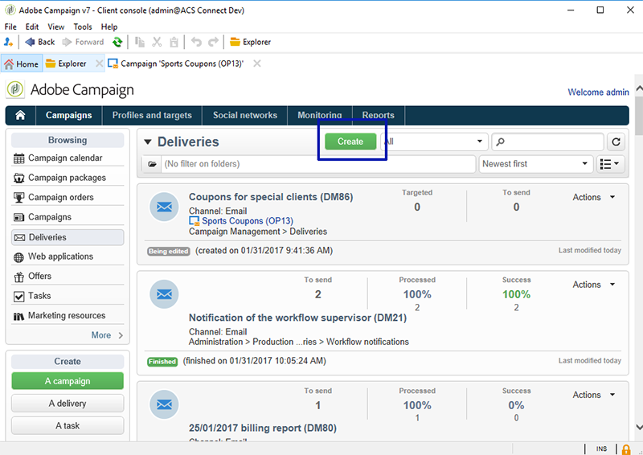

1. Saisissez un nom dans le champ **[!UICONTROL Libellé]** et cliquez sur **[!UICONTROL Continuer]**.
1. Cliquez sur **[!UICONTROL Pour]** pour ajouter des destinataires.
1. Cliquez sur **[!UICONTROL Ajouter]** pour sélectionner des destinataires pour la diffusion. Une fois les destinataires sélectionnés, cliquez sur **[!UICONTROL Ok]** pour retourner à la diffusion.

   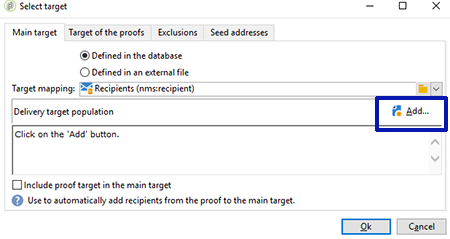

1. Saisissez un objet et ajoutez du contenu au message.

   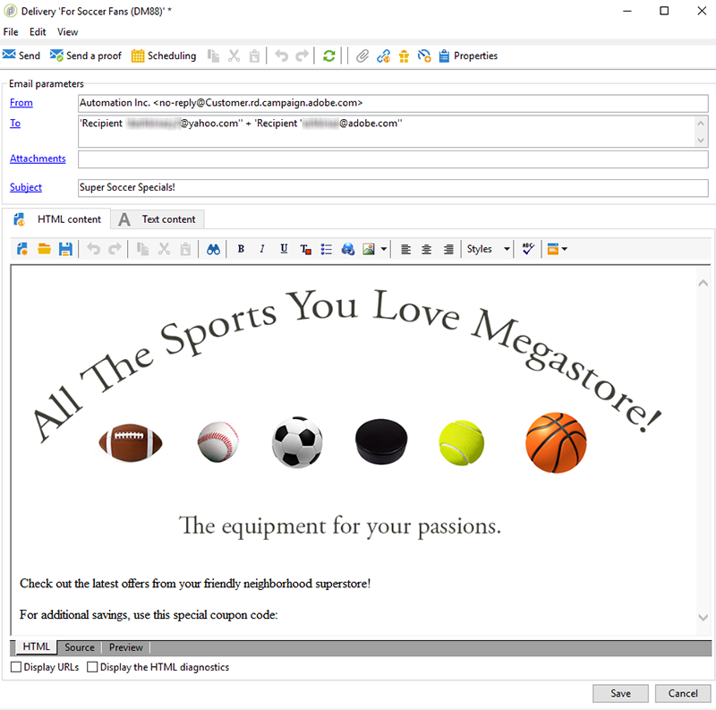

1. Dans la barre d&#39;outils, cliquez sur **[!UICONTROL Propriétés]** et sélectionnez l&#39;onglet **[!UICONTROL Avancé]**.
1. Cliquez sur l&#39;icône dossier pour la **[!UICONTROL Gestion des coupons]**.

   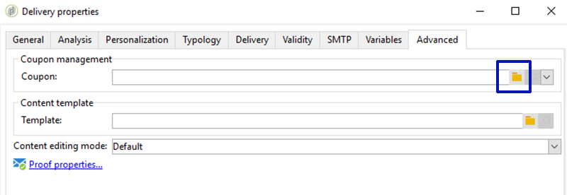

1. Sélectionnez le coupon et cliquez sur **[!UICONTROL Ok]**. Cliquez à nouveau sur **[!UICONTROL Ok]**.

   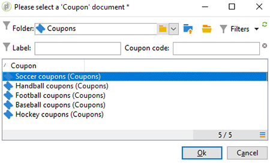

1. Cliquez sur le message pour choisir l&#39;emplacement du coupon.

   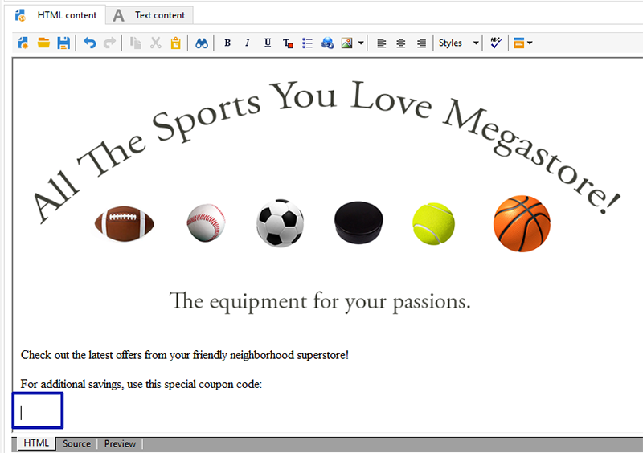

1. Cliquez sur l&#39;icône de personnalisation pour choisir l&#39;une des options suivantes en fonction du type de coupon :

   * Coupon anonyme : **[!UICONTROL Coupon > Code coupon]**

     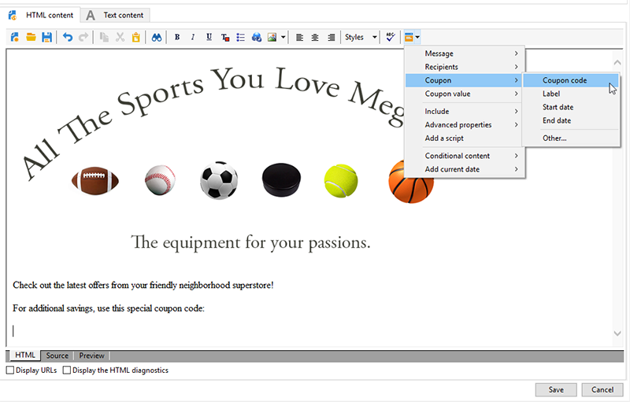

   * Coupon individuel : **[!UICONTROL Valeur de coupon > Code coupon]**

     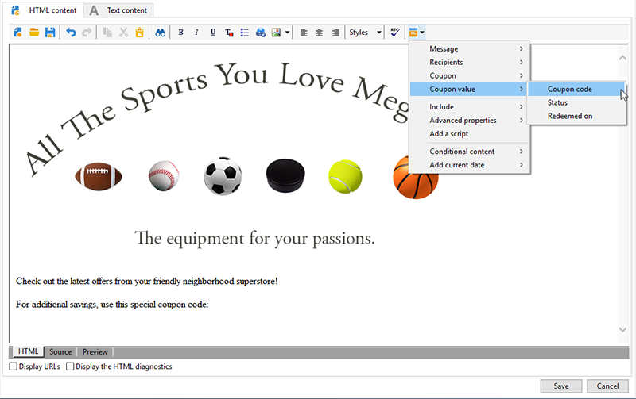

     Le bon est inséré dans le message sous forme de code plutôt que sous le nom que vous avez attribué. Le code est utilisé dans le modèle de données de l’ootb Campaign.

   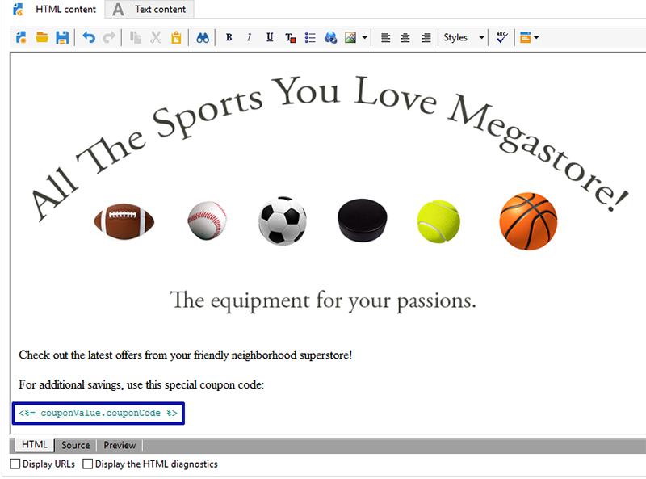

1. Lancez un test pour confirmer le nom assigné au coupon. Allez dans l&#39;onglet **[!UICONTROL Prévisualisation]** et cliquez sur **[!UICONTROL Tester la personnalisation]**. Sélectionnez un destinataire pour le test.

   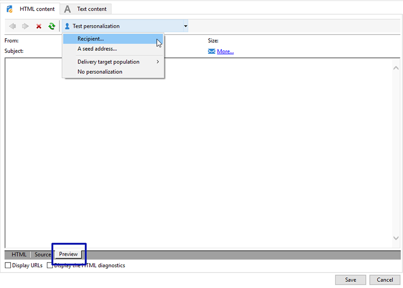

   A la suite du test, le coupon devrait apparaître sous forme du nom assigné et non du code.

   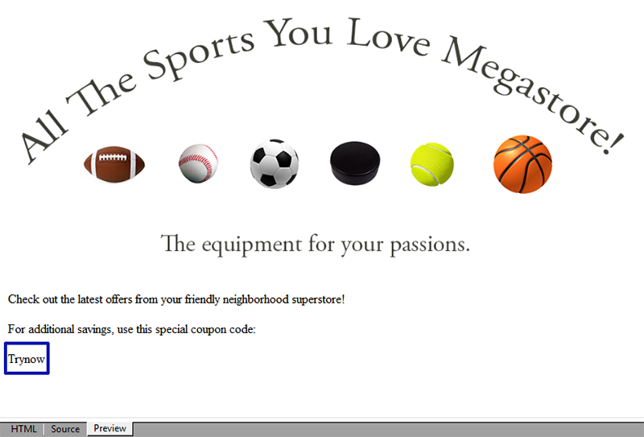

1. Dans la barre d&#39;outils, cliquez sur **[!UICONTROL Envoyer]** (en haut à gauche) et sélectionnez le mode d&#39;envoi de la diffusion.

   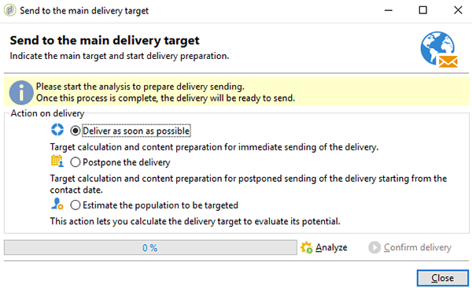

1. Cliquez sur **[!UICONTROL Analyser]**. Si le log d&#39;analyse confirme qu&#39;il y a assez de coupons pour tous les destinataires, cliquez sur **[!UICONTROL Confirmer l&#39;envoi]** pour l&#39;envoyer.

   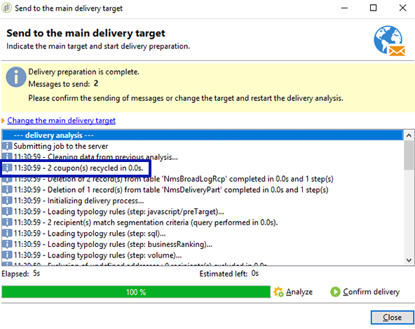

>[!NOTE]
>
>Pour obtenir des instructions sur la gestion du manque de coupons pour une diffusion, consultez la section [Gestion des coupons insuffisants](#managing-insufficient-coupons).

Pour confirmer que la diffusion a abouti :

1. Allez sur **[!UICONTROL Explorateur > Ressources > Gestion de campagne > Coupons]**.
1. Cliquez sur l&#39;onglet **[!UICONTROL Diffusions]**.

   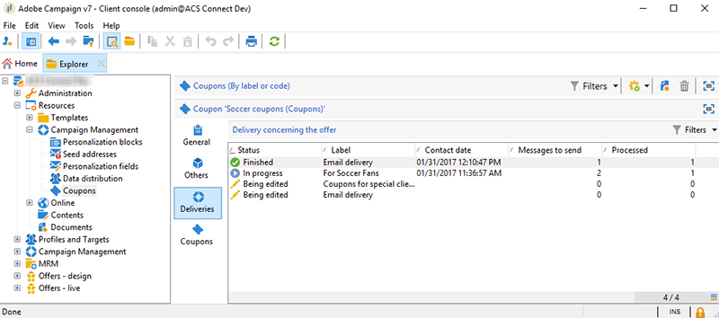

   En cas de diffusion réussie, l&#39;état est **[!UICONTROL Terminé]**.

>[!NOTE]
>
>Par défaut, le module de gestion des coupons utilise une table **nms:recipient**. [En savoir plus](../dev/datamodel.md#ootb-profiles).
>
>Découvrez comment utiliser une table des destinataires personnalisée [sur cette page](../dev/custom-recipient.md).

## Gestion des coupons insuffisants {#managing-insufficient-coupons}

L’analyse de la diffusion s’arrête s’il y a moins de coupons que de messages. Dans ce cas, vous pouvez importer plus de coupons ou restreindre le nombre de messages. Suivez les instructions ci-dessous si vous souhaitez limiter le nombre de messages.

1. Allez dans la fenêtre de diffusion email.
1. Cliquez sur **[!UICONTROL Pour]**.
1. Dans **[!UICONTROL Choix de la cible]**, allez dans l&#39;onglet **[!UICONTROL Exclusions]**.

   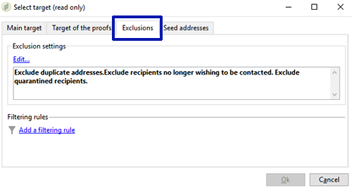

1. Dans la section paramètres d&#39;exclusion, cliquez sur **[!UICONTROL Editer]**.
1. Saisissez le nombre de messages à envoyer dans **[!UICONTROL Limiter la diffusion à...messages]** et cliquez sur **[!UICONTROL Ok]**. Vous pouvez envoyer la diffusion.

   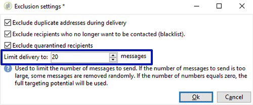

>[!NOTE]
>
>Lors de la gestion d’un nombre limité de coupons, un workflow de diffusion permet de fractionner la diffusion en fonction de vos critères. Il s’agit d’une bonne option si vous souhaitez envoyer des coupons à une population sélectionnée sans restreindre la cible.
