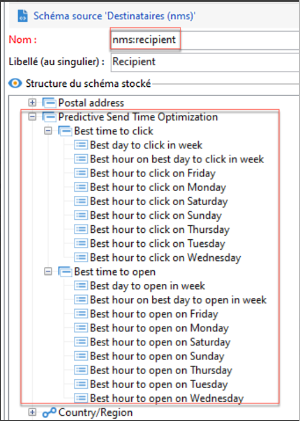

# Optimisation du temps d’envoi et notation prédictive de l’engagement{#optimize-message-delivery}

Optimisé par l’IA et l’apprentissage automatique, l’optimisation du temps d’envoi et la notation de l’engagement prédictif d’Adobe Campaign peuvent analyser et prédire les taux d’ouverture, les temps d’envoi optimaux et l’attrition probable en fonction des mesures d’engagement historiques.

Adobe Campaign propose deux nouveaux modèles d’apprentissage automatique : [Optimisation prédictive de l’heure d’envoi](#predictive-send) et [Score prédictif de l’engagement](#predictive-scoring). Ces deux modèles sont des modèles d’apprentissage automatique spécifiques à la conception et à la diffusion de meilleurs parcours clients.

>[!CAUTION]
>
>Cette fonctionnalité ne fait pas partie des paramètres d’usine du produit. Il est uniquement disponible pour les clients Adobe Campaign Managed Cloud Services exécutant Adobe Campaign Classic v7 ou Adobe Campaign v8.
>
>La mise en œuvre nécessite l’implication d’Adobe Consulting. Pour en savoir plus, contactez votre représentant Adobe.

## Optimisation de l&#39;heure d&#39;envoi prédictive{#predictive-send}

L’optimisation prédictive de l’heure d’envoi prédit la meilleure heure d’envoi pour chaque profil de destinataire pour les ouvertures d’email ou les clics et pour les ouvertures de messages push. Pour chaque profil de destinataire, les scores indiquent la meilleure heure d’envoi pour chaque jour de la semaine et le jour de la semaine le plus approprié à l’envoi afin d’obtenir les meilleurs résultats.

Le modèle d’optimisation prédictive de l’heure d’envoi comprend deux sous-modèles :

* L’heure d’envoi prédictive pour les ouvertures est le meilleur moment pour envoyer une communication au client afin de maximiser les ouvertures

* L’heure d’envoi prédictive pour les clics est le meilleur moment pour envoyer une communication au client afin de maximiser les clics

**Entrée du modèle**: Logs de diffusion, logs de tracking et attributs de profil (autres que PII)

**Sortie de modèle**: Meilleur moment pour envoyer un message (pour les ouvertures et les clics)

Détails de la sortie:

* Calculez la meilleure heure d’envoi de l’email pendant les 7 jours de la semaine avec des intervalles d’une heure (p. ex. : 9 h, 10 h, 11 h)
* Le modèle indique le meilleur jour de la semaine et la meilleure heure de la journée.
* Chaque heure optimale est calculée deux fois : une fois pour maximiser le taux d’ouverture et une fois pour maximiser le taux de clics
* 16 champs sont proposés (14 pour les jours de la semaine et 2 pour toute la semaine) :
   * meilleur moment pour envoyer un email afin d’optimiser les clics pour le lundi - valeurs comprises entre 0 et 23
   * meilleur moment pour envoyer un email afin d’optimiser les ouvertures pour le lundi - valeurs comprises entre 0 et 23
   * ...
   * meilleur moment pour envoyer un email afin d’optimiser les clics pour le dimanche - valeurs comprises entre 0 et 23
   * meilleur moment pour envoyer un email afin d’optimiser les ouvertures pour le dimanche - valeurs comprises entre 0 et 23
   * ...
   * meilleure journée pour envoyer un email afin d’optimiser les ouvertures pour toute la semaine - Du lundi au dimanche
   * meilleur moment pour envoyer un email afin d’optimiser les ouvertures pour toute la semaine - valeurs comprises entre 0 et 23

L’optimisation prédictive de l’heure d’envoi est stockée au niveau du profil :

>[!NOTE]
>
>Le modèle nécessite au moins un mois de données pour produire des résultats significatifs. Ces fonctionnalités de prédiction s’appliquent uniquement aux canaux email et push.

## Score prédictif de l&#39;engagement {#predictive-scoring}

La notation prédictive de l’engagement prédit la probabilité qu’un destinataire interagisse avec un message, ainsi que la probabilité de s’exclure (de se désabonner) dans les 7 jours suivant l’envoi du prochain email. Les probabilités sont divisées en compartiments en fonction du niveau d’engagement prévu pour votre contenu : élevé, moyen ou faible. Ces modèles fournissent également le rang centile de risque de désabonnement pour les clients afin de comprendre où se situe le rang d’un certain client par rapport à d’autres.

Le scoring d’engagement prédictif vous permet d’effectuer les opérations suivantes :

* **Sélectionner une audience** : en utilisant l’activité de requête, vous pouvez sélectionner l’audience à qui s’adresse un message spécifique.
* **Exclure une audience** : en utilisant l’activité de requête, vous pouvez supprimer l’audience à désabonner.
* **Personnaliser** : personnalisez le message en fonction du niveau d’engagement (les utilisateurs à forte interaction recevront un message différent de celui des utilisateurs à faible interaction).

Ce modèle utilise plusieurs scores pour indiquer :

* **Score d’engagement avec ouverture/Score d’engagement avec clic** : cette valeur correspond à la probabilité qu’un abonné interagisse avec un message spécifique (ouverture ou clic). Les valeurs sont comprises entre 0,0 et 1,0.
* **Probabilité de désabonnement** : cette valeur correspond à la probabilité pour le destinataire de se désabonner d’un canal email après l’ouverture d’un email. Les valeurs sont comprises entre 0,0 et 1,0.
* **Niveau de rétention** : cette valeur classe les utilisateurs en trois niveaux : bas, moyen et élevé. Élevé indique que l’utilisateur est susceptible de rester fidèle à la marque et faible indique qu’il est susceptible de se désabonner.
* **Rang centile de rétention** : profil classé en termes de probabilité de désabonnement. Les valeurs sont comprises entre 0,0 et 1,0. Par exemple, si le rang de pourcentage de rétention est de 0,953, ce destinataire est plus susceptible de rester fidèle à la marque et moins susceptible de se désabonner que 95,3 % de tous les destinataires.

>[!NOTE]
>
>Ces fonctionnalités de prévision s’appliquent uniquement aux envois d’email.
>
>Le modèle nécessite au moins un mois de données pour produire des résultats significatifs.

**Entrée du modèle** : logs de diffusion, logs de tracking et attributs de profil spécifiques

**Sortie du modèle** : attribut de profil qui décrit le score et la catégorie du profil
