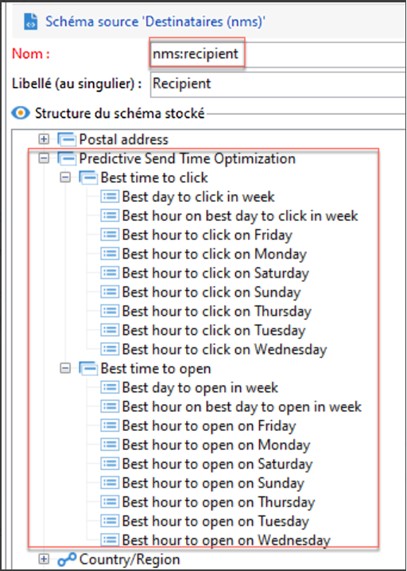

# Optimisation de l’heure d’envoi et score prédictif de l’engagement{#optimize-message-delivery}

Perfectionnés par l’IA et le machine learning, l’optimisation de l’heure d’envoi et le score prédictif de l’engagement d’Adobe Campaign peuvent analyser et estimer les taux d’ouverture, les temps d’envoi optimaux et l’attrition probable en fonction des mesures d’engagement historiques.

Adobe Campaign offre deux nouveaux modèles de machine learning : [optimisation prédictive de l’heure d’envoi](#predictive-send) et [score prédictif de l’engagement](#predictive-scoring). Ces deux modèles sont des modèles d’apprentissage automatique spécifiques à la conception et à la diffusion de meilleurs parcours clients.

>[!CAUTION]
>
>Cette fonctionnalité ne fait pas partie des paramètres d’usine du produit. Elle est uniquement disponible pour les clients d’Adobe Campaign Managed Cloud Services qui exécutent Adobe Campaign Classic v7 ou Adobe Campaign v8.
>
>La mise en œuvre nécessite l’implication d’Adobe Consulting. Pour en savoir plus, contactez votre représentant Adobe.
>

## Optimisation de l’heure d’envoi prédictive{#predictive-send}

L’optimisation de l’heure d’envoi prédictive estime la meilleure heure d’envoi pour chaque profil de destinataire en ce qui concerne les ouvertures d’e-mails ou les clics et les ouvertures de messages push. Pour chaque profil de destinataire, les scores indiquent la meilleure heure d’envoi pour chaque jour de la semaine et le jour de la semaine le plus approprié à l’envoi afin d’obtenir les meilleurs résultats.

Dans le modèle d’optimisation de l’heure d’envoi prédictive, il existe deux sous-modèles :

* L’heure d’envoi prédictive pour les ouvertures est le meilleur moment pour envoyer une communication au client afin de maximiser les ouvertures

* L’heure d’envoi prédictive pour les clics est le meilleur moment pour envoyer une communication au client afin de maximiser les clics

**Entrée du modèle** : logs de diffusion, logs de tracking et attributs de profil (autres que les informations d’identification personnelles)

**Sortie du modèle** : meilleur moment pour envoyer un message (pour les ouvertures et les clics)

Détails de la sortie :

* Calculez la meilleure heure d’envoi d’un e-mail pendant les 7 jours de la semaine avec des intervalles d’une heure (par exemple : 9:00h, 10:00, 11:00).
* Le modèle indique le meilleur jour de la semaine et la meilleure heure de la journée.
* Chaque heure optimale est calculée deux fois : une fois pour maximiser le taux d’ouverture et une fois pour maximiser le taux de clics
* 16 champs sont proposés (14 pour les jours de la semaine et 2 pour toute la semaine) :
   * meilleur moment pour envoyer un email afin d’optimiser les clics pour le lundi - valeurs comprises entre 0 et 23
   * meilleur moment pour envoyer un email afin d’optimiser les ouvertures pour le lundi - valeurs comprises entre 0 et 23
   * ...
   * meilleur moment pour envoyer un email afin d’optimiser les clics pour le dimanche - valeurs comprises entre 0 et 23
   * meilleur moment pour envoyer un email afin d’optimiser les ouvertures pour le dimanche - valeurs comprises entre 0 et 23
   * ...
   * meilleure journée pour envoyer un email afin d’optimiser les ouvertures pour toute la semaine - Du lundi au dimanche
   * meilleur moment pour envoyer un email afin d’optimiser les ouvertures pour toute la semaine - valeurs comprises entre 0 et 23

L’optimisation de l’heure d’envoi prédictive est stockée au niveau du profil :

>[!NOTE]
>
>Le modèle nécessite au moins un mois de données pour produire des résultats significatifs. Ces fonctionnalités prédictives s’appliquent uniquement aux canaux e-mail et push.
>

## Score prédictif de l’engagement {#predictive-scoring}

Le score prédictif de l’engagement estime la probabilité qu’un destinataire interagisse avec un message, ainsi que la probabilité de se désinscrire dans les 7 jours suivant l’envoi du prochain e-mail. Les probabilités sont divisées en compartiments en fonction du niveau d’engagement estimé pour votre contenu : élevé, moyen ou faible. Ces modèles fournissent également le rang percentile du risque de désabonnement pour les clients, afin de comprendre où se situe le rang d’un certain client par rapport aux autres.

Le scoring d’engagement prédictif vous permet d’effectuer les opérations suivantes :

* **Sélectionner une audience** : en utilisant l’activité de requête, vous pouvez sélectionner l’audience à qui s’adresse un message spécifique.
* **Exclure une audience** : en utilisant l’activité de requête, vous pouvez supprimer l’audience à désabonner.
* **Personnaliser** : personnalisez le message en fonction du niveau d’engagement (les utilisateurs à forte interaction recevront un message différent de celui des utilisateurs à faible interaction).

Ce modèle utilise plusieurs scores pour indiquer :

* **Score d’engagement avec ouverture/Score d’engagement avec clic** : cette valeur correspond à la probabilité qu’un abonné interagisse avec un message spécifique (ouverture ou clic). Les valeurs sont comprises entre 0,0 et 1,0.
* **Probabilité de désabonnement** : cette valeur correspond à la probabilité pour le destinataire de se désabonner d’un canal email après l’ouverture d’un email. Les valeurs sont comprises entre 0,0 et 1,0.
* **Niveau de rétention** : cette valeur classe les utilisateurs en trois niveaux : bas, moyen et élevé. Élevé indique que l’utilisateur est susceptible de rester fidèle à la marque et faible indique qu’il est susceptible de se désabonner.
* **Rang percentile de rétention** : profil classé en termes de probabilité de désabonnement. Les valeurs sont comprises entre 0,0 et 1,0. Par exemple, si le rang de pourcentage de rétention est de 0,953, cette personne destinataire est plus susceptible de rester fidèle à la marque et moins susceptible de se désabonner que 95,3 % de toutes les personnes destinataires.

>[!NOTE]
>
>Ces fonctionnalités de prévision s’appliquent uniquement aux envois d’email.
>
>Le modèle nécessite au moins un mois de données pour produire des résultats significatifs.

**Entrée du modèle** : logs de diffusion, logs de tracking et attributs de profil spécifiques

**Sortie du modèle** : attribut de profil qui décrit le score et la catégorie du profil
