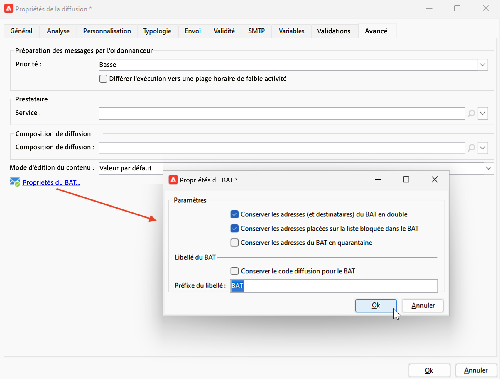

# Prévisualiser et tester votre e-mail {#preview-test}

Une fois le contenu du message défini, prévisualisez-le et testez-le à l’aide de profils de test. Si vous avez inséré du [contenu personnalisé](personalize.md), vous pouvez vérifier son contenu dans le message à l’aide des données de profil de test. De plus, pour détecter d’éventuelles erreurs dans le contenu du message ou les paramètres de personnalisation, envoyez des BAT aux profils de test. Un BAT doit être envoyé à chaque modification afin de valider le contenu le plus récent.

## Prévisualiser le contenu {#preview-content}

Avant d’envoyer des BAT, il est recommandé de vérifier le contenu du message dans la section de prévisualisation de la fenêtre de diffusion.

Pour prévisualiser le contenu du message, procédez comme suit :

1. Accédez à l’onglet **Prévisualisation** de la diffusion.
1. Cliquez sur le bouton **[!UICONTROL Tester la personnalisation]** pour sélectionner un profil et remplir les données de personnalisation. Vous pouvez choisir un ou une destinataire spécifique dans la base, une adresse de contrôle ou sélectionner un profil parmi la population cible, s’il a déjà été défini. Vous pouvez également vérifier le contenu sans la personnalisation.

   

1. La prévisualisation s’affiche et vous pouvez vérifier le rendu du message. Dans la prévisualisation du message, les éléments personnalisés sont remplacés par les données du profil de test sélectionné.

   

1. Sélectionnez d’autres profils de test pour prévisualiser le rendu des e-mails pour chaque variante de votre message.

## Envoyer des BAT {#send-proofs}

Pour les diffusions e-mail, vous pouvez envoyer des BAT pour valider le contenu de votre message. L’envoi de BAT permet de vérifier le lien d’exclusion, la page miroir et d’autres liens, de valider le message, de vérifier le bon affichage des images, de détecter les erreurs possibles, etc. Vous souhaiterez peut-être également vérifier votre conception et le rendu sur différents appareils.

Le BAT est un message spécifique qui permet de tester un message avant son envoi à l’audience principale. Les destinataires du BAT procèdent ensuite à la validation du message : rendu, contenu, paramètres de personnalisation et configuration.

### Destinataires des BAT {#proofs-recipients}

La cible du BAT peut être définie dans le modèle de diffusion ou être spécifique à une diffusion. Dans les deux cas, accédez à l’écran de définition de la cible à partir du lien **[!UICONTROL À]** et cliquez sur l’onglet **[!UICONTROL Cible des BAT]**.

Sélectionnez le type de cible du BAT dans la liste déroulante **[!UICONTROL Mode de ciblage]**.

* Utilisez l’option **[!UICONTROL Définition d’une cible de BAT spécifique]** pour sélectionner les destinataires cibles du BAT dans la base de données.
* Utilisez l’option **[!UICONTROL Substitution de l’adresse]** pour saisir les adresses e-mail et utiliser les données des destinataires cibles pour valider le contenu. Les adresses de substitution peuvent être saisies manuellement ou sélectionnées dans la liste déroulante. L’énumération appropriée est « Substitution address » (rcpAddress).
Par défaut, la substitution est effectuée de manière aléatoire, mais vous pouvez sélectionner un destinataire spécifique dans la cible principale à l’aide de l’icône **[!UICONTROL Détail]**.

  {width="800" align="left"}

  Choisissez l’option **[!UICONTROL Sélectionner un profil (doit être inclus dans la cible)]** et sélectionnez un ou une destinataire.

  {width="800" align="left"}

* Utilisez l’option **[!UICONTROL Adresses de contrôle]** pour utiliser des adresses de contrôle en tant que cible du BAT. Ces adresses peuvent être importées à partir d’un fichier ou saisies manuellement.

  >[!NOTE]
  >
  >Les adresses de contrôle n’appartiennent pas au tableau des destinataires par défaut (nms:recipient). Elles sont créées dans un tableau distinct. Si vous étendez le tableau des destinataires avec de nouvelles données, vous devez étendre le tableau des adresses de contrôle avec les mêmes données.

  En savoir plus sur les adresses de contrôle dans [cette section](../audiences/test-profiles.md).

* Utilisez l’option **[!UICONTROL Cible spécifique et Adresses de contrôle]** pour cumuler des adresses de contrôle et des adresses e-mail spécifiques. Les paramétrages correspondants sont alors définis dans deux sous-onglets distincts.

### Envoyer un BAT {#proofs-send}

Pour envoyer des BAT, procédez comme suit :

1. Dans l’écran de définition du message, cliquez sur le bouton **[!UICONTROL Envoyer un BAT]**.
1. Dans la fenêtre **[!UICONTROL Envoyer un BAT]**, vérifiez les destinataires du BAT.
1. Cliquez sur **[!UICONTROL Analyser]** pour lancer la préparation des messages de BAT.

   {width="800" align="left"}

1. Une fois la préparation de la diffusion terminée, cliquez sur le bouton **[!UICONTROL Confirmer l’envoi]** pour commencer à envoyer les messages de BAT.

Accédez à l’onglet **[!UICONTROL Audit]** de la diffusion pour vérifier la diffusion des copies de BAT.

Il est recommandé d’envoyer des BAT après chaque modification du contenu du message.

>[!NOTE]
>
>Dans le BAT envoyé, le lien vers la page miroir est inactif. Il n’est actif que dans les messages finaux.

### Propriétés du BAT {#proofs-properties}

Les propriétés du BAT sont définies sous l’onglet **[!UICONTROL Avancé]** de la fenêtre des propriétés de la diffusion. Accédez au lien **[!UICONTROL Propriétés du BAT...]** pour définir les paramètres et le libellé des BAT. Vous pouvez choisir de conserver les éléments suivants :

* les adresses du BAT en double
* les adresses du BAT placées sur la liste bloquée
* les adresses du BAT en quarantaine

Par défaut, les messages de BAT sont identifiés par la mention `Proof #N` dans l’objet, où `N` est le numéro du BAT. Ce nombre est incrémenté à chaque analyse de diffusion du BAT. Vous pouvez modifier le préfixe `proof`, le cas échéant.

{width="800" align="left"}

## Vidéo pratique {#video-proof}

Découvrez comment envoyer et valider un BAT pour une diffusion e-mail.

>[!VIDEO](https://video.tv.adobe.com/v/333404)
