# Configuration révisée des notifications push {#push-notifications-config}

Campaign v8.5 présente son dernier service de notifications push, optimisé par un framework robuste reposant sur une technologie de pointe. Ce service est conçu pour atteindre des niveaux d’évolutivité supérieurs, afin que vos notifications puissent atteindre une audience plus large avec une efficacité optimale. Grâce à notre infrastructure améliorée et à nos processus optimisés, vous bénéficierez d’une plus grande échelle et d’une meilleure fiabilité. Vous pourrez ainsi communiquer avec vos utilisateurs et utilisatrices d’applications mobiles comme jamais auparavant.

>[!AVAILABILITY]
>
> Cette fonctionnalité est exclusivement accessible aux nouveaux clients et aux nouvelles clientes à partir de Campaign v8.5 et progressivement déployée vers une clientèle sélectionnée. Si votre environnement a été configuré avant juin 2023, cette page ne vous concerne pas et vous devez suivre les procédures détaillées [dans cette page](push-settings.md).

Dans le cadre de cette mise à jour, procédez comme suit pour envoyer des notifications push dans Adobe Campaign :

1. [Créer une surface d’application dans la collecte de données Adobe Experience Platform](#create-app-surface)

1. [Configurer les paramètres de votre application dans Adobe Campaign](#push-config-campaign)

1. [Créer et configurer une propriété mobile dans la collecte de données Adobe Experience Platform](#create-mobile-property)

1. [Ajout de l’extension Adobe Adobe Experience Platform Assurance](https://developer.adobe.com/client-sdks/documentation/platform-assurance-sdk/){target="_blank"}(recommandé)

1. [Ajouter Campaign Classic à votre application mobile](#campaign-mobile-ap)

1. [Créez une diffusion pour iOS et Android](##push-create)

>[!NOTE]
>
> Les anciens FCM et APNS p12 ne sont pas pris en charge par la collecte de données.

## Créer une surface d’application dans la collecte de données Adobe Experience Platform {#create-app-surface}

Vous devez ajouter les informations d’identification des notifications push de votre application mobile dans [!DNL Adobe Experience Platform Data Collection].

L’enregistrement des informations d’identification des notifications push de l’application mobile est nécessaire pour autoriser Adobe à envoyer des notifications push en votre nom. Reportez-vous aux étapes détaillées ci-dessous :

1. Depuis [!DNL Adobe Experience Platform Data Collection], sélectionnez l’onglet **[!UICONTROL Surfaces de l’application]** dans le panneau de gauche.

1. Cliquez sur **[!UICONTROL Créer une surface d’application]** pour créer une configuration.

   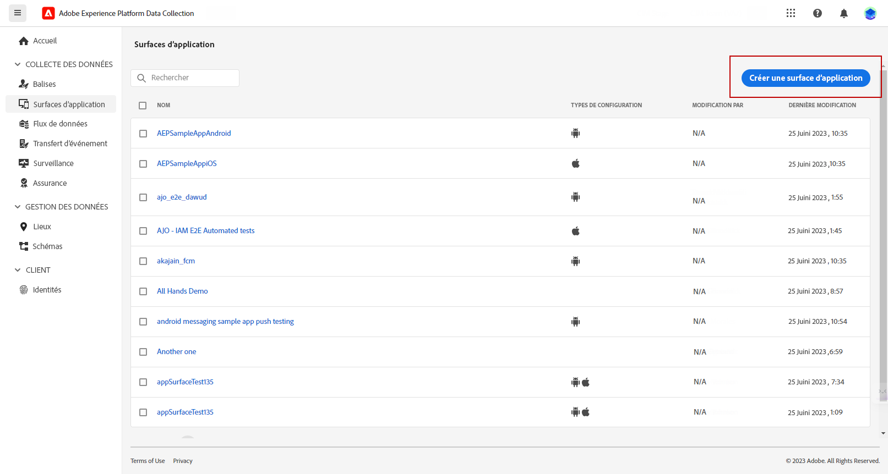

1. Saisissez un **[!UICONTROL nom]** pour la configuration.

1. À partir de **[!UICONTROL Configuration des applications mobiles]**, sélectionnez Système opérationnel :

>[!BEGINTABS]

>[!TAB iOS]

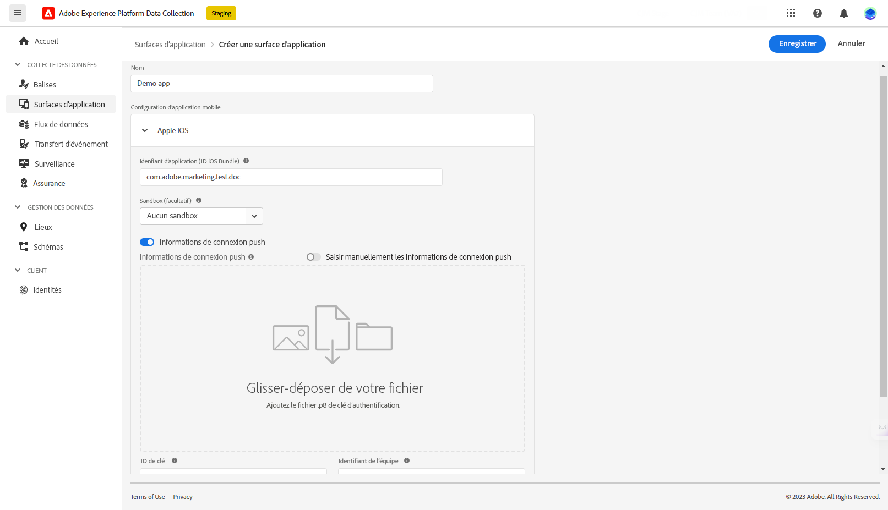

1. Saisissez **l’identifiant de bundle** de l’application mobile dans le champ de l’**[!UICONTROL ID d’application (ID de bundle iOS)]**.

   L’identifiant de bundle d’application se trouve dans l’onglet **Général** de la cible principale dans **XCode** de votre compte de développeur ou de développeuse Apple.

1. Activez **[!UICONTROL Informations d’identification des notifications push]** pour ajouter vos informations d’identification.

1. Glissez-déposez votre fichier de clé d’authentification de notification push Apple .p8.

   Cette clé peut être acquise à partir des pages **Certificats**, **Identificateurs** et **Profils** de votre compte de développeur ou développeuse Apple.

1. Fournissez l’**identifiant de clé**. Il s’agit d’une chaîne de 10 caractères attribuée lors de la création de la clé d’authentification p8.

       Elle se trouve sous l’onglet **Clés** dans les pages **Certificats**, **Identificateurs** et **Profils** de votre compte de développeur Apple.
   
1. Fournissez l’**identifiant de l’équipe**. Il s’agit d’une valeur de chaîne qui se trouve sous l’onglet **Abonnement**.

1. Cliquez sur **[!UICONTROL Enregistrer]** pour créer la configuration de votre application.

>[!TAB Android]

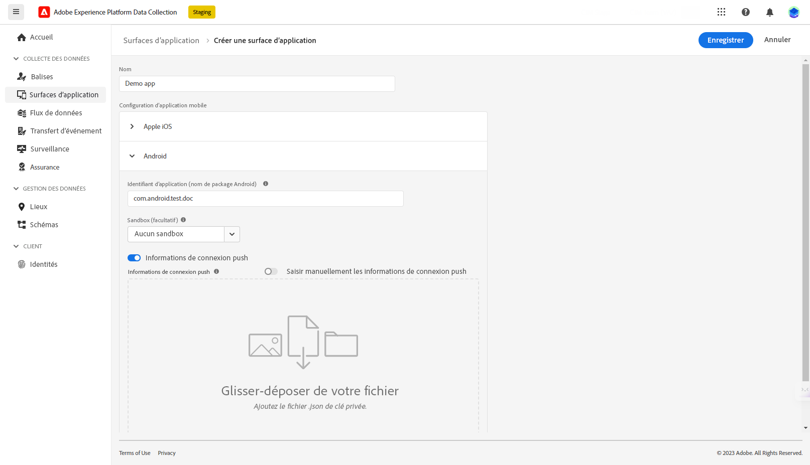

1. Fournissez l’**[!UICONTROL identifiant de l’application (nom du package Android)]**. En règle générale, le nom du package est l’identifiant d’application dans votre fichier `build.gradle`.

1. Activez **[!UICONTROL Informations d’identification des notifications push]** pour ajouter vos informations d’identification.

1. Glissez-déposez les informations d’identification des notifications push FCM. Pour plus d&#39;informations sur l&#39;obtention des informations d&#39;identification push, consultez la documentation de [Google](https://firebase.google.com/docs/admin/setup#initialize-sdk){target="_blank"}.

1. Cliquez sur **[!UICONTROL Enregistrer]** pour créer la configuration de votre application.

>[!ENDTABS]

## Configurer les paramètres de votre application dans Adobe Campaign{#push-config-campaign}

### Créer un service {#create-service}

Avant d’envoyer des notifications push, vous devez définir les paramètres de vos applications iOS et Android dans Adobe Campaign.

Les notifications push sont envoyées aux utilisateurs et utilisatrices de votre application par le biais d’un service dédié. Lorsque les utilisateurs et utilisatrices installent votre application, ils s’abonnent à ce service : Adobe Campaign s’appuie sur ce service pour cibler uniquement les abonné(e)s de votre application. Dans ce service, vous devez ajouter vos applications iOS et Android à envoyer sur les appareils iOS et Android.

Pour créer un service destiné à envoyer des notifications push, procédez comme suit :

1. Accédez à l’onglet **[!UICONTROL Profils et cibles > Services et abonnements]**, puis cliquez sur **[!UICONTROL Créer]**.

   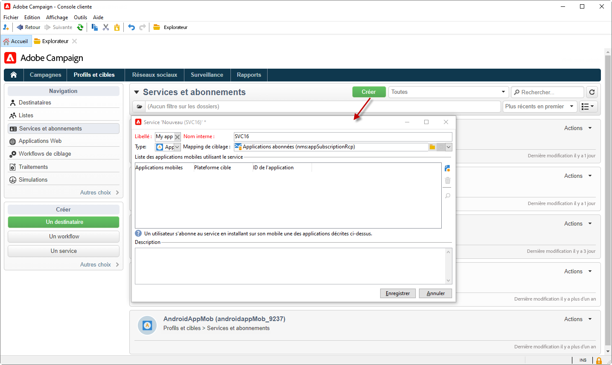{width="800" align="left"}

1. Saisissez un **[!UICONTROL Libellé]** et un **[!UICONTROL Nom interne]**, puis sélectionnez un type d’**[!UICONTROL Application mobile]**. 

   >[!NOTE]
   >
   >Le mapping de ciblage **[!UICONTROL Applications abonnées (nms:appSubscriptionRcp)]** par défaut est lié à la table des destinataires. Si vous souhaitez utiliser un autre mapping de ciblage, vous devez en créer un nouveau et le saisir dans le champ **[!UICONTROL Mapping de ciblage]** du service. Pour plus d’informations sur les mappings de ciblage, consultez [cette page](../audiences/target-mappings.md).

1. Ensuite, utilisez l’icône **[!UICONTROL Ajouter]** sur la droite pour définir les applications mobiles qui utilisent ce service.

   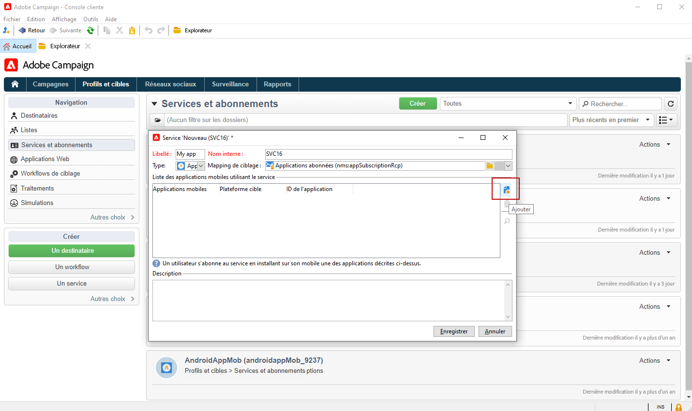

### Créer une application mobile {#create-sapp}

Après avoir créé votre service, vous devez définir les applications mobiles qui utiliseront ce service.

>[!BEGINTABS]

>[!TAB iOS]

Pour créer une application pour les appareils iOS, procédez comme suit :

1. Depuis Service, cliquez sur **[!UICONTROL Ajouter]** puis sélectionnez **[!UICONTROL Créer une application iOS]**. Cliquez sur **[!UICONTROL Suivant]**.

   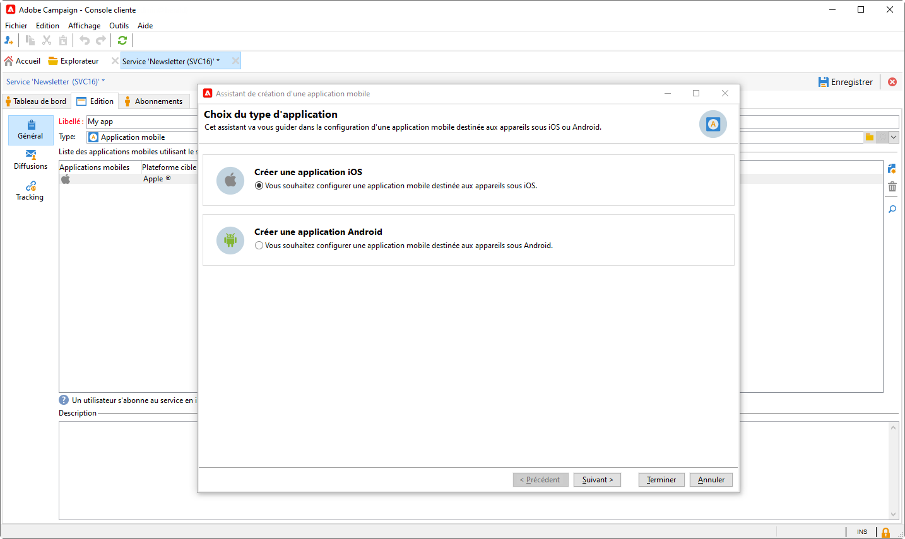

1. Dans la fenêtre **[!UICONTROL Liste des configurations de l’application Launch]**, sélectionnez la surface de l’application créée précédemment dans cette section. Cliquez sur **[!UICONTROL Suivant]**.

   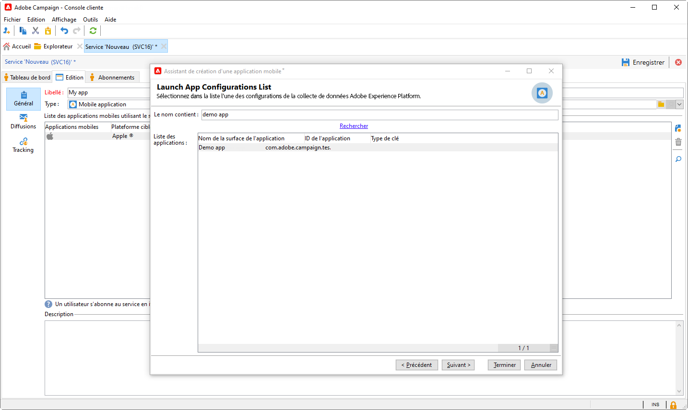

1. (facultatif) Vous pouvez enrichir le contenu d’un message push avec certaines **[!UICONTROL variables d’application]**. Elles sont entièrement personnalisables et font partie de la payload du message envoyé à l&#39;appareil mobile.

   Dans l’exemple suivant, les variables **mediaURl** et **mediaExt** sont ajoutées pour créer une notification push enrichie et fournir à l’application l’image à afficher dans la notification.

   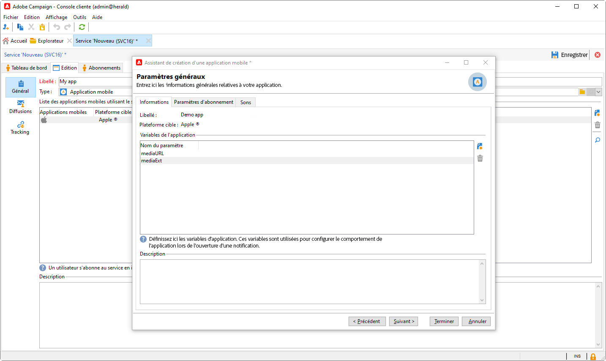

1. Accédez à l’onglet **[!UICONTROL Paramètres d’abonnement]** pour définir le mapping avec une extension du schéma **[!UICONTROL Applications abonnées (nms:appsubscriptionRcp)]**.

1. Accédez à l’onglet **[!UICONTROL Sons]** pour définir un son à lire. Cliquez sur **[!UICONTROL Ajouter]** et renseignez le champ **[!UICONTROL Nom interne]**. Il doit contenir le nom du fichier incorporé dans l’application ou le nom du son système.

1. Cliquez sur **[!UICONTROL Suivant]** pour passer à la configuration de l’application de développement.

1. La **[!UICONTROL clé d’intégration]** est spécifique à chaque application. Elle relie l’application mobile à Adobe Campaign et sera utilisée lors de la configuration de l’extension Campaign.

   Assurez-vous que la même **[!UICONTROL clé d’intégration]** est définie dans Adobe Campaign et dans le code de l’application via le SDK.

   Pour en savoir plus, consultez la [documentation pour les développeurs et développeuses](https://developer.adobe.com/client-sdks/documentation/adobe-campaign-classic/#configuration-keys){target="_blank"}.

   >[!NOTE]
   >
   > La **[!UICONTROL clé d&#39;intégration]** est entièrement personnalisable avec une valeur de chaîne, mais doit être exactement identique à celle spécifiée dans le SDK.
   >
   > Vous ne pouvez pas utiliser le même certificat pour la version de développement (sandbox) et la version de production de l’application.

   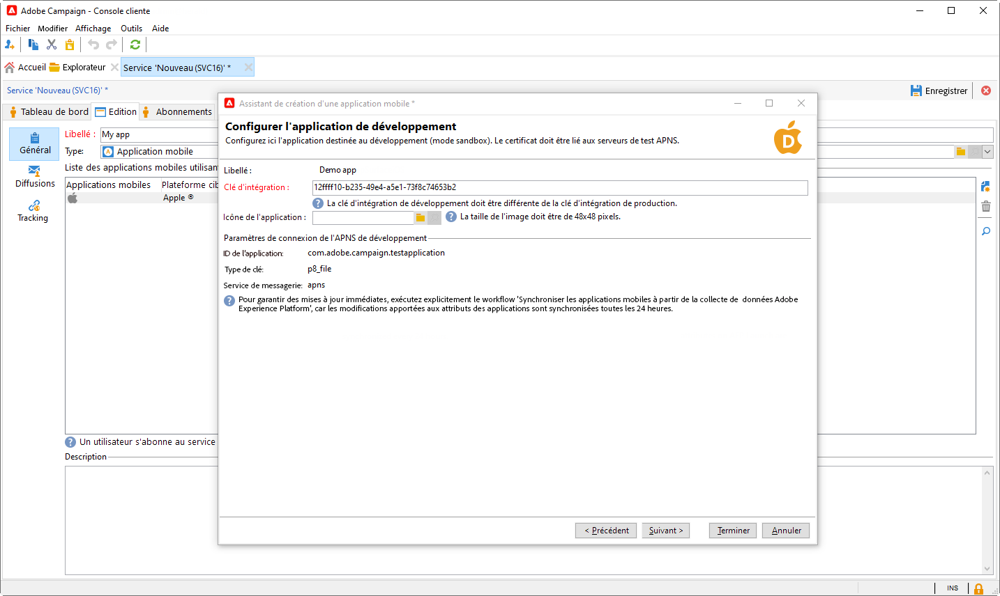

1. Sélectionnez l’icône dans le champ **[!UICONTROL Icône de l’application]** pour personnaliser l’application mobile dans votre service.

1. Cliquez sur **[!UICONTROL Suivant]** pour passer à la configuration de l’application de production et procédez comme décrit ci-dessus. Veuillez noter que vous ne pouvez pas utiliser la même **[!UICONTROL clé d’intégration]** pour la version de développement (sandbox) et la version de production de l’application.

1. Cliquez sur **[!UICONTROL Terminer]**.

Votre application iOS est maintenant prête à être utilisée dans Campaign.

>[!TAB Android]

Pour créer une application pour les appareils Android, procédez comme suit :

1. Dans votre Service, cliquez sur **[!UICONTROL Ajouter]** puis sélectionnez **[!UICONTROL Créer une application Android]**. Cliquez sur **[!UICONTROL Suivant]**.

   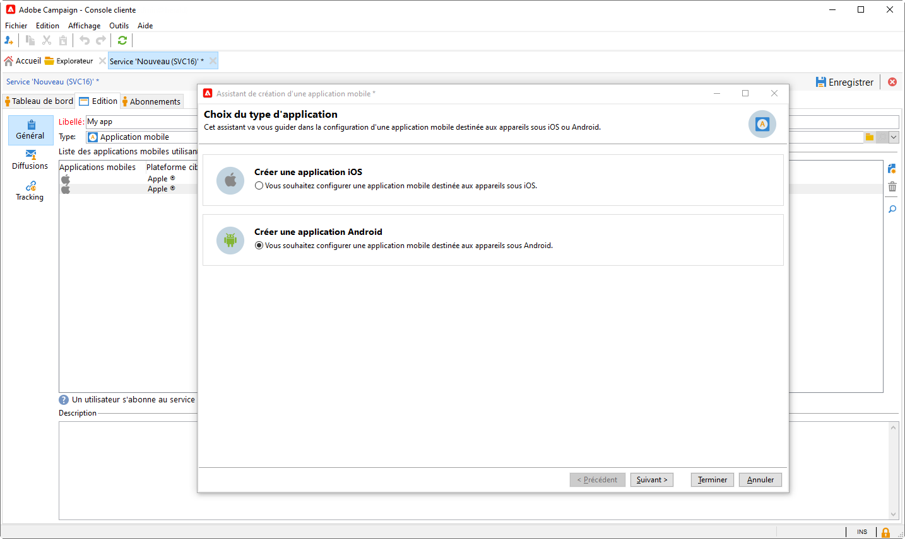

1. Dans la fenêtre **[!UICONTROL Liste des configurations de l’application Launch]**, sélectionnez la surface de l’application créée dans cette section et cliquez sur **[!UICONTROL Suivant]**.

   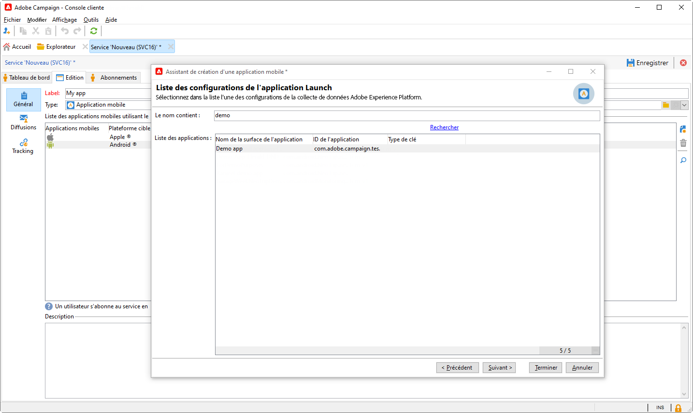

1. La clé d’intégration est spécifique à chaque application. Elle relie l’application mobile à Adobe Campaign et sera utilisée lors de la configuration de l’extension Campaign.

   Assurez-vous que la même **[!UICONTROL clé d’intégration]** est définie dans Adobe Campaign et dans le code de l’application via le SDK.

   Pour en savoir plus, consultez la [documentation pour les développeurs et développeuses](https://developer.adobe.com/client-sdks/documentation/adobe-campaign-classic/#configuration-keys){target="_blank"}.

   >[!NOTE]
   >
   > La **[!UICONTROL clé d&#39;intégration]** est entièrement personnalisable avec une valeur de chaîne, mais doit être exactement identique à celle spécifiée dans le SDK.

   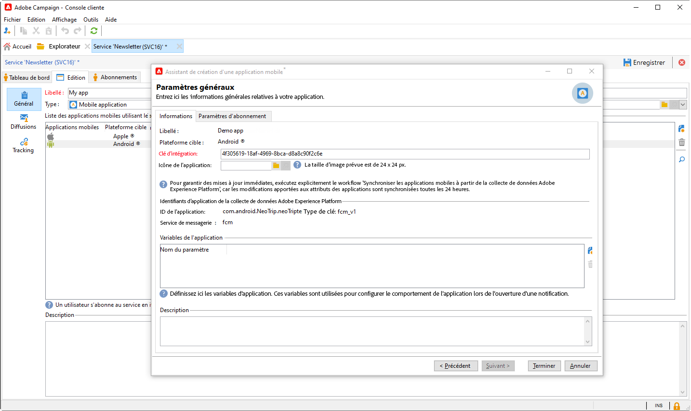

1. Sélectionnez l’icône dans le champ **[!UICONTROL Icône de l’application]** pour personnaliser l’application mobile dans votre service.

1. (facultatif) Vous pouvez, si nécessaire, enrichir le contenu d&#39;un message push avec certaines **[!UICONTROL variables d’application]**. Elles sont entièrement personnalisables et font partie de la payload du message envoyé à l&#39;appareil mobile.

1. Accédez à l’onglet **[!UICONTROL Paramètres d’abonnement]** pour définir le mapping avec une extension du schéma **[!UICONTROL Applications abonnées (nms:appsubscriptionRcp)]**.

1. Cliquez sur **[!UICONTROL Terminer]**, puis sur **[!UICONTROL Enregistrer]**.

Votre application Android est maintenant prête à être utilisée dans Campaign.

>[!ENDTABS]

Vous trouverez ci-dessous les noms de payload FCM pour personnaliser davantage votre notification push :

| Type de message | Élément de message configurable (nom de payload FCM) | Options configurables (nom de payload FCM) |
|:-:|:-:|:-:|
| Message de données | N/A | validate_only |
| Message de notification | title, body, android_channel_id, icon, sound, tag, color, click_action, image, ticker, sticky, visibility, notification_priority, notification_count   | validate_only |

## Configurer une propriété mobile dans la collecte de données Adobe Experience Platform {#create-mobile-property}

1. Sur la page d’accueil de la collecte de données, accédez au menu Balises.

1. Cliquez sur **[!UICONTROL Nouvelle propriété]**.

   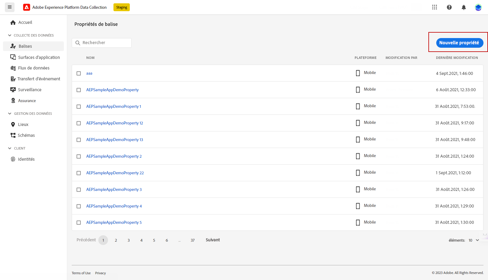

1. Saisissez le nom de la propriété et sélectionnez **[!UICONTROL Mobile]** comme plateforme.

   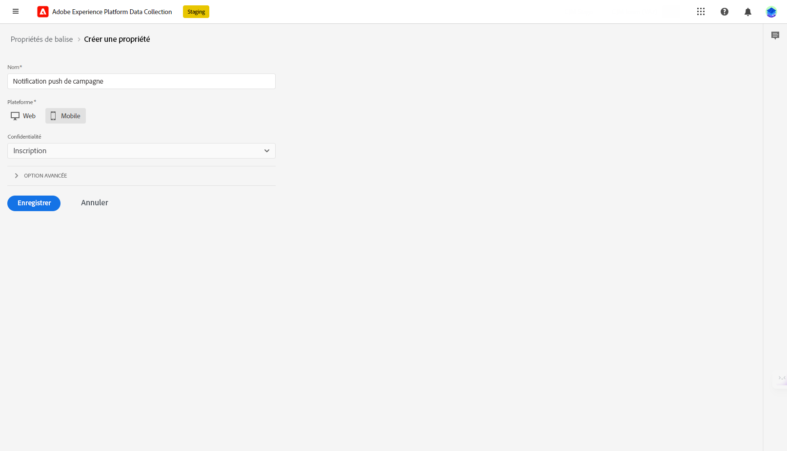

1. Cliquez sur **[!UICONTROL Enregistrer]** pour créer la propriété mobile.

1. Accédez à la propriété mobile que vous venez de créer.

1. Dans le tableau de bord de vos propriétés mobiles, accédez au menu **[!UICONTROL Extensions]** puis à l’onglet **[!UICONTROL Catalogue]**.

   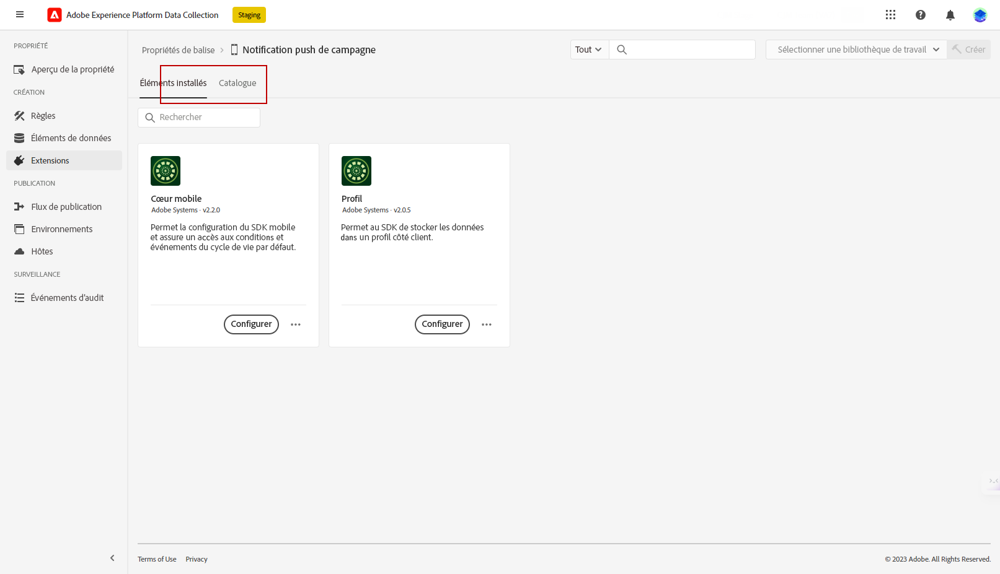

1. Installez l’extension **[!DNL Adobe Campaign Classic]**. [En savoir plus sur l’extension Campaign](https://developer.adobe.com/client-sdks/documentation/adobe-campaign-classic/#configure-campaign-classic-extension)

   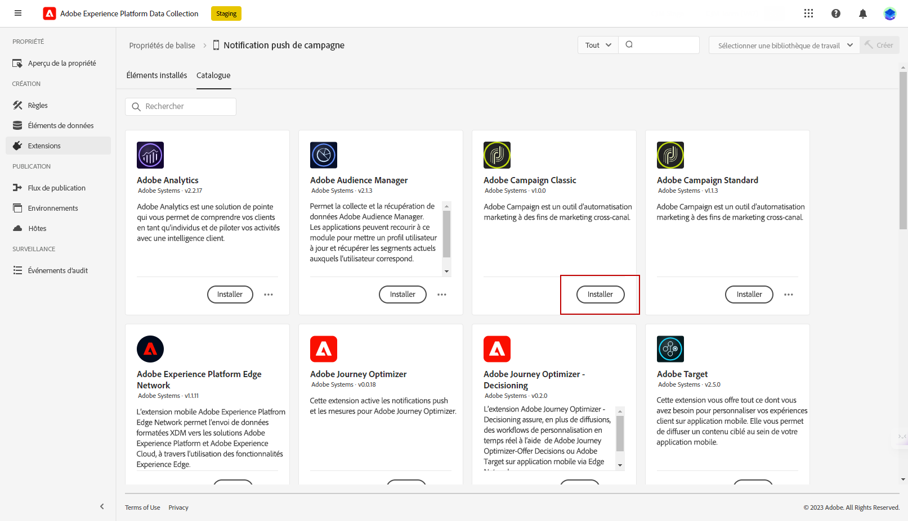

1. Renseignez les détails de votre instance :

   * Les URL **[!UICONTROL Point d’entrée d’enregistrement]** ou **[!UICONTROL Point d’entrée de suivi]** se trouvent dans le menu **[!UICONTROL Outils]** > **[!UICONTROL Avancé]** > **[!UICONTROL Assistant de déploiement]** dans Campaign.
   * Les **[!UICONTROL clés d’intégration]** se trouvent dans l’application mobile configurée dans [cette section](#create-app).

   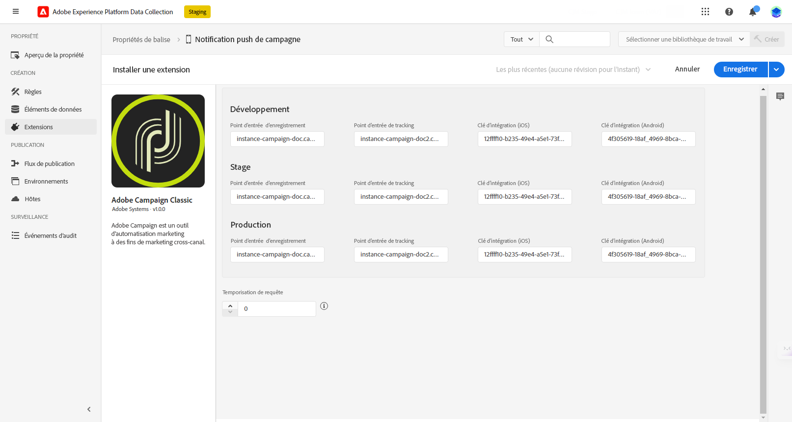

1. Cliquez sur **[!UICONTROL Enregistrer]**.

1. Vous devez maintenant publier la configuration à partir du menu **[!UICONTROL Flux de publication]**. [En savoir plus](https://developer.adobe.com/client-sdks/documentation/getting-started/create-a-mobile-property/#publish-the-configuration).

Votre propriété mobile sera désormais automatiquement synchronisée avec le workflow technique **[!UICONTROL Collecte de données Adobe Experience Platform]**. [En savoir plus](../../automation/workflow/technical-workflows.md#list-technical-workflows).

## Ajouter Campaign Classic à votre application mobile {#campaign-mobile-app}

Le SDK mobile Adobe Experience Platform permet d’optimiser les solutions et services Experience Cloud d’Adobe dans vos applications mobiles. La configuration des SDK s’effectue dans l’interface utilisateur de collecte de données, qui offre des options de configuration flexibles et des intégrations extensibles basées sur des règles.

[En savoir plus dans la documentation d’Adobe Developer](https://developer.adobe.com/client-sdks/documentation/adobe-campaign-classic/#add-campaign-classic-to-your-app){target="_blank"}.

## Créer votre notification push{#push-create}

Une fois que vous avez correctement configuré votre application mobile dans la collecte de données, vous pouvez créer et envoyer des notifications push dans Adobe Campaign.

Reportez-vous à [cette page](push.md#push-create) pour les éléments détaillés spécifiques à la diffusion des notifications iOS et Android.
