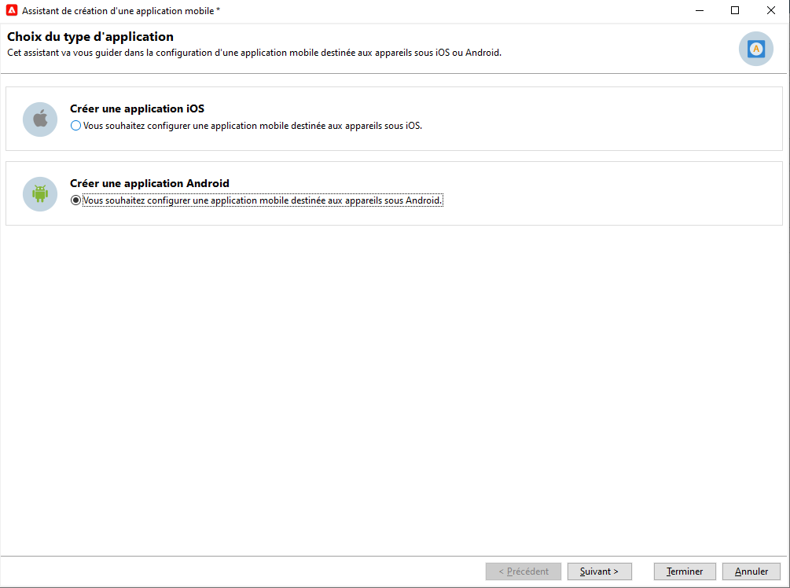

# Configurer le canal de notification push {#push-notification-configuration}

Pour envoyer des notifications push avec Adobe Campaign, vous devez d’abord configurer votre environnement et votre application, comme décrit sur cette page. Dans Adobe Campaign, le canal d’envoi des notifications push est le canal de l’application mobile.

>[!CAUTION]
>
>Certaines modifications importantes apportées au service Android FCM (Firebase Cloud Messaging) seront publiées en 2024 et auront une incidence sur votre mise en œuvre d’Adobe Campaign. Il se peut que la configuration de vos services d’abonnement pour les messages push Android doive être mise à jour pour prendre en charge cette modification. Vous pouvez déjà vérifier et agir. [En savoir plus](../../technotes/upgrades/push-technote.md).

Avant de commencer à envoyer des notifications push avec Adobe Campaign, vous devez vous assurer que les configurations et les intégrations sont en place sur l’application mobile et pour les balises dans Adobe Experience Platform. Le SDK mobile Adobe Experience Platform fournit des API d’intégration côté client pour vos mobiles via les SDK compatibles Android et iOS.

Pour configurer votre application avec des SDK mobiles Adobe Experience Platform, procédez comme suit :

1. Vérifiez les [conditions préalables](#before-starting).
1. Configurez une [propriété de balise mobile](#launch-property) dans la collecte de données Adobe Experience Platform.
1. Procurez-vous le SDK mobile Adobe Experience Platform, comme expliqué [sur cette page](https://developer.adobe.com/client-sdks/documentation/getting-started/get-the-sdk/){target="_blank"}.
1. (facultatif) Activez la journalisation et les mesures de cycle de vie, comme expliqué [sur cette page](https://developer.adobe.com/client-sdks/documentation/getting-started/enable-debug-logging/){target="_blank"}.
1. (facultatif) Ajoutez [Adobe Experience Platform Assurance à votre application](https://developer.adobe.com/client-sdks/documentation/getting-started/validate/){target="_blank"} pour valider votre implémentation. Découvrez comment implémenter l’extension Adobe Experience Platform Assurance [sur cette page](https://developer.adobe.com/client-sdks/documentation/platform-assurance-sdk/){target="_blank"}.
1. Configurez vos services mobiles iOS et Android dans Adobe Campaign, comme expliqué [sur cette page](#push-service).
1. Installez et configurez l’[extension Adobe Campaign](#configure-extension) dans votre propriété mobile.
1. Consultez la [documentation Adobe Experience Platform Mobile SDK](https://developer.adobe.com/client-sdks/documentation/getting-started/){target="_blank"} pour configurer les SDK mobiles Adobe Experience Platform dans votre application.

## Conditions préalables {#before-starting}

### Configurer les autorisations {#setup-permissions}

Avant de créer une application mobile, vous devez vous assurer que vous disposez ou attribuez des autorisations utilisateur/utilisatrice appropriées pour les balises dans Adobe Experience Platform. Les autorisations utilisateur/utilisatrice pour les balises dans Adobe Experience Platform sont attribuées aux utilisateurs et utilisatrices via Adobe Admin Console. En savoir plus dans la [Documentation des balises](https://experienceleague.adobe.com/docs/experience-platform/tags/admin/user-permissions.html?lang=fr){target="_blank"}.

>[!CAUTION]
>
>La configuration des notifications push doit être effectuée par un utilisateur ou une utilisatrice expert(e). Selon votre modèle de mise en œuvre et les personnes impliquées dans celle-ci, vous devrez peut-être attribuer l’ensemble des autorisations à un profil de produit unique ou partager les autorisations entre le développeur/la développeuse de l’application et l’administrateur ou l’administratrice **Adobe Campaign**.

Pour attribuer des droits **Propriété** et **Entreprise**, procédez comme suit :

1. Accédez à l’**[!DNL Admin Console]**.
1. Dans l’onglet **[!UICONTROL Produits]**, sélectionnez la vignette **[!UICONTROL Collecte de données Adobe Experience Platform]**.
1. Sélectionnez un **[!UICONTROL Profil de produit]** ou créez-en un à l’aide du bouton **[!UICONTROL Nouveau profil]**. Découvrez comment créer un **[!UICONTROL Nouveau profil]** dans la documentation [Admin Console](https://experienceleague.adobe.com/docs/experience-platform/access-control/ui/create-profile.html?lang=fr#ui){target="_blank"}.
1. Dans l’onglet **[!UICONTROL Autorisations]**, sélectionnez **[!UICONTROL Droits de propriété]**.
1. Cliquez sur **[!UICONTROL Tout ajouter]**. Vous ajouterez ainsi les droits suivants à votre profil de produit :
   * **[!UICONTROL Approuver]**
   * **[!UICONTROL Développer]**
   * **[!UICONTROL Modifier la propriété]**
   * **[!UICONTROL Gérer les environnements]**
   * **[!UICONTROL Gérer les extensions]**
   * **[!UICONTROL Publier]**

   Ces autorisations sont requises pour installer et publier l’extension Adobe Campaign et publier la propriété de l’application dans le **SDK mobile Adobe Experience Platform**.

1. Sélectionnez ensuite **[!UICONTROL Droits d’entreprise]** dans le menu de gauche.
1. Ajoutez les droits suivants :

   * **[!UICONTROL Gérer les configurations d’application]**
   * **[!UICONTROL Gérer les propriétés]**

   Ces autorisations sont requises pour que le développeur/la développeuse d’applications mobiles configure les informations d’identification des notifications push dans **Collecte de données Adobe Experience Platform**.

1. Cliquez sur **[!UICONTROL Enregistrer]**.

Pour affecter un **[!UICONTROL Profil de produit]** aux utilisateurs et utilisatrices, procédez comme suit :

1. Accédez à l’**[!DNL Admin Console]**.
1. Dans l’onglet **[!UICONTROL Produits]**, sélectionnez la vignette **[!UICONTROL Collecte de données Adobe Experience Platform]**.
1. Sélectionnez le **[!UICONTROL profil de produit]** précédemment configuré.
1. Dans l’onglet **[!UICONTROL Utilisateurs]**, cliquez sur **[!UICONTROL Ajouter un utilisateur]**.
1. Saisissez le nom ou l’adresse e-mail de la personne, puis sélectionnez-la. Cliquez ensuite sur **[!UICONTROL Enregistrer]**.

   >[!NOTE]
   >
   >Si l’utilisateur n’a pas été créé auparavant dans Admin Console, consultez la [documentation relative à l’ajout d’utilisateurs](https://helpx.adobe.com/fr/enterprise/using/manage-users-individually.html#add-users){target="_blank"}.

### Configurer votre application {#configure-app}

La configuration technique implique une collaboration étroite entre le développeur/la développeuse de l’application et l’administrateur/l’administratrice de l’entreprise. Avant de commencer à envoyer des notifications push avec [!DNL Adobe Campaign], vous devez définir les paramètres dans [!DNL Adobe Experience Platform Data Collection] et intégrer votre application mobile aux SDK mobiles Adobe Experience Platform.

Suivez les étapes de mise en œuvre présentées dans les liens ci-dessous :

* Pour **Apple iOS** : découvrez comment enregistrer votre application auprès d’APNs dans la [documentation Apple](https://developer.apple.com/documentation/usernotifications/registering_your_app_with_apns){target="_blank"}
* Pour **Google Android** : découvrez comment configurer une application cliente Firebase Cloud Messaging sur Android dans la [documentation Google](https://firebase.google.com/docs/cloud-messaging/android/client){target="_blank"}

<!--
## Add your app push credentials in Adobe Experience Platform Data Collection {#push-credentials}

After granting the correct user permissions, you now need to add your mobile application push credentials in Adobe Experience Platform Data Collection. 

The mobile app push credential registration is required to authorize Adobe to send push notifications on your behalf. Refer to the steps detailed below:

1. From [!DNL Adobe Experience Platform Data Collection], browse to **[!UICONTROL App Surfaces]** in the left rail.

1. Click **[!UICONTROL Create App Surface]** to create a new configuration.

1. Enter a **[!UICONTROL Name]** for the configuration.

1. From **[!UICONTROL Mobile Application Configuration]**, select the system and enter settings.

    * **For iOS**

        1. Enter the mobile app **Bundle Id** in the **[!UICONTROL App ID (iOS Bundle ID)]** field. The app Bundle ID can be found in the **General** tab of the primary target in **XCode**.
        
        1. Switched on the **[!UICONTROL Push Credentials]** button to add your credentials.
        
        1. Drag and drop your .p8 Apple Push Notification Authentication Key file. This key can be acquired from the **Certificates**, **Identifiers** and **Profiles** page.

        1. Provide the **Key ID**. This is a 10 character string assigned during the creation of p8 auth key. It can be found under **Keys** tab in **Certificates**, **Identifiers** and **Profiles** page.
        
        1. Provide the **Team ID**. This is a string value which can be found under the Membership tab.

    * **For Android**

        1. Provide the **[!UICONTROL App ID (Android package name)]**: usually the package name is the app id in your `build.gradle` file.

        1. Switched on the **[!UICONTROL Push Credentials]** button to add your credentials.

        1. Drag and drop the FCM push credentials. For more details on how to get the push credentials refer to [Google Documentation](https://firebase.google.com/docs/admin/setup#initialize-sdk){target="_blank"}.
    

1. Click **[!UICONTROL Save]** to create your app configuration.
-->

## Configurer une propriété de balise mobile dans la collecte de données Adobe Experience Platform {#launch-property}

La configuration d’une propriété mobile permet aux développeurs et développeuses d’applications mobiles ou aux spécialistes du marketing de configurer les SDK mobiles. En règle générale, vous créez une propriété mobile pour chaque application mobile que vous souhaitez gérer. Découvrez comment créer et configurer une propriété mobile dans la documentation de Adobe Experience Platform Mobile SDK [&#128279;](https://developer.adobe.com/client-sdks/documentation/getting-started/create-a-mobile-property/){target="_blank"}.
<!--
To get the SDKs needed for push notification to work you will need the following SDK extensions, for both Android and iOS:

* **[!UICONTROL Mobile Core]** (installed automatically)
* **[!UICONTROL Profile]** (installed automatically)
* **[!UICONTROL Adobe Experience Platform Edge]**
* **[!UICONTROL Adobe Experience Platform Assurance]**, optional but recommended to debug the mobile implementation.
-->

En savoir plus sur les balises [!DNL Adobe Experience Platform Data Collection] dans la documentation de [Adobe Experience Platform](https://experienceleague.adobe.com/docs/platform-learn/implement-mobile-sdk/initial-configuration/configure-tags.html?lang=fr){target="_blank"}.

Une fois créée, ouvrez la nouvelle propriété de balise et créez une bibliothèque. Pour cela :

1. Accédez à **Flux de publication** dans le volet de navigation de gauche, puis sélectionnez **Ajouter une bibliothèque**.
1. Saisissez le nom de la bibliothèque et sélectionnez l’environnement.
1. Sélectionnez **Ajouter toutes les ressources modifiées**, puis **Enregistrement et création en vue du développement**.
1. Enfin, définissez cette bibliothèque comme votre bibliothèque de travail en cliquant sur le bouton **Sélectionner une bibliothèque de travail**.

## Configurer vos services mobiles dans Campaign {#push-service}

Une fois votre application mobile configurée dans [!DNL Adobe Experience Platform Data Collection], vous devez créer deux services (un pour les appareils iOS et un pour les appareils Android) pour pouvoir envoyer des notifications push depuis **[!DNL Adobe Campaign]**.

Les notifications push sont envoyées aux utilisateurs et utilisatrices de votre application par le biais d’un service dédié. Lorsque les utilisateurs et utilisatrices installent votre application, ils s’abonnent à ce service : Adobe Campaign s’appuie sur ce service pour cibler uniquement les abonné(e)s de votre application. Dans ce service, vous devez ajouter vos applications iOS et Android à envoyer sur les appareils iOS et Android.

Pour créer un service destiné à envoyer des notifications push, procédez comme suit :

1. Accédez à l’onglet **[!UICONTROL Profils et cibles > Services et abonnements]**, puis cliquez sur **[!UICONTROL Créer]**.

   {width="800" align="left"}

1. Saisissez un **[!UICONTROL Libellé]** et un **[!UICONTROL Nom interne]**, puis sélectionnez un type d’**[!UICONTROL Application mobile]**. 

   >[!NOTE]
   >
   >Par défaut, le mapping de ciblage **[!UICONTROL Applications abonnées (nms:appSubscriptionRcp)]** est lié à la table des destinataires. Si vous souhaitez utiliser un autre mapping de ciblage, vous devez en créer un nouveau et le saisir dans le champ **[!UICONTROL Mapping de ciblage]** du service. Pour plus d’informations sur les mappings de ciblage, consultez [cette page](../audiences/target-mappings.md).

1. Ensuite, utilisez l’icône **[!UICONTROL Ajouter]** sur la droite pour définir les applications mobiles qui utilisent ce service.

>[!BEGINTABS]

>[!TAB iOS]

Pour créer une application pour les appareils iOS, procédez comme suit :

1. Sélectionnez **[!UICONTROL Créer une application iOS]**, puis cliquez sur **[!UICONTROL Suivant]**.

   {width="600" align="left"}

1. Saisissez le nom de votre application dans le champ **[!UICONTROL Libellé]**.
1. (facultatif) Vous pouvez enrichir le contenu d’un message push avec certaines **[!UICONTROL variables d’application]**. Elles sont entièrement personnalisables et font partie de la payload du message envoyé à l&#39;appareil mobile.

   Dans l’exemple suivant, les variables **mediaURl** et **mediaExt** sont ajoutées pour créer une notification push enrichie et fournir à l’application l’image à afficher dans la notification.

   {width="600" align="left"}

1. Accédez à l’onglet **[!UICONTROL Paramètres d’abonnement]** pour définir le mapping avec une extension du schéma **[!UICONTROL Applications abonnées (nms:appsubscriptionRcp)]**.

1. Accédez à l’onglet **[!UICONTROL Sons]** pour définir un son à lire. Cliquez sur **[!UICONTROL Ajouter]** et renseignez le champ **[!UICONTROL Nom interne]**. Il doit contenir le nom du fichier incorporé dans l’application ou le nom du son système.

1. Cliquez sur **[!UICONTROL Suivant]** pour passer à la configuration de l’application de développement.

1. La clé d’intégration est spécifique à chaque application. Elle relie l’application mobile à Adobe Campaign.

   Assurez-vous que la même **[!UICONTROL clé d’intégration]** est définie dans Adobe Campaign et dans le code de l’application via le SDK.

   En savoir plus dans [la documentation pour les développeurs](https://developer.adobe.com/client-sdks/documentation/adobe-campaign-classic/#configuration-keys){target="_blank"}

   >[!NOTE]
   >
   > La **[!UICONTROL clé d&#39;intégration]** est entièrement personnalisable avec une valeur de chaîne, mais doit être exactement identique à celle spécifiée dans le SDK.
   >
   > Vous ne pouvez pas utiliser le même certificat pour la version de développement (sandbox) et la version de production de l’application.

1. Sélectionnez l’icône dans le champ **[!UICONTROL Icône de l’application]** pour personnaliser l’application mobile dans votre service.

1. Sélectionnez le **[!UICONTROL mode d&#39;authentification]**. Deux modes sont disponibles :

   * (Recommandé) **[!UICONTROL Authentification basée sur les jetons]** : renseignez les paramètres de connexion APNs **[!UICONTROL Identifiant de la clé]**, **[!UICONTROL Identifiant de l&#39;équipe]** et **[!UICONTROL Identifiant de paquet]**, puis sélectionnez votre certificat p8 en cliquant sur **[!UICONTROL Renseigner la clé privée…]**. Pour plus d&#39;informations sur l&#39;**[!UICONTROL authentification basée sur les jetons]**, reportez-vous à la [documentation Apple](https://developer.apple.com/documentation/usernotifications/setting_up_a_remote_notification_server/establishing_a_token-based_connection_to_apns){target="_blank"}.

   * **[!UICONTROL Authentification basée sur les certificats]** : cliquez sur **[!UICONTROL Renseigner le certificat...]**, sélectionnez votre clé p12 et saisissez le mot de passe fourni par l’équipe de développement d’applications mobiles. Notez que ce certificat est fourni avec une date d’expiration et doit être renouvelé tous les ans. Pour éviter toute interruption de service pour vos utilisateurs et utilisatrices, mettez à jour vos certificats avant qu’ils n’expirent. Les certificats sont valides pendant un an. Vous devez les mettre à jour pour continuer à communiquer avec les APN.

1. Utilisez le bouton **[!UICONTROL Tester la connexion]** pour valider votre configuration.

1. Cliquez sur **[!UICONTROL Suivant]** pour passer à la configuration de l’application de production et procédez comme décrit ci-dessus.

1. Cliquez sur **[!UICONTROL Terminer]**.

Votre application iOS est maintenant prête à être utilisée dans Campaign.

>[!TAB Android]

Pour créer une application pour les appareils Android, procédez comme suit :

1. Sélectionnez **[!UICONTROL Créer une application Android]**, puis cliquez sur **[!UICONTROL Suivant]**.

   {width="600" align="left"}

1. Saisissez le nom de votre application dans le champ **[!UICONTROL Libellé]**.
1. La clé d’intégration est spécifique à chaque application. Elle relie l’application mobile à Adobe Campaign.

   Assurez-vous que la même **[!UICONTROL clé d’intégration]** est définie dans Adobe Campaign et dans le code de l’application via le SDK.

   En savoir plus dans [la documentation pour les développeurs](https://developer.adobe.com/client-sdks/documentation/adobe-campaign-classic/#configuration-keys){target="_blank"}

   >[!NOTE]
   >
   > La **[!UICONTROL clé d&#39;intégration]** est entièrement personnalisable avec une valeur de chaîne, mais doit être exactement identique à celle spécifiée dans le SDK.
   >

1. Sélectionnez l’icône dans le champ **[!UICONTROL Icône de l’application]** pour personnaliser l’application mobile dans votre service.
1. Sélectionnez **HTTP v1** dans la liste déroulante **[!UICONTROL Version de l’API]**.
1. Cliquez sur le lien **[!UICONTROL Charger le fichier JSON du projet pour extraire les détails du projet…]** pour charger votre fichier de clé JSON. Pour plus d’informations sur l’extraction de votre fichier JSON, consultez la [documentation de Firebase de Google](https://firebase.google.com/docs/admin/setup#initialize-sdk){target="_blank"}.

   Vous pouvez également saisir manuellement les informations suivantes :
   * **[!UICONTROL Identifiant du projet]**
   * **[!UICONTROL Clé privée]**
   * **[!UICONTROL Email client]**

1. Utilisez le bouton **[!UICONTROL Tester la connexion]** pour valider votre configuration.

   >[!CAUTION]
   >
   >Le bouton **[!UICONTROL Tester la connexion]** ne vérifie pas si le serveur de mid-sourcing (MID) a accès au serveur FCM.

1. (facultatif) Vous pouvez, si nécessaire, enrichir le contenu d&#39;un message push avec certaines **[!UICONTROL variables d’application]**. Elles sont entièrement personnalisables et font partie de la payload du message envoyé à l&#39;appareil mobile.

1. Cliquez sur **[!UICONTROL Terminer]**, puis sur **[!UICONTROL Enregistrer]**. Votre application Android est maintenant prête à être utilisée dans Campaign.

Vous trouverez ci-dessous les noms de payload FCM pour personnaliser davantage votre notification push :

| Type de message | Élément de message configurable (nom de payload FCM) | Options configurables (nom de payload FCM) |
|:-:|:-:|:-:|
| Message de données | N/A | validate_only |
| Message de notification | title, body, android_channel_id, icon, sound, tag, color, click_action, image, ticker, sticky, visibility, notification_priority, notification_count   | validate_only |

>[!ENDTABS]

## Configurer l’extension Adobe Campaign dans votre propriété mobile {#configure-extension}

L’**Extension Adobe Campaign Classic** pour les SDK mobiles Adobe Experience Platform alimente les notifications push de vos applications mobiles. Elle vous aide à collecter des jetons push utilisateur et à gérer la mesure des interactions avec les services Adobe Experience Platform.

Cette extension, qui s’applique à la fois à Campaign Classic v7 et Campaign v8, est préinstallée sur votre environnement et doit être configurée. Pour configurer l’extension de votre propriété de balise mobile, procédez comme suit :

1. Ouvrez la propriété de balise que vous avez créée précédemment.
1. Dans le volet de navigation de gauche, accédez à **Extensions**, puis ouvrez l’onglet **Catalogue**. Utilisez le champ de recherche pour rechercher l’extension **Adobe Campaign Classic**.
1. Dans la vignette Campaign Classic, cliquez sur le bouton **Installer**.
1. Saisissez les paramètres comme décrit dans la documentation de Adobe Experience Platform Mobile SDK [&#128279;](https://developer.adobe.com/client-sdks/documentation/adobe-campaign-classic/){target="_blank"}.

Vous pouvez maintenant ajouter Campaign à votre application, comme indiqué dans la documentation de Adobe Experience Platform Mobile SDK [&#128279;](https://developer.adobe.com/client-sdks/documentation/adobe-campaign-classic/#add-campaign-classic-to-your-app){target="_blank"}.
