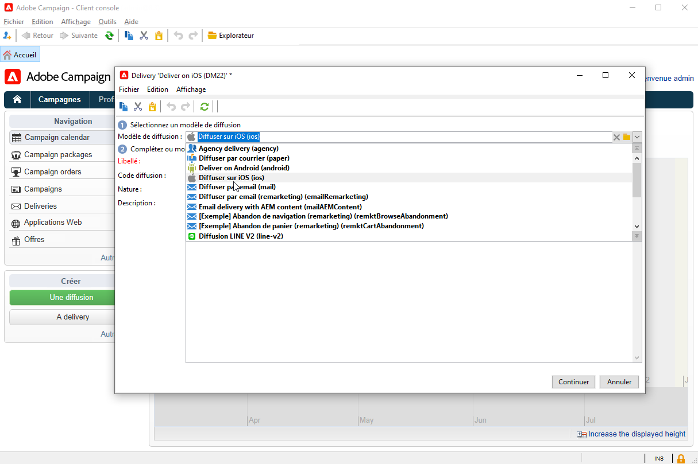
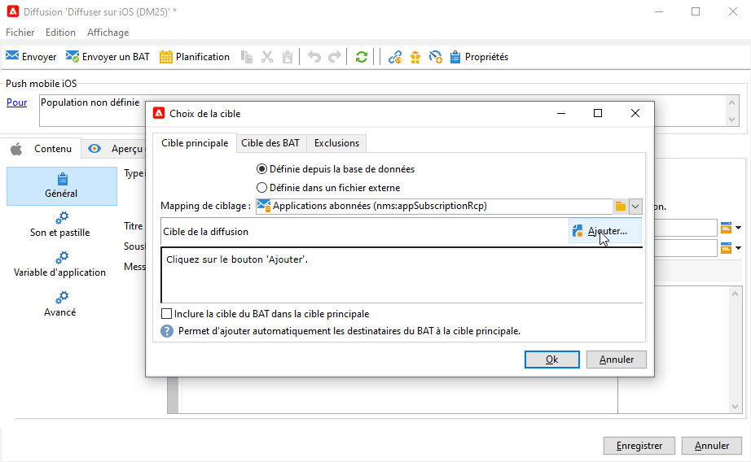
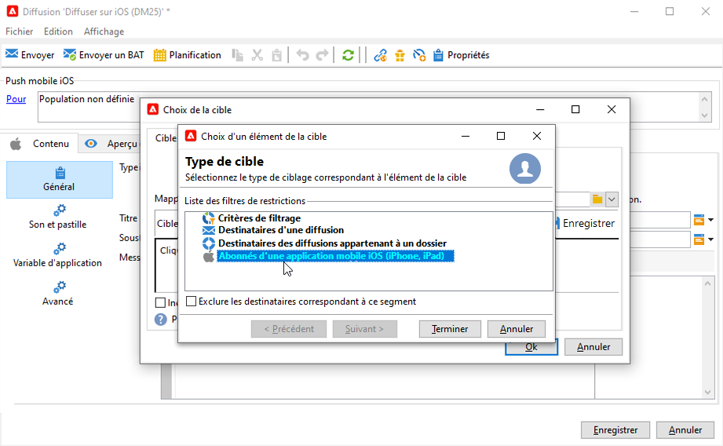
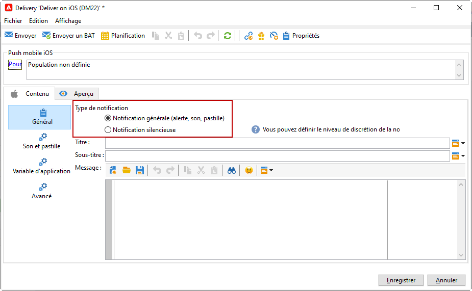
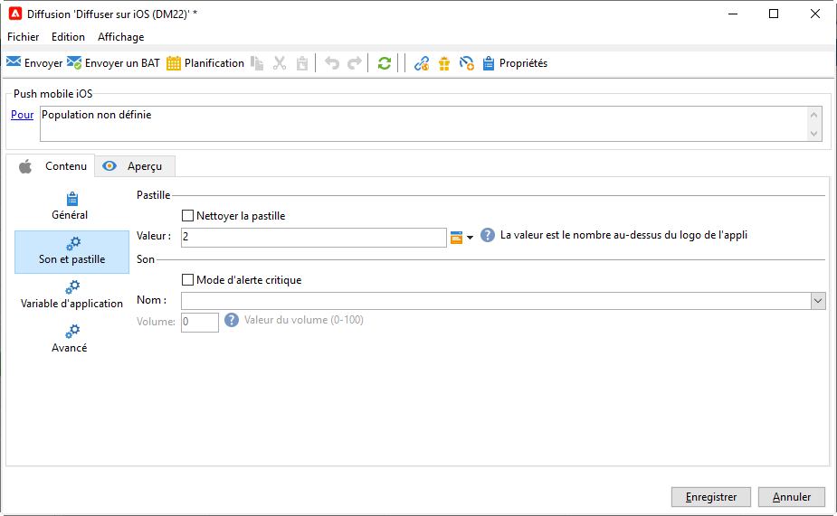
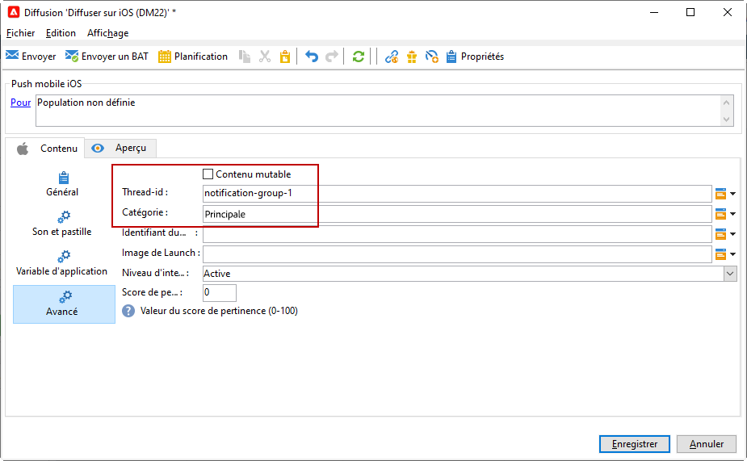
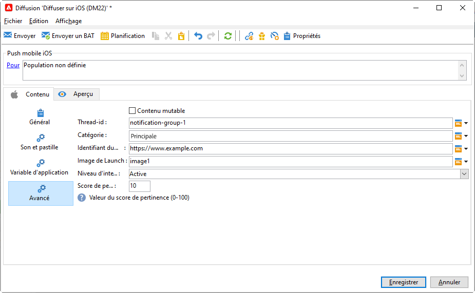
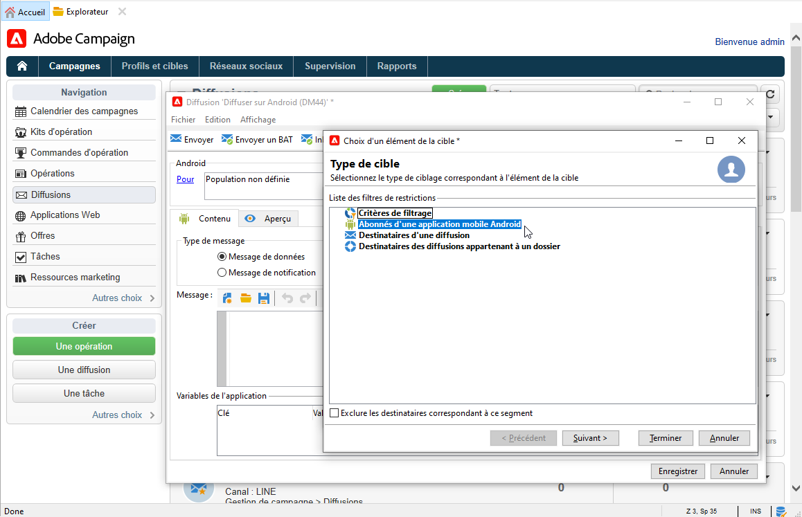

# Création et envoi de notifications push

Les diffusions d&#39;applications mobiles vous permettent d&#39;envoyer des notifications aux systèmes iOS et Android.

Pour envoyer des notifications push dans Adobe Campaign, vous devez effectuer les opérations suivantes :

1. Configuration de votre environnement Campaign
1. Créez un service d&#39;information de type application mobile pour votre application mobile.
1. Ajoutez, à ce service, les versions iOS et Android de l&#39;application.
1. Créez une diffusion pour iOS et Android.

 Découvrez comment prendre en main les applications mobiles dans la [documentation de Campaign Classic v7](https://experienceleague.adobe.com/docs/campaign-classic/using/sending-messages/sending-push-notifications/about-mobile-app-channel.html?lang=fr).{target=&quot;_blank&quot;}

## Intégration du SDK Campaign

Le SDK Campaign facilite l&#39;intégration de votre application mobile à la plateforme Adobe Campaign.

Les versions de SDK compatibles sont répertoriées dans la [Matrice de compatibilité Campaign](../start/compatibility-matrix.md#MobileSDK).

 Découvrez comment intégrer les SDK Android et iOS de Campaign avec votre application dans [cette section](../config/push-config.md)

<!--
### Configure Campaign Extension in Launch

You can integrate Adobe Experience Platorm Launch SDK with Campaign, by leveraging Campaign Classic extension.

 Learn more in [Adobe Mobile SDK documentation](https://aep-sdks.gitbook.io/docs/using-mobile-extensions/adobe-campaignclassic){target="_blank"}

-->

## Configuration des paramètres de votre application dans Campaign

Vous devez définir les paramètres de vos applications iOS et Android dans Adobe Campaign.

 Les instructions de configuration pour iOS sont décrites dans la [documentation de Campaign Classic v7](https://experienceleague.adobe.com/docs/campaign-classic/using/sending-messages/sending-push-notifications/configure-the-mobile-app/configuring-the-mobile-application.html?lang=fr#sending-messages).{target=&quot;_blank&quot;}

 Les instructions de configuration pour Android sont décrites dans la [documentation de Campaign Classic v7](https://experienceleague.adobe.com/docs/campaign-classic/using/sending-messages/sending-push-notifications/configure-the-mobile-app/configuring-the-mobile-application-android.html?lang=fr#sending-messages){target=&quot;_blank&quot;}

## Création de votre première notification push

Cette section présente les éléments spécifiques à la diffusion de notifications iOS et Android.

>[!CAUTION]
>
>Dans le contexte d’un [Déploiement Entreprise (FFDA)](../architecture/enterprise-deployment.md), l’enregistrement mobile est maintenant **asynchrone**. [En savoir plus](../architecture/staging.md)

Pour créer une nouvelle diffusion, accédez à l&#39;onglet **[!UICONTROL Campagnes]**, cliquez sur **[!UICONTROL Diffusions]**, puis sur le bouton **[!UICONTROL Créer]** au-dessus de la liste des diffusions existantes.

 Pour plus d&#39;informations globales sur la création d&#39;une diffusion, consultez la [documentation de Campaign Classic v7](https://experienceleague.adobe.com/docs/campaign-classic/using/sending-messages/key-steps-when-creating-a-delivery/steps-about-delivery-creation-steps.html?lang=fr#sending-messages){target=&quot;_blank&quot;}

### Envoi de notifications sur iOS {#send-notifications-on-ios}

>[!NOTE]
>
>Cette fonctionnalité est disponible à partir de Campaign v8.3. Pour vérifier votre version, reportez-vous à la section [cette section](../start/compatibility-matrix.md#how-to-check-your-campaign-version-and-buildversion)

1. Sélectionnez le modèle de diffusion **[!UICONTROL Diffuser sur iOS]**.

   

1. Pour définir la cible de la notification, cliquez sur le lien **[!UICONTROL Pour]**, puis sur **[!UICONTROL Ajouter]**.

   

1. Sélectionnez **[!UICONTROL Abonnés d&#39;une application mobile iOS (iPhone, iPad)]**, choisissez le service correspondant à votre application mobile, puis sélectionnez la version iOS de l&#39;application.

   

1. Choisissez votre **[!UICONTROL Type de notification]** entre **[!UICONTROL Notification générale (alerte, son, badge)]** ou **[!UICONTROL Notification silencieuse]**.

   

   >[!NOTE]
   >
   >Le mode **Notification silencieuse** permet d&#39;envoyer une notification &quot;silencieuse&quot; à une application mobile. L&#39;utilisateur n&#39;est pas averti de l&#39;arrivée de la notification. Elle est directement transférée à l&#39;application.

1. Dans le **[!UICONTROL Titre]** , saisissez le libellé du titre qui doit apparaître dans la liste des notifications disponibles depuis le centre de notifications.

   Ce champ vous permet de définir la valeur de la variable **title** du payload de notification iOS.

1. Vous pouvez ajouter une **[!UICONTROL Sous-titre]**, valeur de la variable **sous-titre** du payload de notification iOS.

1. Saisissez le contenu du message dans le champ **[!UICONTROL Contenu du message]** de l’assistant.

1. Dans la **[!UICONTROL Son et badge]** vous pouvez modifier les options suivantes :

   * **[!UICONTROL Badge de nettoyage]**: activez ces options pour actualiser la valeur du badge.

   * **[!UICONTROL Valeur]**: définissez un nombre qui sera utilisé pour afficher directement sur l’icône de l’application le nombre de nouvelles informations non lues.

   * **[!UICONTROL Mode d’alerte critique]**: activez cette option pour ajouter du son à votre notification, même si le téléphone de l&#39;utilisateur est en mode focus ou si iPhone est en mode silencieux.

   * **[!UICONTROL Nom]**: sélectionnez le son que doit émettre le terminal mobile à la réception de la notification.

   * **[!UICONTROL Volume]**: volume de votre son de 0 à 100.

      >[!NOTE]
      > 
      >Les sons doivent être inclus dans l’application et définis lors de la création du service.
      >
      >Les instructions de configuration pour iOS sont décrites dans la [documentation de Campaign Classic v7](https://experienceleague.adobe.com/docs/campaign-classic/using/sending-messages/sending-push-notifications/configure-the-mobile-app/configuring-the-mobile-application.html?lang=fr).
   

1. Dans la **[!UICONTROL Variables d’application]** , votre **[!UICONTROL Variables d’application]** sont automatiquement ajoutés. Ils permettent de définir le comportement des notifications, par exemple, lorsque l&#39;utilisateur active la notification, il est possible de configurer un écran spécifique de l&#39;application.

   Pour plus d’informations, consultez [cette section](https://experienceleague.adobe.com/docs/campaign-classic/using/sending-messages/sending-push-notifications/configure-the-mobile-app/configuring-the-mobile-application.html?lang=en).

1. Dans la **[!UICONTROL Avancé]** vous pouvez modifier les options générales suivantes :

   * **[!UICONTROL Contenu mutable]**: activez cette option pour permettre à l’application mobile de télécharger le contenu multimédia.

   * **[!UICONTROL Thread-id]**: identifiant utilisé pour regrouper les notifications associées.

   * **[!UICONTROL Catégorie]**: nom de votre ID de catégorie qui affichera les boutons d’action. Ces notifications permettent à l&#39;utilisateur d&#39;effectuer plus rapidement différentes tâches en réponse à celles-ci, sans ouvrir l&#39;application ou la parcourir.

   

1. Pour une notification sensible à l’heure, vous pouvez spécifier les options suivantes :

   * **[!UICONTROL Identifiant de contenu cible]**: identifiant utilisé pour cibler la fenêtre d&#39;application à transférer à l&#39;ouverture de la notification.

   * **[!UICONTROL Image de lancement]**: nom du fichier image de lancement à afficher. Si l’utilisateur choisit de lancer votre application, l’image sélectionnée s’affichera au lieu de l’écran de lancement de votre application.

   * **[!UICONTROL Niveau d&#39;interruption]**:

      * **[!UICONTROL Principal]**: Défini par défaut, le système présente immédiatement la notification, illumine l’écran et peut émettre un son. Les notifications ne passent pas en mode Ciblage .

      * **[!UICONTROL Passif]**: Le système ajoute la notification à la liste de notifications sans allumer l&#39;écran ni émettre un son. Les notifications ne passent pas en mode Ciblage .

      * **[!UICONTROL Respect de la durée]** Le système présente immédiatement la notification, allume l&#39;écran, peut émettre un son et se déplier en mode Mise au point. Ce niveau ne nécessite pas d’autorisation spéciale de la part d’Apple.

      * **[!UICONTROL Critique]** Le système présente immédiatement la notification, allume l’écran et contourne le bouton d’arrêt ou le mode de mise au point. Notez que ce niveau nécessite une autorisation spéciale de la part d’Apple.
   * **[!UICONTROL Score de pertinence]**: définissez un score de pertinence compris entre 0 et 100. Le système l’utilise pour trier les notifications dans le résumé de la notification.

   

1. Une fois la notification renseignée, cliquez sur l&#39;onglet **[!UICONTROL Aperçu]** pour prévisualiser la notification.

   

### Envoi de notifications sur Android {#send-notifications-on-android}

1. Sélectionnez le modèle de diffusion **[!UICONTROL Diffuser sur Android (android)]**.

   

1. Pour définir la cible de la notification, cliquez sur le lien **[!UICONTROL Pour]**, puis sur **[!UICONTROL Ajouter]**.

   

1. Sélectionnez **[!UICONTROL Abonnés d&#39;une application mobile Android]**, choisissez le service correspondant à votre application mobile (Neotrips, dans notre exemple), puis sélectionnez la version Android de l&#39;application.

   

1. Saisissez ensuite le contenu de la notification.

   

1. Cliquez sur l&#39;icône **[!UICONTROL Insérer une émoticône]** pour insérer des émoticônes dans votre notification push.

1. Dans le champ **[!UICONTROL Variables de l&#39;application]**, saisissez la valeur de chaque variable. Vous pouvez par exemple paramétrer un écran d&#39;application spécifique qui s&#39;affichera lorsque l&#39;utilisateur activera la notification.

1. Une fois la notification renseignée, cliquez sur l&#39;onglet **[!UICONTROL Aperçu]** pour prévisualiser la notification.

   <!---->

## Test, envoi et surveillance de vos notifications push

L&#39;envoi du BAT et l&#39;envoi final de la notification s&#39;effectuent de la même manière que pour une diffusion par e-mail. Apprenez-en davantage en consultant la documentation de Campaign Classic v7 :

* Valider une diffusion et envoyer des BAT
    [En savoir plus sur les étapes clés de validation d&#39;une diffusion](https://experienceleague.adobe.com/docs/campaign-classic/using/sending-messages/key-steps-when-creating-a-delivery/steps-validating-the-delivery.html?lang=fr){target=&quot;_blank&quot;}

* Confirmation et envoi de la diffusion
    [Découvrez les étapes clés pour envoyer une diffusion](https://experienceleague.adobe.com/docs/campaign-classic/using/sending-messages/key-steps-when-creating-a-delivery/steps-sending-the-delivery.html?lang=fr){target=&quot;_blank&quot;}

Après l&#39;envoi des messages, vous pouvez surveiller et suivre vos diffusions. Apprenez-en davantage en consultant la documentation de Campaign Classic v7 :

* Quarantaines des notifications push
    [En savoir plus sur les quarantaines des notifications push](https://experienceleague.adobe.com/docs/campaign-classic/using/sending-messages/monitoring-deliveries/understanding-quarantine-management.html?lang=fr#push-notification-quarantines){target=&quot;_blank&quot;}

* Résolution des problèmes
    [Découvrez comment résoudre les problèmes liés aux notifications push](https://experienceleague.adobe.com/docs/campaign-classic/using/sending-messages/sending-push-notifications/troubleshooting.html?lang=fr){target=&quot;_blank&quot;}
