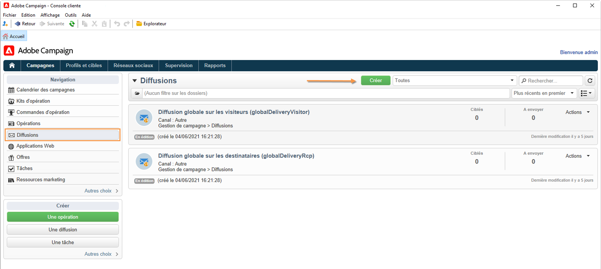
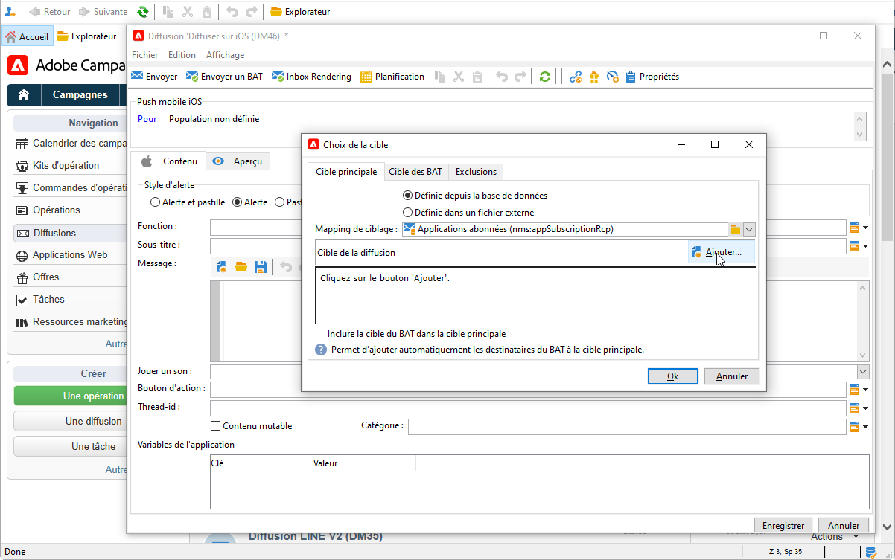
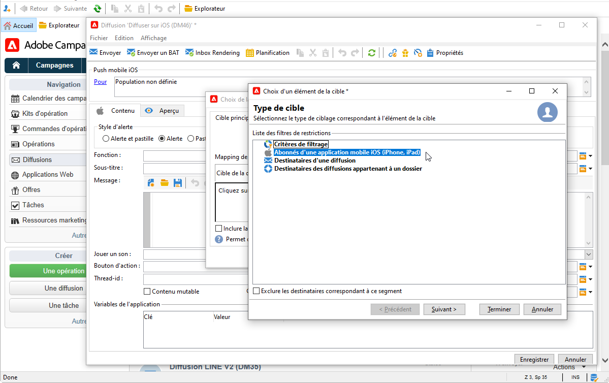
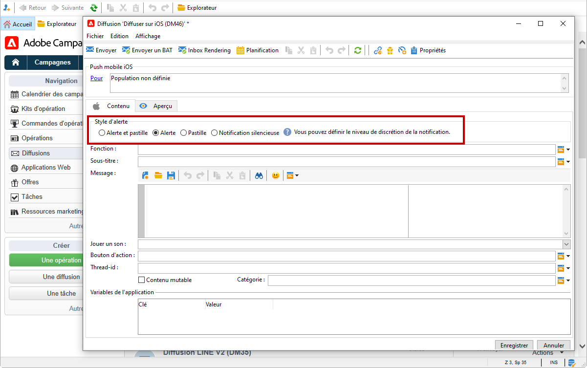
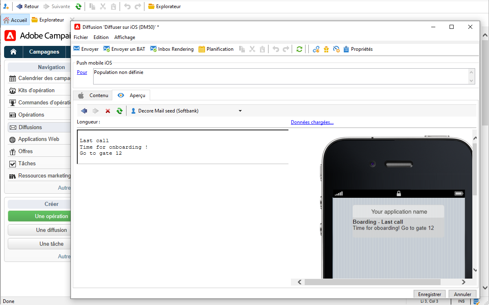
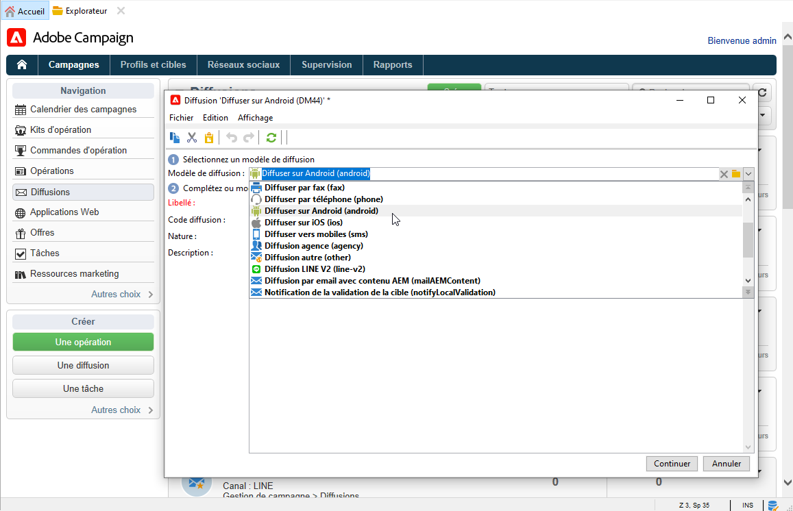
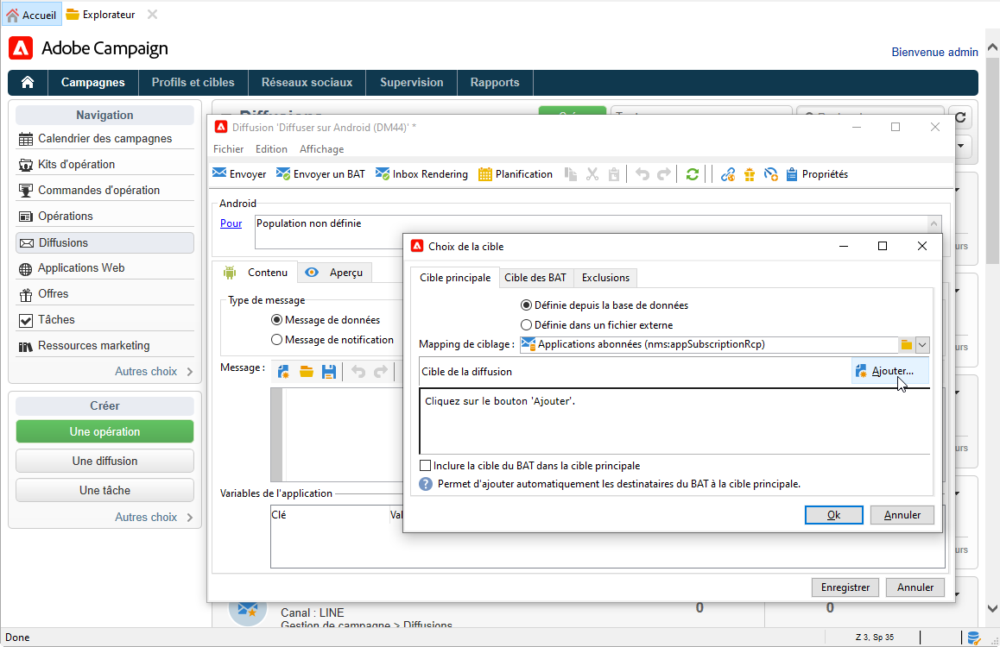
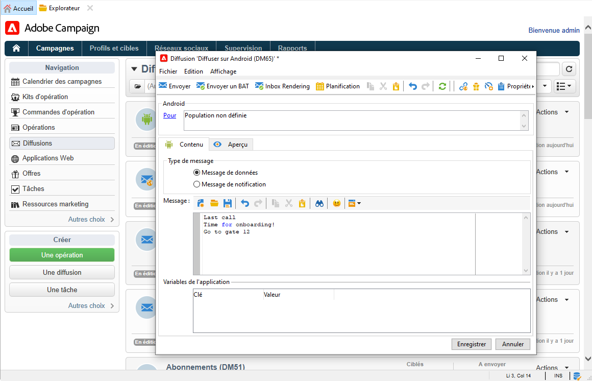

# Création et envoi de notifications push

Les diffusions d’applications mobiles vous permettent d’envoyer des notifications aux systèmes iOS et Android.

Pour envoyer des notifications push dans Adobe Campaign, vous devez effectuer les opérations suivantes :

1. Configuration de votre environnement Campaign
1. Créez un service d’information de type application mobile pour votre application mobile.
1. Ajoutez, à ce service, les versions iOS et Android de l&#39;application.
1. Créez une diffusion pour iOS et Android.

[!DNL :arrow_upper_right:] Découvrez comment commencer à utiliser les applications mobiles dans la documentation de  [Campaign Classic v7](https://experienceleague.adobe.com/docs/campaign-classic/using/sending-messages/sending-push-notifications/about-mobile-app-channel.html?lang=fr)

## Intégration au SDK Adobe

### Intégration du SDK Campaign

Le SDK Campaign facilite l’intégration de votre application mobile à la plateforme Adobe Campaign.

Les versions des SDK compatibles sont répertoriées dans la [matrice de compatibilité Campaign](../start/compatibility-matrix.md#MobileSDK).

<!--
[!DNL :arrow_upper_right:] Learn how to integrate Campaign Android and iOS SDKs with your app in [this section](../config/push-config.md)
-->

### Configuration de l’extension Campaign dans Launch

Vous pouvez intégrer le SDK Adobe Experience Platorm Launch à Campaign à l’aide de l’extension Campaign Classic.

[!DNL :arrow_upper_right:] En savoir plus dans la documentation du SDK Mobile  [Adobe](https://aep-sdks.gitbook.io/docs/using-mobile-extensions/adobe-campaignclassic)

## Configuration des paramètres de votre application dans Campaign

Vous devez définir les paramètres de vos applications iOS et Android dans Adobe Campaign.

[!DNL :arrow_upper_right:] Les instructions de configuration pour iOS sont présentées dans la documentation de  [Campaign Classic v7](https://experienceleague.adobe.com/docs/campaign-classic/using/sending-messages/sending-push-notifications/configure-the-mobile-app/configuring-the-mobile-application.html?lang=fr#sending-messages)

[!DNL :arrow_upper_right:] Les instructions de configuration pour Android sont détaillées dans la documentation de  [Campaign Classic v7](https://experienceleague.adobe.com/docs/campaign-classic/using/sending-messages/sending-push-notifications/configure-the-mobile-app/configuring-the-mobile-application-android.html?lang=fr#sending-messages)

## Création de votre première notification push

Cette section présente les éléments spécifiques à la diffusion de notifications iOS et Android.

[!DNL :arrow_upper_right:] Toutes les étapes de création de notifications push sont détaillées dans la documentation de  [Campaign Classic v7](https://experienceleague.adobe.com/docs/campaign-classic/using/sending-messages/sending-push-notifications/creating-notifications.html?lang=fr)

>[!CAUTION]
>
>Avec Campaign v8, l’enregistrement mobile est désormais **asynchrone**. [En savoir plus](../dev/staging.md)

Pour créer une nouvelle diffusion, accédez à l&#39;onglet **[!UICONTROL Campagnes]**, cliquez sur **[!UICONTROL Diffusions]** et cliquez sur le bouton **[!UICONTROL Créer]** au-dessus de la liste des diffusions existantes.

[!DNL :arrow_upper_right:] Pour plus d&#39;informations sur la création d&#39;une diffusion, reportez-vous à la documentation de  [Campaign Classic v7](https://experienceleague.adobe.com/docs/campaign-classic/using/sending-messages/key-steps-when-creating-a-delivery/steps-about-delivery-creation-steps.html?lang=fr#sending-messages).

### Envoi de notifications sur iOS {#send-notifications-on-ios}

1. Sélectionnez le modèle de diffusion **[!UICONTROL Diffuser sur iOS]** et cliquez sur **[!UICONTROL Continuer]**.

   

1. Pour définir la cible de la notification, cliquez sur le lien **[!UICONTROL Pour]**, puis sur **[!UICONTROL Ajouter]**.

   

1. Sélectionnez **[!UICONTROL Abonnés d’une application mobile iOS (iPhone, iPad)]**, sélectionnez le service correspondant à votre application mobile, puis sélectionnez la version iOS de l’application.

   

1. Sélectionnez le type de notification : **[!UICONTROL Alerte]**, **[!UICONTROL Badge]**, **[!UICONTROL Alerte et badge]** ou **[!UICONTROL Push silencieux]**.

   

1. Dans le champ **[!UICONTROL Titre]**, saisissez le libellé du titre que vous souhaitez afficher sur la notification.

1. Saisissez le **[!UICONTROL Message]** et la **[!UICONTROL Valeur du badge]** en fonction du type de notification choisi.

1. Vous pouvez également définir les éléments suivants :

   * Le **[!UICONTROL bouton Action]** permet de définir le libellé du bouton d’action apparaissant dans les notifications d’alerte (champ **action_loc_key** de la payload).

   * Dans le champ **[!UICONTROL Jouer un son]**, sélectionnez le son que doit émettre le terminal mobile à la réception de la notification.

   * Dans le champ **[!UICONTROL Variables de l&#39;application]** , saisissez la valeur de chaque variable. Vous pouvez par exemple paramétrer un écran d&#39;application spécifique qui s&#39;affichera lorsque l&#39;utilisateur activera la notification.

1. Une fois la notification renseignée, cliquez sur l&#39;onglet **[!UICONTROL Aperçu]** pour afficher la prévisualisation de la notification.

   

[!DNL :arrow_upper_right:] Toutes les étapes détaillées pour créer et envoyer des notifications push sur iOS sont présentées dans la documentation de  [Campaign Classic v7](https://experienceleague.adobe.com/docs/campaign-classic/using/sending-messages/sending-push-notifications/creating-notifications.html?lang=fr#sending-notifications-on-ios)

### Envoi de notifications sur Android {#send-notifications-on-android}

1. Sélectionnez le modèle de diffusion **[!UICONTROL Diffuser sur Android (android)]** .

   

1. Pour définir la cible de la notification, cliquez sur le lien **[!UICONTROL Pour]**, puis sur **[!UICONTROL Ajouter]**.

   

1. Sélectionnez **[!UICONTROL Abonnés d&#39;une application mobile Android]**, choisissez le service correspondant à votre application mobile (Neotrips, dans notre exemple), puis sélectionnez la version Android de l&#39;application.

   

1. Saisissez ensuite le contenu de la notification.

   

1. Cliquez sur l’icône **[!UICONTROL Insérer une émoticône]** pour insérer des émoticônes dans votre notification push.

1. Dans le champ **[!UICONTROL Variables de l&#39;application]** , saisissez la valeur de chaque variable. Vous pouvez par exemple paramétrer un écran d&#39;application spécifique qui s&#39;affichera lorsque l&#39;utilisateur activera la notification.

1. Une fois la notification renseignée, cliquez sur l&#39;onglet **[!UICONTROL Aperçu]** pour afficher la prévisualisation de la notification.

   <!---->

[!DNL :arrow_upper_right:] Toutes les étapes détaillées pour créer et envoyer des notifications push sur Android sont présentées dans la documentation de  [Campaign Classic v7](https://experienceleague.adobe.com/docs/campaign-classic/using/sending-messages/sending-push-notifications/creating-notifications.html?lang=en#sending-notifications-on-android)

## Tester, envoyer et surveiller vos notifications push

L&#39;envoi du BAT et l&#39;envoi final de la notification s&#39;effectuent de la même manière que pour une diffusion par e-mail. En savoir plus dans la documentation de Campaign Classic v7 :

* Valider une diffusion et envoyer des BAT
   [!DNL :arrow_upper_right:] [Découvrez les étapes clés de validation d&#39;une diffusion](https://experienceleague.adobe.com/docs/campaign-classic/using/sending-messages/key-steps-when-creating-a-delivery/steps-validating-the-delivery.html?lang=fr)

* Confirmer et envoyer la diffusion
   [!DNL :arrow_upper_right:] [Découvrez les étapes clés pour envoyer une diffusion](https://experienceleague.adobe.com/docs/campaign-classic/using/sending-messages/key-steps-when-creating-a-delivery/steps-sending-the-delivery.html?lang=en)

Après l&#39;envoi des messages, vous pouvez suivre et suivre vos diffusions. En savoir plus dans la documentation de Campaign Classic v7 :

* Quarantaines des notifications push
   [!DNL :arrow_upper_right:] [En savoir plus sur les quarantaines des notifications push](https://experienceleague.adobe.com/docs/campaign-classic/using/sending-messages/monitoring-deliveries/understanding-quarantine-management.html?lang=en#push-notification-quarantines)

* Résolution des problèmes
   [!DNL :arrow_upper_right:] [Découvrez comment résoudre les problèmes liés aux notifications push](https://experienceleague.adobe.com/docs/campaign-classic/using/sending-messages/sending-push-notifications/troubleshooting.html?lang=en)